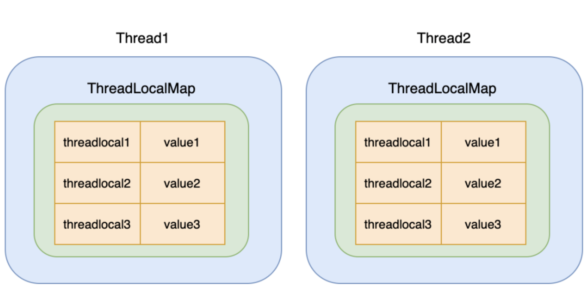
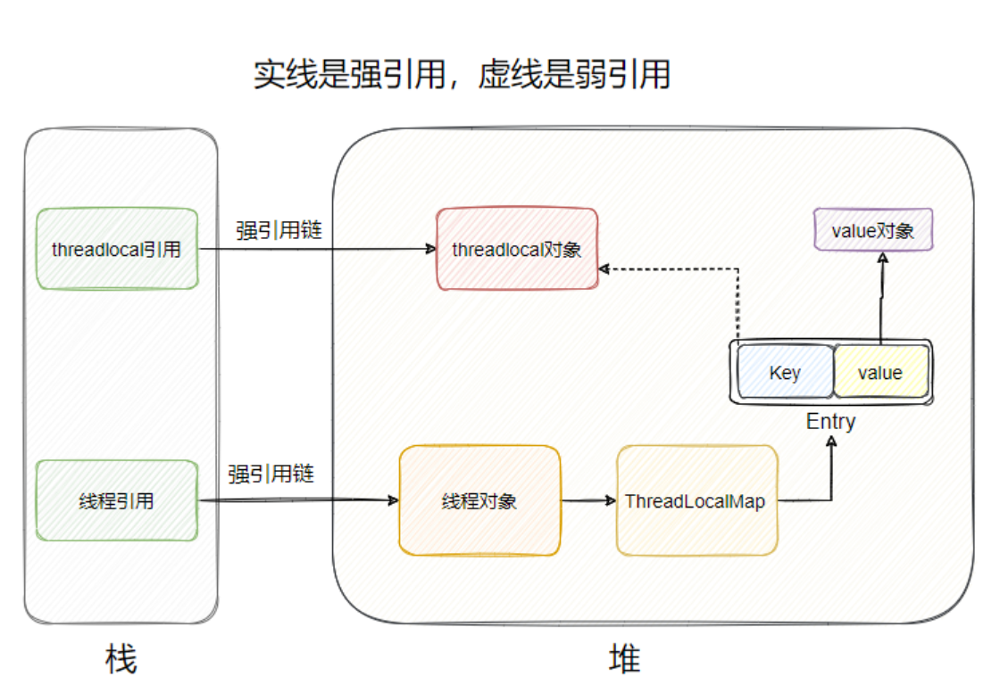
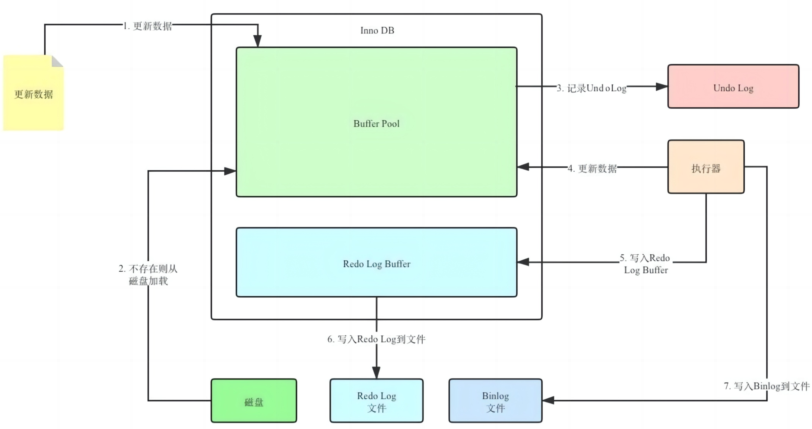
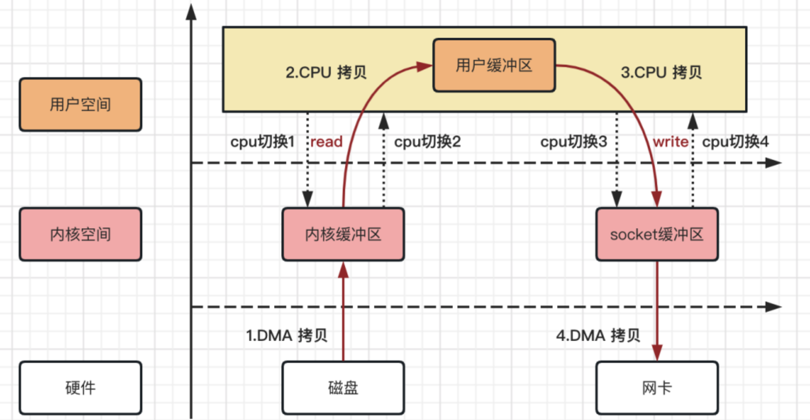

# Java 面试核心知识点

## 基础

### 面向对象


- **面向过程编程（POP）**：以 **过程** 为中心，将程序分解为一系列的函数，按照执行顺序依次调用这些函数完成任务。
- **面向对象编程（OOP）**：以 **对象** 为中心，将程序分解为多个对象，每个对象包含属性（数据）和 行为（方法），强调 **封装、继承和多态**（三大特性）
  - **封装**：将 属性 和 行为 封装成一个对象，防止外部对其直接访问和修改。提高代码安全性。（可以通过反射修改）
  - **继承**：子类可以继承父类的属性和行为，提高代码复用性。（extends）
  - **多态**：同一个行为具有不同的表现形式，分为 **编译时多态（重载） **和 **运行时多态（重写）**，提高代码灵活性。体现方式：
    - 重载：同一个类中定义多个同名但参数列表不同的方法，在编译时根据方法的参数类型和数量决定调用哪个方法。
    - 重写：子类重写父类中的方法，在运行时根据对象的实际类型决定调用哪个方法。
      - 向上转型：父有子无用父类，父有子有用子类
      - 向下转型：子有用子类，**子无父有用父类**

``` java
// 封装
class EncapsulationExample {
    // 属性（数据）
    private int num;

    // 行为（方法）
    public int getNum() {
        return num;
    }

    public void setNum(int num) {
        this.num = num;
    }
}
```

``` java
// 继承

// 父类
class Animal {
    String name;

    // 父类构造函数
    public Animal(String name) {
        this.name = name;
    }

    // 父类方法
    void eat() {
        System.out.println(name + " is eating");
    }
}

// 子类
class Dog extends Animal {
    // 子类构造函数
    public Dog(String name) {
        // 调用父类构造函数
        super(name);
    }

    // 子类方法，重写了父类方法
    @Override
    void eat() {
        System.out.println(name + " is eating bones");
    }

    // 子类特有方法
    void bark() {
        System.out.println(name + " is barking");
    }
}
```

``` java
// 多态：继承实现
class Animal {
    void makeSound() {
        System.out.println("Animal makes a sound");
    }
}

//子类继承父类
class Dog extends Animal {
    @Override
    void makeSound() {  // 子类重写父类方法
        System.out.println("Dog barks");
    }
}
```


接口：只有方法的声明而没有实现（interface, implements）

``` java
// 多态：接口实现
public interface Animal {
    void makeSound();
}

public class Dog implements Animal {
    @Override
    public void makeSound() {
        System.out.println("Woof");
    }
}
```


``` java
// 向上转型后：父有子无用父类，父有子有用子类，其他都不能调用(父无子有、父无子无)
Animal a = new Cat();  // 向上转型（推荐用，安全）
// 向下转型后：父有子无用父类，父用子有用子类，父无子有用子类。父无子无不能调用。
Cat c = (Cat) a;  // 向下转型（不安全）
```


### 构造方法


使用 **构造方法** 对 对象 进行初始化

``` java
public class Person {
    private String name;
    private int age;

    // 构造方法
    public Person(String name, int age) {
        this.name = name;
        this.age = age;
    }
}
```


### JVM、JRE、JDK


JVM （Java 虚拟机） < JRE （Java 运行时环境） < JDK （Java 软件开发包）

JVM + 核心类库 = JRE

JRE + 开发工具 = JDK


### 关键字


|           | 同一个类中 | 同一个包中 | 子类中 | 全局范围 |
| --------- | ---------- | ---------- | ------ | -------- |
| private   | yes        |            |        |          |
| default   | yes        | yes        |        |          |
| protected | yes        | yes        | yes    |          |
| public    | yes        | yes        | yes    | yes      |


- **final**：表示不可变的
  - 修饰一个**变量**时，表示这个变量不能**修改**（如果是引用类型，引用不可变，引用指向的内容可以变）
  - 修饰一个**方法**时，表明这个方法不能被重写
  - 修饰一个**类**时，表明这个类不能被**继承**（String，Integer 等包装类都是 final 修饰的）
  
- **static**：表示静态的，可以用来修饰变量、方法和代码块，静态成员**属于类而不是对象**，可以通过类名直接访问。在内存中只存在一份，**可以被类的所有实例共享**。
- **volatile**：最轻量级的同步机制，只能保证可见性和有序性。
  - 禁止指令重排

  - 强制私有内存的修改立即写入主内存

  - 执行写操作时，致使CPU中其他线程的私有内存无效
- **synchronized**：可以保证可见性、有序性和原子性。可以保证原子性的原因是被其修饰的代码块加了锁。


### 抽象类 和 接口


抽象类 abstract class 的定义：用于表示一类事物的**共性**，允许包含具体方法和属性，适合有一些共有代码的场景。

接口 interface 的定义：用于定义某一类事物的**行为规范**，**不限定如何实现**，适合强调行为而不是关系的场景。


抽象类和接口的区别

- **抽象类中的方法可以有方法体，就是能实现方法的具体功能，但是接口中的方法不行。**
- 抽象类中的成员变量可以是各种类型的，而接口中的成员变量只能是 **public static final** 类型的。
- 抽象类可以有静态代码块和静态方法，而接口中不能含有静态代码块以及静态方法。
- 一个类只能**继承**一个抽象类，而一个类却可以**实现**多个接口。


*Tips：*

1. ***不支持多继承** 是因为会有**菱形继承**，即 B,C 继承 A, D 继承 B,C，D要调用 A 的方法时，因为 B,C 都有实现，就会不知道要调用哪一个。*

2. ***接口允许多继承** 是因为1.8 之前接口是没有具体实现的，所以没事，1.8 之后是通过强制规定：如果多个接口内有相同的默认方法，子类必须重写这个方法。*


**两者都不能被实例化。**


### 值传递


- **值传递**：方法接收的是实参值的拷贝，会创建副本。(在 Java 中只有值传递)
- **引用传递**：方法接收的直接是实参所引用的对象在堆中的地址，不会创建副本，对形参的修改将影响到实参。

Java 中将 实参 传递给 形参 的方式是 **值传递**：

- 如果参数是基本数据类型的话，传递的就是基本数据类型的**字面量值的拷贝**，会创建副本。
- 如果参数是引用类型，传递的就是实参所引用的对象在**堆中地址值的拷贝**，同样也会创建副本。

Tips：Java 是值传递，意味着参数是基本数据类型的话，方法内的修改不会影响原来的参数，是引用类型的话则会影响。


### 深拷贝 和 浅拷贝


- 浅拷贝是指拷贝只复制对象的引用，而不复制引用指向的实际对象。
- 深拷贝是指不仅复制对象本身，还递归复制对象中所有引用的对象。
  - 实现方式：
    - 实现 Cloneable 接口并重写 clone() 方法
      - 这种方法要求对象及其所有引用类型字段都实现 Cloneable 接口，并且重写 clone() 方法。在 clone() 方法中，通过递归克隆引用类型字段来实现深拷贝。
    - 使用序列化和反序列化
      - 通过将对象序列化为字节流，再从字节流反序列化为对象来实现深拷贝。
    - 手动递归复制
      - 针对特定对象结构，手动递归复制对象及其引用类型字段。


### 数据类型


**基本数据类型存储的是实际的数据值，而引用数据类型存储的是对象的引用。**

- 基本数据类型：
  1. **整数类型（Integer Types）**：（都是正数 - 1）
     - `byte`：8位有符号整数，范围为 -128 到 127。
     - `short`：16位有符号整数，范围为 -32768 到 32767。
     - `int`：32位有符号整数，范围为 -2^31 到 2^31 - 1。（10^9）
     - `long`：64位有符号整数，范围为 -2^63 到 2^63 - 1。(10^18)
  2. **浮点类型（Floating-Point Types）**：
     - `float`：32位单精度浮点数，范围约为 ±3.40282347E+38F（有效位数为约 6-7 位）。
     - `double`：64位双精度浮点数，范围约为 ±1.79769313486231570E+308（有效位数为约 15 位）。
  3. **字符类型（Character Type）**：
     - `char`：16位无符号Unicode字符，范围为 U+0000 到 U+FFFF。
  4. **布尔类型（Boolean Type）**：
     - `boolean`：表示布尔值，只有两个取值，`true` 和 `false`。
- 引用数据类型：数组、类、接口


String 属于类，是引用数据类型。


- 基本类型：是变量，存储在栈中，性能较高，不支持 null
- 包装类型：是类，存储在堆中，支持 null


**Java 中，没小数点默认是 int，有小数点默认是 double。**

- `float = 3.4` 不正确，不能将 double 直接赋值给 float，需要写成 `float f = 3.4F` 或者 强制类型转换 `float f = (flaot)3.4` 
- `short s = 1; s = s + 1;`不正确，因为 1 是 int，不能和 short 相加。需要写成`short s = 1; s += 1;`，这样表达隐含强制类型转换


**float in IEEE 754**

float 32位 ：符号位 1 + 指数 8（原本的值加上 127，这样可以表示正负） + 尾数 23（省略1不写）

尾数计算：25.125(D) = 11001.001(B) = 1.1001001 * 2 ^ 4 (B) 

指数计算：4 + 127 = 131(D)  = 10000011(B)

0 10000011 10010010000000000000000


### 引用类型


- **强引用**：new 出来的对象就是强引用类型，内存不足也不会被回收
- **软引用**：在内存不足时被回收
- **弱引用**：执行GC就会被回收
- **虚引用**：在任何时候都有可能被回收，主要作用是追踪对象被回收的状态


### BigDecimal


BigDecimal 在计算时，实际会把数值扩大10的n次倍，变成一个long型整数进行计算，整数计算时自然可以实现精度不丢失。同时结合精度scale，实现最终结果的计算。

``` java
public class BigDecimal extends Number implements Comparable<BigDecimal> {
    // 2.367
    // 该BigDecimal的未缩放值
    private final BigInteger intVal;  // 2
    // 精度，可以理解成小数点后的位数
    private final int scale;  // 3
    // BigDecimal中的十进制位数，如果位数未知，则为0(备用信息)
    private transient int precision;  // 4
    // 存实际的BigDecimal值
    private transient String stringCache;  // "2.367"
    // 扩大成long型数值后的值
    private final transient long intCompact;  // 2367
}
```


### 泛型


泛型的本质是**参数化类型**，将操作的数据类型被指定为一个参数。

泛型的 **作用**：

- 适用于多种数据类型执行相同的代码
- 泛型中的类型在使用时指定，不需要强制类型转换（类型安全，编译器会检查类型）


**泛型擦除**：在编译期间，所有的类型信息都会被擦掉（泛型只存在于源码里，编译的时候检查一下，运行时是不检查的）

主要是为了向下兼容，之前是没有泛型的。


### Object


**== 和 equals() 的区别？** 

- `==` ：基本类型比较值，引用类型比较引用地址
- `equals()` ：不适用于基本类型，引用类型默认也是比较引用，但经常被各种类重写，比如 String、Integer。


如果重写了 equals 也需要重写 hashcode：

防止 equals 相等的对象，被放入不同的哈希桶中。


String、StringBuffer 、StringBuilder的区别：

- String：不可变，操作字符串会产生新对象，线程安全
- StringBuffer：可变，操作字符串不会产生新对象，线程安全（所有方法都使用 `synchronized` 关键字进行同步）
- StringBuilder：可变，删除了 StringBuffer 中线程安全部分，减少开销，线程不安全

StringBuilder > StringBuffer > String


### 实例方法和静态方法


- 实例方法（普通方法）
  - 属于类的实例
  - 必须通过对象来调用
  - 随着对象的创建而存在
  - 既可以访问静态变量和方法，又可以访问实例变量和方法
- 静态方法（静态方法）
  - 属于类
  - 可以直接通过类名调用
  - 随着类的加载而加载，且只加载一次
  - 只能访问静态变量和方法


### 反射


**反射**：加载类，并允许以编程的方式解剖类中的各种成分（**构造器、成员变量、成员方法**等）


**反射可以干什么？**

- 加载类，获取类的字节码：Class对象
  - 获取
    - Class c1 = 类名.class
    - 调用 Class 提供的方法：public static Class forName(String package);
    - 调用 Object 提供的方法：public Class getClass();  Class c3 = 对象.getClass();

- 获取类的**构造器**：Constructor 对象
- 获取类的**成员变量**：Field 对象
- 获取类的**成员方法**：Method 对象
  - 获取
    - getMethods()：获取全部成员方法（只能拿到 public 修饰的）
    - getDeclaredMethods()：获取全部成员方法（只要存在就能拿到）
    - getMethods(String name, Class<?>... parameterTypes)：获取某个成员方法（只能拿到 public修饰的）
    - getDeclaredMethod(String name, Class<?>... parameterTypes)：获取某个成员方法（只要存在就能拿到）
  - 执行
    - invoke(Object obj, Object... args)：触发某个对象的该方法执行
    - setAccessible(boolean flag)：设置为 true，表示禁止检查访问控制（暴力反射，可以获取 private方法）


**反射的作用**：

- **可以得到一个类的全部成分然后操作**（基本作用）
- 适合做 Java 框架，大部分的主流框架都会基于反射设计出一些通用的功能（**最重要的用途**）


**反射的风险**：

- 破坏封装性
- 绕过泛型的约束（泛型工作在编译期，反射工作在运行时）
- 性能开销
- 绕过检查访问控制 setAccessible(ture) 


### 注解


**注解**：对类、方法、变量做特殊标记，让其他程序（编译器等）根据注解信息来决定怎么执行该程序。


**元注解**：注解注解的注解。

``` java
// @Retention 和 @Target 就是元注解
@Retention(RetentionPolicy.RUNTIME)
@Target({ElementType.METHOD})
// 注解本质上是一个接口，继承 java.lang.annotation.Annotation
public @interface Test {

}
```


**@Target：声明被修饰的注解只能在哪些位置使用**

- TYPE：类，接口
- FIELD：成员变量
- METHOD：成员方法
- PARAMETER：方法参数
- CONSTRUCTOR：构造器
- LOCAL_VARIABLE：局部变量


**@Retention：声明注解的保留周期**

- SOURCE：只作用在源码阶段
- CLASS：保留到字节码文件阶段，运行阶段不存在（默认值）
- RUNTIME：一直保留到运行阶段（开发常用）


**注解的解析**：判断类上、方法上、成员变量上是否存在注解，并把注解里面的内容给解析出来。

``` java
// 相关方法
Annotation[] getDeclaredAnnotations()
T getDeclaredAnnotation(Class<T> annotationClass)
boolean isAnnotationPresent(Class<Annotation> annotataionClass)    
```


### 动态代理


代理就像中间商，帮忙处理一些事情。

例如请明星唱歌，联系代理协商钱，场地的事情，明星只负责唱歌。


java.lang.reflecct.Proxy 类：提供了为对象**产生代理对象的方法**

- loader：用于指定用哪个 类加载器 来加载生成的代理类
- interfaces：用来指定接口，这些接口用于指定生成的代理有哪些方法
- h：用来指定生成的代理对象要干什么事情

``` java
public static Object newProxyInstance(Classloader loader, Class<?> interfaces), InvocationHandler h)
```


### 异常


Throwable 主要包括两类：Error 和 Exception

1. **Error（错误）**：系统级的不可恢复错误，不应该被捕获。
2. **Exception（异常）**：可以被处理的程序异常。
   - **编译时异常**：发生在编译阶段，必须进行处理。通常是外部错误，如文件未找到、类未找到等。
   - **运行时异常**：发生在运行阶段，不一定要处理。通常是逻辑错误，如空指针、下标越界等。


异常的处理方式：

- try-catch：捕获异常
- throw：手动抛出异常
- throws：并没有真正处理异常，而是将异常传递给调用者来处理。
- finally：无论是否发生异常都会执行的代码块。
  - 通常用于释放资源，也可以用 try-with-resource 实现。
  - finally 块中的 return 语句会覆盖 try 块中的 return 返回（try有return会被暂存，先执行finally）


### IO


- BIO（blocking IO）：**同步阻塞**，线程在执行 I/O 操作时被阻塞，无法处理其他任务，适用于连接数较少且稳定的场景。
- NIO（non-blocking IO） ：**同步非阻塞**，线程在等待 I/O 时可执行其他任务，通过 Selector 监控多个 Channel 上的事件，提高性能和可伸缩性，适用于高并发场景。
- AIO（Asynchronous IO） ：**异步非阻塞**， 线程发起 I/O 请求后立即返回，当 I/O 操作完成时通过回调函数通知线程，进一步提高了并发处理能力，适用于高吞吐量场景。


阻塞 VS 非阻塞：需不需要等

同步 VS 异步：完成后会不会 **主动** 通知人


I/O 流分为两大类：**字节流** 和 **字符流**，分别用于处理字节级和字符级的数据：

- **字节流**：处理 8 位字节数据，适合于处理二进制文件，如图片、视频等。主要类是 `InputStream` 和 `OutputStream` 及其子类。
- **字符流**：处理 16 位字符数据，适合于处理文本文件。主要类是 `Reader` 和 `Writer` 及其子类。


### Java 1.8 新特性


Stream 流，提供了一种高效且易于使用的数据处理方式，特别适合集合对象的操作。


Stream API 和 Lambda 表达式是 Java 8 提供的语法糖，它们的作用是使集合处理更加简洁、易读和高效。 Lambda 表达式是一种匿名函数，允许你以更紧凑的方式传递代码块，简化代码的编写，比如：

``` java
// 使用 Lambda 表达式过滤以 "A" 开头的名字
List<String> filteredNames = names.stream()
    .filter(name -> name.startsWith("A"))
    .collect(Collectors.toList());
```


## 集合（容器）

### 集合类


- Collection
  - List
  - Queue
  - Set
- Map


### 常用的集合


1. **ArrayList：** 动态数组，实现了List接口，支持动态增长。
2. **LinkedList：** 双向链表，也实现了List接口，支持快速的插入和删除操作。
3. **HashMap：** 基于哈希表的Map实现，存储键值对，通过键快速查找值。
4. **HashSet：** 基于HashMap实现的Set集合，用于存储唯一元素。
5. **TreeMap：** 基于红黑树实现的有序Map集合，可以按照键的顺序进行排序。
6. **LinkedHashMap：** 基于哈希表和双向链表实现的Map集合，保持插入顺序或访问顺序。
7. **PriorityQueue：** 优先队列，可以按照比较器或元素的自然顺序进行排序。


- 线程安全的类
  - Vector：比 ArrayList 出现更早，两者非常相似，在很多方法上加了 synchronized，效率较低
    - 这种加了同步方法的类，注定会被淘汰掉，就像 StringBuilder 取代 StringBuffer
  - Hashtable：方法上加 synchronized
- 线程安全的集合
  - 并发 map
    - ConcurrentHashMap
    - ConcurrentSkipListMap
  - 并发 set
    - ConcurrentSkipListSet
    - CopyOnWriteArraySet
  - 并发 list
    - CopyOnWriteArrayList
  - 并发 queue
    - ConcurrentLinkedQueue
    - BlockingQueue
  - 并发 deque
    - LinkedBlockingDeque
    - ConcurrentLinkedDeque


### List


- ArrayList：基于数组，支持 **动态扩容** 和 **随机访问**。（空间开销主要体现在预留空间）
  - 动态扩容：先判断是否需要扩容(1.5倍，复制原数组)
  - 创建时候指定的元素大小就是该大小（区别于 hashmap ，创建的大小是大于指定值的最小2的幂次）
  - 线程不安全
  - 想要线程安全可以使用 CopyOnWriteArrayList，写时复制 COW 采用**读写分离**，**写的时候复制再写，写完指向新容器**。
    - 底层也是通过一个数组保存数据，使用 volatile 关键字修饰数组，保证当前线程对数组对象重新赋值后，其他线程可以及时感知到。
    - 在写入操作时，加了一把互斥锁 ReentrantLock 以保证线程安全。
  
- LinkedList：基于双向链表，适合插入和删除。（空间开销主要体现在双向指针）
  - 线程不安全
  - 一般不使用
- 两者对比
  - 插入
    - 头部：LinkedList 快
    - 中间：不一定，ArrayList 需要复制后面的元素，同时还需要考虑扩容；linkedList 需要遍历到指定元素。
    - 尾部：不需要扩容，ArrayList 快；需要扩容，LinkedList 快。

  - 删除
    - ArrayList：删除元素越靠后，代价越小。
    - LinkedList：两边的元素代价小，中间元素代价大。

  - 遍历
    - for 循环，ArrayList 快；迭代器，两者差不多。
    - LinkedList 在 for 循环的每一次遍历中都需要 node(int index)

*Tips：增强 for 循环，对于 数组 来说，就是普通的 for 循环；对于 集合 来说，就是迭代器。*


### HashMap


HashMap 线程不安全。

想要线程安全可以考虑使用 ConcurrentHashMap

key 和 value 都可以为 null，但是 key 不能重复，所以只能有一个 key = null。

（key = null 时，对应的 扰动函数的结果为0，即放在第一个位置）

``` java
static final int hash(Object key) {
    int h;
    return (key == null) ? 0 : (h = key.hashCode()) ^ (h >>> 16);
}
```

hash 方法就是为了增加随机性，让数据元素更加均衡的分布，减少碰撞。右移16位使得了 hash 函数的返回值用到了 hashcode 的高位和低位信息。（hashcode 的返回值是 int 类型，32位）

**数组初始化容量是16**，默认的负载因子是0.75


**底层实现：**

- JDK 1.7：数组 + 链表 （使用 **拉链法** 解决哈希冲突）
- JDK 1.8：数组 + 链表 + 红黑树（链表长度大于 8 且 数组元素大于 64 时转换）


**PUT 方法大体流程：**

1. 根据 Key 通过 **扰动函数和与运算** 得出数组下标

   1. 扰动函数（减少碰撞）

      1. JDK 1.7：4次无符号右移运算 和 4次异或运算

      1. JDK 1.8：1次无符号右移运算 和 1次异或运算

   2. 与运算 `(n - 1) & hash`：与运算提高了执行速度，但也要求 HashMap 的长度是 2 的幂次方
2. 如果数组下标位置元素为空
   1. JDK1.7：将 key 和 value 封装为 Entry 对象放入
   2. JDK1.8：将 key 和 value 封装为 Node 对象放入
3. 如果数组下标位置元素不为空
   1. JDK1.7，**先判断**是否需要扩容。如果不用扩容就生成 Entry 对象，并使用**头插法**添加到当前位置的链表中
   2. JDK1.8，将  Node 对象插入到链表或红黑树中后，链表采用**尾插法**，**再判断**是否需要进行扩容


**扩容机制**：HashMap是懒加载机制，不管有参构造还是无参构造，HashMap初始都是为空。在第一次 PUT 时进行扩容。无参设置容量 16，有参设置大于等于参数的最小 2 的幂次方。后续扩容发生在达到阈值（容量 * 负载因子0.75）时，扩容成原来的**两倍**。然后重新计算元素哈希值，放入新数组中。

- JDK 1.7：头插法，所以会导致新旧链表的元素位置会发生倒转。
- JDK 1.8：由于扰动函数的优化，扩容时，要么在 原索引 位置，要么在 原索引 + 旧容量 位置。


**红黑树是一种自平衡的二叉查找树**，左子树中小于其本身，右子树大于其本身。

在最坏情况下的时间复杂度仍然是 O(logn)。

常用于需要高效插入、删除和查找操作的场景。

具有以下性质：

- 节点是红色或黑色
- 根节点和叶子节点是黑色
- 红色节点的两个子节点都是黑色
- 从任一节点到其每个叶子的所有路径都包含相同数目的黑色节点

插入的节点初始为红色，违反了红黑树的性质时，通过 **旋转 和 染色** 保持平衡。

红黑树是为了解决二叉查找树的缺陷，因为二叉查找树在某些情况下会退化成一个线性结构。


### ConcurrentHashMap


ConcurrentHashMap 将整个数据结构分为多个 Segment，每个 Segment 都类似于一个小的 HashMap，每个 Segment 都有自己的锁（可重入锁），不同 Segment 之间的操作互不影响，从而提高并发性能。


JDK 1.7 使用 数组 + 链表，锁的是 segment

JDK 1.8 使用 数组 + 链表 + 红黑树，锁的是头结点。主要通过 volatile + CAS(乐观锁) 或者 synchronized(悲观锁) 来实现的线程安全的。添加元素时首先会判断容器是否为空：

- 如果为空则使用 volatile 加 CAS 来初始化。
- 如果容器不为空，则根据存储的元素计算该位置是否为空。
  - 如果根据存储的元素计算结果为空，则利用 **CAS** 设置该节点；（容量还多，可以通过较少的自旋来完成落槽操作）
  - 如果根据存储的元素计算结果不为空，则使用 **synchronized** ，然后，遍历桶中的数据，并替换或新增节点到桶中，最后再判断是否需要转为红黑树，这样就能保证并发访问时的线程安全了。（容量不足，直接使用 synchronized 效率反而更高）

通过对头结点加锁来保证线程安全的，锁的粒度相比 Segment 来说更小了，发生冲突和加锁的频率降低了，并发操作的性能就提高了。

而且 JDK 1.8 使用的是红黑树优化了之前的链表，那么当数据量比较大的时候，查询性能也得到了很大的提升，从之前的 O(n) 优化到了 O(logn) 的时间复杂度。


## 并发编程 JUC

### 并发编程 3 特性


- 原子性：一个操作要么都执行，要么都不执行
- 可见性：一个线程对共享变量的修改，其他线程可以立马看到
- 有序性：代码的执行顺序要有序


volatile 可以保证后两者，synchronized 可以保证三者。


*“原可有”：原来是可以有的，因为并发没有了*

### 进程 和 线程


- **进程是系统分配资源的基本单位，线程是系统调度的基本单位**。
- 进程拥有独立的内存空间，线程共享所属进程的内存空间，包括堆和方法区。
- 进程的创建和销毁开销较大；线程的创建和销毁开销较小。
- 进程之间通信比较复杂；线程之间通信比较简单，共享内存。
- 进程间是相互独立的，一个进程崩溃不会影响其他进程；线程间是相互依赖的，一个线程崩溃可能影响整个程序。


#### 状态


- 进程状态（关键的其实也就中间三个状态：就绪、运行、阻塞）
  - 初始状态 NEW
  - 就绪状态 **READY**
  - 运行状态 RUNNING
  - 阻塞状态 BLOCKED
  - 终止状态 TERMINATED

- 线程状态（相比于进程多了两个状态）
  - 初始状态 NEW
  - 就绪状态 **RUNNABLE**
  - 运行状态 RUNNING
  - 阻塞状态 BLOCKED	
  - **等待状态 WAITING**
  - **超时等待状态 TIMED_WAITING**
  - 终止状态 TERMINATED


进程状态转换图

``` bash
New → Ready → Running → Terminated
      ↘ Blocked ↗
```

线程状态转换图

``` bash
New → Runnable → Running → Terminated
      ↘ Blocked ↗
      ↘ Waiting ↗
      ↘ Timed Waiting ↗
```


### 线程安全


线程安全：多个线程同时执行时能够正确地处理**共享数据**


**具体方法**：

1. ThreadLocal

2. volatile 修饰变量

3. synchronized 修饰 方法或代码块

   - 在编译之后在同步的代码块前后加上monitorenter和monitorexit字节码指令
   - 执行 monitorenter 指令时，如果对象没有锁或者已经获得了锁，则计数器 + 1；执行 monitorexit 执行时，计数器 - 1。

4. ReentrantLock (唯一实现了 Lock 接口的类，问 lock 就说 reentrantlock，手动加锁解锁)

   - 在 AbstractQueuedSynchronizer（AQS） 的基础上通过内部类 Sync 来实现具体的锁操作。

   - AQS核心思想是，如果被请求的共享资源空闲，那么就将当前请求资源的线程设置为有效的工作线程，将共享资源设置为锁定状态；如果共享资源被占用，就需要一定的阻塞等待唤醒机制来保证锁分配。这个机制主要用的是 CLH 队列的变体实现的，将暂时获取不到锁的线程加入到队列中。

5. 原子类（如 AtomicInteger，AtomicLong 等）,它们利用 CAS（比较并交换），实现了无锁的原子操作，适用于简单的计数器场景。（longadder，将一个变量分解为多个变量，通过维护一个数组的方式进一步减少竞争。分桶计算，累加求和）

6. 线程安全的集合类，如 ConcurrentHashMap，CopyOnWriteArrayList 等。


### 创建线程


Java 中创建线程主要有三种方式，分别为继承 Thread 类、实现 Runnable 接口、实现 Callable 接口。

- 继承 Thread 类，重写 `run()`方法
  - Java 不支持多重继承，所以如果类已经继承了另一个类，就不能使用这种方法了。
- 实现 Runnable 接口，重写 `run()` 方法，然后创建 Thread 对象，参数为 Runnable 对象。
  - 避免 Java 的单继承限制，更加符合面向对象的编程思想。将 任务代码 和 线程控制代码 解耦。
- 实现 Callable 接口，重写 `call()` 方法，然后创建 FutureTask 对象，参数为 Callable 对象；紧接着创建 Thread 对象，参数为 FutureTask 对象
  - 可以获取线程的执行结果

**三者都需要通过 start() 启动线程。**

使用 start() 才能创建新线程，如果直接使用 run()，则是在主线程中执行，没有创建新线程。


### 线程通信


在 Java 中，线程之间的通信是指**多个线程协同工作**，主要实现方式包括：

1）**共享变量**：

- 共享内存
- 共享文件

2）**同步机制**：

- synchronized：Java 中的同步关键字，用于确保同一时刻只有一个线程可以访问共享资源
- ReentrantLock：配合 Condition 提供了类似于 wait()、notify() 的等待/通知机制
- BlockingQueue：通过阻塞队列实现生产者-消费者模式
- CountDownLatch：可以允许一个或多个线程等待，直到在其他线程中执行的一组操作完成
- CyclicBarrier：可以让一组线程互相等待，直到到达某个公共屏障点
- Volatile：Java 中的关键字，确保变量的可见性，防止指令重排
- Semaphore：信号量，可以控制对特定资源的访问线程数


### 线程池


**为什么使用线程池**：降低创建和销毁线程的消耗；提高响应速度；提高线程的可管理性

**七个核心参数**：

- corePoolSize：核心线程数，常驻线程

  - CPU 密集型：corePoolSize = CPU 核心数 + 1(为了使某个线程出错时，CPU 核心都能持续工作)
  - IO 密集型：corePoolSize = CPU 核心数 * 2

- maxinumPoolSize：最大线程数

- keepAliveTime：核心线程数之外线程的存活时间

- unit：时间单位，

- workQueue：工作队列

- ThreadFactory：线程工厂

- Handle：任务拒绝策略

  - AbortPolicy：直接抛出异常，默认策略
  - CallerRunsPolicy：用调用者所在的线程来执行任务
  - DiscardOldestPolicy：丢弃阻塞队列中最老的任务，并执行当前任务
  - DiscardPolicy：直接丢弃任务

  

**处理流程**：核心线程干不完的放入工作队列，工作队列满了创建新线程执行，总的线程数要小于最大线程数，创建的新线程空闲超过存活时间后销毁。


**为什么是先添加队列而不是先创建最大线程？**

避免不必要的线程创建和销毁


**线程池状态**：使用 AtomicInteger 类型的 ctl 属性记录线程池状态(前3位)和线程池数量(后29位)

**RUNNING --> SHUTDOWN/STOP --> TIDYING --> TERMINATED**

线程池提交的方式：

- execute()：Runnable 接口的对象类交给线程池执行，无返回值。
- submit()：Callable 或 Runnable 接口对象类交给线程池执行，返回 Future 类型，可以**通过 get 获取执行结果**。

线程池关闭方式：

- shutdown()：将线程池设置为 SHUTDOWN 状态（不接受新任务，执行完核心线程和工作队列中的任务）
- shutdownNow()：将线程池设置为 STOP 状态（不接受新任务，清除工作队列任务，执行完核心线程任务）


常见的线程池（通过`Executors`工具类创建）：

- SingleThreadExecutor：只有一个线程的线程池，其他任务在工作队列排序等待。
- FixedThreadPool：核心线程数和最大线程数大小一样，可以看做固定线程数的线程池。
- CachedThreadPool：线程数不固定，有空闲线程就复用，没有就创建新线程
- ScheduledThreadPool：定时或定期执行任务的线程池

不推荐使用 Executors 类创建线程池，会有 OOM 风险（工作队列无界队列，最大都是 Integer.MAX_VALUE）

其实就是：**使用有界队列，控制线程创建数量。**


### ThreadLocal


为什么需要ThreadLocal：多个线程可能会同时访问和修改共享变量，**导致线程安全问题**。


sychronized 和 threadlocal 都可以保证线程安全，sychronized 加锁，用时间换空间，threadlocal 为每个线程创建 ThreadLocalMap，用空间换时间。


ThreadLocal 提供了一种简单的解决方案，使**每个线程都有自己的独立变量副本**，避免了多线程间的变量共享和竞争，从而解决了线程安全问题。


常见的应用场景：

- 数据库连接管理：每个线程拥有自己的数据库连接
- 用户上下文管理：每个线程拥有自己的用户上下文


#### 内部结构


ThreadLocal 的**实现原理**就是，**为每个线程创建了一个 ThreadLocalMap**

- key 为 ThreadLocal 对象（实际上是它的一个弱引用）
- value 为 独立变量副本

1、当需要存 独立变量副本 时，通过 ThreadLocal 的 **set** 方法将对象存入 Map 中。

2、当需要取 独立变量副本 时，通过 ThreadLocal 的 **get** 方法从 Map 中取出对象。



JDK 8 之前的设计：ThreadLocal 对应一个 ThreadLocalMap，Thread 作为 key

当前设计的好处：

1. map 存储的 Entry 变少，避免 hash 冲突
2. thread 销毁时，ThreadLocalMap 也会随之销毁，减少内存使用


#### 内存泄漏


**内存溢出**：没有足够的内存提供申请者使用

**内存泄露**：程序中已经无用的内存无法被释放，造成系统内存的浪费。内存泄漏的堆积终将导致内存溢出。


内存泄漏的两个前提：

1. 没有手动删除 Entry（remove() 方法）
2. 当前线程依然在运行


key 使用弱引用 + 主动清理无用 Entry：尽量避免内存泄漏

key 使用强引用，由于没有手动删除 Entry，以及当前线程依然运行的前提下，始终有 Thread-ThreadLocalMap-Entry 这个强引用链，导致无法避免内存泄漏。

key  无论使用强引用还是弱引用都无法完全避免内存泄漏，通过解决内存泄漏的两个前提才可以。但第二种方式一般不用，因为项目中一般是用线程池管理线程的。第一种方式即使用完 ThreadLocal 后，**及时 remove（完全避免内存泄漏）**，这样无论是强引用还是弱引用都没事。**使用弱引用是为了多一层保障**，当忘记 remove 时，通过在 set, get, remove 方法中清理无用 Entry 的方法来避免内存泄漏。比如，在 set 中发生 hash冲突时，通过开放定制法向后遍历，遍历到 key == null 时，会进行清理，将 value 设置为 null。





将 value 设置为弱引用可以防止内存泄漏，但是 value 一般都是局部变量赋值，栈帧出栈后，局部变量的强引用没了，如果 Entry 对其是弱引用，那么发生一次 gc 后 value 就被回收了，用的时候就找不到了。所以不能将 value 设置为弱引用。


#### 源码相关


虽然被叫做 Map，其实它是 **没有实现 Map 接口** 的，但是结构还是和 HashMap 比较类似的

- 元素数组：一个 table 数组，存储 Entry 类型的元素，Entry 是 ThreaLocal 弱引用作为 key，Object 作为 value 的结构。
- 散列方法：哈希取余法，取出 key 的 threadLocalHashCode，然后和 table 数组长度减一&运算（相当于取余）。


**hash 算法**：hashcode 是通过每次递增一个魔数（魔数的选取与斐波那契散列有关，好处是使 hash 分布均匀）来实现的，然后与 len - 1 按位与。

解决 Hash 冲突： 开放定址法(线性向后查找) 。

扩容机制：

1. 达到扩容阈值：threshold = len * 2 / 3
2. rehash() 具体实现：**清理过期**的 Entry，然后还要根据条件判断`size >= threshold * 0.75`来决定是否需要扩容。（清理后仍大于 len * 2/3 *3/4 = len / 2 则扩容）

- resize() 具体实现：**扩容成两倍**，然后遍历重新散列，还是用 开放定址法。


#### 线程传递


- InheritableThreadLocal：jdk提供，用于在线程创建时将父线程的 ThreadLocal 变量副本传递给子线程，使得子线程可以访问父线程中设置的本地变量，同时子线程可以修改自己的副本，不会影响父线程的值。
  - 只有在 new 子线程的时候传递，即手动创建线程时有用，线程池中无效。
- TransmittableThreadLocal(TTL)：阿里开源组件，用于在线程池中传递变量。


### JMM


**CPU 缓存模型**

CPU Cache 缓存的是内存数据用于解决 CPU 处理速度和内存不匹配的问题，内存缓存的是硬盘数据用于解决硬盘访问速度过慢的问题。操作系统通过 **内存模型（Memory Model）** 定义一系列规范来解决内存缓存不一致的问题。


**指令重排序**

指令重排序：系统在执行代码的时候并不一定是按照你写的代码的顺序依次执行

**指令重排序可以保证串行语义一致，但是不保证多线程间的语义也一致**

指令重排序：（依次经历）

- 编译器优化的重排序
- 指令集并行的重排序
- 内存系统的重排序


Java 内存模型（Java Memory Model）定义的一种规范，定义了 **线程内存** 和 **主内存** 之间的抽象关系，规范了线程何时会从主内存中读取数据、何时会把数据写回主内存。

JMM 的核心目标是确保多线程环境下的**可见性、有序性和原子性**：

- **原子性**：synchronized
- **可见性**：volatile
- **有序性**：volatile + happens-before 原则
  - volatile 禁止指令重排序
  - happens-before 原则定义了某个操作的结果对另一个操作可见，主要有 8 个规则。


为什么线程用自己的内存？

- 提高并发性能，避免内存访问竞争。
- 避免指令重排序对最终结果产生影响。


### 锁


死锁的四个必要条件：（资源不能共享，我拿着资源等，我不能抢资源，你等你的你等我的）

- 互斥条件
- 持有并等待条件
- 不可剥夺条件
- 循环等待条件


**避免死锁：至少破坏死锁发生的一个条件**

- 破坏互斥条件：通常不可行，因为加锁就是为了互斥。
- 破坏持有并等待条件：一次性申请所有资源。
- 破坏不可剥夺条件：申请不到进一步资源时，释放已有资源。
- 破坏循环等待条件：对资源进行排序，线程按序申请。


- 悲观锁：每次访问共享资源都会产生冲突
  - synchronized 是最常用的锁，由JVM 帮我们 lock 和 unlock，基于 **对象头** 和 **监视器锁** 实现。
    - 锁升级过程：
      - 偏向锁：一个线程第一次获取锁时，就是偏向锁
      - 轻量级锁：另一个线程尝试获取偏向锁时，升级为轻量级锁，并用 CAS 减少锁竞争
      - 重量级锁：CAS 失败无法获取到锁时，升级为重量级锁，挂起线程
  - ReentrantLock 依赖 AQS
    - AQS：抽象队列同步器，通过维护一个 volatile 修饰的 int 类型的 state 和一个先进先出（FIFO）的 CLH队列，来实现对共享资源的管理。
- 乐观锁：对共享资源的访问不会产生冲突，提交的时候检查。
  - 原子变量类，依赖 CAS
    - CAS：三个值 V：var；E：expected；N：new。判断 V 是否等于 E，如果等于，将 V 的值设置为 N；如果不等，说明已经有其它线程更新了 V（ V 要更新的变量值，E 预期值，N 已写入的新值）
      - 存在的问题：ABA
      - 解决方案：变量加上版本号或时间戳
  


检测死锁：JConsole 等工具


### CAS


在 Java 中，CAS 通过 `Unsafe` 类中的 `native` 方法实现，这些方法调用底层的硬件指令来完成原子操作。


**自旋锁机制**：CAS 操作可能会因为并发冲突而失败，因此通常会与`while`循环搭配使用，在失败后不断重试，直到操作成功。 


**CAS 存在的问题**

- ABA：一个变量初次读取的时候是 A，准备赋值的时候还是 A，但无法判断其是否被修改过
  - 解决方法：在变量前面追加上 **版本号或者时间戳**
- 循环时间长开销大：自旋操作执行开销大
  - 解决方法：利用处理器提供的 pause 指令，延迟流水线执行指令，避免内存顺序冲突。
- 只能保证一个共享变量的原子操作
  - 解决方法：JDK 1.5 后，Java 提供了 AtomicReference 类，可以通过将多个变量封装在一个对象中实现 CAS 操作（或者直接加锁）`AtomicReference<PosRule> atomicRef = new AtomicReference<>();`


### AQS


AQS AbstractQueuedSynchronizer，抽象队列同步器，是一个抽象类，主要用来构建锁和同步器。

**核心思想**：

- 请求的资源空闲，则将请求线程设置为有效的工作线程，并锁定资源。
- 请求的资源被占用，那么就需要一套线程阻塞等待以及被唤醒时锁分配的机制
  - CLH 同步队列，获取不到锁的线程，会进入队尾，然后自旋等待，直到其前驱线程释放锁。
  - 使用 volatile 修饰的名叫 state 的 int 变量  表示同步状态
    - 在 ReentrantLock 中，同一个线程通过累加 state，来实现可重入，state 恢复到 0 ，才表示可以被获取。
    - 在 CountDownLatch 中，state 被初始化为 N，每个子线程执行完成后，调用 countDown() 方法，尝试执行 CAS  操作让 state 减一。state 变为 0 时，调用 unpark() 方法，唤醒主线程。


AQS 有两种资源共享方式：

- Exclusive 独占：ReentrantLock（只能一个线程获取，但是可以重复获取）
- Share 共享：
  - Semaphore 信号量：state 为资源的数量，允许 N 个线程获取到共享资源
  - CountDownLatch 倒计时器


- CountDownLatch：基于 AQS，初始化后只能使用一次。
- CyclicBarrier：基于 ReentrantLock 和 Condition，可以重复使用，所有线程达到屏障后会自动重置。


### 线程顺序执行


- join()：让一个线程等待另一个线程完成执行
  - 在一个线程T上调用T.join()时，调用线程将进入等待状态，直到线程T完成（即终止）
- countDownLatch：通过一个计数器来实现
  - countDown() 计数器减一，计数器为0时唤醒所有 await() 线程
- semaphore：通过一个计数器来管理许可
  - acquire() 请求许可 - 1，release() 释放许可 +1
- 单线程池：确保任务按提交顺序依次执行（依次提交即可）
- synchronized：通过加锁保证同一时刻只有一个线程可以执行


### Others


Thread.sleep(0) 的作用是 触发操作系统立刻重新进行一次CPU竞争。


以下三个方式主要用于线程的通信和同步，需要在 sychronized 修饰下使用：

- wait()：使当前线程进入等待状态
- notify()：唤醒线程（按序顺序）
- notifyAll()：唤醒所有调用 wait 等待的线程


## JVM

### 内存区域


- 运行时数据区域

  - 堆：存储对象（垃圾收集器管理区域）
    - 新生代
    - 老年代：对象创建时，一般在新生代申请内存，当经历一次 GC 之后如果对还存活，那么对象的年龄 +1。当年龄超过一定值(默认是 15，可以通过参数 -XX:MaxTenuringThreshold 来设定)后，如果对象还存活，那么该对象会进入老年代。
    - 永久代：字符串常量池（JDK 1.7之前在永久代，方法区在永久代实现）
      - 永久代在 JDK 1.8 之后被废弃，用元空间代替
  - **虚拟机栈**：执行方法时会创建一个 **栈帧** 放入栈中（方法调用结束自动释放，不需要垃圾收集器）
  - **本地方法栈**：存放 native 方法
  - 方法区：逻辑概念，存储代码缓存（JDK 1.7）
    - 运行时常量池
  - **程序计数器**：当前线程所执行的字节码行号指示器（唯一不会 OutofMemoryError 的内存区域）
- 本地内存

  - 直接内存
  - 元空间：和永久代类似（JDK 1.8）
    - 运行时常量池

**加粗部分为线程私有**

栈（Stack）主要用于管理线程的局部变量和方法调用的上下文，而堆（Heap）则是用于存储所有类的实例和数组。

栈中存储的不是对象，而是 **对象的引用**。

**方法区**和**永久代**的关系就像是 Java 中接口和类的关系，类实现了接口，接口还是那个接口，但实现已经完全升级了。


Java 8 移除永久代并引入元空间，主要是为了解决永久代 **固定大小容易导致内存溢出**、**GC 效率低** 的问题。元空间使用本地内存，具备更灵活的内存分配能力，提升了垃圾收集和内存管理的效率。


### 对象创建


**创建过程**：

1. **类加载检查**：没有被加载过就执行类加载过程
2. **分配堆内存**
3. **赋予默认值**，零值初始化（数值类型0，布尔类型false，对象类型null）
4. **设置对象头**，对象头包含对象是哪个类的实例，对象的哈希码，对象的 GC 分代年龄等信息。
5. 执行 `<init>` 方法，**赋予预期值**


**创建方式**：

- 使用 new 关键字
- 使用 Class 类的 newInstance() 方法（反射机制）
- 使用 Constructor 类的 newInstance() 方法（反射机制）
- 使用 clone() 方法
- 使用反序列化


### 类加载机制


类加载机制：JVM 把 Class 文件中描述类的数据结构加载到内存中，并对数据进行校验、解析和初始化，最终形成可以被 JVM 直接使用的类型。

- 类加载器：加载类文件，将类文件加载到内存中，生成 Class 对象。
  - **启动类加载器**：加载 Java 的核心类库
  - **拓展类加载器**：加载 Java 的标准扩展库（jar包）
  - **应用程序加载器**：加载系统类路径和用户定义的类路径下的类库（编写的类）
  - **自定义加载器**：用户自定义的加载方式（加载网络上的类、执行热部署等）
- 类加载过程：加载、验证、准备、解析和初始化
  - 加载：获取字节码
  - 验证：验证字节码
  - 准备：赋默认值（static 修饰的）
  - 解析：将类的符号引用解析为直接引用
  - 初始化：赋期望值
- **双亲委派模型**：**依次递归父类加载器**，直到最顶层。如果父类加载器无法完成，子类加载器才会尝试去自己加载。
  - 好处：**安全性(避免恶意代码替换核心类库中的类)，一致性（避免重复加载）**
  - 想打破双亲委派模型：
    - **自定义加载器**，重写 classloader 的 loadClass  方法，改变类加载的行为。如tomcat要运行多个web应用
    - **设置线程上下文类加载器**，通过设置当前线程的上下文类加载器，在特定线程中使用自定义类加载器来加载类。，JDBC和JNDI等就是利用线程上下文类加载器来加载类的

 

类的生命周期：加载 --> *验证 --> 准备 --> 解析* --> 初始化 --> 使用 --> 卸载

验证、准备、解析三个部分统称为**连接（Linking）**


### 深拷贝 和 浅拷贝


- **浅拷贝**：**在堆中创建一个新的对象，其中包含原始对象的所有元素的引用。**

- **深拷贝**：**在堆中创建一个全新的对象，其中包含原始对象的所有元素的副本。**

- **引用拷贝：**两个**不同的引用**指向同一个对象。


### 垃圾判断


通过关键字`new`创建的对象，由Java的垃圾回收器（Garbage Collector）负责回收。垃圾回收器的工作是在程序运行过程中自动进行的，它会周期性地检测不再被引用的对象，并将其回收释放内存。

- **引用计数**：保存对象被引用的次数
- **根可达**：一个对象如果到 GC 根 之间没有任务引用链，则表明其不可达，需要被回收。
  - **GC 根是活跃的引用**，不是对象。
    - 主要包括：虚拟机栈的引用、本地方法栈的引用、静态属性的引用、常量池的引用。

引用计数存在**循环引用**，可能导致内存泄漏。但其无需等待垃圾回收周期。

根可达需要等待垃圾回收周期才执行，能解决循环引用，是现代垃圾回收器的主流技术。


### GC 算法


**逐步改进**：

- 标记清理算法：标记出来然后清理（内存碎片问题）
- 复制算法：容量划分为一半，存活对象会被复制到另一半的一侧（浪费一半空间）
- 标记整理算法：标记然后将所有存活对象移到一侧。（移动成本高）
- 分代收集算法：融合上述 3 种基本的算法思想。新生代使用复制算法，老年代使用标记清理或标记整理算法。
  - 新生代：
    - Eden 和 两个 Survivor（from, to），默认大小比例 8:1:1
    - 发生垃圾收集时，将 Eden 和 from 中仍然存活的对象一次性复制到 to，然后清理。
    - 复制一次年龄+1，默认15次时会移动到老年区（可以通过参数配置）


### 垃圾回收器


- 分代收集器

  - 新生代算法：（复制算法）
    - Serial 收集器：单线程
    - ParNew 收集器：多线程
    - Parallel Scavenge 收集器：多线程。关注吞吐量（吞吐量 = 运行时间/ (收集时间 + 运行时间)，CPU利用率）
  - 老年代算法：
    - Serial Old 收集器：单线程，标记整理算法。
    - Parallel Old 收集器：多线程，标记整理算法，关注吞吐量。
    - **CMS (Concurrent Mark-Sweep) 收集器：**一种以获取**最短回收停顿时间**为目标的收集器。**并发收集，低停顿。**标记清理算法。
      - **初始标记**：STW，从 GC根 出发标记可达对象 
      - **并发标记**：STW，从初始标记出发标记可达对象
      - **重新标记**：短暂 STW，完成剩余标记任务，标记之前并发中的少量改动。
      - **并发清除**：清除未被标记对象

- 分区收集器

  - **G1 (Garbage-First)收集器**：把 **Java 堆 **划分为多个 **大小相等的 Region**，每次**根据允许收集时间**，**优先回收价值最大的 Region**（解决了 CMS 收集器 内存碎片的问题）
    - **初始标记**：STW，从 GC根 出发标记可达对象 
    - **并发标记**：STW，从初始标记出发标记可达对象
    - **最终标记**：短暂 STW，完成剩余标记任务，标记之前并发中的少量改动。
    - **筛选回收**：STW，更新 Region 的统计数据，**排序**，然后根据**允许的收集时间**，选择 Region 进行回收
  - **ZGC (Z Garbage Collector) 收集器**：低延时，牺牲了一定的吞吐量。


### GC 类型


- Minor GC(Young GC)
  - 作用范围：针对新生代进行回收，包括 Eden 区和两个 Survivor 区。
  - 触发条件：Eden 区空间不足时，将 Eden 区和一个 Survivor 区中的存活对象移动到另一个 Survivor 区或老年代（Old Generation）
  - 特点：经常触发
- Major GC(Old GC)
  - 作用范围：针对老年代回收，但不一定只回收老年代。
  - 触发条件：老年代空间不足，或新生代晋升到老年代速度过快时。
  - 特点：较少触发，每次回收可能需要更长时间。
- Full GC
  - 作用范围：对整个堆内存（包括新生代、老年代以及永久代/元空间）进行回收。
  - 触发条件：
    - 直接调用`System.gc()`或`Runtime.getRuntime().gc()`方法时，虽然不能保证立即执行，但JVM会尝试执行Full GC。
    - Minor GC（新生代垃圾回收）时，如果存活的对象无法全部放入老年代，或者老年代空间不足以容纳存活的对象，则会触发Full GC，对整个堆内存进行回收。
    - 当永久代（Java 8之前的版本）或元空间（Java 8及以后的版本）空间不足时。
  - 特点：Full GC是最昂贵的操作，因为它需要停止所有的工作线程（Stop The World），遍历整个堆内存来查找和回收不再使用的对象，因此应尽量减少Full GC的触发。


### 常用的启动参数


- -Xmx：堆内存的最大限制
- -Xms：堆内存的初始大小
- -Xmn：新生代的大小
- -XX:SurvivorRatio：新生代中 Eden 区和每个Survivor 区的比例
- -XX:NewRatio：新生代和老年代的比例
- -XX:MaxGCPauseMills：垃圾回收最大暂停时间


## Redis

### 为啥快？


- 在内存中，读写快
- 单线程 + IO 多路复用，避免上下文切换，效率高
- 高效的数据结构


6.0 后引入多线程，主要负责处理网络请求。


### Redis 和 Memcached


- Redis 支持多种数据结构，持久化
- Memcached 仅支持键值对存储，不支持持久化


### 数据类型及其底层数据结构


listpack 替代的是 压缩列表


**数据类型**

- Key

- Value

  - String：字符串、整数或浮点数
    - 底层结构：int 和 SDS（len值保存长度，可以存二进制数据）
    - 应用场景：缓存对象、分布式锁
    - 常用指令：
      - `set username:1 jim`
      - `SET lock_key unique_value NX PX 10000`nx参数保证只在key不存在时操作,px为过期时间，释放锁
  - List：一个链表，每个节点都包含一个字符串
    - 底层结构：压缩列表（元素个数小于 512 个，每个元素小于 64字节），双向链表。3.2版本后用 quicklist 实现
    - 应用场景：消息队列
    - 常用指令：
      - LPUSH + BRPOPLPUSH 实现消息队列
        - 消息队列的三大需求：消息保序、处理重复的消息和保证消息可靠性
        - 一边进一边出 保证了**消息保序**
        - BRPOPLPUSH 保证了阻塞读取，避免一直请求。以及消息者消费后备份消息，保证消息可靠。
        - 缺陷：不支持**消费组**实现，组内消费者分担消息消费，组间消费者可以重复消费（Stream 支持）
      - `LPUSH mq "111000102:stock:99"`（111000102 为消息id，保证了**消息不重复**）
      - `BRPOPLPUSH mq mq_bak 10`10为超时时间，将mq的最右元素返回并弹出到mq_bak

  - Hash：键值对集合
    - 底层结构：压缩列表（元素个数小于 512 个，每个元素小于 64字节），哈希表。7.0版本后用 listpack 实现
    - 应用场景：购物车(cart_id,[{iphone 11, 5599}, {apple watch s4, 2299}])
      - 也可以用 String 实现，String 保存一个 JSON 字符串即可。如果数据变更频繁就用 hash。
    - 常用指令：
      - `HSET uid:1 name jim  `
      - `HGET uid:1 name`

  - Set：无序并唯一字符串
    - 底层结构：整数集合（元素个数小于 512 个），哈希表
    - 应用场景：点赞、共同关注（交并差集操作）
    - 常用指令：
      - `SADD article:1 uid:1`添加
      - `SREM article:1 uid:1`删除

  - ZSet：有序并唯一键值对(浮点数-字符串，根据浮点数排序)
    - 底层结构：压缩列表（元素个数小于 128 个，每个元素小于 64 字节），跳表。7.0后用 listpack 实现
    - 应用场景：排行榜
    - 常用指令：
      - `ZADD read:ranking 200 jim` 添加 注意是 分数 在前
      - `ZREVRANGE read:ranking 0 2 WITHSCORES`展示阅读量前三的人及其分数
  - BitMap：一连串的二进制数组（占用空间小）
    - 底层结构：Redis 的 String ，但只能保存二进制 0 或 1
    - 应用场景：签到统计
    - 常用命令：
      - `setbit uid:sign:1:202409 2 1`2为偏移量，用来定位，记录用户9月3日已签到
      - `getbig uid:sign:1:202409 2 `查询
  - HyperLogLog：提供不精确的去重计数
    - 底层结构：比较复杂
    - 应用场景：百万级uv计数
    - 常用命令：
      - `pfadd page1:uv user1 usr2`添加两个访问用户
      - `pfcount page1:uv`计数
  - GEO：存储地理位置信息
    - 底层结构：和 zset 一致
    - 应用场景：滴滴打车
    - 常用命令：
      - `GEOADD cars:locations 116.034579 39.03045 33` 写入车辆经纬度信息，33是id
      - `GEORADIUS cars:locations 116.000000 39.000000 5 km ASC COUNT 10`返回10个 5km内最近的车辆信息
  - Stream：专门为消息队列设计，支持发布订阅模式、消费组、自动生成唯一ID、自动保存消费者读取消息并在消费成功后返回确认消息等功能
    - 应用场景：消费队列（但仍存在消息丢失和消息积压的问题）
    - 常见命令：
      - `XADD mq * name xiaolin` 表示生成唯一ID
      - `XGROUP CREATE mymq group1 0-0`创建名为group1的消费者，并从第一条消息开始读取
      - `XREADGROUP GROUP group1 consumer1 STREAMS mymq >`group1中的consumer1消费者开始消费，> 表示从第一条未读消息开始


**数据结构**

- SDS：在原本字符数组之上，增加了三个元数据：len 记录字符串长度、alloc记录分配的空间长度、flags 表示类型，用来解决 C 语言字符串的缺陷。
  - O(1) 复杂度获取字符串长度（len）
  - 二进制安全（len，不需要标识符标识出结尾位置）
  - 不会发生缓冲区溢出 (追加前 alloc - len 来判断是否需要扩容)
- 压缩列表 ziplist：由连续内存块组成的顺序型数据结构，类似于数组（只适合保存节点数量不多的场景）
  - 压缩列表结构：zlbytes | zltail | zllen | entry1 | ... | entryN | zlend
    - zlbytes：记录整个压缩列表占用字节数
    - zltail：记录列表尾偏移量
    - zllen：记录节点数量
    - zlend：标识结束，固定值 0xFF
    - entry： prelen | encoding | data
      - **prelen**：**记录前一个节点的长度**（实现 向前遍历）
      - encoding：记录当前节点的数据类型和长度
      - data：实际数据
  - 缺陷：容易引发 **连锁更新**（连续多次的空间扩展操作）
    - 前一个元素大于等于254字节，下一个元素的 prevlen 也需要增大
    - 下一个元素的 prevlen 增大，整体也超过 254，导致下一个元素的 prevlen 也需要增大
    - ...
- 双向链表：包含 头指针 head、尾指针 tail、节点数量 len、以及可以自定义实现的 dup 复制、free 释放、match 比较 函数。
  - 通过自定义函数，链表节点可以保存各种不同类型的值
- 快表 quicklist：结构体 和 链表 类似，区别在于节点的结构，保存了一个压缩列表
  - 每个 Quicklist 节点都是一个 Ziplist
  - quicklistNode：前后指针、压缩列表指针、压缩列表字节大小、压缩列表元素个数
  - 添加元素时，先检查 压缩列表 能否容纳，不能容纳则再创建一个 quicklistNode
  - 通过控制 压缩列表字节大小、压缩列表元素个数 来避免潜在的 连锁更新 问题（**没有完全避免**）

- 哈希表：保存键值对的结构
  - Redis 采用了 拉链法 来解决冲突
  - 采用了 渐进式 rehash 来扩容：数据的迁移的工作不再是一次性完成，而是分多次迁移。
- 跳表：支持平均 O(logN) 复杂度的节点查找
  - 跳表是在链表基础上改进过来的，实现了一种「多层」的**有序链表**
  - 就是一个 **多层索引** 的链表，每一层索引的元素在最底层的链表中可以找到的元素（和 B + 树很像）
    - **插入时**，首先从最高层开始查找插入位置，然后随机决定新节点的层数，最后在相应的层中插入节点并更新指针。
    - **删除时**，同样从最高层开始查找要删除的节点，并在各层中更新指针，以保持跳表的结构。
    - **查找时**，从最高层开始，逐层向下，直到找到目标元素或确定元素不存在。查找效率高，时间复杂度为 O(logn)
  - Redis 中的跳表多了**回退指针，且 score 可以重复**
- 紧凑列表 listpack：设计的目的是替代压缩列表，最大的特点就是 listpack entry 不再包含 prevlen（完全避免连锁更新）
  - listpack 结构：listpack 总字节数 | listpack 元素数量 | listpack entry1 | ... | listpack entryN | listpack 结尾标识
  - listpack entry 结构：encoding | date | len
    - encoding：编码类型
    - data：实际数据
    - len：encoding + data 的 总长度
  - 压缩列表使用 prevlen 是为了 向前遍历，listpack 使用 len 向前遍历


### 过期处理


删除策略主要有两种：

- 定期删除：每个一段时间删除
  - 每次扫描一部分，过期占比大，继续扫描一部分
- 惰性删除：访问键时，检查是否过期


内存回收机制：当内存使用量达到最大限制时触发

- 不淘汰数据：超过最大内存后，报错禁止写入（默认）

- 设置了过期时间的键

  - volatile-lru：对设定了过期时间的键使用 lru 算法删除（删除最久未使用）

  - volatile-lfu：对设定了过期时间的键使用 lfu 算法删除（删除最少使用）

  - valatile-random：对设定了过期时间的键随机删除

  - valatile-ttl：对设定了过期时间的键根据存活时间删除（删除剩余存活时间短）

- 针对所有数据

  - allkeys-lru
  - allkeys-lfu
  - allkeys-random


正常情况下：**惰性删除 + 定期删除一起使用**，主动删除（内存回收）其实属于异常的兜底处理了。


### 持久化


**RDB 持久化 、 AOF 持久化、混合持久化**

- RDB 持久化：创建快照
  - 触发条件
    - save 命令：同步创建快照，会阻塞。
    - bgsave 命令：异步创建快照（默认）
      - **生成 RDB 文件时，主进程可以正常处理客户端请求。**因为使用了写时复制的技术，主线程 fork 出一个子进程，并不会把主进程的所有内存数据重新复制一份给子进程，而是让主进程和子进程**共享相同的内存页面**，主进程修改数据的时候会复制出副本进行修改。
    - 自动触发：
      - 配置文件设置，`save 900 1` 表示如果至少有一个键被修改，900s后触发。
      - 通过 SHUTDOWN 正常关闭 Redis；
      - 主从节点建立连接时，主节点自动触发，生成 RDB 文件，然后发送给从节点。
  - 优缺点：恢复大数据集的速度比较快，但是可能会丢失最后一次快照以后的数据。
- AOF 持久化：追加写命令到 AOF 文件中
  - 工作流程操作：命令写入 （append）、文件同步（fsync）、文件重写（rewrite）、重启加载 （load）
    - 命令写入：写命令（比如 SET, LPUSH, SADD 等修改数据的命令）追加到 AOF 缓冲区（buffer）的末尾
    - 文件同步：持久化到磁盘的 AOF 文件
      - always：每次写命令都会同步
      - everysec(默认)：每秒同步一次
      - no：只会在AOF 关闭或 Redis 关闭时执行
    - 文件重写：AOF 文件会逐渐增大，所以需要重写。
      - 重写过程：将当前数据库状态转化成一系列写命令保存到新的 AOF 文件中（去重），不会解析原始文件。
      - 重写操作由 bgrewriteaof 完成，创建子线程执行，不会阻塞。
      - 重写过程中，新的写命令追加到 旧的 AOF 文件以及缓冲区中。重写完成后，缓冲区命令追加到新的 AOF 文件中，然后切换到新的 AOF 文件。
    - 重启加载：读取 AOF 文件中的所有命令并重新执行，恢复数据库。
  - 优缺点：数据的完整性比较高，但是对于大数据集，AOF 文件可能会比较大，恢复的速度比较慢。

- **混合持久化：**在 AOF 重写的时候同时生成一份 RDB 快照，然后将这份快照作为 AOF 文件的一部分，最后再附加新的写入命令。前半部分是 RDB ，后半部分是 AOF 。恢复数据的时候先加载 RDB 然后通过 AOF 记录的命令恢复。


Redis 的持久化机制，并不能保证数据不丢失：因为 Redis 是先执行命令再写入 aof，所以如果执行命令写入 aof 这段时间 Redis 宕机了，重启后也无法利用 aof 恢复！


### 主从复制


可以通过**主从复制、哨兵模式 和 集群模式**来实现 **高可用**。


主从复制：实现读写分离。

- 包括三种模式：**全量复制、基于长连接的命令传播、增量复制**。
- 第一次同步，全量复制。后续命令传播。如果网络断开，根据 repl_backlog_buffer 缓冲区判断是全量同步还是增量同步。

- 全量复制：传输的是 RDB 文件
  - 使用场景：初次同步、从服务器数据丢失、主从服务器数据差异过大

- 增量复制：传输的是 命令
  - 如何实现：主服务器根据从服务器记录的偏移量，来发送增量数据。
    - **repl_backlog_buffer**：**环形缓冲区**，在主服务器中，记录了已经执行的命令
    - **replication offset**：标记环形缓冲区的偏移量，主从服务器都有
    - Tips：如果从服务器的数据已经不在环形缓冲区中，则需要进行全量复制，为了避免全量复制的性能损耗，尽量将环形缓冲区设置的大一点。


### 哨兵模式


哨兵模式：实现 主从节点 故障转移

- 哨兵节点主要负责三件事情：**监控、选主、通知**
- 监控

  - 三个定时监控：主从信息获取，哨兵信息发布，节点心跳检测（向主从节点以及其他哨兵发送）
  - 主观下线和客观下线
    - 主观下线：哨兵节点认为某个节点有问题。（心跳检测没有回应）
    - 客观下线：超过一定数量 quorum 的哨兵节点认为**主节点**有问题。（ quorum 的值建议设置为哨兵个数的二分之一加 1，只有主节点才有客观下线）

- 选主 + 通知

  - 选主：每个哨兵发送命令给其余哨兵，其余哨兵如果是第一次收到该命令则同意，否则拒绝。如果每个哨兵获得的同意数大于等于 max(quorum, num(sentinels) / 2 + 1) 则成为Leader。如果没有哨兵满足则进行下一轮选举。

  - Leader 实现故障转移：选择节点成为主节点；向其余节点发送命令，使其成为新主节点的从节点；监视老主节点，上线后通知其成为新主节点的从节点。
    - 选择主节点的参考依据：响应时间短、从节点优先级高、复制偏移量大（越大越完整）、runid 小


### 集群模式


**集群模式** 保证的是大数据量，高吞吐量场景

**哨兵模式** 保证的是主从的高可用，读写分离场景 


**集群模式**：将数据存储在多个服务器上（一份数据一个服务器存不下）

- **虚拟槽分区**：每个键通过哈希算法映射到槽上，**每个集群节点负责一定范围的槽**。槽的个数是2 的 14 次方，和 HashMap 中数组长度是 2 的幂次方一样，能够保证扩容后，大部分数据停留在扩容前的位置，少部分需要迁移。
- 支持主从复制和主节点的自动故障转移（与哨兵类似）


客户端在发送请求时，会通过集群的任意节点进行连接，如果该节点存储了对应的数据则直接返回，反之该节点会根据请求的键值计算哈希槽并路由到正确的节点。


可能会出现**脑裂问题**：

脑裂是指分布式系统中节点之间失去正常联系，导致集群分区，从而造成数据不一致的问题。

数据不一致：网络异常造成主节点与哨兵和从节点分区，哨兵选举出新的主节点，此时就出现了两个主节点，客户端不知道往哪里写。

如何避免？通过合理配置一下两个参数尽量避免，使主节点无法被写入（无法完全避免脑裂）

- min-slaves-to-write：主节点能执行写操作的最少跟随的从节点数量
- min-slavas-max-lag：从节点的最大延迟（超过改值，不会计入主从点的跟随）


### 发布订阅模型


生产者（pub）发送消息，订阅者（sub）接收消息。

生产者往这个队列 x 发送一条消息，**Redis 不会做任何的存储动作，而是查找映射关系**，然后立马转发给消费者1，所以 Redis 实际上就是提供了一个“转发通道”

存在的问题：**会丢数据**

``` bash
publish channel "hello"
subscribe channel
```


### 缓存一致性


**旁路缓存策略**：

- **读数据**：先读缓存，不命中再将数据从 数据库 加载到 缓存。

- **写数据**：先更新数据库 ，后删除缓存。


- 不好的方案
  - 先更新数据库，再更新缓存
    - 存在的问题：ABBA，B的修改被A覆盖了
    - 对于并发量不高的项目，用这个也可以，还需要以下逻辑：
      - 给缓存加一个过期时间，那样顶多也就过期前数据有问题
      - 读缓存没读到后，查询数据库，回写缓存
  - 先更新缓存，再更新数据库
    - 存在的问题：同上
  - 先删除缓存，再更新数据库
    - 存在的问题：
      - Ard --> Brr --> Bmr --> Amu --> Bru（A删除，B查询，A更新，B回写旧数据）
        - 一般来说查询比更新快，所以容易发生（缓存中的是查询回写的旧数据）
- 好的方案
  - 删除缓存，更新数据库，删除缓存（缓存双删）
    - 存在的问题：这个方法比上一个方法多了一个删除，就是为了防止回写旧数据。但是需要等待一段时间，等查询的回写，这个时间不好设置，不可控。
  - 先更新数据库，再删除缓存（实时性高）
    - 存在的问题：
      - 更新后，还未删除，中间有查询操作，获取到了旧数据
        - 出现的概率小，影响也小，非强一致性业务可以容忍
      - Brr(未命中) --> Bmr --> Amu --> Ard --> Bru（B查询，A更新删除，B回写旧数据）
        - 一般来说查询比更新快，回写也会在删除之前，不容易发生。
  - 先更新数据库，再通过 bin log 异步更新 redis（最终一致性）
    - 使用 canal  模拟从库


CAP 理论：一致性 Consistency、可用性 Availability、分区容错性 Partition tolerance（P 是必选项）

分布式系统中最多只能满足其中两个，缓存牺牲了一致性，即 AP。但可以通过以下方案，实现**最终一致性**

- canal + 消息队列
  - canal 模拟 从服务器 同步 主服务器的 bin log 放到 消息队列中
  - 编写一个删除缓存的消费者订阅 bin log 日志，并通过消息确认 ACK 机制，确保删除


###  缓存穿透、击穿、雪崩


- 缓存穿透：查询数据库也不存在的数据
  - 解决方案：
    - 非法请求限制
    - 缓存空值：数据库不命中后即在数据库中缓存空值
      - 消耗内存，通过设置较短过期时间。
      - 数据不一致，过期时间内数据库新增该数据。得通过消息队列或者其他异步方式清理缓存空值。
    - 布隆过滤器：布隆过滤器没有的，数据库一定没有

- 缓存击穿：某个热点数据缓存过期，大量请求打到数据库（可以认为是缓存雪崩的子集）
  - 解决方案：
    - 加锁查询：查询数据库时加锁，防止并发查询，查到后写入数据库。
    - 热点数据永不过期
- 缓存雪崩：缓存数据大量过期或者宕机，大量请求打到数据库。
  - 过期解决方案：（和击穿类似）
    - 加锁查询
    - 过期时间加随机数
  - 宕机解决方案：
    - 集群部署
    - 备份缓存
    - 限流和降级


### 布隆过滤器


布隆过滤器（Bloom Filter）是一种空间效率极高的概率型数据结构，用于快速检查一个元素是否存在于一个集合中。

布隆过滤器由一个初始值都为 0 的位数组和 k 个哈希函数组成。

添加元素时，k 个哈希计算 k 个位置，将对应位置设置为 1。

布隆过滤器判断存在不一定真的存在，判断不存在一定不存在。


### 分布式锁


分布式锁：当多个进程不在同一个系统中，用分布式锁控制多个进程对资源的访问。


#### Redis 实现


加锁：`SET lock_key unique_value NX EX 5 `：

- lock_key 就是 key 键；
- unique_value 是客户端唯一标识，区分不同客户端；
- NX 代表只在 lock_key 不存在时，才对 lock_key 进行设置操作；
- EX 5 表示设置 lock_key 的过期时间为 5s，这是为了避免客户端发生异常而无法释放锁。

解锁：使用 lua 脚本，删除前需要判断执行操作的客户端就是加锁的客户端（通过 unique_value）

``` lua
if redis.call("GET",KEYS[1]) == ARGV[1]
then
    return redis.call("DEL",KEYS[1])
else
    return 0
end
```


#### Redisson 实现


设置了过期时间，就需要 **续期**，来保证操作共享资源的时间小于过期时间。

**可以通过 Redisson 优雅的进行锁的续期：**

Redisson 中的分布式锁自带自动续期机制，其提供了一个专门用来监控和续期锁的 **Watch Dog（ 看门狗）**，如果操作共享资源的线程还未执行完成的话，Watch Dog 会不断地延长锁的过期时间，进而保证锁不会因为超时而被释放。

**看门狗机制：**

- 异步实现，基于 lua 脚本
- 可重入，同一线程可以多次获取
- 递归调用实现续期（默认10s调用一次，将超时时间设置为 30s，会先判断是否需要续期）

``` java
// 1.获取指定的分布式可重入锁对象
// 2.获取锁且不设置锁超时时间，才会使用 Watch Dog 机制。获取不到 throw 异常
// 3.try 中执行业务
// 4.finally 中释放锁
RLock lock = redisson.getLock("lock");
if (!lock.tryLock()) throw xxx;
try {
    // do something
} finally {
    lock.unlock();
}
```


#### 红锁


单点故障问题：

在生产环境会使用主从+哨兵方式来部署 Redis，在使用分布式锁的过程中，发生主从切换时，从节点可能不一定同步了主节点的锁信息，导致两个竞争者同时获取到锁。


**红锁** 是为了防止Redis集群中因**主节点异常宕机而导致锁失效**，从节点重复获取到锁。

红锁 加锁时只需**超过半数节点获取锁成功**就表示加锁成功。

使用红锁需要集群部署  redis，官方推荐至少 5 个实例，不需要部署从库和哨兵，**仅需主库**。5 个实例之间没有主从机制，没有任何信息交互。


**Redlock 的实现流程**：

1）客户端获取当前时间（t1）。

2）客户端按照顺序依次对 N 个 Redis 节点利用 set 命令进行加锁操作，对每个节点加锁都会设置超时时间（远小于锁的总过期时间），如果当前节点请求超时，立马向下一个节点申请锁。

3）当客户端成功从半数的 Redis 节点获取到了锁，这个时候获取一下当前时间 t2，然后计算加锁过程的总耗时 t（t2 - t1）。如果 t < 锁的过期时间，这个时候就可以判断加锁成功，反之加锁失败。

4）加锁成功则执行业务逻辑，加锁失败则依次向**全部节点**发起释放锁的流程。


但红锁也不一定安全，实例的时间跳跃时，就可能出现问题。

所以一般业务上还是使用 **主从 + 哨兵** 来实现分布式锁。


### 事务


Redis 保证原子性：

- 单线程，不存在多线程安全问题
- lua 脚本实现将 多个命令 视为 整体执行（lua 脚本写好边界条件，防止报错）


一般都使用事务保证原子性，但是 **Redis 的事务不支持回滚**，它只负责把多个命令放在一起执行，防止其他命令插队。如果中间出错，会继续执行剩余命令。


- MULTI：用来组装一个事务，从输入Multi命令开始，输入的命令都会依次进入命令队列中，但不会执行，直到输入Exec后，redis会将之前的命令依次执行。
- EXEC：用来执行一个事务
- DISCARD：用来取消一个事务

redis事务分2个阶段：组队阶段、执行阶段
- **组队阶段**：只是将所有命令加入命令队列
- **执行阶段**：依次执行队列中的命令，在执行这些命令的过程中，不会被其他客户端发送的请求命令插队或者打断。


### lua


- 原子性：Redis 是单线程，同时会将 lua 脚本作为一个命令执行
- 复杂操作：编写复杂逻辑


lua 也不支持回滚，同时和Redis 的事务不一样的时，如果中途出错，会停止执行后续代码。


### Others


- **Pipeline**：非原子性，允许客户端在一次网络请求中批量发送多个命令，可以组合多种命令，减少网络 IO

- 原生批处理命令（Mset、Mget）：原子性，同一种操作（批量获取，添加）


**大 key 问题**：占用内存空间较大的键

危害：

1. 导致集群模式下内存分布不均匀
2. 线程阻塞：Redis 是单线程，操作大key耗时较长
3. 网络 IO 压力大

解决：

1. 拆分数据
2. 压缩数据


**热 key 问题**：访问量比较大的 key

危害：服务端压力大

解决：

1. 多级缓存，利用本地缓存，在应用层就返回数据
2. 存到不同实例上


## MySQL

数据库逻辑架构：客户端、Server 层、存储引擎层

### SQL 和 NoSQL


- SQL 关系型数据库：数据以行列**二维表**的形式存储
  - 支持 ACID，即原子性 Atomicity，一致性 Consistency，隔离性 Isolation 和持续性 Durability。
- NoSQL 非关系型数据库：数据以 **JSON** 或 **键值对** 的形式存储
  - 支持 BASE，即基本可用 Basically Available，软状态 Soft state 和最终一致性 Eventually consistent。


### 三大范式


- 第一范式：每一列不可分割（原子性）
- 第二范式：非主属性完全依赖于主属性，不能是部分依赖（针对联合主键）
- 第三范式：非主属性之间不能有依赖关系（消除传递依赖）

后面还有 BCNF 范式 、第四范式 和第五范式。

一般来说，在关系型数据库设计中，最高也就遵循到 BCNF，普遍还是3NF。但也不绝对，有时候为了提高某些查询性能，我们还需要破坏范式规则，也就是**反规范化**。

每个范式都是在上一个范式的基础上多一些规则。


### SQL 执行过程


- 客户端
- 服务层

  - **连接器**
  - **缓存层**
    - 8.0 后被删除：查询缓存无效化问题（表的数据发生变化，缓存就无效了），维护一致性成本高
  - **分析器**：词法分析（识别关键字），语法分析（是否满足语法规则）
  - **优化器**：选择成本最小的执行计划
  - **执行器**：根据执行计划，从存储引擎中获取记录。
- 存储引擎


### 存储引擎


- InnoDB
  - 索引和数据一起保存
  - 支持事务和外键
  - 行级锁：锁的粒度更小，更好支持并发性能
  - 支持崩溃恢复（redo log）
  - 不存储表的总记录数
- Myisam
  - 索引和数据分离保存
  - 不支持事务和外键
  - 表级锁
  - 不支持崩溃恢复
  - **存储表的总记录数**


### InnoDB 结构


mysql 的 InnoDB 存储引擎架构，包括了内存架构和磁盘架构两部分。

- 内存架构
  - **缓冲池 Buffer Poll**：用于缓存访问过的表和索引数据。
  - 修改缓冲区 Change Buffer：用于缓存不在**缓冲池**中的那些二级索引页的变更
  - 自适应hash索引 Adaptive Hash Index：根据需要为经常访问的索引页构建
  - **日志缓冲区 Log Buffer**：保存即将写入磁盘上日志文件的数据的内存区域
- 磁盘架构
  - 表
  - 索引
  - 表空间
  - 双写缓冲区
  - 重做日志 redo log
  - 撤销日志 undo log


### B+ 树查询过程


1. 从根节点开始，通过二分查找定位到对应的**叶子节点**
2. 在叶子节点中，通过二分查找定位到对应的**组**
3. 在组中，通过链表的遍历定位到对应的**行**


**每个节点都是一个数据页**，InnoDB 数据页的默认大小是 16KB


### SQL 优化


SQL 优化：

- 避免不必要的列（只查需要的列，避免`*`）
- 分页优化（offset + limit 有性能问题，数据库需要扫描 offset + limit 行的数据）
  - 延迟关联：适用于需要从多个表中获取数据且主表行数较多的情况。它首先从索引表中检索出需要的行 ID（这里还是通过 offset + limit），然后再根据这些 ID 去关联其他的表获取详细信息。（这个方式减少了 JION 操作涉及的字段）
  - 书签：记住上次查询最后一行的值，避免扫描大量不需要的行
- **索引优化**
  - 利用**覆盖索引**：要尽量使查的字段叶子节点都有，避免回表查询。（可以通过添加联合索引实现）
  - 正确使用**联合索引**：创建的时候区分度大（重复小）的字段排前面，使用的时候遵循最左匹配原则（不遵循索引会失效）
  - 适当使用**前缀索引**：前缀索引可以降低索引空间占用，提高查询效率。比如邮箱后面几位都是类似的，适合用。
  - **主键索引**最好自增且长度小一点：自增使得新增数据是追加，而不用页分裂。长度小可以让二级索引的子结点小，节省空间占用。
  - 索引设置非空：空会让优化器难以优化，同时还占用物理空间。
  - **防止索引失效：**
    - 避免使用 `!=`和 `<>`：这两个操作符会导致无法使用索引，可以分成 `> or <` 来实现
    - 避免where子句中索引使用函数运算：会导致索引失效，因为数据库需要对每列应用函数再进行比较。
    - 避免where子句中 or 前后一个是索引列，一个不是索引列。
    - 避免模糊查询时候有通配符在最左侧。
- JOIN 优化
  - 优化子查询：使用 JOIN 代替子查询
  - 小表驱动大表：驱动表需要全表扫描，而被驱动表是通过索引查询的，理论执行复杂度为 A + 2 log2B * A
  - 适当增加冗余字段：高频查询场景下，通过增加冗余字段避免 JOIN 操作。
  - 避免 join 太多的表：可以分成多次简单查询，然后再应用层组合
- 排序优化
  - 利用索引扫描做排序：根据排序需求设置索引
- UNION 优化
  - 条件下推：将 where 子句推到 union 的各个子查询中
  - UNION ALL 代替 UNION


### 索引


#### B+树 的优点


- 对比 B树

  - 非叶子节点：B+树只存放索引信息，B树存放索引信息和数据（B+树 减少 IO，相对来说更少数据）

  - 叶子结点：B+树链表连接，B树没有链表连接（利于范围查询）

- 对比 二叉树

  - B+树的时间复杂度为 O(log d N)，d为最大子节点个数，N为叶子节点个数（实际应用中，d>100，导致高度一般就 3-4 层）
  - 二叉树的时间复杂度为 O(log 2 N)

- 对比 Hash

  - B+树的应用场景过多，例如范围搜索。Hash 只适合等值查询。


#### 索引类型


- 按「**数据结构**」分类：B+树索引、Hash索引、Full-text索引（倒排索引）
  - InnoDB 和 MyISAM 都只支持 B+树索引 和 Full-text 索引
  - Memory 只支持 B+树索引和 hash索引
- 按「**物理结构**」分类：聚簇索引（主键索引）、二级索引（辅助索引）
  - 主键索引叶子节点放的是所有数据
  - 二级索引叶子结点放的是主键值（回表）
- 按「**字段特性**」分类：主键索引、唯一索引、普通索引、前缀索引
  - 主键索引：建立在主键字段上的索引
  - 唯一索引：建立在 unique 字段上的索引
  - 普通索引：建立在普通字段上的索引（不为主键不为 unique）
  - 前缀索引：针对字符串类型字段前几个字符建立的索引（减少索引的存储空间） 
- 按「**字段个数**」分类：单列索引、联合索引
  - 单列索引：建立在一个字段上的索引
  - 联合索引：建立在多个字段上的索引
    - 最左匹配原则：按照最左有限的方式进行索引匹配
    - 不遵循 最左匹配原则 会导致索引失效
    - 最左匹配原则匹配到范围查询就停止匹配，即 范围查询后面的字段无法用到联合索引


**索引下推**：部分查询条件下推到存储引擎层进行过滤，而不是服务层过滤，减少 IO

**覆盖索引**：二级索引中包含了要查询的所有列


#### 联合索引详解


联合索引遵循 **最左匹配原则**：在联合索引中，索引查找操作首先匹配索引的第一列，然后是第二列，以此类推。只有当前面的列匹配成功后，索引才会继续检查下一列。

建立时，要把**区分度大字段排在前面**。区分度就是某个字段 column 不同值的个数「除以」表的总行数。


联合索引(a, b)，可以通过 key_len 判断用到了几个索引列。

- a 字段用到了联合索引，b字段没有用到
  - select * from t_table where a > 1 and b = 2（在 a  > 1 的数据库，b是无序的，无法利用到联合索引）
    - MySQL 5.6 之前， a 字段索引查询完然后就回表了。
    - MySQL 5.6 之后，引入了 **索引下推** 优化，可以在对联合索引中包含的字段先做判断，直接过滤掉不满足条件的记录，减少回表次数，EXTRA  中有 Using index condition 说明 使用了索引下推。
- a 和 b 字段都用到了联合索引进行索引查询（不太明白为啥，但验证过确实是这样的）
  - select * from t_table where a >= 1 and b = 2
  - select * from t_table where a between 2 and 8 and b = 2
  - select * from t_table where a like 'a%' and b = 2（此处a 字段为varchar）


总结：**联合索引的最左匹配原则，在遇到范围查询（如 >、<）的时候，就会停止匹配，也就是范围查询的字段可以用到联合索引，但是在范围查询字段的后面的字段无法用到联合索引。注意，对于 >=、<=、BETWEEN、like 前缀匹配的范围查询，并不会停止匹配**


#### 索引失效


1. 使用 左 或 左右 模糊匹配
2. 对 索引列 使用函数 或 计算
3. 联合索引不遵循最左匹配原则
4. where 子句中 or 前后有非索引列


#### EXPLAIN


使用 explain 是查看 sql 的执行计划，部分参数如下：

- key：实际用到的索引
- rows：扫描行数
- **type：扫描类型**（效率从高到底）
  - const：结果只有一条的主键或唯一索引扫描（通常是与常量比较）
  - eq_ref：唯一索引扫描（通常是多表联查）
  - ref：非唯一索引扫描（索引不唯一，所以还需要在等值索引的小范围继续扫描）
  - range：索引范围扫描（在索引范围内扫描）
  - index：全索引扫描（对索引表进行全扫描，好处是无需排序，尽量避免）
  - all：全表扫描（全表扫描，尽量避免）
- extra：其他
  - Using filesort：无法利用索引完成排序，需要内部排序甚至文件排序，效率底
  - Using temporary：使用临时表保存中间结果，效率底
  - Using index：使用了覆盖索引，避免了回表


### 锁


类型：

- 全局锁：锁整个数据库，锁后数据库只读，主要用于全库备份
- 表级锁
  - 表锁：锁全表
  - 元数据锁 MDL：CRUD 加的是 MDL 读锁；表结构变更加的是 MDL 写锁
  - 意向锁：CRUD 前先加意向独占锁，再加独占锁（方便快速判断表里是否有记录被加锁）
- 行级锁（以下三种锁都有 S 锁 和 X 锁）
  - 记录锁：锁记录
  - 间隙锁(,)：只存在于可重复读，解决幻读问题
    - 间隙锁的 S锁 和 X锁，并没有区别。
    - 间隙锁之间是兼容的，即区域内可以添加多个间隙锁。
    - 插入意向锁：特殊的间隙锁，间隙锁锁的是范围，插入意向锁锁的是一个点，两者不兼容。
  - 临键锁(,]：记录锁 + 间隙锁，锁定一个范围，以及记录自身

共享锁（S锁）满足读读共享，读写互斥。独占锁（X锁）满足写写互斥、读写互斥。


加锁：

- insert：正常情况下不会生成锁结构，通过 trx_id 实现 隐式锁。
  - 插入的位置如果有间隙锁，则生成插入意向锁，并进入等待状态。
- select：没加锁，可以通过 `select ... lock in share mode`加共享锁(S型锁) 和`select ... for update` 加排它锁(X型锁)
- update, delete：加独占锁(X型锁)


死锁的四个必要条件：**互斥、请求和保持、不可剥夺、循环等待**。

在数据库层面，有两种策略通过「打破循环等待条件」来解除死锁状态：

- 设置事务等待锁的超时时间

- 开启主动死锁检测


### 事务


#### 事务四大特性 ACID


- **原子性 Atomicity：**要么全部完成，要么全部不完成。undo log 回滚日志来保证的。
- **一致性 Consistency：**操作前后，数据满足完整性约束。通过 持久性 + 原子性 + 隔离性 来保证；
- **隔离性 Isolation：**每个事务都有一个完整的数据空间，对其他并发事务是隔离的。MVCC或锁机制来保证的。**（重点）**
- **持久性 Durability：**事务结束后，数据修改是永久的。 redo log 重做日志来保证的。


#### 并发问题


- 脏读：读到其他其他事务未提交数据
- 不可重复读：查询结果不同
- 幻读：查询结果的记录数量不同


#### 事务的隔离级别


- 读未提交：事务没提交时，所做的变更就能被其他事务看到
- 读已提交：MVCC，提交后才能看到 （解决了脏读）
- 可重复读：MVCC，事务看到的数据和启动该事务时保持一致（解决了脏读 和 不可重复读，很大程度上避免了 幻读，默认的隔离级别）
  - 快照读(普通查询，读取进入事务时候的快照)通过 MVCC 避免幻读
  - 当前读(select ... for update, update, insert, delete ，读取最新数据）通过引入临键锁避免幻读
  - 幻读发生的场景：
    - A快照读记录为空，B新增记录x提交，A更新该条记录，A快照读查到记录数据
    - A快照读查范围数据n条，B新增记录x提交，A当前读再查范围数据 n + 1 条
  - 为了避免上述两种场景，**在开启事务后，需要尽快执行当前读**
- 串行化：加锁，后访问的事务必须等前一个事务执行完成才能执行（解决了脏读、不可重复读 和 幻读）
  - 普通查询也会对记录加 S 型 next-key 锁


#### MVCC


**MVCC  是通过  undo log 版本链 和 ReadView 机制来实现的。**

MVCC MultiVersion Concurrency Control 多版本并发控制，要用来解决数据库并发问题,允许多个事务同时读取和写入数据库，而无需互相等待，从而提高数据库的并发性能。


- 读已提交：**每次读** 都会重新生成一个 Read View
- 可重复读：**第一次读** 生成一个 Read View，然后整个事务期间都在用这个 Read View


MVCC 所谓的多版本不是真的存储了多个版本的数据，只是借助 **undo log 记录了每次写操作的反向操作**，可以通过undo log 得到历史版本。


**Read View 有四个重要字段**

- creator_trx_id：创建该 ReadView 事务的事务id
- m_ids：创建时，活跃且未提交的事务id列表
- min_trx_id：创建时，活跃且未提交的最小事务id
- max_trx_id：创建时，下一个事务id（即还没有开始的事务）


**InnoDB 中聚簇索引的隐藏列**

- trx_id：事务对该记录进行改动时，把该事务的id记录在 trx_id
- roll_pointer：事务对该记录进行改动时，旧版本的记录会被写入到 undo log 中，这个指针指向 旧版本记录


**记录的可见分析**

- trx < min_trx_id：该记录在创建 ReadView 之前的事务生成，可见
- trx >= max_trx_id：该记录是创建 ReadView 之后的事务生成，不可见
- trx  在 min_trx_id 和 max_trx_id 之间
  - trx_id 在 m_ids：该记录属于活跃未提交事务，不可见
  - trx_id 不在 m_ids：事务已提交，可见


### 日志




更新过程：

1. buffer pool 不存在则从磁盘加载，存在则将记录到 undo log
2. 执行器 更新 buffer pool 的数据，同时写入 redo log buffer
3. redo log buffer 写入 redo log
4. 执行器写入 bin log


- bin log 二进制日志，是 Server 层生成的日志，主要用于**数据备份 和 主从复制**
  - 追加写，记录变更操作。先写到 bin log cache
  - 有三种格式
    - STATEMENT：记录 SQL（可能导致从库重放结果不一样，使用now() 等函数）
    - ROW：记录修改后的记录数据
    - MIXED：根据情况，自动选择上述两种模式
- undo log 回滚日志，是 Innodb 存储引擎层生成的日志，实现了事务中的 **原子性**，主要用于**事务回滚 和 MVCC**
  - 记录事务开始前的数据（包含 trx_id 和 roll_pointer 指向 undo log 的指针）
  - 执行相反的操作即可回滚失误
  - 被存储在 Buffer Pool 缓冲池 中的 Undo 页 中，内存中不可靠。
- redo log 重做日志，是 Innodb 存储引擎层生成的日志，实现了事务中的 **持久性**，主要用于**崩溃恢复**
  - 记录事务提交后的数据，物理级别上的页修改操作，会持久化到磁盘可靠。
  - 循环写，write_pos 表示写入位置，checkpoint 表示擦除位置，Buffer Pool 的脏页(写入缓存池的修改还未写入磁盘)写入磁盘后即可擦除。
  - 但其实 redo log 也不是直接写到磁盘的，先是写到了 redo log buffer
  - bin log 是 server 层的日志，没有脏页信息，无法实现崩溃恢复
- relay log 中继日志，从库通过 io 线程拷贝主库的 bin log 后本地生成的日志
- slow query log 慢查询日志，用于记录执行时间过长的sql，需要设置阈值后手动开启

`InnoDB`的事务采用了**WAL技术**， 其核心思想是 **先写日志，再写磁盘**。


bin log 和 redo log 都要写入磁盘，为了保证两者的一致性，MySQL 使用了 内部 XA 事务（两阶段提交）：

- prepare 阶段：将 XID 写入 redo log，事务状态设置为 prepare，同时持久化到磁盘
- commit 阶段：将 XID 写入 bin log，持久化到磁盘。将 redo log 的事务状态设置为 commit

MySQL 重启后会扫描 redo log 文件，碰到处于 prepare 状态的 redo log，就查 bin log 中是否有相同的 XID。有则提交事务，没有则回滚失误。（**两阶段提交是以 binlog 写成功为事务提交成功的标识**）


### 主从复制


MySQL 的主从复制依赖于 bin log ，也就是记录 MySQL 上的所有变化并以二进制形式保存在磁盘上。复制的过程就是将 binlog 中的数据从主库传输到从库上。

这个过程一般是**异步**的，也就是主库上执行事务操作的线程不会等待复制 bin log 的线程同步完成。

主从复制过程：

- **写入 Bin log**：主库写 binlog 日志。
- **同步 Bin log**：从库创建 I/O 线程连接主库的 log dump 线程，接收 bin log 并写到 relay log 中。
- **回放 Bin log**：从库创建 SQL 线程，回放 relay log，同步数据。


主从复制类型：

- 异步复制：主库不需要等待从库响应
- 同步复制：主库需要等待所有从库响应
- 半同步复制：主库需要等待部分从库响应，通过配置参数


### 分库分表


分库分表：将数据分散在多个数据库或表中

1. 水平分库：库中的数据拆分到多个库中
2. 垂直分库：按照业务分，订单库、用户库等
3. 水平分表：同一张表的数据拆分到多个表中
4. 垂直分表：不同列拆分到多个表中


带来的问题：

1. 事务问题：分库导致需要使用分布式事务，存在数据不一致的情况
2. 连表问题：分库之后无法用 JOIN 连表查询
3. 自增问题：不能使用自增ID，防止重复


### 缓存


主要包含两种缓存：

- 查询缓存（8.0 已废除）：命中率过低

- buffer pool：查询数据时，首先在缓冲池里面查找，没有的话再从磁盘中读取到缓存池中

  - InnoDB 读取磁盘是以页为单位的，16KB，全部加载到缓冲池中

  - 淘汰机制：内存放不下所有磁盘的数据，InnoDB 实现了一种变型的 LRU（为了预防 预读失效 和 缓冲池污染）

    - 具体实现：

      - buffer pool 分为了老年代和新生代，比例为3：5。

      - 新增数据时，先加入老年代头部，1s内被访问则不移动，1s后被访问则移动到新生代

        - 加入老年代头部：是因为 InnoDB 有一个预读机制，会将所需数据附近的数据也读进来，直接放到新生代会污染热点数据。
        - 1s：相当于一个时间窗口，1s内被访问不能算能热点数据，1s后的访问才算热点数据


新生代头 --> 新生代尾 --> 老年代头 --> 老年代尾 --> （淘汰）


### 大小写敏感


默认情况下，**列名都是大小写不敏感的**

- Unix：数据库名和表名是大小写敏感的
- Windows：数据库名和表名是大小写不敏感的，存储和查询时会转换为小写
- MacOS：数据库名和表名是大小写不敏感的，查询的时候会转换为小写。


可以通过修改配置文件或设置字段属性来控制大小写敏感性

- **`lower_case_table_name`**：控制库名、表名的大小写敏感性
- **`排序规则（COLLATE）`**：控制列名的大小写敏感性
  - _bin：二进制存储，区分大小写
  - _ci (case insensitive)：不区分大小写
  - _cs (case insensitive)：区分大小写

MySQL常用**排序规则**有：utf8mb4_general_ci、utf8mb4_unicode_ci、utf8mb4_bin、utf8mb4_0900_ai_ci


字符集：

- utf8mb3：每个多字节字符最多3个字节（mb3：maximun of 3 bytes per multi-byte character）
- utf8mb4：每个多字节字符最多4个字节


### Others


- count(*) 和 count(2) ：效率一直，都是统计行数，包括 null 
- count(字段名)：统计指定字段不为 null 的行数，字段不为主键时，性能稍差。


int(11) 中 11 表示数据宽度，不是范围（开启 zerofill 后，不足补0）

varchar(100) 中 100 表示最多可以存储100个字符


- char：定长，填充空格
- verchar：不定长（推荐使用，节省空间）


如何实现读写分离：

1. 代码封装：写操作指向主库，读操作指向从库
2. 中间件：ShardingSphere、Mycat等


深度分页问题：

1. 子查询：在子查询中利用二级索引先找到对应深度的位置，二级索引的数据少，快。
2. 记录id：每次分页都返回当前的最大id（适合连续查询）


关于删除：

- drop：删除数据和表结构，不可回滚
- truncate：删除数据，重置主键自增，不可回滚
- delete：删除数据，可回滚


关于时间：

- DATETIME：字符串形式存储
- TIMESTAMP：时间戳形式存储，受时区影响


自增到达最大值：

1. 如果定义了主键，则后续会报重复键错误
2. 如果没定义主键，则 会使用 mysql 默认配置的 row_id，这个值达到最大值后，会从 0 重新开始，即覆盖原有数据。


- EXISTS 用于判断子查询是否返回任何行，匹配到就返回。
- IN 用于检查某个值是否在指定的集合中，遍历完所有。


## Spring

### IoC


IOC（控制反转）是一种**设计原则**，通过将 **对象的创建** 和 **依赖管理职责** 交给外部容器，降低了代码的耦合度。

**控制** 的是  bean 的整个生命周期。

**反转** 的是 程序员主动创建对象，到被动接收 Spring Ioc 容器给我们的对象。


通过 `ApplicationContext` ，从 class path 或者 file path 中读取数据，用 `getBean()` 获取具体的 bean instance。


Spring 的 IoC 容器工作的过程，其实可以划分为两个阶段：**容器启动阶段** 和 **Bean 实例化阶段**。

- **容器启动阶段**：加载和解析配置文件，保存到对应的 Bean 定义中。
- **4 种方法实例化 Bean**：
  - 构造方法的方式：类上使用注解，通过构造方法注入依赖
    - `@Component` 通用注解, `@Repository` 持久层, `@Service` 服务层,` @Controller` 控制层
  - 静态工厂的方式：静态方法创建
  - 实例工厂的方式：依赖于某个类的实例来创建 Bean
  - FactoryBean 接口实例化的方式：通过实现 FactoryBean 接口，可以自定义实例化逻辑，这对于构建复杂的初始化逻辑非常有用。

DI 和 IoC 含义相同，它们是从两个角度描述的同一个概念、做同一件事情。


**依赖注入**方式：

1. 构造器注入（推荐使用）
2. setter 注入
3. @Autowired 注入（根据类型注入）
4. @Resource 注入（根据名称注入）


### AOP


AOP（面向切面编程，Aspect-oriented Programming），就是把一些业务逻辑中的相同代码抽取到一个独立的模块中，比如说可以将日志记录、事务管理等分离出来，来提高代码的可重用性。

AOP 的核心是 **动态代理**，可以使用 JDK 动态代理来实现，也可以使用 CGLIB 来实现。


AOP 的核心概念包括切面（Aspect）、连接点（Join Point）、通知（Advice）、切点（Pointcut）和织入（Weaving）等。

① 切面：像日志打印、事务管理等都可以抽离为切面，可以声明在类的方法上。

② 切点：用于指定我们想要在哪些连接点上执行通知的规则

`@Pointcut("@annotation(MdcDot) || @within(MdcDot)")`

③ 通知：前置通知、后置通知、环绕通知、异常通知、最终通知等。（也叫增强方式）

④ 连接点：表示方法的执行 `ProceedingJoinPoint.proceed()`

像 `@Transactional` 注解，就是一个典型的 AOP 应用，它就是通过 AOP 来实现事务管理的。我们只需要在方法上添加 `@Transactional` 注解，Spring 就会在方法执行前后添加事务管理的逻辑。


**AOP 的实现基于动态代理和反射**：

- **动态代理**：允许在运行时创建代理对象，该代理对象可以在方法调用前后执行额外的逻辑

  - **Java 动态代理**：**基于接口**，要求目标对象必须实现一个或多个接口。（Spring Framework 默认）
    - 通过调用 InvocationHandler 的 invoke 方法
  
  
    - **CGLIB 代理**：**基于类**，不要求目标对象实现接口（Spring Boot 默认）
      - 通过生成目标类的子类来实现
  
- **反射**：通过反射可以调用目标对象的方法。

  - 在 InvocationHandler 的 invoke 方法中，可以使用 Method.invoke() 来调用目标方法。


### 循环依赖


定义：存在两个 Bean，都想要把对方注入到自己里面。

AB 循环依赖，A 实例化的时候，发现依赖 B，创建 B 实例，创建 B 的时候发现需要 A，创建 A1 实例......


**关键**就是**提前暴露未完全创建完毕的 Bean**。


**Spring 可以解决的循环依赖**：

- **依赖的 bean 必须是单例**
  - 防止 A1 创建 B1，B1创建 A2...
- **不全是构造器注入**
  - 需要有 setter 注入，否者 new 的时候就需要有完整的依赖对象

**解决方式：**

单例 的 Bean 要初始化完成，需要经历 **实例化、属性赋值、初始化**。

注入发生在 属性赋值，Spring 可以**通过三级缓存来解决循环依赖**。

1. 一级缓存：**singletonObjects**，完整的 Bean，可以被其他对象所注入
2. 二级缓存：**earlySingletonObjects**，存放中间状态的 Bean，即未依赖注入的 代理对象/普通对象
3. 三级缓存：**singletonFactories**，是一个工厂，存放创建 Bean 的 Lambda 表达式（**提前曝光**）

例子：**A、B 发生循环依赖，A 实例的初始化过程**

1.  A 实例化，放入三级缓存，虽然 A 还不完整，但先曝光出来让大家知道。
2. A 注入属性时，发现依赖 B，去实例化 B
3. B 注入属性时，发现依赖 A，依次从一级到三级缓存查询 A，发生三级缓存有 A，把 A 放入二级缓存，删除三级缓存的 A。B实例化完成，放入一级缓存。
4. A 属性赋值，顺利从一级缓存拿到 B。A 对象创建完成，删除二级缓存的 A，放入一级缓存。
5. 一级缓存中保存着实例化和初始化都完成的 A, B 对象。

之所以 Spring 能解决 setter 注入的循环依赖，是因为其 **实例化和属性赋值是分开** 的，里面有操作的空间。如果都是构造器注入的话，那么都得在实例化这一步完成注入，没有可操作的空间。

**需要三级缓存而不只用二级** 是为了**生成代理对象**。如果是没有代理的情况下，使用二级缓存解决循环依赖也是 OK 的。但是如果存在代理，三级没有问题，二级就不行了。（代理对象通常用于在访问目标对象之前或之后执行额外的操作）

因为三级缓存中放的是⽣成具体对象的匿名内部类，获取 Object 的时候，它可以⽣成代理对象，也可以返回普通对象。使⽤三级缓存主要是为了保证不管什么时候使⽤的都是⼀个对象。

假设只有⼆级缓存的情况，往⼆级缓存中放的显示⼀个普通的 Bean 对象，Bean 初始化过程中，通过 BeanPostProcessor 去⽣成代理对象之后，覆盖掉⼆级缓存中的普通 Bean 对象，那么可能就导致取到的 Bean 对象不一致了。


``` java
// setter 方法注入
@Component
public class Car {
    private Driver driver;

    public void setDriver(Driver driver) {
        this.driver = driver;
    }

    public void drive() {
        System.out.println("driven by: " + driver);
    }
}

@Component
public class Driver {
    private Car car;

    public void setCar(Car car) {
        this.car = car;
    }

    public void showCar() {
        System.out.println("my car: " + car);
    }
}
```


### 自动装配


Spring 的 **自动装配** 是指 根据一定的规则自动建立 Bean 之间的依赖关系。


@SpringBootApplication 

- @SpringBootConfiguration
  - @Configuration
- @EnableAutoConfiguration
  - @Import(AutoConfigurationImportSelector.class)
- @ComponentScan


1. 通过@SpringBootConfiguration 引入了**@EnableAutoConfiguration**
2. @EnableAutoConfiguration引入了**@Import**
3. @lmport  导入了一个 **ImportSelector**
4. 然后读取所有的**/META-INF/spring.factories**文件
5. 拿到出所有 自动配置类
6. 通过 **@Condition** 无效的自动配置类


Spring 提供了 4 种自动装配类型：（需要在 xml 配置文件中配置）

- no：不自动装配，需要显示地定义依赖
- byType：根据 Bean 的类型进行自动装配。
- byName：根据 Bean 的名称进行自动装配。
- constructor：通过构造器参数进行自动装配。


一般不用xml实现自动装配，而是采用 @Autowired 注解，这个注解就是默认采用 byType 进行自动装配的。


### 事务


5 种隔离级别：

- DEFAULT：使用数据库定义的隔离级别 （默认）
- 读未提交
- 读已提交
- 可重复读
- 串行化


7 种事务传播行为：（A的事务调用B的事务）

- **PROPAGATION_DEFAULT**：A如果存在事务，则B融入A事务，如果没有则B新起一个事务（默认）
- **PROPAGATION_SUPPORT**：支持事务，A有，则B融入，A没有，则非事务执行
- **PROPAGATION_MANDATORY**：强制，A有，则B融入，A没有，则抛异常
- PROPAGATION_REQUIRES_NEW：需要新的，A有，则将A事务挂起，新开一个事务来执行B，执行完后，唤醒A，继续执行；A没有事务则新起一个事务执行B
- PROPAGATION_NOT_SUPPORT：不支持事务，A有，则挂起B，A非事务执行
- PROPAGATION_NEVER：从不，A有，则抛异常
- PROPAGATION_NESTED：嵌套，A有，则B嵌套执行


2 种实现方式

- 声明式事务：直接使用 @Transactional 
- 编程式事务：编写代码来控制事务的开启、提交、回滚


**声明式事务（ @Transactional）会失效的情况**：

1. 应用在 非public 方法上
2. 多线程环境
3. 同一个类中内部调用，主要是没有经过代理，需要用 代理对象 进行事务调用或者放到另一个类中。
4. rollbackfor 
5. 事务的传播机制配置错误（例如）
6. 数据库的存储引擎用了 myisam


### Spring MVC 的工作流程


1. 用户发送请求至 前端控制器 DispatcherServlet
2. 前端控制器 调用 处理映射器 HandlerMapper，获得 HandlerExecutionChain（包含拦截器和 Handler）
3. 前端控制器 调用 处理适配器 HandlerAdapter 执行 Handler，完成后返回 ModelAndView
4. 前端控制器 调用 视图解析器 ViewResolver 对 ModelAndView 进行解析，获得 View
5. 前端控制器 渲染 View，并响应给用户


### SpringBoot 的启动流程


1. 在执行 run() 方法之前 new 一个 SpringApplication 对象
2. 进入 run() 方法，创建应用监听器 SpringApplicationRunListeners 开始监听
3. 加载 SpringBoot 配置环境(ConfigurableEnvironment)，并放入监听对象中
4. 加载应用上下文(ConfigurableApplicationContext)，当做run方法的返回对象
5. 创建 Spring 容器，refreshContext(context)，实现 starter 自动化配置和 bean 的实例化等工作。


### SpringBoot 和 Spring MVC


- SpringBoot 是简化 Spring 应用开发的框架，Spring MVC 是一个 web 框架。
- SpringBoot 提供自动配置，Spring MVC 需要手动配置。
- Spring Boot 包含了 Spring MVC，使用 Spring Boot 时不需要显式引入 Spring MVC


### Bean 对象的作用域


xml 中定义 bean 的时候，可以通过scope属性指定bean的作用域。

``` xml
<bean id="" class="" scope="作用域" />
```

scope的值常见的有5种：

- singleton：一个容器对应一个 bean 实例
- prototype：通过容器每次获取的 bean 都是不同的实例
- request：一个 http 请求对应一个 bean 实例，请求结束 bean 也就结束了
- session：一个 session 会话会对应一个 bean 实例
- application：一个 web 应用程序对应一个 bean 实例


### API 和 SPI


API Application Programming Interface 应用程序编程接口：让开发者调用某些功能

SPI Service Provider Interface 服务提供者接口：让实现者提供功能


### 过滤器 和 拦截器


Filter --> Servlet --> Interceptor --> controller


- Filter 是 Servlet 规范的组件，用于在请求到达 Servlet 之前对其进行过滤。它在整个请求处理链的最前端执行
- Interceptor 是 Spring MVC 提供的组件，用于在请求到达 Controller 之前对其进行拦截。


| **维度**     | **过滤器（Filter）**                     | **拦截器（Interceptor）**                          |
| ------------ | ---------------------------------------- | -------------------------------------------------- |
| **生效范围** | 在 Servlet 层面，全局生效                | 在 Spring MVC 层面，可以有选择性地生效             |
| **执行时机** | 在 Spring MVC 处理请求之前，靠前执行     | 在 Spring MVC 处理请求时，控制器方法之前执行       |
| **适用场景** | 通用的、全局性的请求处理，如认证、日志等 | 针对业务逻辑相关的请求拦截，如权限校验、身份验证等 |
| **灵活性**   | 较少，主要作用于请求的预处理和后处理     | 更灵活，可以精确控制拦截哪些请求                   |
| **使用场景** | 安全认证、跨域、日志等                   | 权限控制、业务相关拦截、特定接口处理               |


在项目中我通常是使用拦截器来进行 **权限校验**、日志记录、处理异常等问题。具体实现如下：

1）实现 HandlerInterceptor 接口，并实现接口中的方法，方法里面包括了几个请求时间点：请求前、请求后 、整个请求结束后（用于资源清理等操作）。

2）通过实现 WebMvcConfigurer 的 addInterceptors 方法来添加自定义的拦截器。


### 自定义 start


简单版本：

1. 创建 `xxx-starter` 项目，引入 `spring-boot-starter` 基础依赖

2. 编写自动配置类

3. 编写模块功能（控制器类、服务类、服务实现类），引入模块所有需要的依赖

4. 编写配置文件`spring.factories`，加入启动需要加载的自动配置类

5. 其他项目引入即可使用


### 常用注解


Spring Boot 中一些常用的注解包括：

- **@SpringBootApplication**：用于标注主应用程序类，标识一个 Spring Boot 应用程序的入口点，同时启用自动配置和组件扫描。
- **@Controller**：标识控制器类，处理HTTP请求。
- **@RestController**：结合 @Controller 和 @ResponseBody，返回 RESTful 风格的数据。
- **@Service**：标识服务类，通常用于标记业务逻辑层。
- **@Repository**：标识数据访问组件，通常用于标记数据访问层。
- **@Component**：通用的 Spring 组件注解，表示一个受 Spring 管理的组件。
- **@Autowired**：用于自动装配 Spring Bean。
- **@Value**：用于注入配置属性值。
- **@RequestMapping**：用于映射 HTTP 请求路径到 Controller 的处理方法。
- **@GetMapping、@PostMapping、@PutMapping、@DeleteMapping**：简化 @RequestMapping 的GET、POST、PUT 和 DELETE 请求。

另外，一个与配置相关的重要注解是：

- **@Configuration**：用于指定一个类为配置类，其中定义的 bean 会被 Spring 容器管理。通常与 @Bean 配合使用，@Bean 用于声明一个 Bean 实例，由Spring容器进行管理。


- @Autowired：来自 Spring，根据类型装配，找不到根据名称
- @Resource：来自 Java，根据名称装配，找不到根据类型

## 计网

### 网络模型


OSI 七层模型：“物链网输会示用”


TCP/IP 四层模型：“接网输用”

- **应用层**：HTTP, FTP, DNS, SMTP
- **传输层**：TCP, UDP
- **网络层**：IP
- **网络接口层**


### 输入网址到网页显示


1. 浏览器解析 URL，生成 **HTTP** 请求
2. **DNS** 解析：查询缓存(浏览器和系统都有)或DNS服务器获取请求服务器对应的 IP 地址
3. 委托 **协议栈** 通过TCP或者UDP协议来传输数据
4.  **TCP** 是可靠传输，UDP 是不可靠传输
5. 生成 **IP** 数据包
6. 使用双方 **MAC** 地址进行两点传输
7. **网卡** 将数字信息转换为电信号，在网线上进行数据传输
8. 借助 **交换机** 将数据包发送到路由器
9. 借助 **路由器** 将数据包发送到服务器
10. 服务器解析数据包


### Cookie 和 Session 和 Token


- Cookie：存储在浏览器，明文。
- Session：存储在服务器端，通过 Session ID 从服务器端获取相应信息。
- Token：存储在浏览器，密文。


### HTTP


HTTP 是超文本传输协议，也就是**H**yper**T**ext **T**ransfer **P**rotocol。

**HTTP 是一个在计算机世界里专门在「两点」之间「传输」文字、图片、音频、视频等「超文本」数据的「约定和规范」。**


#### 常见状态码

 

1xx：提示信息，表示中间状态

2xx：成功，报文已经被正确处理

3xx：重定向（301 永久重定向，302 临时重定向，304资源未修改走缓存）

4xx：客户端错误

5xx：服务器错误


#### GET 和 POST


- GET 的语义是从服务器获取指定的资源（安全且幂等）

- POST 的语义是根据请求负荷（报文body）对指定的资源做出处理（不安全，不幂等）

上面是按照规范来说，但实际使用中，GET 方法也可以用来新增或删除，携带 body，POST 方法也可以用来查询，所以不一定。


#### HTTP 各个版本


- HTTP/1.0：基于 TCP
- HTTP/1.1：基于 TCP
  - 长连接
  - 管道传输，第二个请求不需要等待第一个请求的响应就可以发送（解决了**请求的队头阻塞**）
- HTTP/2：基于 TCP（仍存在响应队头阻塞问题）
  - 头部压缩：静态表、动态表、Huffman 编码
  - 二进制格式
  - 并发传输，引入了 Stream，通过 Stream ID 按序组装消息
  - 服务器主动推送资源，客户端建立奇数 Stream ID，服务器建立偶数 Stream ID
- HTTP/3：基于 UDP
  - QUIC 协议：基于 UDP，不管发送顺序和丢包与否，但优化成了可靠传输。
    - 无队头阻塞，某个 Stream 丢包时，只会阻塞这个流（解决了响应的队头阻塞）
    - 更快的建立连接，QUIC 内部包含 SSL（原先 TCP 和 SSL 是分层的）
    - 连接迁移，使用 **连接 ID** 标记双方（原先使用四元组， IP 变化就需要重新建立连接）


#### HTTP/1.1 优化


- 避免请求：尽量走缓存（304 表示资源未修改走缓存，200 正常返回数据）
  - 强制缓存
  - 协商缓存
- 减少请求次数
  - 减少重定向请求次数（直接 301 永久重定向）
  - 合并请求（小请求合并为大请求）
  - 延迟发送请求（按需获取，只请求能看到的内容）
- 减少响应数据量
  - 有损压缩
  - 无损压缩


#### HTTP 和 HTTPS


**两者的区别**

- HTTP 明文传输，不安全；HTTPS 加密传输，安全。
- HTTP 通过 TCP 三次握手建立连接；HTTPS 在 TCP 三次握手之后，还需进行 SSL/TLS 的握手过程。
- HTTP 默认端口号是 80，HTTPS 默认端口号是 443。


HTTP 由于是明文传输，所以安全上存在以下三个风险：**窃听风险、篡改风险、冒充风险**。

HTTP**S** 在 HTTP 与 TCP 层之间加入了**`SSL/TLS`** 协议，通过以下三种方式分别解决：

- **混合加密**
   - 建立连接前，非对称加密（公钥私钥，速度慢，保密性强）
   - 建立连接后 ，对称加密（一个密钥，速度快，保密性弱）

- **摘要算法 + 数字签名**
   - 摘要算法（哈希函数）计算出内容的哈希值，比较接收方和发送方的结果是否一致。
   - 数字签名用来验证身份，是非对称加密，通过 私钥加密，公钥解密 的方式，来确认消息来源的身份。

- **数字证书**
  - 防止替换公钥私钥，客户端用CA的公钥确认服务器数字证书的真实性，并解析出服务器的公钥。


**SSL/TLS 协议基本流程**

- 客户端向服务器索要并验证服务器的公钥。
- 双方协商生产「会话秘钥」。
- 双方采用「会话秘钥」进行加密通信。

前面两个部分为 TLS 的 **握手阶段**，涉及**四次通信**，使用不同的密钥交换算法，TLS 握手流程也会不一样的，现在常用的密钥交换算法有两种：RSA 算法 和 ECDHE 算法。

- **RSA 算法**（4次握手）
  - 客户端发送 ClientHello 请求，包含 支持的 TLS 协议版本和加密算法，随机数
  
  - 服务器响应 SeverHello 请求，包含 确认 TLS 协议版本和加密算法，随机数，**数字证书**
  - 客户端回应
    - 客户端先验证 **数字证书** 并获得服务器公钥，并用它加密报文
    - 回应内容：随机数，加密算法改变通知，客户端握手结束通知
  
  - 服务器回应
    - 使用协商的加密算法 对 三个随机数 加密，生成「**会话秘钥**」
    - 回应内容：加密算法改变通知，服务器握手结束通知
  - 存在问题：不知道前向保密，服务器私钥泄露，则所有之前被截获的通讯也会被破解
  
- **ECDHE 算法**

至此 TLS 握手阶段结束，后续通信使用 HTTP 协议，只不过使用 「会话秘钥」 加密内容


#### HTTPS 优化


- 硬件：算力更强的 CPU
- 软件：升级 Linux 和 openssl 版本
- 协议：使用 ECDHE 算法 替换 RSA 算法；使用 TLS 1.3 替换 TLS 1.2
  - TLS 1.2 通过 4 次握手，2 rtt(round-trip time 往返时延)；TLS 1.3 把 Hello 和公钥交换这两个消息合并成了一个消息，于是这样就减少到只需 1 RTT 就能完成 TLS 握手。


#### RPC


**RPC**（**R**emote **P**rocedure **C**all），又叫做**远程过程调用**，不是协议，是一种调用方式。

RPC 主要应用于 C/S，HTTP 主要应用于 B/S。


#### WebSocket


TCP 是 **全双工**（双方可以同时发送信息）的，但是我们常用的 HTTP/1.1 是 **半双工**（同一时间，只有一方能发送信息）的，不适用于 客户端和服务器之间频繁交互的场景。

WebSocket 会先利用 HTTP 协议进行握手升级操作，升级成功后就用 WebSocket 的数据格式进行收发数据。

*Tips：WebSocket 和 Socket 没啥关系*


### TCP


#### TCP 基本认识


- TCP 头格式中的重点字段
  - **序列号**：发送一次数据，就累加一次该数据字节数的大小（用来解决网络包乱序问题）
  - **确认应答号**：下一次期望收到的序列号（用来解决丢包问题）
  - **控制位**：
    - ACK：为 1 表明 将确认应答号字段变为有效，除了建立连接的 SYN 之外都应该为 1
    - RST：为 1 表明 出现异常，强制断开连接
    - SYN：为 1 表明 希望建立连接，并初始化序列号
    - FIN：为 1 表明 希望断开连接
- IP 不可靠，需要 TCP 来保证可靠
- TCP 是 **面向连接的（一对一）、可靠的、基于字节流** 的传输层通信协议。
- 建立一个 TCP 连接是需要客户端与服务端达成 **Socket（IP地址 + 端口号）、序列号（解决乱序）、窗口大小（流量控制）** 的共识。
- 通过 TCP 四元组（源地址、源端口、目标地址、目标端口）唯一确定一个连接。
- 最大 TCP 连接数 = 客户端 IP 数 * 客户端端口数（会受到服务端文件描述符和内存的限制）


#### TCP 连接建立


- **三次握手过程**
  - 第一个报文：SYN 报文。客户端：SYN = 1，随机生成**序列号**
  - 第二个报文：SYN + ACK 报文。服务端：SYN = 1，ACK = 1 ，随机生成序列号，**确认应答号**  = 客户端序列号 + 1
  - 第三次报文：ACK 报文。客户端：ACK = 1，确认应答号 = 服务端序列号 + 1
  - *Tips：第三次握手是可以携带数据的，前两次握手是不可以携带数据的*
  
- 为什么三次握手才可以初始化 Socket、序列号和窗口大小并建立 TCP 连接？
  
  - **避免历史连接**（主要原因，两次握手不能避免）
    - 旧 SYN 报文 在收到服务器返回的 SYN + ACK 报文后，检测到不是想要的序列号，会发 RST 报文中断旧的连接。
  - 同步双方初始序列号
  - 避免资源浪费
  
- 第一次握手失败

  - 客户端触发 超时重传机制，重传 SYN 报文，而且重传的 SYN 报文的序列号都是一样的

- 第二次握手失败

  - 客户端触发 超时重传机制，重传 SYN 报文
  - 服务端触发 超时重传机制，重传 SYN-ACK 报文

- 第三次握手失败

  - 服务端触发超时重传机制，重传 SYN-ACK 报文
  - 客户端的 ACK 报文是不会有重传的


**为什么每次建立 TCP 连接时，初始化的序列号都要求不一样呢？**

为了尽量避免历史报文被下一个相同四元组的连接接收（存在序列号回绕问题，超过 2^31 -1 后可能重复）

完全避免还需要加时间戳


**初始序列号 ISN 是如何随机产生的？** 

随机数是会基于时钟计时器递增


**既然 IP 层超过 MTU 会分片，为什么 TCP 层还需要 MSS 呢？**

TCP 层分片后，如果一个 TCP 分片丢失后，进行重发时也是以 MSS 为单位。

TCP 层不分片，留给 IP 分片，丢失的话就需要重传整个 IP 报文的所有分片。

*MTU：网络包的最大长度，一般为 1500 字节，IP 层中超过这个大小会触发分片*

*MSS：除去 IP 和 TCP 头部之后，网络包所能容纳的 TCP 数据的最大长度*


#### TCP 连接断开


- **4 次挥手**（双方都可以主动断开，**主动关闭的一方需要等待关闭**）
  - 第一次挥手
    - 客户端发送 FIN 报文，状态为 FIN_WAIT_1（仅仅表示客户端不再发送，但还能接收）
  - 第二次挥手
    - 服务端发送 ACK 报文，状态为 CLOSE_WAIT（还有数据要处理和发送）
    - 客户端状态为 FIN_WAIT_2
  - 第三次挥手
    - 服务端：FIN 报文，状态为 LAST_ACK（服务端也不再发送了，同意关闭连接）
  - 第四次挥手
    - 客户端发送 ACK 报文，状态为 TIME_WAIT，等待 2MSL (TIME_WAIT)后关闭
    - 服务端收到 ACK 报文后就关闭。
- 第一次挥手失败：客户端超时重传 FIN 报文
- 第二次挥手失败：客户端超时重传 FIN 报文。**ACK 报文不会重传**，所以服务端没反应。
- 第三次挥手失败：服务端超时重发 FIN 报文
- 第四次挥手失败：服务端超时重发 FIN 报文


**为什么要等待 2MSL？**

MSL 是 Maximum Segment Lifetime，报文最大生存时间

2MSL 其实是相当于 **至少允许报文丢失一次**。第四次挥手失败，客户端又接收到了服务端重发的 FIN 报文，那么 **2MSL 时间将重新计时**。


**为什么需要 TIME-WAIT 状态？**

- 防止历史连接中的数据，被后面相同四元组的连接错误的接收
  - 2 MSL 的时间足够让双方丢失历史数据（不会因为**序列号回绕**被认为是新数据）

- 保证  被动关闭连接 的一方，能被正确的关闭（第四次挥手失败都没地方发）


TIME_WAIT 危害：占用系统资源、占用端口资源

如果服务端要避免过多的 TIME_WAIT 状态的连接，就永远不要主动断开连接，让客户端去断开，由分布在各处的客户端去承受 TIME_WAIT

**什么场景下服务端会主动断开连接呢？**

- 第一个场景：HTTP 没有使用长连接
  - 不管哪一方禁用了 Keep-Alive，都是由服务端主动关闭连接
- 第二个场景：HTTP 长连接超时
  - 大量的客户端建立完 TCP 连接后，很长一段时间没有发送数据
- 第三个场景：HTTP 长连接的请求数量达到上限
  - 如果达到这个参数设置的最大值时，则 nginx 会主动关闭这个长连接


除了四次挥手，还有什么方式断开连接？

- RST 标志：发送带有 RST 标志的 TCP 报文、
- 超时：双方会依据设定的超时时间自动断开连接


#### 重传机制


TCP 实现可靠传输的方式之一，是通过序列号与确认应答号。

TCP 针对数据包丢失的情况，会用**重传机制**解决：

- 超时重传：定时器，超过 RTO 就重传
  - RTO Retransmission Timeout，超时重传时间
  - RTO 应该略大于 RTT，RTO 的值由动态采样 RTT加权计算得出 
- 快速重传：当收到三个相同的 ACK 报文时重传（不清楚要重传哪些报文）
- SACK Selective Acknowledge 选择性重传：只重传丢失的数据，TCP 头部加上字段 SACK，记录已接收的内容
- D-SACK Duplicate SACK：记录哪些数据被重复接收（发送方网络延迟，就可以被发现 ACK > SACK）


#### 滑动窗口


窗口：其实是一个缓存空间，发送方在接受到应答之前，都需要在缓冲区保留该数据

窗口大小 Window：被记录上 TCP 头部，是指 无需等待确认应答，可以继续发送数据的最大值。窗口大小通常是用接收方决定的，发送方的数据大小不能超过接受方的窗口大小。


**发送方的滑动窗口，四个部分**

1. 已发送并收到 ACK
2. 已发送未收到 ACK
3. 未发送但在接收方处理范围内（第二部分和第三部分为发送窗口）
4. 未发送但在接收方处理范围外

使用三个指针来划分：

- SND.WND：发送窗口大小（接收方指定）
- SND.UNA：绝对指针，指向已发送未收到 ACK 的第一个字节，即第 2 部分的第一个字节
- SND.NEXT：绝对指针，指向未发送但在接受方范围的第一个字节，即第 3 部分的第一个字节

**可用窗口大小：SND.WND - (SND.NXT - SND.UNA)**


**接收方的滑动窗口，三个部分**

1. 已接受并发送 ACK 
2. 未收到但可以接收的数据
3. 未收到但不可以接收的数据

使用两个指针来划分：

- RCV.WND：接收窗口大小（会通知发送方）
- RCV.NEXT：指向未收到但可以接收的数据的第一个字节，即第 2 部分的第一个字节


发送方和接收方的滑动窗口大小不一定相等，存在时延，接收方通过 TCP 头部的 window 字段告知发送方。


#### 流量控制


**流量控制**：让 发送方 根据 接收方 的实际接收能力控制发送的数据量，是避免 发送方 的数据填满 接收方 的缓存。


发送窗口和接收窗口中所存放的字节数，都是放在操作系统内存缓冲区中的，而操作系统的缓冲区，会被操作系统调整。

- 丢包问题：接收方减少缓存，消息还没到发送端，发送端就发了过量数据，导致接收方只能丢弃。
  - 先收缩窗口，后减少缓存
- 窗口关闭：接收方一直没空处理数据，窗口最后变成0，后续即使处理了，发送给发送端的 报文也会被丢失，导致死锁。
  - 为每个连接设置一个**持续定时器**，只要 TCP 连接一方收到对方的零窗口通知，就启动持续计时器。超时后，发送窗口探测 报文，如果窗口仍为0，则重新计时，否者打破死锁。
- 糊涂窗口综合征：当窗口小到只有几个字节时发送方仍然发送，为了几个字节的数据搭上40个字节的头部（TCP 20 + IP 20）不值得，通过以下两种方法解决：
  - **不通告小窗口，直接报 0**：让接收方在窗口小于MSS一半的时候直接通告窗口为0，等到窗口恢复到MSS时再让对方发数据
  - **Nagle 算法**：让发送方在数据和窗口大小达到 MSS 时再发送数据 或 收到了ACK包


#### 拥塞控制


恶性循环：拥堵 --> 延时/丢包 --> 重传  --> 拥堵

**拥塞控制**：目的就是避免 发送方 的数据填满整个网络

**拥塞窗口 cwnd** 是发送方维护的一个的状态变量，它会根据网络的拥塞程度动态变化的。

发送窗口swnd 是 接收窗口 rwnd 和 拥塞窗口 cwnd 的较小值 `swnd = min(cwnd, rwnd)`


拥塞控制算法：

- 慢启动：发送方每收到一个 ACK，cwnd +=  1（发包数量呈指数增长）
  - `cwnd < ssthresh`时发生，ssthresh 是慢启动门限
- 拥塞避免：发送方每收到一个 ACK，cwnd += 1/cwnd （线性增长）
  - `cwnd >= ssthresh`时发生
- 拥塞发生
  - 超时重传
    - ssthresh = cwnd / 2
    - cwnd 重置为初始值
  - 快速重传（收到三个相同的 ACK，不是很严重，只丢失了部分包）
    - cwnd = cwnd / 2
    - ssthresh = cwnd
    - 进入快速恢复
- 快速恢复
  - cwnd = ssthresh + 3（因为收到三个相同的 ACK）
  - 重传丢失的数据包
  - 收到重复 ACK，cwnd += 1
  - 收到新数据 ACK，cwnd  =  ssthresh，回到拥塞避免。


### TCP 和 UDP


- TCP 可靠交付（不丢失，不重复，按序到达）；UDP 不可靠交付。
- TCP 传输前先建立；UDP 不需要建立连接
- TCP 一对一；UDP 支持 一对多，多对一，多对多
- TCP 面向字节流的协议；UDP 面向报文协议


由于 TCP 面向字节流，发送方的多个数据包在接收方被合并成一个包接收，导致多条消息数据粘在一起，接收方无法正确区分这些消息的边界。（粘包问题）

粘包的解决方式：

- 消息定长
- 消息头记录长度
- 使用消息分隔符


### IP


#### IP 基本认识


**IP 的作用**

- IP 在 TCP/IP 参考模型中处于第三层，也就是网络层
- 网络层的主要作用是：实现主机与主机之间的通信，也叫点对点（end to end）通信


**IP 与 MAC 的关系**

- MAC 的作用则是实现「直连」的两个设备之间通信，而 IP 则负责在「没有直连」的两个网络之间进行通信传输。
- 在网络中数据包传输中也是如此，源IP地址和目标IP地址在传输过程中是不会变化的（前提：没有使用 NAT 网络），只有源 MAC 地址和目标 MAC 一直在变化。


#### IP 地址的基础知识


**IP 地址的定义**

- IP 地址（IPv4 地址）由 `32` 位正整数来表示，二进制的方式处理的
- **点分十进制**：32位 IP 地址每 8 位一组，共 4 组。然后转换成十进制。


**IP 地址的分类**

IP 地址分类成了 5 种类型，分别是 A 类、B 类、C 类、D 类、E 类。

 | 类别 | IP 地址范围（小） | IP 地址范围（大） | 结构                       | 最大主机数          |
  | ---- | ----------------- | ----------------- | -------------------------- | ------------------- |
  | A    | 0.0.0.0           | 127.255.255.255   | 0，7位网络号，24位主机号   | 2^24 - 2 = 16777214 |
  | B    | 128.0.0.0         | 191.255.255.255   | 10，14位网络号，16位主机号 | 2^16 - 2 = 65534    |
  | C    | 192.0.0.0         | 223.255.255.255   | 110，21位网络号，8位主机号 | 2^8 - 2 = 254       |

最大主机数要 -2 是因为：主机号**全为 1 用于广播**，**全为 0 指定某个网络**


 | 类别 | IP 地址范围（小） | IP 地址范围（大） | 结构               | 用途     |
  | ---- | ----------------- | ----------------- | ------------------ | -------- |
  | D    | 224.0.0.0         | 239.255.255.255   | 1110，28位组播地址 | IP 多播  |
  | E    | 240.0.0.0         | 255.255.255.255   | 1111，28位留待后用 | 预留使用 |

广播无法穿透路由，多播可以穿透路由


IP 分类的优点：快速判断网络类型。第0位是0还是1？第1位是0还是1？（**得按序判断**）

IP 分类的缺点：同一网络下没有地址层次；不能很好的与现实网络匹配（C太少，B太多）


**无分类地址 CIDR**：表示形式 `a.b.c.d/x`，其中 `/x` 表示前 x 位属于网络号， x 的范围是 `0 ~ 32`，这就使得 IP 地址更加具有灵活性(10.100.122.0/24)

**子网掩码**：掩码的意思就是掩盖掉主机号，剩余的就是网络号（`255.255.255`）


**IPv6 基本认识**

- IPv4 的地址是 32 位的，8位一组，十进制表示。IPv6 的地址是 128 位的，16位一组，冒号隔开，十六进制表示。
- 如果出现连续的 0 时还可以将这些 0 省略，并用两个冒号 「::」隔开。但是，一个 IP 地址中只允许出现一次两个连续的冒号。


#### IP 协议相关技术


**DNS （Domain Name System）域名系统**，DNS 可以将域名网址自动转换为具体的 IP 地址。（域名方便人类记忆，**右边层级高**）


**DHCP（Dynamic Host Configuration Protocol）动态主机配置协议。 动态获取 IP 地址**，大大省去了配 IP 信息繁琐的过程。

- 客户端能够在租用期内使用 DHCP 服务器分配的 IP 地址，快到期时重新请求。
- 交互过程全都使用 UDP 广播通信，只能局域网通信。
  - 为此，引入 DHCP 中继代理，客户端（广播）--> DHCP 中继代理（单播）--> DHCP服务器


**NAT（Network Address Translation）网络地址转换**：对外通信时，NAT 路由器把私有 IP 地址转换成公有 IP 地址。

**网络地址与端口转换 NAPT**：把 IP 地址 + 端口号一起进行转换。**公有地址相同，以不同端口号区分**（缓解了 IPv4 地址耗尽的问题）

缺点：外部无法主动与内部建立连接；转换操作性能开销；NAT 路由器重启，连接全部重置

解决方案：改用IPv6，NAT穿透技术（客户端主动建立端口映射条目，对外通信）


**ARP（Address Resolution Protocol） 地址解析协议**，可以求得下一跳的 MAC 地址。

- ARP 是借助 ARP 请求与 ARP 响应 两种类型的包确定 MAC 地址的。
- RARP 协议正好相反，它是 已知 MAC 地址求 IP 地址


## 系统

### 用户态 和 内核态


- 用户态：提供有限的资源和功能
- 内核态：提供所有的资源和功能


### 同步 和 异步


- 同步：需要等待方法调用执行完毕
- 异步：不需要等待方法调用执行完毕


### 进程状态


- 就绪态 Ready
- 运行态 Running
- 阻塞态 Blocked
- 创建态 New
- 终止态 Terminated


### 一致性哈希 和 分布式哈希


普通的哈希算法 （分布式哈希）的不足：

- 「存储节点」数量发生变化，需要重新映射「存储节点」和「数据」的关系
- 迁移数据的时候，也需要重新映射


一致性哈希：指将「存储节点」和「数据」都映射到一个首尾相连的哈希环上

- 数据映射的结果值往 **顺时针的方向的找到第一个节点**，就是存储该数据的节点。

- 通过这种方式，当新增或删除 存储节点时，只影响一小部分节点（会导致数据分布不均匀）
- 可以通过引入**虚拟节点**来提高均衡度


### 零拷贝


传统的IO拷贝：**4 次数据拷贝次数、4 次上下文切换次数**

- 数据拷贝次数包括 2 次 DMA 拷贝，2 次 CPU 拷贝
- 上下文切换次数包括 4 次用户态和内核态的切换




零拷贝（Zero-Copy）技术是一种高效的数据传输技术，旨在减少或消除数据在传输过程中的拷贝次数，从而提高数据传输效率和系统性能。

- **mmap内存映射**：利用了虚拟内存的特性，将内核中的读缓冲区与用户空间的缓冲区进行映射。
  - 减少了 1次数据拷贝次数
- **sendfile系统调用**：利用了虚拟内存的特性，将内核中的读缓冲区与用户空间的缓冲区进行映射。
  - 减少了 1次数据拷贝次数，2次上下文切换次数
- **splice系统调用**：splice系统调用用于在管道（pipe）或套接字（socket）之间高效地传输数据。它允许将一个文件描述符的数据直接传输到另一个文件描述符，而无需经过用户空间的拷贝。


## 排序算法


### 总结


| 排序算法 | 时间复杂度（平均） | 时间复杂度（最差） | 时间复杂度（最好） | 空间复杂度 | 排序方式 | 稳定性 |
| -------- | ------------------ | ------------------ | ------------------ | ---------- | -------- | ------ |
| 冒泡排序 | O(n^2)             | O(n^2)             | O(n)               | O(1)       | 内部排序 | 稳定   |
| 选择排序 | O(n^2)             | O(n^2)             | O(n^2)             | O(1)       | 内部排序 | 不稳定 |
| 插入排序 | O(n^2)             | O(n^2)             | O(n)               | O(1)       | 内部排序 | 稳定   |
| 希尔排序 | O(nlogn)           | O(n^2)             | O(nlogn)           | O(1)       | 内部排序 | 不稳定 |
| 归并排序 | O(nlogn)           | O(nlogn)           | O(nlogn)           | O(n)       | 外部排序 | 稳定   |
| 快速排序 | O(nlogn)           | O(n^2)             | O(nlogn)           | O(logn)    | 内部排序 | 不稳定 |
| 堆排序   | O(nlogn)           | O(nlogn)           | O(nlogn)           | O(1)       | 内部排序 | 不稳定 |
| 计数排序 | O(n+k)             | O(n+k)             | O(n+k)             | O(k)       | 外部排序 | 稳定   |
| 桶排序   | O(n+k)             | O(n^2)             | O(n+k)             | O(n+k)     | 外部排序 | 稳定   |
| 基数排序 | O(n×k)             | O(n×k)             | O(n×k)             | O(n+k)     | 外部排序 | 稳定   |

内部排序：操作在内存中完成；外部排序：部分数据放在磁盘


### 冒泡排序


遍历比较相邻元素，顺序错误就交换。


```java
/**
 * 冒泡排序
 * @param arr
 * @return arr
 */
public static int[] bubbleSort(int[] arr) {
    for (int i = 1; i < arr.length; i++) {
        boolean flag = true;
        for (int j = 0; j < arr.length - i; j++) {
            if (arr[j] > arr[j + 1]) {
                int tmp = arr[j];
                arr[j] = arr[j + 1];
                arr[j + 1] = tmp;
                flag = false;
            }
        }
        if (flag) {
            break;
        }
    }
    return arr;
}
```


### 选择排序


未排序序列中找到最小元素，放到已排序的末尾


*Tips：无论什么数据都是 O(n^2) 的时间复杂度*


### 插入排序


构建有序序列，对于未排序数据，在已排序序列中从后向前扫描，找到相应位置并插入。


*Tips：假设第一个数有序，从第二个数开始遍历*


### 希尔排序


先将整个待排序的记录序列分割成为若干子序列分别进行直接插入排序，待整个序列中的记录 “基本有序” 时，再对全体记录进行依次直接插入排序。


### 归并排序


先使每个子序列有序，再使子序列段间有序。


### 快速排序


通过一趟排序将待排序列分隔成独立的两部分，其中一部分记录的元素均比另一部分的元素小，则可分别对这两部分子序列继续进行排序，以达到整个序列有序。


```java
public static int partition(int[] array, int low, int high) {
    int pivot = array[high];
    int pointer = low;
    for (int i = low; i < high; i++) {
        if (array[i] <= pivot) {
            int temp = array[i];
            array[i] = array[pointer];
            array[pointer] = temp;
            pointer++;
        }
    }
    int temp = array[pointer];
    array[pointer] = array[high];
    array[high] = temp;
    return pointer;
}
public static void quickSort(int[] array, int low, int high) {
    if (low < high) {
        int position = partition(array, low, high);
        quickSort(array, low, position - 1);
        quickSort(array, position + 1, high);
    }
}
```


### 堆排序


每一趟将堆顶元素加入有序子序列（与待排序序列中的最后一个元素交换），并将待排序元素序列再次调整为大根堆。

建立大根堆：把所有非终端结点都检查一遍，是否满足大根堆要求，不满足的时将当前结点和更大的孩子互换


### 计数排序


将输入的数据值转化为键存储在额外开辟的数组空间中。 作为一种线性时间复杂度的排序，计数排序要求输入的数据必须是有确定范围的整数。


*Tips：找最大找最小创建新数组*


### 桶排序


计数排序的升级版，利用了函数的映射关系。

假设输入数据服从均匀分布，将数据分到有限数量的桶里，每个桶再分别排序（有可能再使用别的排序算法或是以递归方式继续使用桶排序进行。


### 基数排序


按照低位先排序，然后收集；再按照高位排序，然后再收集；依次类推，直到最高位。

## MQ


### 基础知识


消息队列的作用：

- 异步：订票
- 削峰：秒杀
- 解耦：使用发布-订阅模式
  - 消息队列还有 点对点模式（一个消息只有一个消费者）


消息队列带来的问题：

- 可用性降低
- 复杂度提高
- 一致性问题


消息模型：

- 点对点模式：使用队列作为消息通信载体

- 发布-订阅模式：使用 主题（Topic）作为消息通信载体，类似于广播模式


**保证消息不丢失**：

1. 生产者：发送完消息后需要 Broker 响应结果，并处理，保证成功发送
2. Broker：在消息刷盘之后再响应
3. 消费者：真正消费完后再响应给 Broker


**保证消息不重复**：

1. 幂等（数据库的主键，或者 Redis 中的set）

使用上面的方式行不通，以生产者为例，Broker收到消息后崩溃了，就还是会导致生产者重新发送消息。


**保证消息有序**：

1. 全局有序：一个生产者一个队列
2. 部分有序：
   1. Kafka：发送的时候指定key，或直接指定分区
   2. RocketMQ：指定队列


**处理消息堆积**：

消费堆积 是由于消费者的消费能力跟不上生产能力。

1. 逻辑错误：优化消费逻辑，单条处理改成批量处理
2. 消费者：增加队列数量和消费者数量
3. 生产者：限流，降低生产速度


### Kafka 和 RocketMQ


- 性能：

  - Kafka 单机写入TPS约在百万条/秒

    - 在生产端端将多个小消息合并，批量发向到 Broker。
    - 使用 sendfile 进行零拷贝，减少1次数据拷贝次数和2次系统内核切换次数，直接从内核缓存区到Socket缓存区

    - 使用页缓存，消息存到页后就返回，由系统进行刷盘

  - RocketMQ 单机写入TPS单约十万条/秒
    - 没有采用 Kafka 的批量发送策略，主要是因为其生产端使用Java语言开发，缓存过多消息会导致GC。
    - 使用 mmap 进行零拷贝，共享内核缓冲区和应用缓冲区（减少1次数据拷贝次数）

- 消费失败重试：

  - Kafka 消费失败不支持重试。

  - RocketMQ 消费失败支持定时重试，每次重试间隔时间顺延。

- 分布式事务消息：

  - Kafka 不支持分布式事务消息。

  - RocketMQ 支持分布式事务消息，适合处理需要保证一致性的业务场景。

- 适用场景：

  - Kafka 更适合处理海量数据流，对数据正确性要求不是特别严格的场景，如日志收集、实时分析等。

  - RocketMQ 更适合对数据可靠性、实时性要求较高，且需要处理大量队列的场景，如金融交易、订单处理等。


### Kafka


Kafka 是一个分布式流式处理平台

- 三个关键功能

  - 消息队列：发布和订阅消息流

  - 容错的持久方式存储记录消息流：消息持久化到磁盘

  - 流式处理平台：提供了完整的流式处理类库

- 两大应用场景

  - 消息队列
  - 数据处理

- 对比其他消息队列，主要的优势：极致的性能、生态系统兼容性强


为什么性能高？

1. 顺序写：采用追加写
2. 页缓存：消息写入页缓存就返回，后续由操作系统进行刷盘
3. 批量接受和发送
4. **零拷贝**：使用了 sendfile() 系统调用，**减少了系统用户态与内核态的两次上下文切换以及数据拷贝**
   1. 磁盘 --> 内核缓存区 --> Socket 缓冲区 --> 网卡（不用到用户缓冲区）


*Tips：RocketMQ 的消息模型和 Kafka 基本是完全一样的（发布订阅模式）。唯一的区别是 Kafka 中没有队列这个概念，与之对应的是 Partition（分区）*


| 名称          | 解释                                                         |
| ------------- | ------------------------------------------------------------ |
| Producer      | 消息生产者                                                   |
| Consumer      | 消息消费者                                                   |
| ConsumerGroup | 每个 Consumer 属于一个特定的 Consumer Group，一条消息可以被多个不同的 Consumer Group 消费，但是一个 Consumer Group 中只能有一个 Consumer 能够消费该消息 |
| Broker        | 可以看做 Kafka 实例，一个或者多个 Broker 可以组成一个 Kafka 集群 |
| Topic         | Kafka 根据 topic 对消息进行归类，发布到 Kafka 集群的每条消息都需要指定一个 Topic |
| Partition     | 每个 partition 中的消息是有序的，一个 topic 可以分为多个 partition，partition 也有主从，主 挂了选举 从 顶上（提高容灾能力） |
| Zookeeper     | Kafka 的注册中心，监控整个 Kafka 集群的状态（心跳机制），同时实现负载均衡 |


**多分区（Partition）机制**：Topic 可以对应多个 Partition,  Partition 又可以分布在不同的 Broker 上, 提高并发能力（负载均衡）

**多副本（Replica）机制**：Partition 可以指定对应的副本数，提高了容灾能力，不过也相应的增加了所需要的存储空间。


Kafka 发送消息的时候可以指定：topic, partition, key, data


- 消息保序：kafka 保证同一个 partition 中顺序执行
  - 发送消息的时候指定 key（这样消息就会被放入同一个 partition）
- 消息不丢失
  - 生产者：使用回调函数异步获取结果（get 也可以获取结果，但是是同步）
  - 消费者：关闭自动提交 offset，等真正消费完消息之后再自己手动提交 offset （仍存在重复消费，消费完成还未提交offset时挂掉）
  - broker：从副本 升级为 主副本
- 不重复消费：没有成功提交 offset
  - 幂等校验：通过 Redis 的 set 或者 MySQL 的主键 实现幂等


**Kafka的重试机制**：Kafka 在消息消费异常时会进行重试，重试多次后跳过当前消息（放入死信队列），执行后续消息。（默认情况下重试10次，异常后立即重试）

可以通过 重写 DefaultErrorHandler 的 handleRemaining 函数 实现自定义重试失败后的告警逻辑

**死信队列**：消费者处理失败，或者超过一定的重试次数仍无法被成功处理，消息会被发送到死信队列中，而不是被丢弃。


### RocketMQ


RocketMQ 具有**高性能、高可靠、高实时、分布式** 的特点。


RocketMQ 的**基本架构**：（四个部分组成，为了保证高可用，一般每一部分都是集群部署的）

- NameServer，（邮局管理机构，发现）无状态服务器
  - 和 kafka 使用的 Zookeeper 类似
  - 功能：和 Broker 节点保持长连接；维护 Topic 的路由信息
- Broker，（邮局，存）消息存储和中转角色
  - 内部维护 消费者队列，用来存储信息的索引。真正存储信息的地方是 CommitLog 日志文件。
  - 单个 Broker 与 所有 Nameserver 保持长连接，定时将 Topic 同步到 NameServer（通信底层通过 Netty）
- Producer 生产者，（发信人，发）
  - 将消息通过负载均衡的方式发送到 Broker 集群
  - 有三种方式发送：同步，异步，单向（只发不收，异步是发送后不等待响应）
- Consumer 消费者，（收信人，收）
  - 支持 集群消费 和 广播消费：一个队列指会被同一个消费组中的 一个/所有 消费者消费
  - PUSH 和 PULL：前者是 被动消费，注册消费监听器，触发后才开始消费。后者是 主动消费，主动拉取到消息消费。


| 名称          | 解释                                                         |
| ------------- | ------------------------------------------------------------ |
| Producer      | 消息生产者                                                   |
| ProducerGroup | 生产者组                                                     |
| Consumer      | 消息消费者                                                   |
| ConsumerGroup | 消费者组                                                     |
| Broker        | 消息队列服务器，生产者发送消息到 Broker，消费者从 Broker 中拿消息 |
| Topic         | 根据 topic 对消息进行归类，**包含多个队列**（和 Broker 是多对多的关系） |
| NameServer    | 注册中心，提供了 Broker 管理 和 路由信息管理                 |

*Tips：主题模型的实现：`Kafka` 用 分区 Partition ，`RocketMQ` 用 队列。*

`RocketMQ` 通过**使用在一个 `Topic` 中配置多个队列并且每个队列维护每个消费者组的消费位置** 实现了 **主题模式/发布订阅模式**。


- 消息保序：在队列层面上是有序的
  - 通过 重写 MessageQueueSelector 的 select 方法来 **自定义队列选择**，将要顺序执行的消息放到同一队列中
    - RocketMQ 提供的队列选择算法：
      - 轮询算法：各队列依次发送消息（默认）
      - 最小投递延迟算法：选择消息延时小的队列投递
- 不重复消费：没有成功提交 offset
  - 幂等校验：通过 Redis 的 set 或者 MySQL 的主键 实现幂等
- 分布式事务：要么都执行，要么都不执行
  - 事务消息（half 半消息机制） + 事务反查机制
    - half 消息：在事务提交之前，对于消费者来说是不可见的（收到half消息后会备份原消息队列，并改名放入）
    - 事务反差机制：事务执行结果 commit/rollback 如果没有正常发送给消息队列，消息队列会主动发送消息回查
- 消息堆积
  - 生产者端：限流降级
  - 消费者端：增加消费者和队列数量（一个队列只会被一个消费者消费，所以也需要增加队列数量）


RocketMQ 的特性：

- 支持回溯消费：消费之前的消息
- 高性能读写：基于 mmap 实现的零拷贝
  - mmap：共享内核缓冲区和应用缓冲区（减少了一次 IO 拷贝）


**事务消息**：

RocketMQ 的事务消息也可以被认为是一个**两阶段提交**，简单的说就是在事务开始的时候会先发送一个**半消息**给 Broker。

半消息：

1. 对 消费者 是不可见的
2. 存放在一个特殊队列，不是发送队列

发送完半消息之后再执行本地事务，再根据执行结果来决定是向 Broker 发送**提交**消息，还是发送**回滚**消息。


## 系统设计题

### RPC 框架


核心点：

1. 动态代理(屏蔽底层调用细节)
2. 序列化(把对象转化成二进制数据)
3. 协议(规定协议格式，才能识别数据)
4. 网络传输(IO 多路复用)


**RPC 其实就是用来屏蔽远程调用网络相关的细节，使得远程调用和本地调用使用一致**，让开发的效率更高。


### 秒杀系统


1. **请求拦截**：限流（令牌桶策略、Sentinel）

2. **用户验证**：用户是否登录、是否有秒杀资格

3. **库存扣减**：秒杀物品提前预热到Redis中，并分布式锁进行库存扣减，防止超卖

4. **下单流程**：消息队列异步处理订单生成和支付逻辑，扣减数据库库存

5. **超时机制**：如果用户未在规定时间内完成支付，订单会被取消，库存回滚。


### 消息队列


1. 首先明确提出消息中间件的几个重要角色，分别是生产者、消费者、Broker、注册中心。
2. 简诉数据流转过程
   1. 生产者生成消息发送至 Broker
   2. Broker 暂缓消息
   3. 消费者从 Broker 获取消息，进行消费
   4. 注册中心用于服务发现
3. 简述实现要点
   1. 模块之间的通信可以基于 Netty 然后自定义协议
   2. 注册中心可以利用 zookeeper、nacos等等
4. 扩展
   1. 和 Kafka 一样采用 多副本机制、多分区机制，partition，同时提供主从机制，以及选举算法；采用批量发送；采用 sendfile() 的零拷贝方式


### 线程池


按照现有的设计，再添加一些个人见解。


线程池讲白了就是存储线程的一个容器，池内保存之前建立过的线程来重复执行任务，减少创建和销毁线程的开销，提高任务的响应速度，并便于线程的管理。

我个人觉得如果要设计一个线程池的话可以考虑：

- 任务执行顺序（短作业优先、高响应比优先）
- 线程池拒绝策略，原来四个，可以适当加一些
- 提供监控接口，已处理任务数、未处理任务数等

同时将相关的参数都暴露出来，可配置。


### HashMap


基本原理就是将 key 经过 hash 函数进行散列得到散列值，然后通过散列值对数组取模找到对应的 index 。

关键点：

1. hash 函数，运算快，分布均匀
2. 处理哈希碰撞：拉链法
3. 扩容机制


### 短链接系统


原理：在浏览器输入短链后，请求打到短链服务，短链服务会根据 url 找到对应的长链重定向到长链地址，此时浏览器就会跳转网页定位到真正的地址。

关键点：

1. murmurhash + base62，murmurhash 速度快，比 md5 快十倍。进制转换缩短长度
2. 跳转，302 临时重定向，因为要记录监控信息
3. 分库分表，数据量大的情况
4. 引入缓存，预热，防止缓存穿透，缓存一致性


### 订单超时取消


通过定时任务或者消息队列的延迟消息来实现订单超时取消功能。


定时任务的逻辑就是定时扫描已创建未支付的订单，判断订单的创建时间与当前时间的差值（超时时间不准确）

消息队列，RocketMQ 提供延迟消息功能，仅需在下单的时候发送一条延迟 10 分钟取消订单的消息，10 分钟后，消费者会接受到这条消息，如果这条订单还未支付则取消订单，若已支付则忽略这条消息。


还可以通过 Zset 来实现，score 保存的是 创建时间 + 超时时长，排序后 score 大于当前时间的订单，如果还没支付就取消。


### 分布式单例


分布式锁获取单例，如果抢到则从 redis 获取这个数据，反序列化成一个对象使用，使用完之后，将对象数据再序列化存储到 redis 中，覆盖之前的数据，最终释放锁。


### top 50


商户想要知道店内卖的最好的 50 个商品。

ZSet，value 存储商品 id，score 存储售卖数量

``` bash
## 查看前 50
zrevrange key 0 49
```


### 点赞


点赞功能：存储点赞消息、取消点赞、获取点赞列表（按照点赞顺序排序）

ZSet，key 朋友圈id，value 点赞用户 id，score 点赞时间。


技术派中没有点赞列表排序的功能，使用 hash 保存的，一篇文章对应一个 hash。


### 分布式锁


获取锁：使用 `jedis.set(lockKey, lockValue, "NX", "PX", lockTimeout)` 尝试获取锁，NX 确保键不存在时才设置，PX 设置键的过期时间（毫秒）。

释放锁：使用 Lua 脚本确保只有持有锁的客户端才能删除锁。Lua 脚本会检查键的值是否等于 lockValue，如果是则删除该键。


### 统计接口调用次数


1. ConcurrentHashMap + AtomicInteger + 定时任务
   1. ConcurrentHashMap 的 key 保存方法名称，value 为 AtomicInteger 记录调用次数
   2. 通过 aop 切面记录方法调用
   3. 利用定时任务统计 ConcurrentHashMap，然后清空
2. 日志 + 日志采集工具
3. **消息队列**，每次调用都发送消息，消费端存储到 redis，进行统计分析


### 文件上传


关键点：

1. 大文件上传，前端分块传输给后端保存，后端按序发送给前端
2. 避免重复文件，摘要算法计算文件的哈希
3. 限流问题，文件大小，上传频次


### 分布式 ID


UUID：本地生成，简单。但是不适合作为主键（无序导致页分裂，太长占用空间）


常见的 分布式 ID 实现：

1. **雪花算法**
   1. 64bit：1bit暂时没用 + 41bit 时间戳 + 10bit 机器ID +12bit 自增序列号
   2. 如果发生时间回拨，可能导致重复 ID（记录发号时间，检查发现时间回拨则拒绝发号）
   3. 如果是动态扩容服务器，可以借助 redis 自增，获得 机器 ID
2. 基于数据库的自增主键
   1. 性能不好，可以利用 自增步长 和 自增偏移量 实现横向扩展
   2. 批量思想，每次从数据库获取1000个id，用一个 buffer 缓存可用 ID，当到达阈值的时候从 数据库 中重新拿 1000 个  ID
   3. 如果 ID 连续，可能导致 爬虫 容易获取订单量以及进行爬取


### 限流


限流：控制流量，限制并发数。


常见的限流算法：

1. 计数限流
   1. 使用 原子类 或者 Redis incr 实现。
   2. 单机直接放内存中，分布式可以放 Redis 中
2. 固定窗口限流
   1. 时间窗口，每过一个时间窗口就重置
   2. 固定窗口临界问题，0.95s 到来的 100 个请求都相应，1.05s 到来的 100个请求都相应，在这个时间段里超过了设定的阈值 100/s
3. 滑动窗口限流
   1. 保证了任意时间窗口内都不会超过阈值
   2. 引入 计数器 + 记录请求达到时间（可以使用 zset 记录）
4. 漏桶算法（阿里开源的 Sentinel 基于此）
   1. 请求先放入桶中，服务定速从桶中拿并处理请求。桶满拒绝（类似于 线程池）
   2. 处理速度和平时一样
5. 令牌桶算法（谷歌开源的 Guava 基于此）
   1. 定速往桶中放令牌，请求从桶中拿到令牌才执行。桶满丢弃令牌 （类似于 Semaphore 信号量）
   2. 可以应对突发流量，短时间处理更多的请求


### 历史消息下拉分页加载


传统方式：基于偏移量，但即时通讯中数据很快发生变化，导致错过和查到重复数据。

可以使用 **游标分页**：每次请求从上一次请求的游标开始加载数据（推荐使用 时间戳 + ID 作为复合游标）


## 场景题


### Redis 机器爆满


- 内存问题
  - 增加内存，增加 Redis 实例
  - 优化过期时间和内存淘汰策略
- CPU 问题
  - 将复杂的操作命令放到后端执行
- 带宽问题
  - 将大 key 拆分或压缩
  - 热 key 考虑用本地缓存


### 导入 Excel 到数据库


- 内存：对于大数据，需要分批加载 
- 时间：多线程分别执行，各自负责对应的sheet
- 异常：对于异常数据，记录到日志，继续执行其余的


### 导出 Excel 慢


- 业务逻辑慢（多次调用变成一次批量调用）
- 数据库查询慢（用游标代替 limit）
- 写入 Excel 慢（批量写入，分成多sheet，分多文件）


### 1G 的 hashmap 如何扩容


参考 Redis 的 hash 的 **渐进式rehash**

**空间换时间：将数据一点一点移到新数组中**

1. 创建一个 两倍大的新数组
2. 查询的时候先查老数组，在查新数组。老数组有新数组没有就写入。
3. 新增直接吸入新数组

老数组的数据会被逐步搬空。


### 1000亿条数据插入 HashMap


- 避免扩容：
  - 初始化容量的时候设置够大
  - 负载因子配置成 1
- 多线程插入
  - 针对 hashmap 的哈希算法进行分组，不同组用不同线程执行插入
  - 使用 ConcurrentHashMap


### CPU 占用高


1. top 命令定位到具体是哪个进程的哪个线程占用高
2. jstack 命令查看指定进程下所有线程的栈信息
3. grep 定位到对应的线程栈信息
4. 分析对应代码


### 分析 JVM 的内存占用情况


- jstat：实时监控 JVM 运行时信息
- jmap：生成堆转储文件（会导致 STW）


OOM 分析：

1. 生成转储文件
   1. 手动：jmap
   2. 自动：启动时添加以下参数`-XX:+HeapDumpOnOutOfMemoryError -XX: HeapDumpPath=<Path>`
2. 使用工具分析转储文件（Eclipse MAT、VisualVM）


### 多线程怎么解决高并发问题


- 线程池：避免频繁创建和销毁线程带来的开销
- 异步编程：CompletableFuture 或者 @Async
- 锁机制：synchronized 或者 reentrentlock
- 无锁数据结构：原子类
- 并发集合：ConcurrentHashMap、CopyOnWriteArrayList
- 分布式锁：redisson


## 其他


### MyBatis


#### 缓存


有两类缓存，分别是一级缓存和二级缓存：

- 一级缓存，默认开启，作用域为 session，同一个 session 共享缓存。
  - SESSION：这是默认设置，意味着在一个SqlSession生命周期内，对查询结果进行缓存。
  - STATEMENT：意味着每次执行完SQL后都会清除缓存，即每个语句执行后都不会保留缓存。（建议）

- 二级缓存，默认关闭，作用域为 namespace，同一个 namespace 共享缓存（实际上一个 namespace 对应一个 mapper，也就是一张表）


查询数据执行数据是：二级缓存 --> 一级缓存 --> 数据库。


#### 其他


动态 sql 如何拼接？

基于 XML 配置文件，使用标签进行拼接，\<if> , \<where>, \<foreach>等等


- `#{}`是预编译处理，会被替换成 ？，由数据库驱动程序进行参数绑定，可以有效防止‌ SQL 注入。‌
- `${}`是直接替换，将变量值直接拼接到SQL语句中，容易引发SQL注入问题。


批量插入？

- 直接用 \<foreach> 标签即可
- 用 mybatis 中 BatchExecutor 中的 batch 模式插入
- 用 jdbc 原生的 addBatch 方式插入


### Docker


 Docker 是一个用于在容器中开发、发布和运行应用程序的平台。容器允许开发人员将应用程序及其依赖项打包到一个单元中，以便跨各种环境进行一致的部署。


- 镜像：一个可执行的包，其中包含应用程序及其依赖项。
- 容器： 镜像的运行实例，可以通过一个镜像可以运行多个容器。


**Dockerfile** 是一个文本文件，包含我们需要运行以构建 Docker 镜像的所有命令，每条指令都会构建一层镜像，指令的内容描述了该层镜像应如何构建。

**Docker Compose** 是一个用来定义和运行复杂应用的 Docker 管理工具，通过配置文件来管理多个Docker容器，其中 depends_on 可以用来指定容器运行的优先顺序。


### Spring Cloud 全家桶式技术栈


Spring Cloud 一个全家桶式的技术栈，用于构建分布式微服务架构的一站式解决方案。如服务发现注册、配置中心、消息总线、负载均衡、断路器、数据监控等，都可以用 Spring Boot 的开发风格做到一键启动和部署。


Spring Cloud 和 Spring Boot 之间有严格的版本依赖关系。


### Sentinel 限流


服务保护框架，可以在控制台上设置流控规则，QPS 上限。


### Nacos 注册中心


Nacos 是一个注册中心框架，提供了服务注册、发现和负载均衡等功能。


- 注册中心：推送变更到服务调用者
- 服务提供者：在注册中心注册服务并保持心跳检测
- 服务调用者：从注册中心订阅服务，远程调用服务提供者，同时对实例列表进行 **负载均衡** 


### OpenFeign 简化远程调用


OpenFeign 的设计宗旨是 简化 Java Http 客户端的开发（简化远程调用）

利用 RestTemplate 的远程调用的代码太复杂了，我们想要让 **远程调用像本地方法调用一样简单**，这就可以用 OpenFeign组件来解决。

远程调用的关键点其实就四个：**请求方式、请求路径、请求参数、返回值类型**。

OpenFeign 就利用 SpringMVC 的 **相关注解** 来声明上述4个参数，然后基于动态代理帮我们生成远程调用的代码，而无需我们手动再编写，非常方便。


### Seata 事务管理


分布式事务产生的一个重要原因，就是参与事务的多个分支事务 **互相无感知**，不知道彼此的执行状态。因此解决分布式事务的思想非常简单找一个统一的**事务协调者**，与多个分支事务通信，检测每个分支事务的执行状态，保证全局事务下的每一个分支事务同时成功或失败即可。大多数的分布式事务框架都是基于这个理论来实现的。


Seata 的事务管理中有三个重要角色：

-  **TC (Transaction Coordinator) - 事务协调者**：维护全局和分支事务的状态，协调全局事务提交或回滚。 
-  **TM (Transaction Manager) - 事务管理器**：定义全局事务的范围、开始全局事务、提交或回滚全局事务。 
-  **RM (Resource Manager) - 资源管理器**：管理分支事务，与TC交谈以注册分支事务和报告分支事务的状态，并驱动分支事务提交或回滚。 

**TM** 和 **RM** 可以理解为 Seata 的客户端部分，引入到参与事务的微服务依赖中即可。**TM**和**RM**会协助微服务，实现本地分支事务与 **TC** 之间交互，实现事务的提交或回滚。

**TC** 服务则是事务协调中心，是一个独立的微服务，需要单独部署。
