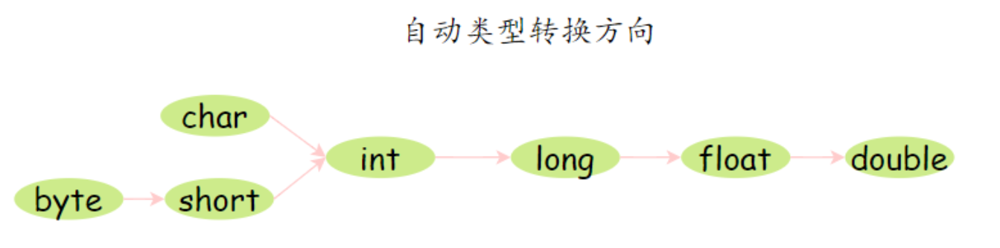
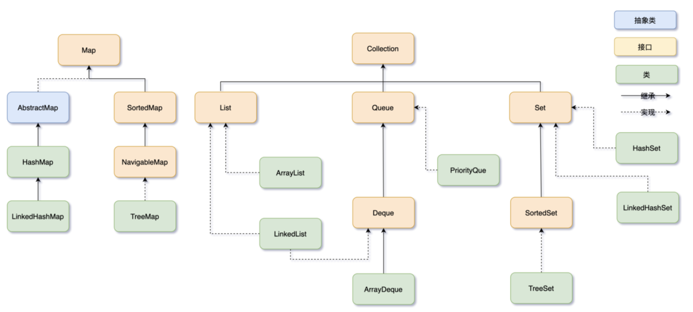
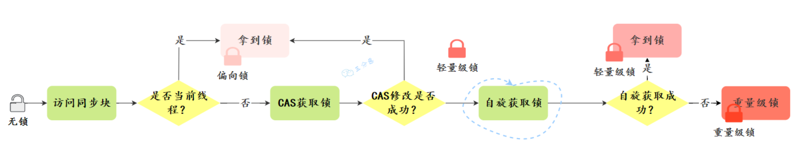

# 面渣逆袭

## Java SE


### Java 概述


Java 特点：面向对象(封装继承多态)、平台无关性、支持多线程、编译与解释并存

平台无关性的原理：Java 程序是通过 Java 虚拟机在系统平台上运行的，只要该系统可以安装相应的 Java 虚拟机，该系统就可以运行 java 程序。

**字节码** 是 Java 程序经过编译之类产生的.class 文件，字节码能够被虚拟机识别，从而实现 Java 程序的跨平台性。

Java 从源代码到运行的步骤

1. 编译：`.java` 被  **jdk 中的 javac** 编译为 虚拟机能理解的字节码 `.class`
2. 解释：**虚拟机** 执行字节码，翻译成机器码
3. 执行：执行机器码

c++ 没有内置多线程机制


JVM （Java 虚拟机） < JRE （Java 运行时环境） < JDK （Java 软件开发包）

JVM + 核心类库 = JRE

JRE + 开发工具 = JDK


### 基础语法


Java 的数据类型分两种：**基本数据类型**和**引用数据类型**。

**基本数据类型：**

- 数值型
  - 整数类型（byte、short、int、long）（1、2、4、8 字节）
  - 浮点类型（float、double）（4、8字节）
- 字符型（char）（2字节）
- 布尔型（boolean）（1比特）

**引用数据类型**：数组、类、接口


自动类型转换：表数范围小的可以赋给大的。



**在 Java 里面，没小数点的默认是 int,有小数点的默认是 double**

- `float = 3.4` 不正确，不能将 double 直接赋值给 float，需要写成 `float f = 3.4F` 或者 强制类型转换 `float f = (flaot)3.4` 
- `short s = 1; s = s + 1;`不正确，因为 1 是 int，不能复制给 short。需要写成`short s = 1; s += 1;`，这样表达隐含强制类型转换


装箱就是把基本数据类型变成其对应的引用数据类型，拆箱反之。

Integer 是 int 的包装类，属于引用数据类型。


`&` 是 逻辑与，`&&` 是短路与。前者需要判断两个条件，后者前一个条件 false，直接返回 false。`|` 和 `||`同理。


switch(expr) 的作用范围：

- Java 5 以前：byte, short, char, int
- Java 5 开始：引入枚举类型 enum
- Java 7 开始：String

Long 在所有版本中都不可以。（浮点型 和 char 还有 boolean 也不行）

枚举类型：用于表示一组有限的命名常量

``` java
enum Color {
    RED,
    GREEN,
    BLUE
}
```


乘 2 的 n 次方最有效率的方式是 **左移 n 位**。


`i = i++;` 值不变：

**`i++` 是一个表达式，是有返回值的**，它的返回值就是 i 自加前的值。

Java对自加是这样处理的：首先把 i 的值（注意是值，不是引用）拷贝到一个临时变量区，然后对 i 变量加 1，最后返回临时变量区的值。

``` java
// i++ 干的事情 
int tmp = i;
i = i + 1;
return i;
```


IEEE 754 标准的单精度浮点数格式：

float 32位 ：符号位 1 + 指数 8（原本的值加上 127，这样可以表示正负） + 尾数 23（省略1不写）

尾数计算：25.125(D) = 11001.001(B) = 1.1001001 * 2 ^ 4 (B) 

指数计算：4 + 127 = 131(D)  = 10000011(B)

0 10000011 10010010000000000000000


float 储存在舍入误差  0.1+ 0.2 != 0.3

保证数据的高准确性（金融方面），需要使用`BigDecimal` 

在处理小额支付或计算时，可以转换为较小的货币单位（如分），可以提供运算速度同时保证准备性。

BigDecimal 0.1元 用 int 10分 来算.


### 面向对象


面向过程：拆分成一个一个步骤，然后一次调用函数。

面向对象：分解成各个对象，加强代码重用。

面向对象编程的三大特性：封装、继承、多态

- 封装：把对象的属性私有化，向外提供可访问的方法。
- 继承：允许子类继承父类的属性和方法
- 多态：同一个行为具有不同的表现形式
  - **三个前置条件：子类继承父类、子类重写父类方法、父类引用指向子类的对象**
  - 多态的目的是为了提高代码的**灵活性和可扩展性**，使得代码更容易维护和扩展。比如说动态绑定，**允许在程序在运行时再确定调用的是子类还是父类的方法。**

``` java
//子类继承父类
class Wangxiaoer extends Wanger {
    public void write() { // 子类重写父类方法
        System.out.println("记住仇恨，表明我们要奋发图强的心智");
    }

    public static void main(String[] args) {
        // 父类引用指向子类对象
        Wanger wanger = new Wangxiaoer();
        wanger.write();
    }
}

class Wanger {
    public void write() {
        System.out.println("勿忘国耻");
    }
}

```


重载：名字相同，但参数个数不同的方法（发生在同一个类下）

重写：子类和父类，一样的方法名一样的参数，但是不同的方法体（发生在子类中）

- 需要遵守 里氏代换原则：子类在扩展父类的功能时，不应改变父类原有的行为(throw)


面向对象设计中的五个基本设计原则：（SOLID 原则）

- 单一职责原则 SRP：一个类应该只有一个职责。
- 开闭原则 OCP：实体应该对扩展开放，对修改关闭。
- 里氏替换原则 LSP：子类在继承时不能改变父类已有的行为(throw)
- 接口隔离原则 ISP：一个类不应该依赖于它不需要的接口
- 依赖反转原则 DIP：高级模块不应该依赖低级模块，两者都应该依赖于抽象


访问修饰符的可见性：

|           | 同一个类中 | 同一个包中 | 子类中 | 全局范围 |
| --------- | ---------- | ---------- | ------ | -------- |
| private   | yes        |            |        |          |
| default   | yes        | yes        |        |          |
| protected | yes        | yes        | yes    |          |
| public    | yes        | yes        | yes    | yes      |


this 可以理解为 **指向对象本身的一个指针**


一个类只能继承一个抽象类；但一个类可以实现多个接口。

``` java
// 抽象类
abstract class Animal {
    String name;

    Animal(String name) {
        this.name = name;
    }

    // 抽象方法
    abstract void makeSound();

    // 具体方法
    void sleep() {
        System.out.println(name + " is sleeping");
    }
}

// 接口
interface Swimmable {
    void swim();
}

interface Flyable {
    void fly();
}

// 一个类只能继承一个抽象类
class Dog extends Animal {
    Dog(String name) {
        super(name);
    }

    // 实现抽象方法
    void makeSound() {
        System.out.println(name + " says woof");
    }
}

// 一个类可以实现多个接口
class Fish implements Swimmable, Flayable {
    // 实现接口方法
    public void swim() {
        System.out.println("The fish is swimming");
    }
    public void fly() {
        System.out.println("The fish can not fly");
    }
}

```


- **静态变量**：static 修饰的变量，也被称为类变量。属于类。在内存中仅有一个副本。
- **实例变量**：依存于某一个实例，需要先创建对象才能通过对象访问到它。
- **静态方法**：static 修饰的方法，也被称为类方法。可以通过 `类名.方法名` 或 `对象名.方法名` 使用。不能访问其中非静态的成员变量和方法。
- **实例方法**：依存于类的实例，需要使用 `对象名.方法名` 使用，可以访问类的所有成员变量和方法。


final 关键字的作用

- 修饰一个**类**时，表明这个类不能被继承。（String，Integer 等包装类都是 final 修饰的）
- 修饰一个**方法**时，表明这个方法不能被重写。
- 修饰一个**变量**时，表示这个变量一旦初始化就不能修改（如果是引用类型的变量，引用不可变，引用指向的内容可以变）


final, finally, finalize 区别：

- final 如上
- finally 是异常处理的一部分，finally 块的代码总是会被执行
- finalize 是 Object 的一个方法，不能显式地调用 finalize 方法，因为它总是由垃圾回收器在适当的时间自动调用。


`==` 操作符和 `equals()` 方法用于比较两个对象：

- `==`：用于比较两个对象的引用，即它们是否指向同一个对象实例。
- **equals() 方法**：用于比较两个对象的内容是否相等。


`hashCode()` 方法的作⽤是获取哈希码，它会返回⼀个 int 整数。哈希码是由对象的内存地址或者对象的属性计算出来的，通常不会重复，可以用来作为 键值对 的键，提高查询效率。

**重写 equals 时必须重写 hashCode ⽅法** 的原因是为了 维护 `equals()`和 `hashCode()`之间的一致性，确保键值对正确检索对象。如果没有重写，则 equals 为 true 是，对应的哈希码可能不同，导致出错。

不同的对象也可能有相同的哈希码，这种情况称为 哈希冲突。所以在哈希表处理键时，不仅比较哈希码，还比较 equals 。


Java 参数是值传递，不是引用传递。

- 值传递：方法调用时会将实际参数的值复制一份传递给方法，方法内的修改不会影响实际参数，修改的是副本。
- 引用传递：方法调用时会将实际参数的引用（内存地址）传递给方法，方法内的修改会影响到实际参数指向的对象，因为它们指向同一个内存地址。

在Java中，虽然传递的是对象的引用的副本，但由于对象是可变的，因此在方法内部对对象的修改会影响到原始对象。这导致了一些人错误地认为Java是引用传递。但从传递参数的方式来看，Java中的参数传递是值传递。


浅拷贝：仅拷贝被拷贝对象的成员变量的值。（拷贝基本数据类型的值，引用数据类型的地址）

深拷贝：完全拷贝对象，包括堆中的对象。

深拷贝是安全的，浅拷贝引用类型，如果变量修改，会影响原对象。

浅拷贝 通过 Object 提供的 clone() 方法实现

深拷贝 通过 重写 clone() 方法，或者 序列化 实现。


Java 创建对象的方式：new，反射机制，clone()，序列化


### String


String 不是基本数据类型，被 final 修饰，不可继承。


- **String**：适用于字符串内容不经常改变的场景。在使用字符串常量或进行少量的字符串操作时使用。
- **StringBuilder**：适用于单线程环境下需要频繁修改字符串内容的场景，比如在循环中拼接或修改字符串。
- **StringBuffer**：适用于多线程环境下需要频繁修改字符串内容的场景，保证了字符串操作的线程安全。


`String s = "abc"`：Java 首先检查字符串常量池中是否存在，如果存在，则让新的变量引用，如果不存在，则在字符串常量池创建，然后让变量引用它。（s 指向字符串常量池）


`String s = new String("abc")`：分为两步，第一步就是上面的过程，第二步是在堆中创建一个新的字符串对象，初始化为字符串常量池中的一个副本。（s 指向 堆）

这种方法创建了 1 或者 2 个对象，堆中肯定有一个，字符串常量池看之前是否有，没有的话也得创建一个。


String 不可变的好处：安全、容易缓存和重用（字符串常量池出现的原因）、哈希值固定不变，适合作为键。

String 中通过 "+" 拼接时，会在堆中产生新的对象。"+" 其实是通过 StringBuilder 实现的 


intern() 用于返回当前字符串的引用。如果常量池存在，则返回对应的引用，如果不存在，则在常量池添加后返回引用。

``` java
// s1 != s2 s1 != s3 s2 == s3  
String s1 = new String("abc");  // 在常量池和堆中创建对象，返回堆中的引用
String s2 = "abc";  // 常量池已有，返回常量池引用
String s3 = s1.intern();  // 常量池也有，返回常量池引用。

```


### Integer


**自动装箱** 过程中，会使用`Integer.valueOf()`方法来创建`Integer`对象。

`Integer.valueOf()`方法会针对数值在 -128 到 127 之间的`Integer`对象使用缓存。

``` java
// a == b，大于127 则会创建两个不同对象
Integer a = 127;
Integer b = 127;
```

要比较`Integer`对象的数值是否相等，应该使用`equals`方法，而不是`==`运算符。


Integer 缓存池，默认范围是 -128 到 127。主要目的是优化性能和内存使用。


new Integer(10) == new Integer(10) 结果为 false

`== `比较的是内存地址，不是值，两者在指向 堆 中的不同位置。


String 转成 Integer 的两个方法：（本质其实都是调用 `parseInt(String s, int radix)`，radix 表示进制）

``` java
Integer.parseInt(String s)
Integer.valueOf(String s)
```


### Object


Object 主要提供了 11 个方法：

- 对象比较：hashCode(), equals()
- 对象拷贝：clone()
- 对象转字符串：toString()
- 多线程调度：wait(), wait(long timeout), wait(long timeout, int nanos), notify(), notifyAll()
- 反射：getClass()
- 垃圾回收：finalize()


### 异常处理


`Throwable` 是 Java 语言中所有错误和异常的基类。它有两个主要的子类：Error 和 Exception。

- Error:  程序无法处理。
- Exception：程序可以处理。
  - 编译时异常（编译不通过）
  - 运行时异常


异常的处理方式：

- 抛出异常：
  - throw：用在方法上，后面跟的是异常类
  - throws：用在方法内，后面跟的是异常对象
- 捕获异常：try catch（finally 无论 try 中有无异常都要执行）


### I/O

 IO 流：

- 按照数据流方向划分：输入流、输出流
- 按照数据单位划分：字节流、字符流
- 按照功能划分：节点流、处理流、管道流


Java 的 IO 流体系到了一个设计模式——**装饰器模式**。（通过将对象放入包装对象中来动态地扩展其功能）


Java 缓冲区预防溢出：

- 合理设置缓冲区大小
- 控制写入数据量


为什么有了字节流还需要字符流？

字符流虽然是由 Java 虚拟机将字节转换得到的，但这个过程比较耗时，而且容易出现乱码问题，所以干脆提供了直接操作字符的接口。


IO 分类：

- BIO Blocking I/O：阻塞式 IO，等待 IO 完成。（适合连接少）
- NIO Non-blocking I/O：非阻塞式 IO，线程等待 IO 时，可以执行其他任务。（适合连接多但连接时间短）
- AIO Asynchronous I/O：异步 IO，线程发起 IO 请求后立即返回，IO 完成后通过回调函数通知线程。（适合连接多且连接时间长）


### 序列化


**序列化就是把 Java 对象转为二进制流**，方便存储和传输。

**反序列化就是把二进制流恢复成对象**。


Serializable 接口 是一个标记，没有具体作用。如果不实现这个接口，可能会报错。

serialVersionUID 就是起验证作用，验证序列化的对象和反序列化的对象 ID 是否一致。


序列化的时候是不包含静态变量的。对不不想进行序列化的变量，使用 `transient` 关键字修饰。


序列化方式：Java 对象流序列化、JSON 序列化、protoBuff 序列化


### 泛型 

`<T>`

泛型的本质是参数化类型，也就是说所操作的数据类型被指定为一个参数。

泛型一般有三种使用方式:**泛型类**、**泛型接口**、**泛型方法**。

**常用的通配符为： T，E，K，V，？**


**泛型擦除（类型擦除）**：Java 的泛型是伪泛型，这是因为 Java 在编译期间，所有的类型信息都会被擦掉。因为 Java 的范型只存在于源码里，编译的时候给你静态地检查一下范型类型是否正确，而到了运行时就不检查了。

``` java
// 以下两者在 JRE 看来没有区别
// 源码还是得按上面的写
LinkedList<Integer> list = new ListedList<Integer>();
LinkedList list = new ListedList();
```

**类型擦除是为了向下兼容，JDK 5 之前没有泛型。**


### 注解


**Java 注解本质上是一个标记**

有了标记之后，我们就可以在编译或者运行阶段去识别这些标记，然后搞一些事情，这就是注解的用处。


### 反射


**反射是指在运行时动态地获取类的信息以及操作类的属性、方法和构造函数的能力。**

应用场景：注解、AOP


反射的基本原理可以简述如下：

1. 首先，通过类的全限定名（包名加类名）或对象的`getClass()`方法获取对应的`Class`对象。
2. 然后，通过`Class`对象的方法，可以获取类的构造函数、属性、方法等信息。
3. 最后，通过`Constructor`、`Field`和`Method`等类的实例，可以动态地创建对象、读写属性、调用方法等操作。


### JDK 1.8 新特性


- 接口默认方法：允许给接口添加一个非抽象的方法实现，只需要 `default` 用关键字修饰即可
- Lambda 表达式和函数式接口：函数作为一个方法的参数
- Stream API：用函数式编程方式在集合类上进行复杂操作
- 日期时间 API：改进日期时间管理
- optional 类：解决空指针异常的问题


Lambda 表达式本质上是一段匿名内部类，也可以是一段可以传递的代码。

只有那些函数式接口（Functional Interface）才能缩写成 Lambda 表示式。

函数式接口（Functional Interface）就是只包含一个抽象方法的声明。针对该接口类型的所有 Lambda 表达式都会与这个抽象方法匹配。（例如：Comparator, Runnable 等等）


Optional 是用于防范控制还早呢异常，可以看做是包装对象的容器。


Stream 流可以对一个包含一个或多个元素的集合做各种操作。（Filter, map 转换 等

- 中间操作： Filter 过滤, map 转换
- 终端操作：sorted 排序，match 匹配，count 技术，reduce 规约成一个值


## Java 集合框架


### 引言


Java 集合框架可以分为两条大的支线：

- Collection：List、Set、Queue
- Map




ArrayDeque 是一个基于数组的双端队列，可以在两端插入和删除元素。

LinkedList，它既可以当作 List 使用，也可以当作 Queue 使用。


1. ArrayList：ArrayList 可以看作是一个动态数组，它可以在运行时动态扩容。优点是访问速度快，可以通过索引直接查到元素。缺点是插入和删除元素可能需要移动元素，效率就会降低。
2. LinkedList：LinkedList 是一个双向链表，它适合频繁的插入和删除操作。优点是插入和删除元素的时候只需要改变节点的前后指针，缺点是访问元素时需要遍历链表。
3. HashMap：HashMap 是一个基于哈希表的键值对集合。优点是插入、删除和查找元素的速度都很快。缺点是它不保留键值对的插入顺序。
4. LinkedHashMap：LinkedHashMap 在 HashMap 的基础上增加了一个双向链表来保持键值对的插入顺序。


### List


ArrayList 和 LinkedList 的区别主要体现在**数据结构、用途、是否支持随机访问、内存占用**等方面

- ArrayList
  - 基于动态数组，适合查找，支持随机访问，内存占用主要体现在预留空间
- LinkedList
  - 基于链表，适合增删（体现在效率上，不需要移动元素，时间复杂度还是一样 O(n)），不支持随机访问，内存占用主要体现在指针


ArrayList 的扩容机制：

初始的数组容量在定义的时候确定，满了后创建一个 1.5 被的新数组，然后拷贝过去。

ArrayList 使用`transient`修饰存储元素的`elementData`的数组，不让存储元素的数组被序列化。这是出于效率考虑，因为 ArrayList 长度为 100，但实际可能只用了 50。所以它 通过**readObject、writeObject** 自定义序列化和反序列化的策略。


- 快速失败：一旦检测到异常立即抛出
  - 直接遍历原有集合内容
  - java.util 包下的集合类都是快速失败的，不能在多线程下发生并发修改（迭代过程中被修改），比如 ArrayList 类。
- 安全失败：尽量继续执行程序，不立即抛出
  - 复制原有集合内容遍历
  - java.util.concurrent 包下的容器都是安全失败，可以在多线程下并发使用，并发修改，比如 CopyOnWriteArrayList 类。


实现 ArrayList 线程安全：

- 使用 Vector 代替 ArrayList。（不推荐，Vector 是一个历史遗留类）
- 使用 Collections.synchronizedList 包装 ArrayList，然后操作包装后的 list。
- 使用 CopyOnWriteArrayList 代替 ArrayList。
- 在使用 ArrayList 时，应用程序通过同步机制去控制 ArrayList 的读写。


CopyOnWriteArrayList 就是线程安全版本的 ArrayList。CopyOnWrite 写时复制，已经说明了其原理。它采用读写分离的并发策略，读操作无锁，写操作加锁，复制写完，然后将引用指向新容器。


### Map


JDK 8 中 HashMap 的数据结构是`数组`+`链表`+`红黑树`。

HashMap 的核心是一个动态数组，用于存储键值对。这个数组的每个元素称为一个“桶”（Bucket），每个桶的索引是通过对键的哈希值进行哈希函数处理得到的。

哈希冲突时，通过拉链法解决。当链表的长度超过 8 时，且数组的长度大于 64，链表就会转换为红黑树。红黑树的**查询效率**是 O(logn)，比链表的 O(n) 要快。

扩容机制：达到阈值（容量 * 负载因子）时，扩容成原来的两倍。然后重新计算元素哈希值，放入新数组中。


红黑树是一种自平衡的二叉查找树：

1. 每个节点要么是红色，要么是黑色；
2. 根节点永远是黑色；
3. 所有的叶子节点都是是黑色的（下图中的 NULL 节点）；
4. 红色节点的子节点一定是黑色的；
5. **从任一节点到其每个叶子的所有简单路径都包含相同数目的黑色节点**


不用二叉树的原因：当插入数据有序时，可能会退化成链表。

不用平衡二叉树的原因，维护平衡的成本高。

红黑树是一种折中的方案，保证了树平衡的同时，保证了插入和删除操作的性能，查询效率是 O(logn)

**红黑树是一种自平衡的二叉查找树**，每个节点都大于其左子树中的任何节点，小于其右子节点树种的任何节点。

红黑树通过 **旋转(左旋和右旋) 和 染色** 保持平衡。


map 中 只重写 equals 没重写 hashcode 会导致 equals 相同的元素被放入 不同的桶中，


put() 流程：

1. hash 方法计算哈希值（hashcode() + 右移16位）
2. 扩容
3. 计算下标(`n- 1 & hash`)，放入。链表大于 8，数组大于 64 转换成 红黑树。 

get() 流程：

1. hash 方法计算哈希值（hashcode() + 右移16位）
2. 计算下标(`n- 1 & hash`)
3. 找到结果返回。如果会链表则遍历，如果为树，则查找红黑树。


hash 函数： `return (key == null) ? 0 : (h = key.hashCode()) ^ (h >>> 16);`

key 的 hashCode 和 其右移16位做异或运算 是为了降低哈希碰撞的概率。这种方式利用了hashcode的 高16位 和低16位。

hashcode() 返回 int 类型的哈希值，32位。


HashMap 容量是 2 的倍数是为了快速定位元素下标。`(n - 1) & hash`

` n - 1` 相当于 低位掩码，当前位以及更高位没有意义，能被整除。余数就是低位，只需要通过与操作把低位获取即使余数。


如果你传入 17 作为初始容量，HashMap 实际上会被初始化为大小为 32 的哈希表。（转换为大于或等于 17 的最小 2 的幂）

不传入初始容量，则默认为 16


HashMap 里哈希构造函数的方法叫 除留取余法，除以一个不大于长度的数然后取余。

其他哈希函数的构造方法：直接定址、数字分析、平方取中、折叠法等


解决哈希冲突方法：

- 再哈希法：两套哈希算法，遇到冲突用另外一套。
- 开放地址法：遇到哈希冲突，寻找下一个空位。
  - 线性探测：从该位置开始依次找空位
  - 二次探测：从冲突位置开始以（1, -1, 4, -4, 9, -9）方式寻找
  - 双重哈希：和再哈希类似
- 拉链法


key 相等的条件：

1. 先用 `==` 判断两者引用的对象是否相同，相同则 key 一定相同
2. 引用对象不相同则 看 `hashcode()` 和 `equals()`，这两者相同也可说明 key 相同。

``` java
(k = e.key) == key || (key != null && key.equals(k))
```


红黑树节点的大小大概是普通节点大小的两倍，所以转红黑树，牺牲了空间换时间，更多的是一种兜底的策略，保证极端情况下的查找效率。

链表转红黑数阈值为 8 的原因：统计学中，节点个数为 8 的概率仅为 0.00000006

红黑数转链表阈值为 6 的原因：防止刚好在 8 附近，两者不断转换，浪费资源。


选择了 0.75 作为 HashMap 的默认加载因子这是对 空间 成本和 时间 成本平衡的考虑。设置小了浪费空间，设置大了浪费查找时间。


JDK 8 的 新 hash 算法（无符号右移 16 位） 保证了数组扩容后 **要么在原来的位置，要么在 原来的位置 + 原来的容量**

扩容后，只需要一次位运算即可判断位置，计算成本相对较低。

具体来说，就是判断原哈希值的高位中新增的那一位是否为 1，如果是，该元素会被移动到原位置加上旧容量的位置；如果不是，则保持在原位置。


JDK 1.8 对 HashMap 的优化：

1. 数据结构：从 数组 + 链表 改成了 数组 + 链表 + 红黑树
2. 链表插入方式：从 头插法 改成了 尾插法
3. 扩容 rehash：从 重新 hash 定位 到 简单逻辑判断就可确定。（高位新增是否为 1）
4. 扩容时机：从 先判断再插入 到 先插入到判断
5. 散列函数：从 四次移位和四次异或 到 一次


HashMap 在多线程下的问题：

- 多线程下扩容会死循环：JDK 1.7 中使用头插法，多线程扩容时可能出现环形链表，导致死循环。 JDK 1.8 已经修复。
- put 可能导致元素丢失：多线程没有加锁，哈希冲突时 put 被其他线程覆盖掉，没有用上链表。
- put 和 get 并发，导致 get 为 null：线程 1 put 时触发扩容，线程 2 get 为 null。


解决 HashMap 线程不安全：

- 直接在 Hashtable 方法上加入 `synchronized` 关键字（不推荐）
- Collections.synchronizedMap(Map) 包装器
- ConcurrentHashMap，使用 CAS + synchronized 关键字


HashMap 内部节点无序，LinkedHashMap 或者 TreeMap 是有序的。

- LinkedHashMap：维护了一个双向链表，有 before 和 after 标志前后节点。
- TreeMap：通过 key 的比较器决定元素顺序就，底层是 红黑树。


TreeMap 是基于红黑树实现的，put 元素的时候会先判断根节点是否为空，如果为空，直接插入到根节点，如果不为空，会通过 key 的比较器来判断元素应该插入到左子树还是右子树。

get 元素的时候会通过 key 的比较器来判断元素的位置，然后递归查找。

在没有发生哈希冲突的情况下，HashMap 的查找效率是 O(1)。适用于查找操作比较频繁的场景。而 TreeMap 是基于红黑树实现的，所以 TreeMap 的查找效率是 O(logn)。并且保证了元素的顺序，因此适用于需要大量范围查找或者有序遍历的场景。


### Set


HashSet 其实是由 HashMap 实现的，只不过值由一个固定的 Object 对象填充，而键用于操作。

HashSet 主要用于去重，它会自动去重，因为使用 HashMap 实现的。

HashSet 的 add 方法是通过调用 HashMap 的 put 方法实现的，通过哈希值判断是否重复，如果重复，则覆盖。


## Java 并发编程


### 基础


- 并行：多个处理器同时处理任务
- 并发：单个处理器通过时间片轮转的方式处理任务


线程安全：一段代码块或者一个方法在多线程环境中被多个线程同时执行时能够正确地处理共享数据

三个要素来确保线程安全：

- 原子性：共享变量的修改操作不可分割（互斥锁 synchronized 或者原子操作 AtomicInteger 来保证）
- 可见性：共享变量修改后可以立即被其他线程看到（volatile 关键字）
- 活跃性问题：确保线程不会因为死锁、饥饿、活锁等问题导致无法继续执行

活锁是彼此让步而无法向前推进。


基本单位、内存空间、开销、通信、崩溃影响范围 五个角度：

- **进程是操作系统分配资源的基本单位，线程是操作系统调度的基本单位**。
- 进程拥有独立的内存空间，线程共享所属进程的内存空间。
- 进程的创建和销毁需要资源的分配和回收，开销较大；线程的创建和销毁只需要保存寄存器和栈信息，开销较小。
- 进程间的通信比较复杂，而线程间的通信比较简单。
- 进程间是相互独立的，一个进程崩溃不会影响其他进程；线程间是相互依赖的，一个线程崩溃可能影响整个程序的稳定性。

一个进程中可以有多个线程，多个线程共用进程的堆和方法区（JDK 8 为元空间）资源，但是每个线程都会有自己的程序计数器和栈。


协程通常被视为比线程更轻量级的并发单元，它们主要在一些支持异步编程模型的语言中得到了原生支持（Kotlin、Go）


Java 中 线程之间的通信通过共享内存的方式来完成。JMM Java 内存模型决定一个线程的共享变量的写入何时对另外一个线程可见。

线程之间的共享变量存储在主内存（main memory）中，每个线程都有一个私有的本地内存（local memory，JMM 的抽象概念），本地内存中存储了共享变量的副本。

线程 A 和 线程 B 通信的步骤：

1. 线程 A 把 其本地内存中的共享变量副本刷新到主内存中
2. 线程 B 到主内存中读取共享变量同步到其本地内存


Java 中创建线程主要有三种方式，分别为继承 Thread 类、实现 Runnable 接口、实现 Callable 接口。

- 继承 Thread 类，重写 `run()`方法，调用 `start()`方法启动线程。
  - Java 不支持多重继承，所以如果类已经继承了另一个类，就不能使用这种方法了。
- 实现 Runnable 接口，重写 `run()` 方法，然后创建 Thread 对象，将 Runnable 对象作为参数传递给 Thread 对象，调用 `start()` 方法启动线程。
  - 避免 Java 的单继承限制，更加符合面向对象的编程思想。将 任务代码 和 线程控制代码 解耦。
- 实现 Callable 接口，重写 `call()` 方法，然后创建 FutureTask 对象，参数为 Callable 对象；紧接着创建 Thread 对象，参数为 FutureTask 对象，调用 `start()` 方法启动线程。
  - 可以获取线程的执行结果

本质都需要通过 start() 启动线程。

使用 start() 才能创建新线程，如果直接使用 run()，则是在主线程中执行，没有创建新线程。


在确定一个系统 **最多可以创建多个线程** 时，需要考虑系统的内存大小外和Java 虚拟机栈的大小。可以通过命令查看 JVM 栈的默认大小。

启动一个 Java 程序，会启动的线程：main线程、垃圾回收线程、编译器线程。


线程常用的调用方法：

- 等待
  - wait()：阻塞挂起，直到 其他线程调用共享对象的 notify() 或 notifyAll()；其他线程调用阻塞线程的 interrupt() 方法，然后阻塞进程异常返回。
  - wait(long timeout)：多了一个超时参数，指定时间没有被唤醒，则超时返回
  - wait(long timeout, int nanos)：nanos 参数表示额外的纳秒部分
  - join()：当一个线程调用另一个线程的 `join()` 方法时，调用线程将会被阻塞，直到被调用线程执行完毕或者超时，才会继续执行。
- 通知（唤醒线程的两个方法）
  - notify()：唤醒一个在这个共享变量上调用 wait 系列方法后被挂起的线程。一个共享变量上可能会有多个线程在等待，具体唤醒哪个等待的线程是随机的。
  - notifyAll()：唤醒所有在该共享变量上调用 wait 系列方法而被挂起的线程。
- 让出优先权
  - yield()：暗示线程调度器，请求让出自己的 CPU
- 中断：**设置线程的中断标志并不能直接终止该线程的执行。被中断的线程会根据中断状态自行处理。**
  - interrupt()：设置中断标志为 true 并立即返回（实际并没有被中断）
  - isinterrupted()： 检测当前线程是否被中断。
  - interrupted()： 检测当前线程是否被中断，同时如果中断，则会清除中断标志。
- 休眠
  - sleep(long millis)：暂时让出指定时间的执行权。

stop() 方法用来强制线程停止执行，目前已经处于废弃状态，因为危险。


Java 中，线程有六种状态：

| 状态         | 说明                                                         |
| :----------- | :----------------------------------------------------------- |
| NEW          | 初始状态：线程被创建，但还没有调用 start()方法               |
| RUNNABLE     | 运行状态：Java 线程将操作系统中的 **就绪 Ready 和 运行 Running** 两种状态笼统的称作“运行” |
| BLOCKED      | 阻塞状态：表示线程阻塞于锁                                   |
| WAITING      | 等待状态：表示线程进入等待状态，进入该状态表示当前线程需要等待其他线程做出一些特定动作（通知或中断） |
| TIME_WAITING | 超时等待状态：该状态不同于 WAITIND，它是可以在指定的时间自行返回的 |
| TERMINATED   | 终止状态：表示当前线程已经执行完毕                           |


上下文切换：当线程使用完时间片后，就会处于就绪状态并让出 CPU 让其他线程占用（实现并发）


Java 中的线程分为两类，分别为 daemon 线程（守护线程，例如垃圾回收线程）和 user 线程（用户线程，例如 main 线程）。

只要有一个用户线程还没结束，正常情况下 JVM 就不会退出。守护线程(例如垃圾回收)不影响 JVM 的退出。


线程间通信：

- volatile 和 synchronized 关键字
  - volatile 用来修饰成员变量，告知程序均需从共享内存中读取，保证可见性
  - synchronized 可以修饰方法，确保同一时间只有一个线程执行
- 等待/通知机制：wait() notify()
- 管道输入/输出流：用于线程之间的数据传输，媒介为内存。也实现了字节和字符流。
- 使用 Thread.join() ：当 join() 的线程结束后才继续当前线程
- 使用 ThreadLocal：使每个线程拥有独立副本


sleep() 和 wait() 区别：

- 所属类： Thread 类； Object 类。
- 锁的释放：不会释放任何锁；会释放锁。
- 使用对象：任何地方；必须在同步代码块或者同步方法中别调用，因为 wait() 方法的前提是当前线程必须持有对象的锁。
- 唤醒条件：指定时间后自动唤醒；notify() notifyAll()


线程安全：多线程环境下，多个线程对共享资源的访问不会导致数据的不一致性。

使用场景：实现单例模式，懒汉式单例则在第一次使用时初始化，这种方式需要使用双重检查锁定来确保线程安全，volatile 用来保证可见性，syncronized 用来保证同步。


### ThreadLocal


ThreadLocal 是 Java 中提供的一种 **用于实现线程局部变量** 的工具类。它允许每个线程都拥有自己的独立副本，从而实现线程隔离，用于解决多线程中共享对象的线程安全问题。


解决线程安全问题的方法：

- ThreadLocal：

  ``` java
  //创建一个ThreadLocal变量
  public static ThreadLocal<String> localVariable = new ThreadLocal<>();
  //设置ThreadLocal变量的值
  localVariable.set("沉默王二是沙雕");
  //获取ThreadLocal变量的值
  String value = localVariable.get();
  //删除ThreadLocal变量的值
  localVariable.remove();
  ```

- synchronized 修饰 方法或代码块

  ``` java
  public synchronized void method() {
      // 线程安全的操作
  }
  ```

- ReentrantLock

  ``` java
  ReentrantLock lock = new ReentrantLock();
  
  public void method() {
      lock.lock();
      try {
          // 线程安全的操作
      } finally {
          lock.unlock();
      }
  }
  ```

- 原子变量类（如 AtomicInteger，AtomicLong 等）,它们利用 CAS（比较并交换），实现了无锁的原子操作，适用于简单的计数器场景。

  ``` java
  AtomicInteger atomicInteger = new AtomicInteger(0);
  
  public void increment() {
      atomicInteger.incrementAndGet();
  }
  ```

- 线程安全的集合类，如 ConcurrentHashMap，CopyOnWriteArrayList 等。

  ``` java
  ConcurrentHashMap<String, String> map = new ConcurrentHashMap<>();
  ```

- volatile 变量

  ``` java
  private volatile boolean flag = false;
  ```

  

ThreadLocal 可以用来储存用户信息。假如在服务层和持久层也要用到用户信息，就可以在控制层拦截请求把用户信息存入 ThreadLocal，另外，cookie、session 等等数据隔离都可以通过 ThreadLocal 去实现。


ThreadLocal 本身并不存储任何值，它只是作为一个映射，来映射线程的局部变量。当一个线程调用 ThreadLocal 的 set 或 get 方法时，实际上是访问线程自己的 ThreadLocal.ThreadLocalMap。ThreadLocalMap 是 ThreadLocal 的静态内部类，它内部维护了一个 Entry 数组，key 是 ThreadLocal 对象，value 是线程的局部变量本身。


ThreadLocal 的实现原理就是，每个线程维护一个 Map，key 为 ThreadLocal 对象，value 为想要实现线程隔离的对象。

1、当需要存线程隔离的对象时，通过 ThreadLocal 的 set 方法将对象存入 Map 中。

2、当需要取线程隔离的对象时，通过 ThreadLocal 的 get 方法从 Map 中取出对象。

3、Map 的大小由 ThreadLocal 对象的多少决定。

在 ThreadLocalMap 中，`key = new ThreadLocal<>()` 是一个 **弱引用对象**。当 JVM 进行垃圾回收时，如果发现了弱引用对象，就会将其回收。value 是强引用。

**为什么 key 要设计成弱引用：当内存不足时，JVM 主动回收弱引用对象**。一旦 key 被回收，ThreadLocalMap 在 进行 get 和 set 的时候就会对 key 为 null 的 Entry 进行清理。


- 强引用是指通过 `new` 关键字创建的对象的默认引用方式。当一个对象被强引用所引用时，即使内存空间不足，垃圾回收器也不会回收该对象，宁愿抛出 OutOfMemoryError。

  ``` java
  Object obj = new Object();
  ```

- 弱引用是一种较强度较弱的引用方式。当一个对象只被弱引用所引用时，在垃圾回收器进行垃圾回收时，无论内存空间是否充足，该对象都会被回收。

  ``` java
  WeakReference<Object> weakRef = new WeakReference<>(new Object());
  ```

  

如果一个线程一直在运行，并且其 `ThreadLocalMap` 中的 Entry.value 一直指向某个强引用对象，那么这个对象就不会被回收，从而导致内存泄漏。当 Entry 非常多时，可能就会引发更严重的内存溢出问题。（ThreadLocal 内存泄露）

**避免内存泄漏问题**：使用完 ThreadLocal 后，及时调用 `remove()` 方法释放内存空间。`remove()` 方法会将当前线程的 ThreadLocalMap 中的所有 key 为 null 的 Entry 全部清除。


**ThreadLocalMap 源码系列：**

 虽然被叫做 Map，其实它是 **没有实现 Map 接口** 的，但是结构还是和 HashMap 比较类似的，主要关注的是两个要素：元素数组 和 散列方法。

- 元素数组：一个 table 数组，存储 Entry 类型的元素，Entry 是 ThreaLocal 弱引用作为 key，Object 作为 value 的结构。
- 散列方法：哈希取余法，取出 key 的 threadLocalHashCode，然后和 table 数组长度减一&运算（相当于取余）。

解决 Hash 冲突： 开放定址法(线性向后查找) 。

扩容机制：

- 扩容阈值：(len * 2) / 3
- rehash() 具体实现：清理过期的 Entry，然后还要根据条件判断`size >= threshold* 3/4`来决定是否需要扩容。
- resize() 具体实现：扩容成两倍，然后遍历重新散列，还是用 开放定制法。


父子线程共享数据：

不能用 ThreadLocal，但可以用 InheritableThreadLocal，在 Thread.init 的时候，如果父线程的inheritableThreadLocals 不为空，就把它赋给当前线程（子线程）的 inheritableThreadLocals。


### Java 内存模型 JMM


Java 内存模型（Java Memory Model）是一种 **抽象的模型，并不真实存在**，简称 JMM，定义了线程内存和主内存之间的抽象关系：线程之间的共享变量存储在 主内存（Main Memory）中，每个线程都有一个私有的 本地内存（Local Memory），本地内存中存储了共享变量的副本，用来进行线程内部的读写操作。本地内存可能对应于 CPU 缓存、寄存器或者其他硬件和编译器优化。


为什么线程用自己的内存？

- 提高并发性能，避免内存访问竞争。
- 避免指令重排序对最终结果产生影响。


并发编程的重要概念：

- **原子性**：要么全部执行，要么全部不执行。（synchronized）
- **可见性**：一个线程修改，其它线程能够立即看到。（volatile，final 和 synchronized）
- **有序性**：从前往后依次执行代码，并发时有可能会发生指令重排。（synchronized 和 volatile）


指令重排序：（依次经历）

- 编译器优化的重排序
- 指令集并行的重排序
- 内存系统的重排序


指令重排序的限制规则：**happens-before 和 as-if-serial** 

- happens-before：前者执行的结果对后者可见
  - 两个操作存在 happens-bofore 关系，并不意味着必须要按照指定的顺序运行，只要不影响结果就可以重排。
  - 六大规则：程序顺序规则、监视器锁规则、volatile 变量规则、start() 规则、join() 规则
- as -if-serial:**单线程程序的执行结果不能被改变**
  - 编译器、runtime 和处理器都必须遵守 as-if-serial 语义
  - 编译器和处理器都不会对存在数据依赖的操作做重排序


volatile 关键字主要有两个作用，一个是保证变量的内存可见性，一个是禁止指令重排序。

- 保证变量可见性：当线程对 volatile 变量写操作时，JMM 会在写入后插入一个 Store-Barrier（写屏障）指令，这个指令会强制将本地内存中的变量值刷新到主内存中。当线程对 volatile 变量读操作时，JMM 会插入一个 Load-Barrier（读屏障）指令，这个指令会强制让本地内存中的变量值失效，从而重新从主内存中读取最新的值。
- 禁止指令重排序：
  - 写 volatile 变量的操作之前的操作不会被编译器重排序到写操作之后。
  - 读 volatile 变量的操作之后的操作不会被编译器重排序到读操作之前。
  - 通过这两条规则，保证了 volatile 变量的写操作总是发生在任何后续读操作之前。


### 锁


synchronized 是最常用的锁，它使用简单，并且可以保证线程安全，避免多线程并发访问时出现数据不一致的情况。尽管synchronized 随着版本更迭不断轻量化，但仍是悲观锁。

可以用在方法和代码块中：

- 修饰方法：同一时间只允许一个线程执行该方法。
  - 如果加在 静态方法 static 上，锁的是这个类的 Class 对象，因为静态方法是属于类级别的。
- 修饰代码块：synchronized 后面的括号中指定了要锁定的对象，可以是 this，也可以是其他对象。


synchronized 加锁：（JVM 帮我们 lock 和 unlock）

- 修饰方法时：JVM 采用 ACC_SYNCHRONIZED 标记符来实现同步
- 修饰代码块时：JVM 采用 monitorenter、monitorexit 两个指令来实现同步
- 三者都是**基于 Monitor 实现**，Monitor 又是由 **ObjectMonitor  实现** 的。


保证可见性：

- 线程加锁前，将清空工作内存中共享变量的值，从而使用共享变量时需要从主内存中重新读取最新的值。
- 线程加锁后，其它线程无法获取主内存中的共享变量。
- 线程解锁前，必须把共享变量的最新值刷新到主内存中。

保证有序性：

- 因为 as-if-serial 规则，所以能保证结果的有序性。无法保证指令不重排。

保证可重入：

- 锁对象的时候有一个计数器，获取锁 + 1，释放锁 - 1。


在对象头里，有一个叫做 Mark Word 的结构，其中有一个锁状态标志，用来记录锁的状态。

锁升级的过程：无锁 --> 偏向锁 --> 轻量级锁 --> 重量级锁

- 偏向锁：首次获得锁记录线程 ID，目的是消除同一线程的后续锁获取和释放的开销。如果另一个线程尝试获取这个锁，偏向模式会被撤销，并且锁会升级为轻量级锁。
- 轻量级锁：多个线程在不同时段获取同一把锁，即不存在锁竞争的情况，也就没有线程阻塞。
- 自旋锁：获取轻量级锁失败时，先进行自旋，反正立即进入阻塞状态。
- 锁粗化：当一系列锁操作在单一线程中完成时，将多个锁操作合并为一个更大范围的锁操作，减少锁请求次数。
- 锁消除：JIT 在运行时进行代码分析，消除不可能被多个线程访问的锁。




| 区别       | synchronized     | ReentrantLock                  |
| ---------- | ---------------- | ------------------------------ |
| 锁实现机制 | 对象头监视器模式 | 依赖 AQS                       |
| 灵活性     | 不灵活           | 支持相应中断、超时、尝试获取锁 |
| 释放锁形式 | 自动释放锁       | 显式调用 unlock()              |
| 支持锁类型 | 非公平锁         | 公平锁 和 非公平锁             |
| 条件队列   | 单条件队列       | 多个条件队列                   |
| 可重入支持 | 支持             | 支持                           |


AQS，全称是 AbstractQueuedSynchronizer，中文意思是抽象队列同步器。

AQS 的思想是，如果被请求的共享资源空闲，则当前线程能够成功获取资源；否则，它将进入一个等待队列，当有其他线程释放资源时，系统会挑选等待队列中的一个线程，赋予其资源。

通过维护一个volatile 修饰的 int 类型的状态 和一个先进先出（FIFO）的队列，来实现对共享资源的管理。

支持两种同步方式：

- 独占模式：每次只能有一个线程持有锁
- 共享模式：多个线程可以同时获取锁


**ReentrantLock** 是可重入的独占锁，同一个线程可以重复获取同一个锁，其他线程会被阻塞。

``` java
ReentrantLock lock = new ReentrantLock();  // 默认构造方法是 非公平锁
ReentrantLock lock = new ReentrantLock(true);  // 有参构造方法传入true来创建公平锁
```

- 公平锁：锁会授予等待时间最长的线程

- 非公平锁：锁可能会授予刚刚请求它的线程，而不考虑等待时间。


CAS（Compare-and-Swap）是一种乐观锁的实现方式，全称为“比较并交换”，是一种无锁的原子操作。

CAS 是乐观锁，线程执行的时候不会加锁，它会假设此时没有冲突，然后完成某项操作；**如果因为冲突失败了就重试，直到成功为止**。

CAS 的三个值：

- V：要更新的变量var
- E：预期值expected
- N：新值new

判断 V 是否等于 E，如果等于，将 V 的值设置为 N；如果不等，说明已经有其它线程更新了 V，于是当前线程放弃更新，什么都不做。这里的 E 预期值本质上指的是旧值。

CAS 的三个问题：

- ABA 问题：无法知晓某个值改成其他后又改回来的情况
  - 解决：每次变量更新时，不仅更新变量的值，还更新一个版本号
- 循环性能开销：一直自旋的性能开销
  - 解决：限制自旋次数
- 只能保证一个变量的原子操作：无法保证多个变量的原子性
  - 改用锁来保证
  - 合并变量，封装成一个对象，通过 AtomicReference 来保证原子性


保证原子性的方法：

- 使用原子类：AtomicInteger
- 使用 juc 包下的锁：ReentrantLock
- 使用 synchronized


AtomicInteger 的原理：使用 CAS 实现。


死锁的四个必要条件：

- 互斥条件
- 持有并等待条件
- 不可剥夺条件
- 循环等待条件


避免死锁：至少破坏死锁发生的一个条件

- 破坏互斥条件：通常不可行，因为加锁就是为了互斥。
- 破坏持有并等待条件：一次性申请所有资源。
- 破坏不可剥夺条件：申请不到进一步资源时，释放已有资源。
- 破坏循环等待条件：对资源进行排序，线程按序申请。


如何排查死锁问题：

1. 在 Linux 中，可以先使用top, ps 等命令查看进程状态
2. 然后使用 JDK 自带性能监控工具：jps, jstat, jinfo, jmap, jstack, jcmd。或者可视化性能监控工具：JConsole, VisualVM（这些工具也可以用来查看 JVM 信息）


**线程同步** ：在多线程环境下如何安全地访问和修改共享资源的问题。

实现方式有 6 种：互斥量、读写锁、条件变量、自旋锁、屏障、信号量

在 Java 中，synchronized 和 Lock 接口是实现线程同步的常用方式。

- synchronized：属于典型的互斥量，它保证了同一时间只有一个线程可以访问共享资源。
- Lock：ReentrantLock


- 悲观锁：每次访问共享资源都会产生冲突
  - synchronized 关键字 和 Lock 接口
- 乐观锁：对共享资源的访问不会产生冲突
  - 使用 CAS 来保证线程执行的安全性


### 并发工具类


**CountDownLatch 倒计数器**，有两个常见的应用场景：

- 协调子线程结束动作：等待所有子线程运行结束
- 协调子线程开始动作：统一各线程动作开始的时机

核心方法：

- await()：等待 latch 降为 0
- await(long timeout, TimeUnit unit)：等待 latch 降为 0，但是可以设置超时时间。
- countDown()：latch 数量减 1；
- getCount()：获取当前的 latch 数量。


CyclicBarrier 同步屏障：允许一组线程互相等待，直到达到某个公共屏障点（barrier），然后再继续执行。

核心还是 await()


| CyclicBarrier                                                | CountDownLatch                                               |
| :----------------------------------------------------------- | :----------------------------------------------------------- |
| CyclicBarrier 面向的是线程数                                 | CountDownLatch 面向的是任务数                                |
| 在使用 CyclicBarrier 时，你必须在构造中指定参与协作的线程数，这些线程必须调用 await()方法 | 使用 CountDownLatch 时，则必须要指定任务数，至于这些任务由哪些线程完成无关紧要 |
| CyclicBarrier 可以在所有的线程释放后重新使用                 | CountDownLatch 在计数器为 0 时不能再使用                     |
| 在 CyclicBarrier 中，如果某个线程遇到了中断、超时等问题时，则处于 await 的线程都会出现问题 | 在 CountDownLatch 中，如果某个线程出现问题，其他线程不受影响 |


Semaphore（信号量）是用来控制同时访问特定资源的线程数量，它通过协调各个线程，以保证合理的使用公共资源。

Semaphore 的本质就是**协调多个线程对共享资源的获取**。

可以用于做流量控制，特别是公用资源有限的应用场景，比如数据库连接。

使用方式：首先线程使用 Semaphore 的 acquire()方法获取一个许可证，使用完之后调用 release()方法归还许可证。还可以用 tryAcquire()方法尝试获取许可证。


Exchanger（交换者）是一个用于线程间协作的工具类。Exchanger 用于进行线程间的数据交换。它提供一个同步点，在这个同步点，两个线程可以交换彼此的数据。

如果第一个线程先执行 exchange()方法，它会一直等待第二个线程也执行 exchange 方法，当两个线程都到达同步点时，这两个线程就可以交换数据，将本线程生产出来的数据传递给对方。


ConcurrentHashMap 实现原理：

在 JDK 7 时：采用的是分段锁机制（Segment Locking），整个 Map 被分为若干段，每个段都可以独立地加锁。因此，不同的线程可以同时操作不同的段，从而实现并发访问。

- 由 Segment 数组结构和 HashEntry 数组构成的。
- put：和 HashMap 非常类似，只不过是先定位到具体的 Segment，然后通过 ReentrantLock 去操作而已。
- get：通过 hash(key) 定位到 segment，再遍历链表定位到具体的元素上。value是 volatile 的，不需要加锁。

在 JDK 8 后：不再使用分段锁，而是使用了一种更加精细化的锁——桶锁，以及 CAS 无锁算法。每个桶（Node 数组的每个元素）都可以独立地加锁，从而实现更高级别的并发访问。读操作通过 volatile 保持可见性，写操作通过 CAS 实现无锁更新。

- CAS + synchronized 来保证并发安全性，整个容器只分为一个 Segment，即 table 数组。
- put：计算 hash，遍历 node 数组，如果 node 是空的话，就通过 CAS+自旋的方式初始化；如果 node 非空，判断 node[i] ，为空则通过 CAS + 自旋写入数据，非空则用和 HashMap 一样，拉链法解决冲突，链表长度超过 8 则转换红黑苏，多加一个使用 synchronized写入数据。如果需要扩容，则 CAS + synchronized 实现扩容。
- get：通过 key 的 hash 进行定位，多一个判断 hash 值是否小于 0 。小于 0 说明是一个特殊节点，需要调用节点的 find 进行查找。


ConcurrentHashMap 是 HashMap 的线程安全版本，使用了 CAS、synchronized、volatile 来确保线程安全。

对比 HashMap 的优势：

- 允许并发，效率高。
- 读操作使用 volatile，不需要加锁

保证可见性：volatile

保证原子性：synchronized


CopyOnWriteArrayList 是一个线程安全的 ArrayList，它遵循写时复制（Copy-On-Write）的原则，即在写操作时，会先复制一个新的数组，然后在新的数组上进行写操作，写完之后再将原数组引用指向新数组。


### 线程池


线程池：管理线程的池子。线程池能够复用已创建的线程，避免创建和销毁开销的同时，还提高了响应速度。

工作流程：核心线程池干不完的放入任务队列，任务队列满了放入最大线程池（干完后多出来的线程会销毁），最大线程池还干不完执行拒绝策略。

核心参数：

- corePoolSize：核心线程池
- maximumPoolSize：最大线程池
- keepAliveTime：非核心线程存活时间
- unit：非核心线程存活时间单位
- workQueue：工作队列
- threadFactory：创建线程使用工厂
- handler：拒绝策略
  - AbortPolicy：拒绝任务，抛出异常。（默认策略）
  - CallerRunsPolicy：使用调用者线程来执行任务
  - DiscardPolicy：直接拒绝任务
  - DiscardOldestPolicy：丢弃工作队列中最老的请求，执行新任务。

常用的阻塞队列（工作队列）：

- ArrayBlockingQueue：数组实现有界策略（先进先出，适合固定大小的线程池）
- LinkedBlockingQueue：链表结构队列（不指定大小，默认是 Integer.MAX_VALUE）
- PriorityBlockingQueue：有优先级无界阻塞队列
- DelayQueue：延迟执行队列（二插堆实现，类似与 PriorityBlockingQueue）
- SynchronousQueue：无元素存储阻塞队列（实际上它不是一个真正的队列，因为没有容量。每个插入操作必须等待另一个线程的移除操作，同样任何一个移除操作都必须等待另一个线程的插入操作。）


线程池提交 execute 和 submit 区别：

- execute() 用于提交不需要返回值的任务
- submit()方法用于提交需要返回值的任务。线程池会返回一个 future 类型的对象，通过这个 future 对象可以判断任务是否执行成功，并且可以通过 future 的 get()方法来获取返回值


关闭线程池：shutdown() 和 shutdownNow()

- shutdownNow()能立即停止线程池，正在跑的和正在等待的任务都停下了。（interrupt 中断，无法响应中断请求的任务可能永远无法终止）
- shutdown()只是关闭了提交通道，用 submit()是无效的；而内部的任务该怎么跑还是怎么跑，跑完再彻底停止线程池。


如何配置线程数：

- 对于 CPU 密集型：减少上下文切换，所以将核心线程数设置为处理器核心数或核心数加一。
- 对于 IO 密集型：线程经常处于等待状态，所以可以设置成 核心数的两倍，提高 CPU 利用率。


创建线程池的方式主要有四种，本质都是通过 Excutors 创建（不推荐直接使用）：

- newFixedThreadPool (固定数目线程的线程池)
  - （n, n, 0, LQ）
  - 适用于处理 CPU 密集型的任务，长期执行任务。
- newCachedThreadPool (可缓存线程的线程池)
  - （0, max, 60s, SQ）
  - 并发执行大量短期的小任务
- newSingleThreadExecutor (单线程的线程池)
  - （1, 1, 0, LQ）
  - 适用于串行执行任务的场景，一个任务一个任务地执行。
- newScheduledThreadPool (定时及周期执行的线程池)
  - （n, max, 0, DQ）
  - scheduleAtFixedRate() ：按某种速率周期执行
  - scheduleWithFixedDelay()：在某个延迟后执行
  - 周期性执行任务的场景，需要限制线程数量的场景

前三种线程池的构造直接调用 ThreadPoolExecutor 的构造方法。上面（核心线程数，最大线程数，存活时间，工作队列缩写）


线程池异常处理方式：

- try-catch
- submit 执行，Future.get 接受异常
- 重写 ThreadPoolExecutor.afterExcute()，处理传递的异常引用
- 实例化时，传入自己的 ThreadFactory，设置 Thread.UncaughtExceptionHandler 处理为检测的异常。


线程池的五个状态：RUNNING,SHUTDOWN,STOP,TIDYING,TERMINATED。

RUNNING 通过 shutdown() 进入 SHUTDOWN，通过 shutdownNow() 进入 STOP。两者都没任务时，即为 TIDYING，执行完 terminal() 后即为 TERMINATED.


线程池提供了几个 setter 方法来设置线程池的参数。

setCorePoolSize(), setKeepAliveTime(), setMaximunPoolSize() 等等。

另外可以 用配置中心配置，或者 自己实现线程池，监听参数变化。


线程池调优：事前评估 --> 监控/告警 --> 动态调整 --> 事后观察 

注意事项：

- 合适的线程池大小（CPU 密集还是 IO 密集）
- 任务队列的选择（尽量有界队列）
- 尽量使用自定义的线程池（newFixedThreadPool 和 newScheduledThreadPool 队列无限大，容易导致内存溢出；newCachedThreadPool 最大线程无限大，可能导致负载过高 ）


单机线程池执行断电处理：对阻塞队列持久化；正在处理任务事务控制；断电之后正在处理任务的回滚，通过日志恢复该次操作；服务器重启后阻塞队列中的数据再加载。


### 并发容器和框架


Fork/Join 框架是 Java7 提供的一个用于并行执行任务的框架，是一个把大任务分割成若干个小任务，最终汇总每个小任务结果后得到大任务结果的框架。

核心：**分而治之** 和 **工作窃取算法**

**分治思想**：将一个规模为 N 的问题分解为 K 个规模较小的子问题，这些子问题相互独立且与原问题性质相同。求出子问题的解，就可得到原问题的解。（Fork 分，Join 合）

**工作窃取算法**：大任务拆成了若干个小任务，把这些小任务放到不同的队列里，各自创建单独线程来执行队列里的任务。干完活的线程窃取干活慢的线程里面的任务。（通常采用双端队列，自己执行一端拿，被窃取时另一端拿）

ForkJoinTask 与一般 Task 的主要区别在于它需要实现 compute 方法，用于判断是否需要进一步划分任务。


## JVM


### 引言


JVM，也就是 Java 虚拟机，它是 Java 实现跨平台的基石。

Java 程序：**编译器** 将 **.java 源代码** 编译成与平台无关的 **.class 字节码**，然后 **JVM** 对字节码进行解释，翻译为对应平台的 **机器码** 运行。


JVM 大致可以划分为三个部门：类加载器、运行时数据区和执行引擎。

- 类加载器：加载 Class 文件，读取到内存中
- 运行时数据区：方法区、堆、栈、程序计数器和本地方法栈
- 执行引擎：执行字节码，包括虚拟处理器、即时编译器 JIT 和 垃圾回收器


### 内存管理


垃圾回收 GC：释放垃圾占用的空间

**垃圾判断算法：**

- 引用计数算法：保存对象被引用的次数
- 可达性分析算法：引用链连接垃圾回收根 GC roots 开始的依次向下的对象，一个对象如果到垃圾回收根之间没有任务引用链，则表明其不可达，需要被回收。
  - GC Roots，是一组必须活跃的引用，不是对象，它们是程序运行时的起点，是一切引用链的源头。
  - 在 Java 中，GC Roots 包括以下几种：虚拟机栈中的引用，本地方法栈中 Java Native Interface (JNI) 的引用，类静态变量，运行时常量池中的常量

**垃圾回收算法：**

- 标记清理算法：标记出来然后清理（内存碎片问题）
- 复制算法：容量划分为一半，存活对象会被复制到另一半的一侧（浪费一半空间）
- 标记整理算法：标记然后将所有存活对象移到一侧。（移动成本高）
- 分代收集算法：融合上述 3 种基本的算法思想。新生代使用复制算法，老年代使用标记清理或标记整理算法。
  - 新生代：Eden 和 两个 Survivor，默认大小比例 8:1:1
  - 发生垃圾收集时，将 Eden 和 Survivor 中仍然存活的对象一次性复制到另外一块 Survivor 空间上，然后清理。

**垃圾收集器：**

- 新生代算法：
  - Serial：单线程，复制算法。
  - ParNew：多线程，复制算法
  - Parallel Scavenge 收集器：多线程，复制算法。主要关注吞吐量（吞吐量 = 运行时间/ (收集时间 + 运行时间)）
- 老年代算法：
  - Serial Old：单线程，标记整理算法。
  - Parallel Old：多线程，标记整理算法，关注吞吐量。

- CMS (Concurrent Mark-Sweep) 收集器：**一种以获取最短回收停顿时间为目标的收集器**。第一次实现了让垃圾收集线程与用户线程（基本上）同时工作。
  - 初始标记：STW，从 GC Roots 出发标记可达对象 
  - 并发标记：STW，从初始标记出发标记可达对象
  - 重新标记：短暂 STW，完成剩余标记任务，并发中的少量改动。
  - 并发清除：清除未被标记对象
  - 优点：**并发收集、低停顿**
  - 缺点：内存碎片多（标记清除算法）；并发能力依赖CPU 资源；并发清除会产生浮动垃圾
- G1 (Garbage-First) 收集器：一款面向服务器的垃圾收集器，主要针对配备多颗处理器及大容量内存的机器。**以极高概率满足 GC 停顿时间要求的同时，还具备高吞吐量性能特征。在后台维护了一个优先列表，每次根据允许的收集时间，优先选择回收价值最大的 Region(这也就是它的名字 Garbage-First 的由来)** 。（解决了 CMS 内存碎片的问题）
  - 划分为多个 Region，每个区域都可以扮演新生代，老年代，或者一个专门对大对象设计的大对象区（超过 Region 的一半即为大对象）
  - 并发标记：找出垃圾对象
  - 混合收集：计算回收价值，优先回收价值高的 Region
  - 可预测的停顿：短暂 STW，用户可以设置期望停顿时间，G1 会尽量在时间内完成垃圾收集。
- ZGC (Z Garbage Collector) 收集器：低延时，牺牲了一定的吞吐量。

垃圾回收名称及含义：

- Minor GC/ Young GC：发生在新生代的垃圾收集，包含 Eden 区和两个 Survivor 区（发生在 Eden 去没有足够空间时）
- Major GC/ Old GC：发生在老年代的垃圾收集，CMS 特有行为。
- Mixed GC：G1特有行为，在一次 GC 中同时清理新生代和老年代。
- Full GC：最彻底的垃圾清理，涉及整个堆和方法区(元空间)。
  - 触发条件：
  - Young GC 之前检查老年代：如果 Young GC 之前发现`老年代可用的连续内存空间` < `新生代历次Young GC后升入老年代的对象总和的平均大小`，本次 Young GC 后可能升入老年代的对象大小，可能超过了老年代当前可用内存空间。（可能超过，先清理）
  - Young GC 之后老年代空间不足：执行 Young GC 发现老年代没有足够空间。（实际超过）
  - 老年代空间不足：老年代内存占用率高，自动触发。
  - 空间分配担保失败：新生代 To 区放不下 Eden 和 Survivor 的拷贝对象；新生代对象需要晋升到老年代但是放不下
    - 晋升条件：长期存活对象、大对象、动态年龄判定
  - 方法区内存空间不足：永久代空间不足
  - System.gc() 命令


JVM 的内存结构：

- 程序计数器：当前线程所执行的字节码行号指示器
- 虚拟机栈：执行方法时会创建一个栈帧放入栈中（方法调用结束自动释放，不需要垃圾收集器）
- 本地方法栈：存放 native 方法
- 堆：存储对象（垃圾收集器管理区域）
- 方法区：逻辑概念，存储代码缓存。

前面三者是线程私有的，后面两者是线程共享的。

内存结构变化：

- JDK1.6 使用永久代实现方法区
- JDK1.7 时发生了一些变化，将字符串常量池存放在堆上。永久代保存类常量池、运行时常量池。
- JDK1.8 时彻底干掉了永久代，而在 **直接内存** 中划出一块区域作为**元空间**，运行时常量池、类常量池都移动到元空间。

使用元空间替代永久代：放到内存中不容易内存溢出。


对象创建过程：

1. 类加载检查：没有被加载过就执行类加载过程
2. 分配堆内存
3. 对象内存初始化，初始化零值（数值类型0，布尔类型false，对象类型null）
4. 设置对象头，对象头包含对象是哪个类的实例，对象的哈希码，对象的 GC 分代年龄等信息。
5. 执行 `<init>` 方法，赋予预期值

对象销毁过程：对象不再被任何引用指向时，就变成垃圾。垃圾收集器通过可达性分析判断对象是否存活，不可达则回收。


在堆内存分配对象时，主要使用两种策略：指针碰撞和空闲列表。

- 指针碰撞：JVM 维护一个指针，指向下一个可用地址。分配内存时，每次移动一定距离直到成功分配。（适合年轻代，碎片化不严重，标记清除和标记整理算法）
- 空闲列表：JVM 维护一个空闲列表，记录所有空闲内存块。分配内存时，遍历列表，找到足够大的空间放入。放入后的多余空间加入空闲列表。（适合老年代，碎片化严重，复制算法）


JVM 如何保证线程安全：

线程不安全：分配给A时，还没有修改指针，就会B分配内存。

解决方案：**CAS 分配重试 或者 TLAB 本地线程分配缓冲**，为每个线程分配本地缓冲区，用完本地缓冲区后分配新的才需要同步锁定。


对象的内存布局：（由 JVM 定义，不同的实现可能不同，以下是 HotSpot 实现 JVM）

- 对象头：标记字（8个字节）、类型指针（指向对象所属类，可以被压缩，压缩前4压缩后8）、数组长度（数组对象才有的字段，4字节）
- 实例数据：存储了对象的具体信息
- 对齐填充：使对象的大小总是 8 字节的倍数，在尾部的填充。


一般来说，目前的操作系统都是 64 位的，并且 JDK 8 中的压缩指针是默认开启的，因此在 64 位 JVM 上，`new Object()`的大小是 16 字节（12 字节的对象头 + 4 字节的对齐填充），对象引用 `Object referenc;` 占用的内存大小为 4 字节。


对象访问方式：

- 句柄访问：堆中划分内存作为句柄池，保存对象实例数据（在堆的实例池中）和类型数据（在方法区中）各自具体的地址信息。
  - 优势：reference 存储的是稳定的句柄地址，不担心对象回收而需要改动 reference
- 直接指针访问：reference 存储的就是对象地址（实例数据，在对中），其中还有一个指针指向类型数据。
  - 优势：访问速度快，少了一次指针定位的时间开销。（HotSpot 虚拟机中主要使用的）


- 内存溢出：分配内存时，由于没有足够的内存空间满足其需求，抛出 OutOfMemoryError
- 内存泄漏：程序使用完内存后没有释放，导致这部分内存无法使用。久而久之，导致内存溢出。
  - 通常发生在长期存活的对象持有短期存活对象的引用，而长期存活的对象又没有及时释放对短期存活对象的引用，从而导致短期存活对象无法被回收。


内存泄漏：

- 静态集合类：静态集合的生命周期和 JVM 一致，不能被释放
- 单例模式：单例对象在初始化后会以静态变量的方式在 JVM 的整个生命周期中存在。
- 连接未释放：创建的连接不再使用时，需要调用 **close** 方法关闭连接，否者 GC 无法回收。
- 变量作用域过大：一个变量的定义作用域大于其使用范围
- hash 值发生改变：无法找到存入HashMap、HashSet的对象也就无法销毁。
- ThreadLocal 使用不当：ThreadLocal 中 key 的弱引用导致内存泄漏，使用后 remove 进行清除。（key 被清除 ，value 没有被清除）


- 强引用：普通存在的引用赋值。（不会回收）
- 软引用：还有点用，但非必须的对象。（抛出 OOM 前回收，仍溢出再抛出）
- 弱引用：非必须的对象（只能生存到下一次垃圾收集发生）
- 虚引用：不影响生存时间，也无法用来获取实例。设置它只是为了能在这个对象被收集器回收时收到一个系统通知（一定被回收）

引用强度从上到下逐渐减弱


finalize() 是一次回收前的再判断。可达性分析发现没有引用链会第一次标记，然后进行一次筛选，有必要执行 finalize() 且成功在 finalize 中关联到引用链中就可以避免被回收。


STW Stop The World：垃圾回收时，暂停所有用户进程的行为。

OopMap：一个数据结构（映射表），类加载完成后，HotSpot 把对象内什么偏移量上是什么类型的数据保存其中。在 JIT 中，也会在安全点生成OopMap，记录下栈上和寄存器里哪些位置是引用。

- 安全点包括：循环末尾，方法临返回前/调用方法的 call 指令后，可能抛异常的位置
- 只有在安全点才能进行垃圾收集


对象不一定分配在堆中。编译期间，JIT 会优化代码，目的是减少内存对分配压力，其中有一种重要的技术叫做逃逸分析。

逃逸分析：分析指针动态范围的方法，它同编译器优化原理的指针分析和外形分析相关联。（通俗点说，就是对象还可能被外部调用）

逃逸分析的好处：

- 栈上分配：分配到栈上，随栈帧出栈而销毁，减少垃圾收集压力。
- 同步消除：不会逃逸就说明无法被其他线程访问，读写没有竞争，可以消除同步措施。
- 标量替换：标量是指不可拆分的基本数据类型。不会逃逸说明这个标量无法被外部访问，所以可以不创建，而直接用若干个成员变量替代，在栈上分配和读写。


### JVM 调优


常用工具：

- 操作系统工具
  - top：显示系统整体资源使用情况
  - vmstat：监控内存和 CPU
  - iostat：监控 IO 使用
  - netstat：监控网络使用
- JDK 性能监控工具
  - jps：虚拟机进程查看
  - jstat：虚拟机运行时信息查看
  - jinfo：虚拟机配置查看
  - jmap：内存映像（导出）
  - jhat：堆转储快照分析
  - jstack：Java 堆栈跟踪
  - jcmd：实现上面除了 jstat 外所有命令的功能


可视化工具：JConsole，VisualVM，Java Mission Control等等


**堆配置：**

- -Xms: 初始堆大小
- -Xmx: 最大堆大小
- -XX:NewSize=n: 设置新生代大小
- -XX:NewRatio=n: 设置老年代和新生代的比值。例如默认 n = 3 表示老年代和新生代的比值为 3:1
- -XX:SurvivorRatio=n: 年轻代中 Eden 区与一个 Survivor 区的比值。例如默认 n = 8 表示 8:1:1，一个 Survivor 区占整个年轻代的 1/10
- -XX:MaxPermSize=n: 设置持久代大小

**收集器设置：**

- -XX:+UseSerialGC:设置串行收集器
- -XX:+UseParallelGC:设置并行收集器
- -XX:+UseParalledlOldGC:设置并行年老代收集器
- -XX:+UseConcMarkSweepGC:设置并发收集器

**并行收集器设置**

- -XX:ParallelGCThreads=n:设置并行收集器收集时使用的 CPU 数。并行收集线程数
- -XX:MaxGCPauseMillis=n:设置并行收集最大的暂停时间（如果到这个时间了，垃圾回收器依然没有回收完，也会停止回收）
- -XX:GCTimeRatio=n:设置垃圾回收时间占程序运行时间的百分比。公式为：1/(1+n)
- -XX:+CMSIncrementalMode:设置为增量模式。适用于单 CPU 情况
- -XX:ParallelGCThreads=n:设置并发收集器年轻代手机方式为并行收集时，使用的 CPU 数。并行收集线程数

**打印 GC 回收的过程日志信息**

- -XX:+PrintGC
- -XX:+PrintGCDetails
- -XX:+PrintGCTimeStamps
- -Xloggc:filename

Boolean类型：-XX:+或者-XX:- （代表一个属性，+表示属性开启，-表示属性关闭）

k-v键值型：属性key=属性值value


JVM 调优是一个复杂的过程，主要包括对堆内存、垃圾收集器、JVM 参数等进行调整和优化。

线上 CPU 占用过高如何排查：

1. top 列出各个进程占用情况
2. top -Hp 进程 ID 列出对应进程占用情况
3. 打印进程堆栈信息：
   1. printf "%x\n" PID 把线程 ID 转换为 16 进制。
   2. jstack PID 打印出进程的所有线程信息，从打印出来的线程信息中找到上一步转换为 16 进制的线程 ID 对应的线程信息。
4. 根据堆栈信息定位具体业务逻辑，找问题。


内存飚高如果是发生在 java 进程上，一般是因为创建了大量对象所导致，持续飚高说明垃圾回收跟不上对象创建的速度，或者内存泄露导致对象无法回收。

优化 Minor GC 频繁问题：通常情况下，由于新生代空间较小，Eden 区很快被填满，就会导致频繁 Minor GC，因此可以通过增大新生代空间`-Xmn`来降低 Minor GC 的频率。

频繁 Full GC的原因：

- 大对象
- 内存泄漏
- 长生命周期的对象
- 程序 Bug
- 显示调用了 gc 方法
- JVM 参数设置


### 虚拟机执行


- 解释：将源代码 **逐行** 转换为机器码。
- 编译：将源代码 **一次性** 转换为机器码。


Java 一般被称为“解释型语言”，因为 Java 代码在执行前，需要先将源代码编译成字节码，然后在运行时，再由 JVM 的解释器“逐行”将字节码转换为机器码，然后执行。

JIT 会将热点代码放入 CodeCache，保存机器码。下次就可以直接执行了。


类加载机制：JVM 把 Class 文件中描述类的数据结构加载到内存中，并对数据进行校验、解析和初始化，最终形成可以被 JVM 直接使用的类型。

- 类加载器：加载类文件，将类文件加载到内存中，生成 Class 对象。
  - 启动类加载器：加载 Java 的核心类库
  - 拓展类加载器：加载 Java 的标准扩展库
  - 应用程序加载器：加载系统类路径和用户定义的类路径下的类库，我们编写的任何类都是由应用程序类加载器加载的，除非显式使用自定义类加载器。
  - 用户自定义加载器：加载网络上的类、执行热部署或为了安全目的自定义的加载方式。
- 类加载过程：加载、验证、准备、解析和初始化
  - 加载：获取字节码
  - 链接：转换字节码
    - 验证：验证字节码
    - 准备：赋默认值
    - 解析：将类的符号引用解析为直接引用
  - 初始化：赋予期望值
- 双亲委派模型：依次递归父类加载器，直到最顶层。如果父类加载器无法完成，子类加载器才会尝试去自己加载。
  - 好处：避免重复加载，保证安全性和一致性。
  - 不想打破双亲委派模型：重写 findClass() 方法，无法被父类加载器加载的类会通过这个方法加载
  - 想打破双亲委派模型：重写 loadClass() 方法


类的生命周期：加载 --> 验证 --> 准备 --> 解析 --> 初始化 --> 使用 --> 卸载

验证、准备、解析三个部分统称为连接（Linking）


实现一个 **热部署**（Hot Deployment）功能通常涉及到 **类的加载和卸载机制**，使得在不重启应用程序的情况下，能够动态替换或更新应用程序的组件。

1. 使用文件监控机制（如 Java NIO 的 WatchService）来监控类文件或配置文件的变更。当监控到文件变更时，触发热部署流程。
2. 创建一个自定义类加载器，继承自`java.lang.ClassLoader`，重写`findClass()`方法，实现类的加载。


Tomcat 是主流的 Java Web 服务器之一，为了实现一些特殊的功能需求，自定义了一些类加载器。

Tomcat 破坏了**双亲委派原则**，提供隔离的机制，为每个 web 容器单独提供一个 WebAppClassLoader 加载器。每一个 WebAppClassLoader 负责加载本身的目录下的 class 文件，加载不到时再交 CommonClassLoader 加载，这和双亲委派刚好相反。


## Redis


### 基础


Redis (Remote Dictionary Service) ，是一种基于键值对（key-value）的 NoSQL 数据库。

Redis 中的 value 支持 string（字符串）、hash（哈希）、 list（列表）、set（集合）、zset（有序集合）、Bitmaps（位图）、 HyperLogLog（基数估算）、GEO（地理信息定位）等多种数据结构。


- Redis：数据存储在 **内存** 中的 NoSQL 数据库，读写性能非常好，是互联网技术领域中使用最广泛的缓存中间件。
- MySQL：数据存储在 **硬盘**中的关系型数据库，适用于需要事务支持和复杂查询的场景。


Redis 的应用：

- 缓存：最常见的用途，提高响应速度和吞吐量。
- 计数器：Redis 的原子递增操作可以实现计数器。
- 排行榜： ZSet 非常适合用来实现排行榜.
- 分布式锁：Redisson

五种基本类型：（key 都是字符串，value 有如下类型）

- String：字符串、数字、二进制。
  - key：`user_id:1:name` --> value：`jim` 
- Hash：Map 集合
  - key：`user_id:1` --> value：`{name:'jim', age:18}`
- list：有序的字符串列表
- set：唯一无序
- Zset：有序唯一，还多了一个排序属性 score


Redis 为什么快：

- 基于内存的数据存储
- 单线程模型
- IO 多路复用：监听，到达就处理。
- 高效的数据结构

Redis6.0 的多线程是用多线程来处理数据的**读写和协议解析**，但是 Redis**执行命令**还是单线程的。

Redis 的性能瓶颈在于⽹络 IO ⽽⾮ CPU，使⽤多线程能提升 IO 读写的效率，从⽽整体提⾼ Redis 的性能。

一个普通服务器的 Redis 实例通常可以达到每秒数万到几十万的 QPS


### 持久化


RDB 持久化 、 AOF 持久化、混合持久化。

- RDB 持久化：创建快照
  - 触发条件
    - save 命令：保存所有数据，会阻塞。
    - bgsave 命令：异步创建快照。
    - 自动触发：
      - 配置文件设置，`save 900 1` 表示如果至少有一个键被修改，900s后触发。
      - 通过 SHUTDOWN 正常关闭 Redis；
      - 主从节点建立连接时，主节点自动触发，生成 RDB 文件，然后发送给从节点。
  - 优缺点：恢复大数据集的速度比较快，但是可能会丢失最后一次快照以后的数据。
- AOF 持久化：追加写命令到 AOF 文件中
  - 工作流程操作：命令写入 （append）、文件同步（fsync）、文件重写（rewrite）、重启加载 （load）
    - 命令写入：写命令（比如 SET, LPUSH, SADD 等修改数据的命令）追加到 AOF 缓冲区（buffer）的末尾
    - 文件同步：持久化到磁盘的 AOF 文件
      - always：每次写命令都会同步
      - everysec(默认)：每秒同步一次
      - no：只会在AOF 关闭或 Redis 关闭时执行
    - 文件重写：AOF 文件会逐渐增大，所以需要重写。
      - 重写过程：将当前数据库状态转化成一系列写命令保存到新的 AOF 文件中（去重），不会解析原始文件。
      - 重写操作由 bgrewriteaof 完成，创建子线程执行，不会阻塞。
      - 重写过程中，新的写命令追加到 旧的 AOF 文件以及缓冲区中。重写完成后，缓冲区命令追加到新的 AOF 文件中，然后切换到新的 AOF 文件。
    - 重启加载：读取 AOF 文件中的所有命令并重新执行，恢复数据库。
  - 优缺点：数据的完整性比较高，但是对于大数据集，AOF 文件可能会比较大，恢复的速度比较慢。

- **混合持久化**：在 AOF 重写的时候同时生成一份 RDB 快照，然后将这份快照作为 AOF 文件的一部分，最后再附加新的写入命令。前半部分是 RDB ，后半部分是 AOF 。恢复数据的时候先加载 RDB 然后通过 AOF 记录的命令恢复。


恢复过程：把 RDB 或者 AOF 文件拷贝到 Redis 的数据目录下，如果使用 AOF 恢复，配置文件开启 AOF，然后启动 redis-server 即可。

Redis 启动时：如果 AOF 持久化开启并且存在 AOF 文件时，加载 AOF，否则加载 RDB。加载成功后，启动成功。文件如果存在问题，启动失败并打印错误信息。 


### 高可用


可以通过主从复制、哨兵模式和集群模式来实现高可用。

- 主从复制：实现读写分离。
  - Redis 主从复制支持 **主从同步** 和 **从从同步** 两种。
  - 作用：数据冗余（热备份）、故障恢复（主挂从上）、负载均衡（主写从读）、高可用基石（后两者的基础）
  - 拓扑结构：一主一从、一主多从、树状主从结构
  - 同步过程包括：全量复制和部分复制
    - 全量复制：一般是初次复制场景
    - 部分复制：复制时网络中断，补发数据通过部分复制。
- 哨兵模式：监控主节点和从节点的状态，保证系统的可用性。
  - 通过哨兵节点完成对数据节点的监控、下线、故障转移。
  - 三个定时监控：主从信息获取，哨兵信息发布，节点心跳检测（向主从节点以及其他哨兵发送）
  - 主观下线和客观下线
    - 主观下线：哨兵节点认为某个节点有问题。（心跳检测没有回应）
    - 客观下线：超过一定数量 quorum 的哨兵节点认为主节点有问题。（ quorum 的值建议设置为哨兵个数的二分之一加 1）
  - 领导者选举：每个哨兵发送命令给其余哨兵，其余哨兵如果是第一次收到该命令则同意，否则拒绝。如果每个哨兵获得的同意数大于等于 max(quorum, num(sentinels) / 2 + 1) 则成为Leader。如果没有哨兵满足则进行下一轮选举。
  - 领导者实现故障转移：选择节点成为主节点；向其余节点发送命令，使其成为新主节点的从节点；监视老主节点，上下后通知其成为新主节点的从节点。
    - 选择主节点的参考依据：响应时间短、从节点优先级高、复制偏移量大（越大越完整）、runid 小
- 集群模式：通过分片存储数据，解决高可用和分布式问题。（哈希映射）
  - 数据分区：增加容量。每个主节点都可以读写，提高响应速度。
    - 节点取余分区：节点哈希取余。缺点是扩容或者缩容时，需要重新映射。
    - 一致性哈希分区：将哈希值空间组织成一个环，数据项和节点都映射到这个环上。数据项由其哈希值直接映射到环上，然后顺时针分配到遇到的第一个节点。优点是加入和删除节点只影响后一个节点。缺点是如果节点分布不均匀，会导致部分节点压力过大，以及当节点故障时，压力都打到后一个节点。
    - 虚拟槽分区：每个键通过哈希算法映射到槽上，**每个集群节点负责一定范围的槽**。槽的个数是2 的 14 次方，和 HashMap 中数组长度是 2 的幂次方一样，能够保证扩容后，大部分数据停留在扩容前的位置，少部分需要迁移。
  - 高可用：支持主从复制和主节点的自动故障转移（与哨兵类似）


### 缓存设计


缓存穿透、缓存击穿和缓存雪崩

- 缓存穿透：查询数据库也不存在的数据
  - 解决方案：
    - 非法请求限制
    - 缓存空值：数据库不命中后即在数据库中缓存空值
      - 消耗内存，通过设置较短过期时间。
      - 数据不一致，过期时间内数据库新增该数据。得通过消息队列或者其他异步方式清理缓存空值。
    - 布隆过滤器：布隆过滤器没有的，数据库一定没有
- 缓存击穿：某个热点数据缓存过期，大量请求打到数据库（可以认为是缓存雪崩的子集）
  - 解决方案：
    - 加锁更新：查询数据库时加锁，防止并发查询，查到后写入数据库。
    - 异步刷新过期时间
- 缓存雪崩：缓存数据大量过期或者宕机，大量请求打到数据库。
  - 过期解决方案：
    - 设置不同过期时间
    - 加锁更新
    - 异步刷新过期时间
  - 宕机解决方案：
    - 集群部署
    - 限流和降级


布隆过滤器（Bloom Filter）是一种空间效率极高的概率型数据结构，用于快速检查一个元素是否存在于一个集合中。

布隆过滤器由一个长度为 m 的位数组和 k 个哈希函数组成。

添加元素时，k 个哈希计算 k 个位置，将对应位置设置为 1。

布隆过滤器判断存在不一定真的存在，判断不存在一定不存在。


缓存和数据库一致性如何保证：先更新数据库，再删除缓存。（还是有一小段时间数据不一致）

两者都更新的话很容易数据不一致。如果先删除在更新，可能会产生脏数据。即缓存删除成功，读取数据写入缓存，数据库删除成功。（更新数据库的速度比删除缓存的速度要慢得多。）

一致性要求高的解决方案：

- 引入消息队列保证最终一致性（代码侵入性）
- 数据库订阅 + 消息队列（降低代码侵入性）
- 延迟双删（延时时间需要仔细考量和测试）
- 设置缓存过期时间兜底

保证本地缓存 Caffeine 和分布式缓存 Redis 的一致：

- 本地缓存过期时间：过期了从分布式缓存中获取
- 使用 Redis 的 Pub/Sub 机制，Redis 缓存变化时，发布消息。本地缓存订阅这个消息。
- 引入消息队列，更新 Redis 的缓存变化到本地缓存。


热 key：短时间内被频繁访问的键。

监控热 key：记录 key 和 调用次数。包括客户端，代理端和 Redis 服务端。Redis 可以通过 monitor 和 bigkeys 来分析。

处理热 key：

- 把热 key 打散到不同的服务器，降低压⼒。
- 加入二级缓存，加载到 JVM 中，后续直接 JVM 读取。


缓存预热：提前把数据库里的数据刷到缓存里。


热 key 重建：

- 互斥锁：只允许一个线程重建缓存
- 永不过期：不设置过期时间 + 定时构建缓存（服务器宕机）


无底洞问题：增加缓存服务器并不能提升性能。

因为批量数据需要从不同节点获取，分布式系统需要多次 网络IO。

解决方案：

- 命令本身的优化，减少批量操作。
- 减少网络通信次数
- 降低接入成本，长连接/连接池/NIO (New IO 多路非阻塞 IO)等


### Redis 运维


内存不足：修改配置文件、通过命令动态设置内存上限、修改内存淘汰策略、使用集群模式横向扩容

过期数据回收策略：

- 惰性删除：访问的时候发现过期才删除
- 定期删除：每个一段时间随机测试一批 key，删除过期 key。（过期占比大，继续随机测试）

Redis 阻塞排查：

- API 或数据结构使用不合理：慢查询、大对象
- CPU 饱和问题：并发极限、命令内存
- 持久化相关阻塞：fork阻塞、AOF刷盘阻塞、HugePage 写操作阻塞


大 key：存储了大量数据的键

找到大 key：bigkeys 命令，redis-rdb-tools

如何处理：删除大 key；压缩和拆分 key。


### Redis 应用


使用 Redis 实现异步队列：

- 使用 list 作为队列，lpush 生产消息，rpop 死循环来消费消息（消耗 CPU）
- 使用 list 作为队列，lpush 生产消息，brpop 消费消息（brpop 是 rpop 的阻塞版本，list 有值才消费，只能实现一对一队列）
- 使用 Redis 的 pub/sub 来进行消息的发布/订阅（不可靠的，不保证订阅者一定能够收到）

使用 Redis 实现延时队列：

- 使用 Zset 来实现

  - 任务添加到 Zset，score 保存任务执行的时间戳，value 为任务内容
  - 定期获取 score 小于当前时间戳的任务执行
  - 执行完后删除

  

Redis 支持简单的事务，可以将多个命令打包，然后一次性的，按照顺序执行。（不支持回滚）

主要通过 multi、exec、discard、watch 等命令来实现：

- multi 命令开始一个事务，之后的命令被保存到队列中。
- exec 命令触发事务的执行。原子执行队列中的任务。
- discard 可以取消事务，清空队列。
- watch 监视一个或多个键，当 multi 后 exec 前，被监视的键发生改变，则取消事务，返回错误。


Redis 提供三种将客户端多条命令打包发送给服务端执行的方式：

- Pipelining(管道)：最简单。优点：节省了RTT，减少了上下文切换。
- Transactions(事务) 
- Lua Scripts(Lua 脚本) ：lua 脚本原子执行，可以定制命令，打包命令减少网络开销。


Redis 实现分布式锁：

- V1 setnx：当获取锁后没有 del 就出现异常，即出现死锁。
- V2 锁超时释放：给锁加过期时间 expire 命令。（两条命令不是原子执行，也可能出现死锁）
- V3 set ：`set key value ex 5 nx` 过期时间ex 为 5s，nx 保证 key 值不存在才能 set 成功。

专业轮子： Redisson


### 底层结构


底层数据结构看 小林 coding


SDS 对比 C语言字符串 的优势：

- **多增加 len 表示当前字符串的长度**：这样就可以直接获取长度了，复杂度 O(1)；
- **自动扩展空间**：当 SDS 需要对字符串进行修改时，首先借助于 `len` 和 `alloc` 检查空间是否满足修改所需的要求，如果空间不够的话，SDS 会自动扩展空间，避免了像 C 字符串操作中的溢出情况；
- **有效降低内存分配次数**：C 字符串在涉及增加或者清除操作时会改变底层数组的大小造成重新分配，SDS 使用了 **空间预分配** 和 **惰性空间释放** 机制，简单理解就是每次在扩展时是成倍的多分配的，在缩容是也是先留着并不正式归还给 OS；
- **二进制安全**：C 语言字符串只能保存 `ascii` 码，对于图片、音频等信息无法保存，SDS 是二进制安全的，写入什么读取就是什么，不做任何过滤和限制；


使用 `keys` 指令可以扫出指定模式的 key 列表，但会导致线程阻塞。

`scan` 指令可以无阻塞的提取出指定模式的 `key` 列表，但是可能重复（客户端去重）且花费时间更长。


秒杀场景中，关键要 **错峰削峰** 和 **限流**。

- 错峰削峰：缓存预热，消息队列，多阶段多时间窗口，插入答题系统
- 限流：令牌桶算法，维护一个容器，按照固定的速率往容器中放令牌（token），当请求到来时，从容器中取出一个令牌，如果容器中没有令牌，则拒绝请求。


## Spring


### 基础


**Spring 是一个轻量级、非入侵式的控制反转 (IoC) 和面向切面 (AOP) 的框架。**

企业级开发的标配基本就是 **Spring 5** + **Spring Boot 2** + **JDK 8**

IoC 的核心思想是将对象的创建和管理交给外部容器来完成，而不是在应用程序中直接创建对象。

AOP 的核心概念是将程序的横切关注点（cross-cutting concerns）与主要业务逻辑分离开来，使得这些关注点可以独立地被定义、管理和重用。


**Spring 的特性：**

1. **IoC** 和 **DI** 的支持：可以维护所有对象的创建和依赖关系，实现**高内聚低耦合**的设计理念。

2. AOP 编程的支持：可以方便的实现对程序进行权限拦截、运行监控等切面功能。

3. 声明式事务的支持：支持通过配置就来完成对事务的管理，而不需要通过硬编码的方式。

4. 快捷测试的支持：Junit 提供支持，可以通过**注解**快捷地测试 Spring 程序。

5. 快速集成功能：方便集成各种优秀框架（Mybatis、Quartz等）

6. 复杂 API 模板封装：封装 API 的提供使得应用难度大大降低（JDBC、JavaMail、远程调用等）


Spring 框架是分模块存在，除了最核心的`Spring Core Container`是必要模块之外，其他模块都是 可选，大约有 20 多个模块。

**Spring Core**：Spring 核心，它是框架最基础的部分，提供 IoC 和依赖注入 DI 特性。


**Spring 常用的注解：**

- Web

  1. `@Controller`：用于标注控制层组件。

  2. `@RestController`：是`@Controller` 和 `@ResponseBody` 的结合体，返回 JSON 数据时使用。

  3. `@RequestMapping`：用于映射请求 URL 到具体的方法上，还可以细分为：
     - `@GetMapping`：只能用于处理 GET 请求（查）
     - `@PostMapping`：只能用于处理 POST 请求（增）
     - `@DeleteMapping`：只能用于处理 DELETE 请求（删）

  4. `@ResponseBody`：直接将返回的数据放入 HTTP 响应正文中，一般用于返回 JSON 数据

  5. `@RequestBody`：表示一个方法参数应该绑定到 Web 请求体。

  6. `@PathVariable`：用于接收路径参数，比如 `@RequestMapping(“/hello/{name}”)`，这里的 name 就是路径参数。

  7. `@RequestParam`：用于接收请求参数。比如 `@RequestParam(name = "key") String key`，这里的 key 就是请求参数。

- 容器

  1. `@Component`：标识一个类为 Spring 组件，使其能够被 Spring 容器自动扫描和管理。

  2. `@Service`：标识一个业务逻辑组件（服务层）。比如 `@Service("userService")`，这里的 userService 就是 Bean 的名称。

  3. `@Repository`：标识一个数据访问组件（持久层）。

  4. `@Autowired`：按类型自动注入依赖。

  5. `@Configuration`：用于定义配置类，可替换 XML 配置文件。

  6. `@Value`：用于将 Spring Boot 中 application.properties 配置的属性值赋值给变量。

- AOP

  1. `@Aspect` 用于声明一个切面，可以配合其他注解一起使用，比如：

  2. `@After`：在方法执行之后执行。

  3. `@Before`：在方法执行之前执行。

  4. `@Around`：方法前后均执行。

  5. `@PointCut`：定义切点，指定需要拦截的方法。

- 事务
  1.   `@Transactional`，用于声明一个方法需要事务支持。


Spring中用到的设计模式：

1. 工厂模式：IoC容器可以看做一个巨大的工厂
2. 代理模式：AOP的实现就是基于代理模式的
3. 单例模式：容器中的 bean 默认都是单例的
4. 模板模式：JdbcTemplate，HibernateTemplate 等使用了模板方法模式
5. 观察者模式：事件驱动模型就是观察者模式经典的应用
6. 适配器模式：Spring MVC 中的 HandlerAdaper 使用了适配器模式
7. 策略模式：Resource 接口，它的不同实现类，会根据不同的策略去访问资源


### IoC


**IoC（控制反转，Inversion of Control）**，就是由容器来控制对象的生命周期和对象之间的关系。以前是我们想要什么就自己创建什么，现在是我们需要什么容器就帮我们送来什么。

**DI（依赖注入 ，Dependency Injection）**，控制反转这个词太宽泛，并不能很好地解释这个框架的具体实现。

IoC 降低了对象之间的耦合度，使得程序更加灵活，更加易于维护。


Spring IoC 的实现机制：

- 订单（Bean 定义）：注册、定义；获取、单例
- 工厂（Spring 容器）：资源加载、实例创建、单例、实例缓存
- 仓库（HashMap）


BeanFactory 是 Spring 的“心脏”，ApplicantContext 是完整的“身躯”。

- BeanFactory（Bean 工厂）是 Spring 框架的基础设施，面向 Spring 本身。（手动挡）
  - BeanFactory 采用的是延迟初始化的方式
- ApplicantContext（应用上下文）建立在 BeanFactoty 基础上，面向使用 Spring 框架的开发者。（自动挡）
  - ApplicationContext 会在启动时预先创建并初始化所有的 Bean


Spring 的 IoC 容器工作的过程，其实可以划分为两个阶段：**容器启动阶段**和**Bean 实例化阶段**。

- **容器启动阶段**：主要做的工作是加载和解析配置文件，保存到对应的 Bean 定义中。
- **4 种方法实例化 Bean**：
  - 构造方法的方式：类上使用注解，通过构造方法注入依赖
  - 静态工厂的方式：静态方法创建
  - 实例工厂的方式：依赖于某个类的实例来创建 Bean
  - FactoryBean 接口实例化的方式：通过实现 FactoryBean 接口，可以自定义实例化逻辑，这对于构建复杂的初始化逻辑非常有用。


Spring Bean 的生命周期：

**实例化**（Instantiation）、**属性赋值**（Populate）、**初始化**（Initialization）、**销毁**（Destruction）


Bean 依赖配置的方式有三种：**直接编码方式**、**配置文件方式**、**注解方式**。


Spring 支持**构造方法注入**、**属性注入**、**工厂方法注入**,其中工厂方法注入，又可以分为**静态工厂方法注入**和**非静态工厂方法注入**。


Spring 的 **自动装配** 是指 Spring 容器根据一定的规则自动地将 Bean 之间的依赖关系进行注入。

Spring 提供了 4 种自动装配类型：byType, byName, constructor, autodetect


Spring 的 Bean 主要支持五种作用域：

- singleton：容器进存在一个 Bean 实例（默认作用域）
- prototype：每次从容器重调用 Bean 时，都会返回一个新的实例。
- 以下三个作用域只在 Web 应用中适用：
  - request：每次 HTTP 请求都会产生一个新的 Bean，仅在当前请求内有效。
  - session：同一个 HTTP Session 共享一个 Bean
  - gobalSession：同一个全局 Session 共享一个 Bean


Spring 中的单例 Bean **不是线程安全的**。

如果单例 Bean 只进行查询，那么这个单例 Bean 是线程安全的。比如 Spring mvc 的 Controller、Service、Dao 等，这些 Bean 大多是无状态的，只关注于方法本身。

解决方法：将 Bean 中的成员变量保存在 ThreadLocal 中


**循环依赖**只发生在 Singleton 作用域的 Bean 之间。

AB 循环依赖，A 实例化的时候，发现依赖 B，创建 B 实例，创建 B 的时候发现需要 A，创建 A1 实例......

**Spring 可以解决的循环依赖**：当循环依赖的实例都采用 setter 方法注入时，Spring 支持，都采用构造器注入的时候，不支持；构造器注入和 setter 注入同时存在的时候，看命。

**解决方式：**

Singleton 的 Bean 要初始化完成，需要经历 实例化、属性复制、初始化。

注入发生在 属性赋值，Spring 可以**通过三级缓存来解决循环依赖**。

1. 一级缓存 : `Map<String,Object>` **singletonObjects**，单例池，用于保存实例化、属性赋值（注入）、初始化完成的 bean 实例
2. 二级缓存 : `Map<String,Object>` **earlySingletonObjects**，早期曝光对象，用于保存实例化完成的 bean 实例
3. 三级缓存 : `Map<String,ObjectFactory<?>>` **singletonFactories**，早期曝光对象工厂，用于保存 bean 创建工厂，以便后面有机会创建代理对象。

例子：A、B 发生循环依赖，A 实例的初始化过程:

1. 创建 A 实例，放入三级缓存，虽然 A 还不完整，但先曝光出来让大家知道。
2. A 注入属性时，发生依赖 B，去实例化 B
3. B 注入属性时，发生依赖 A，依次从一级到三级缓存查询 A，发生三级缓存有 A，把 A 放入二级缓存，删除三级缓存的 A。B实例化完成，放入一级缓存。
4. A 属性复制，顺利从一级缓存拿到 B。A 对象创建完成，删除二级缓存的 A，放入一级缓存。
5. 一级缓存中保存着实例化和初始化都完成的 A, B 对象。

之所以 Spring 能解决 setter 注入的循环依赖，是因为其实例化和属性赋值是分开的，里面有操作的空间。如果都是构造器注入的话，那么都得在实例化这一步完成注入，没有可操作的空间。

**需要三级缓存而不只用二级** 是为了生成代理对象。如果是没有代理的情况下，使用二级缓存解决循环依赖也是 OK 的。但是如果存在代理，三级没有问题，二级就不行了。（代理对象通常用于在访问目标对象之前或之后执行额外的操作）

因为三级缓存中放的是⽣成具体对象的匿名内部类，获取 Object 的时候，它可以⽣成代理对象，也可以返回普通对象。使⽤三级缓存主要是为了保证不管什么时候使⽤的都是⼀个对象。

假设只有⼆级缓存的情况，往⼆级缓存中放的显示⼀个普通的 Bean 对象，Bean 初始化过程中，通过 BeanPostProcessor 去⽣成代理对象之后，覆盖掉⼆级缓存中的普通 Bean 对象，那么可能就导致取到的 Bean 对象不一致了。


实现@Autowired 的功能，也是通过后置处理器来完成的。这个后置处理器就是 AutowiredAnnotationBeanPostProcessor。


### AOP


AOP（面向切面编程，Aspect-oriented Programming），就是把一些业务逻辑中的相同代码抽取到一个独立的模块中，让业务逻辑更加清爽。

AOP 的核心是**动态代理**，可以使用 JDK 动态代理来实现，也可以使用 CGLIB 来实现。

AOP，也就是面向切面编程，是一种编程范式，旨在提高代码的模块化。比如说可以将日志记录、事务管理等分离出来，来提高代码的可重用性。


AOP 的核心概念包括切面（Aspect）、连接点（Join Point）、通知（Advice）、切点（Pointcut）和织入（Weaving）等。

① 像日志打印、事务管理等都可以抽离为切面，可以声明在类的方法上。

② 在 Spring AOP 中，连接点总是表示方法的执行。

③ Spring AOP 支持五种类型的通知：前置通知、后置通知、环绕通知、异常通知、最终通知等。

④ 在 AOP 中，切点用于指定我们想要在哪些连接点上执行通知的规则。

⑤ 织入是指将切面应用到目标对象并创建新的代理对象的过程。Spring AOP 默认在运行时通过动态代理方式实现织入。

像 `@Transactional` 注解，就是一个典型的 AOP 应用，它就是通过 AOP 来实现事务管理的。我们只需要在方法上添加 `@Transactional` 注解，Spring 就会在方法执行前后添加事务管理的逻辑。


Spring 的 AOP 是通过 动态代理来实现的，动态代理主要有两种方式：JDK 动态代理和 CGLIB 代理。

- JDK 动态代理是**基于接口**的代理方式，它使用 Java 原生的 `java.lang.reflect.Proxy` 类和 `java.lang.reflect.InvocationHandler` 接口来创建和管理代理对象。
- CGLIB（Code Generation Library）是一个第三方代码生成库，它**通过继承方式实现代理，不需要接口**，被广泛应用于 Spring AOP 中，用于提供方法拦截操作。


Spring AOP 属于运行时增强。

AspectJ AOP 属于编译时增强。


###  事务


Spring 事务的本质其实就是数据库对事务的支持，没有数据库的事务支持，Spring 是无法提供事务功能的。Spring 只提供统一事务管理接口，具体实现都是由各数据库自己实现，数据库事务的提交和回滚是通过数据库自己的事务机制实现。


事务管理可以分为两大类：声明式事务管理和编程式事务管理。

- **编程式事务管理**：需要在代码中显式调用事务管理的 API 来控制事务的边界，比较灵活，但是代码侵入性较强，不够优雅。
- **声明式事务管理**：这种方式使用 Spring 的 AOP 来声明事务，将事务管理代码从业务代码中分离出来。优点是代码简洁，易于维护。但缺点是不够灵活，只能在预定义的方法上使用事务。

Spring 推荐通过 @Transactional 注解的方式来实现声明式事务管理，也是日常开发中最常用的。

不足的地方是，声明式事务管理最细粒度只能作用到方法级别，无法像编程式事务那样可以作用到代码块级别。


SQL 标准定义了四个隔离级别，Spring 都支持，并且提供了对应的机制来配置它们，定义在 TransactionDefinition 接口中。

1. ISOLATION_DEFAULT：使用数据库默认的隔离级别，MySQL 默认的是可重复读，Oracle 默认的读已提交。

2. ISOLATION_READ_UNCOMMITTED：读未提交，允许事务读取未被其他事务提交的更改。这是隔离级别最低的设置，可能会导致“脏读”问题。

3. ISOLATION_READ_COMMITTED：读已提交，确保事务只能读取已经被其他事务提交的更改。这可以防止“脏读”，但仍然可能发生“不可重复读”和“幻读”问题。

4. ISOLATION_REPEATABLE_READ：可重复读，确保事务可以多次从一个字段中读取相同的值，即在这个事务内，其他事务无法更改这个字段，从而避免了“不可重复读”，但仍可能发生“幻读”问题。

5. ISOLATION_SERIALIZABLE：串行化，这是最高的隔离级别，它完全隔离了事务，确保事务序列化执行，以此来避免“脏读”、“不可重复读”和“幻读”问题，但性能影响也最大。


**事务的传播机制**定义了在方法被另一个事务方法调用时，这个方法的事务行为应该如何。

Spring 默认的事务传播行为是 PROPAFATION_REQUIRED，即如果多个 `ServiceX#methodX()` 都工作在事务环境下，且程序中存在这样的调用链 `Service1#method1()->Service2#method2()->Service3#method3()`，那么**这 3 个服务类的 3 个方法都通过 Spring 的事务传播机制工作在同一个事务中。**


**只有通过 Spring 容器的 AOP 代理调用的公开方法（public method）上的`@Transactional`注解才会生效**。在 protected 和 private 方法上不会生效。

Spring 的声明式事务管理是通过 AOP（面向切面编程）和代理机制实现的。

声明式事务 `@Transactional` 失效：

- 应用在非 public 修饰的方法上
- 注解属性 propagation 设置错误
- 注解属性 roolbackFor 设置错误
- 同一个类中方法调用（最常见）
  - 类 Test 下有 A, B 两个方法。A 调用了 B。A没有声明注解事务，B有。当 A 调用 B 时，B 的事务失效。
  - 由 Spring AOP 代理造成的，因为只有事务方法被当前类以外的代码调用时，才会由 Spring 生成的代理对象来管理。


### MVC


Spring MVC 是基于模型-视图-控制器的 Web 框架，它的工作流程也主要是围绕着 Model、View、Controller 这三个组件展开的。


### Spring Boot


Spring Boot 的优点非常多，比如说：

1. 通过 Intellij IDEA 或者官方的 Spring Initializr 就可以快速创建新项目，只需要选择需要的依赖就可以五分钟内搭建一个项目骨架。
2. Spring Boot 内嵌了 Tomcat、Jetty、Undertow 等容器，不需要在服务器上部署 WAR 包了，直接运行 jar 包就可以启动项目，超级方便。
3. Spring Boot 无需再像以前一样在 web.xml、applicationContext.xml 等配置文件里配置大量的内容，大部分初始工作 Spring Boot 都帮我们做好了。例如，如果项目中添加了 spring-boot-starter-web，Spring Boot 会自动配置 Tomcat 和 Spring MVC。
4. Spring Boot 允许我们通过 yaml 来管理应用的配置，比传统的 properties 文件更加简洁。
5. Spring Boot 提供了一系列的 Starter，可以快速集成常用的框架，例如 Spring Data JPA、Spring Security、MyBatis 等。
6. Spring Boot 提供了一系列的 Actuator，可以帮助我们监控和管理应用，比如健康检查、审计、统计等。
7. 配合 Spring Cloud 可以快速构建微服务架构。


Spring MVC 是基于 Spring 框架的一个模块，提供了一种 Model-View-Controller（模型-视图-控制器）的开发模式。

Spring Boot 旨在简化 Spring 应用的配置和部署过程，提供了大量的自动配置选项，以及运行时环境的内嵌 Web 服务器（默认 Tomcat ），这样就可以更快速地开发一个 SpringMVC 的 Web 项目。


**自动装配是指容器利用反射技术，根据 Bean 的类型、名称等自动注入所需的依赖。**

开启自动装配的注解是`@EnableAutoConfiguration`。Spring Boot 为了进一步简化，直接通过 `@SpringBootApplication` 注解一步搞定，这个注解包含了 `@EnableAutoConfiguration` 注解。


**自定义一个 SpringBoot Starter：（Javabetter）**

1. 创建一个新的 Maven 项目，加入必要的依赖和配置。（spring-boot-autoconfigure 和 spring-boot-starter）
2. 创建自动配置类
3. 创建配置属性类
4. 创建简单服务类
5. 配置 spring.factories
6. 打包这个项目 `mvn clean install`
7. 在其他项目中引入这个依赖，然后注入使用。

必要性：有很多模块需要用到同一个包，最坏的做法是每个模块各自引入。


**自定义 starter 方式（尚硅谷）：**

1. 创建 `xxx-starter` 项目，引入 `spring-boot-starter` 基础依赖。

2. 编写模块功能，引入模块所有需要的依赖，编写 `xxxAutoConfiguration` 自动配置类

3. 编写配置文件，加入启动需要加载的自动配置类

   ``` bash
   # 文件名
   META-INF/Spring/org.springframework.boot.autoconfigure.AutoConfiguration.imports
   # 在上面这个文件中加入自动配置类
   com.atguigu.boot3.starter.robot.RobotAutoConfiguration
   ```

4. 其他项目引入即可使用


三种自定义 starter 方式：

1. 创建新的项目，将公共的代码（即要抽取的业务）复制进来，然后引入必要的配置依赖。（后续步骤都需要在引用项目中导入这个 starter 的依赖）

2. 基本抽取：创建自动配置类 `AutoConfiguration`，import 导入必要内容，或者直接new出来然后 `@Bean`，只要实现把组件放入容器中即可（同时`@Configuration` ，这样别人就可以跨包导入了），然后在 **引用的项目中 import 自动配置类**。（ SpringBoot 的默认扫描规则，只扫描自己主程序所在的包以及子包，所以需要 import 自动配置类）`@Import(RobotAutoConfiguratin.class)`

3. 使用 Enable 机制：import 写到 自定义的注解 里面，然后 **引用的项目就可以直接加上自定义注解** 即可。

4. 完全自动配置： 依赖 SpringBoot 的 SPI 机制。在下面这个文件中加入自动配置类即可

   ```bash
   META-INF/Spring/org.springframework.boot.autoconfigure.AutoConfiguration.imports
   ```

   


Spring Boot 应用通常有一个带有 main 方法的主类，这个类上标注了 `@SpringBootApplication` 注解，它是整个应用启动的入口。这个注解组合了 `@SpringBootConfiguration`、`@EnableAutoConfiguration` 和 `@ComponentScan`，这些注解共同支持配置和类路径扫描。

`SpringApplication.run()` 方法负责准备和启动 Spring 应用上下文（ApplicationContext）环境，包括：

- 扫描配置文件，添加依赖项
- 初始化和加载 Bean 定义
- 启动内嵌的 Web 服务器


`@SpringBootApplication` 是 Spring Boot 的核心注解，经常用于主类上，作为项目启动入口的标识。它是一个组合注解：

- `@SpringBootConfiguration`：继承自 `@Configuration`，标注该类是一个配置类，相当于一个 Spring 配置文件。
- `@EnableAutoConfiguration`：告诉 Spring Boot 根据 pom.xml 中添加的依赖自动配置项目。例如，如果 spring-boot-starter-web 依赖被添加到项目中，Spring Boot 会自动配置 Tomcat 和 Spring MVC。
- `@ComponentScan`：扫描当前包及其子包下被`@Component`、`@Service`、`@Controller`、`@Repository` 注解标记的类，并注册为 Spring Bean。


Spring Boot 在启动时能够找到主类上的`@SpringBootApplication`注解，是因为它利用了 Java 的反射机制和类加载机制，结合 Spring 框架内部的一系列处理流程。

当运行一个 Spring Boot 程序时，通常会调用主类中的`main`方法，这个方法会执行`SpringApplication.run()`，比如：

```java
@SpringBootApplication
public class MyApplication {
    public static void main(String[] args) {
        SpringApplication.run(MyApplication.class, args);
    }
}
```

`SpringApplication.run(Class<?> primarySource, String... args)`方法接收两个参数：第一个是主应用类（即包含`main`方法的类），第二个是命令行参数。`primarySource`参数提供了一个起点，Spring Boot 通过它来加载应用上下文。

Spring Boot 利用 Java 反射机制来读取传递给`run`方法的类（`MyApplication.class`）。它会检查这个类上的注解，包括`@SpringBootApplication`


Spring Boot 的默认包扫描路径是以启动类 `@SpringBootApplication` 注解所在的包为根目录的，即默认情况下，Spring Boot 会扫描启动类所在包及其子包下的所有组件。

如果需要自定义包扫描路径，可以在`@SpringBootApplication`注解上添加`@ComponentScan`注解，指定要扫描的包路径。


### Spring Cloud


微服务化的核心就是将传统的一站式应用，根据业务拆分成一个一个的服务，彻底地去耦合，每一个微服务提供单个业务功能的服务，一个服务做一件事情，从技术角度看就是一种小而独立的处理过程，类似进程的概念，能够自行单独启动或销毁，拥有自己独立的数据库。


**主流微服务框架**：Spring Cloud Netflix；Spring Cloud Alibaba；SpringBoot + Dubbo + ZooKeeper


### SpringTask

SpringTask 是 Spring 框架提供的一个轻量级的任务调度框架，它允许我们开发者通过简单的注解来配置和管理定时任务。

- `@Scheduled`：最常用的注解，用于标记方法为计划任务的执行点。支持 corn 表达式。
- `@EnableScheduling`：用于开启定时任务的支持。


## MyBatis

短链接用的是 Mybatis-Plus

以后再看吧


### 基础


Mybatis 是一个半 ORM（对象关系映射）框架，它内部封装了 JDBC，开发时只需要关注 SQL 语句本身，不需要花费精力去处理加载驱动、创建连接、创建 statement 等繁杂的过程。程序员直接编写原生态 sql，可以严格控制 sql 执行性能，灵活度高。

ORM (Object Relational Mapping) 对象关系映射 是一种为了解决关系型数据库数据与简单 Java 对象（POJO）的映射关系的技术。因为需要手动编写 SQL，所以被称为半自动 ORM 映射工具。


JDBC 的不足：

- 数据库连接创建和释放消耗系统性能。（mybatis-config.xml 中配置数据链接池，使用连接池统一管理数据库连接）
- SQL 语句写在代码中不易维护（sql 语句配置在 XXXXmapper.xml 文件中与 java 代码分离）
- 向 SQL 语句传参麻烦（Mybatis 自动将 java 对象映射至 sql 语句）
- 对结果集解析麻烦（Mybatis 自动将 sql 执行结果映射至 java 对象）


MyBatis 基本使用的过程：

1. 创建 SqlSessionFactory
2. 通过 SqlSessionFactory 创建 SqlSession
3. 通过 sqlsession 执行数据库操作
4. 调用 session.commit()提交事务
5. 调用 session.close()关闭会话

 

mapper 中如何传递多个参数：

- 顺序传参法（不直观，不建议使用）
- @Param 注解传参法（推荐使用）
- Map 传参法（适合传递多个参数，且参数易变能灵活传递的情况）
- Java Bean 传参法（需要建立实体类，推荐使用）


实体属性名和表中字段名不一样怎么办？

-  SQL 语句中定义字段名的别名
-  resultMap 中的\<result>来映射


- 当使用 `#{}` 时，MyBatis 会在 SQL 执行之前，将占位符替换为问号 `?`，并使用参数值来替代这些问号。
- 当使用 `${}` 时，参数的值会直接替换到 SQL 语句中去，而不会经过预处理。


## MySQL


### 基础

MySQL，它是一个开源的关系型数据库管理系统。（Redis 是非关系型数据库）

关系型一般以表记录信息，非关系型一般以集合，键值对记录信息。


- 内连接：两张表中匹配关系的记录（交集）
- 外连接：两张表中匹配关系的记录 + 某张表的其余记录
  - 左连接：匹配关系的记录，左表的其余记录，右表部分 null 填充
  - 右连接：匹配关系的记录，右表的其余记录，左表部分 null 填充（比较别扭，可以通过左连接实现）
  - 全外连接：匹配关系的记录，两表的其余记录，另一个表部分用 null 填充
- 交叉连接：没有匹配关系进行筛选。笛卡尔积在 SQL 的实现（两行表各有 m, n 行数据，则返回 m* n 行记录）


**数据库三大范式：**

- 第一范式：每一列都是不可分割的基本数据单元
- 第二范式：每一列都和主键直接相关，不能是部分相关（主要针对联合主键）
- 第三范式：非主键列 **只依赖于主键列，不依赖于其他非主键列**

实际开发过程中，三大范式反而可能让表的设计变的复杂，同时降低查询效率（需要多表连接），所以需要实际考量。


- char：定长，不足部分空格填充，存取速度快，最多存放 255 个字符。2^8 - 1

- varchar：变长，是多长存多长，存取速度慢，最多存放 65532 个字符。2^16 - 1(null) - 2(变长) （utf8 还需要 /3，如果是多字段，比如两个 varchar，那两个的总和小于等于 65535 - 2 - 1 - 2 - 1.


- blob：存储二进制，没有字符集
- text：存储大字符串，有一个字符集，可以排序和比较


DATETIME 和 TIMESTAMP：

相同点：表现形式都是 `YYYY-MM-DD HH:MM:SS` ；都包含日期和时间；都可以存微秒

不同点：日期范围，前者大；存储空间，前者 8 字节，后者 4 字节；时区相关，前者无关，后者有关；默认值，前者null，后者当前时间。


in 语句是把外表和内表作 hash 连接，而 exists 语句是对外表作 loop 循环，每次 loop 循环再对内表进行查询。

子查询表大的用 exists，子查询表小的用 in


货币在数据库中 MySQL 常用 Decimal 和 Numric 类型表示，这两种类型被 MySQL 实现为同样的类型。DECIMAL 和 NUMERIC 值作为**字符串存储**，而不是作为二进制浮点数，以便保存那些值的小数精度。


- utf8mb3：3 个字节的 UTF-8 编码。

- utf8mb4：4 个字节的 UTF-8 编码，支持 emoji 4 字节。

mb 是 multi-byte 的缩写


在不再需要一张表的时候，用 drop；在想删除部分数据行时候，用 delete；在保留表而删除所有数据的时候用 truncate。

- DML，数据操纵语言。insert、delete、update、select等。

- DDL，数据定义语言。Create、Alter、Drop、truncate等。


`UNION` 和 `UNION ALL` 是 MySQL 中用于合并查询结果的两种方法，它们的区别在于 `UNION` 会去除重复的行，而 `UNION ALL` 则会保留所有行，不进行去重。


按照性能排序：count(*) = count(1) > count(主键字段) > count(字段) 

count() 是**统计符合查询条件的记录中，函数指定的参数不为 NULL 的记录有多少个**。

count(1)、 count(*)、 count(主键字段)在执行的时候，如果表里存在二级索引，优化器就会选择二级索引进行扫描。所以尽量在数据表上建立二级索引，这样优化器会自动采用 key_len 最小的二级索引进行扫描，相比于扫描主键索引效率会高一些。同时要避免使用 count(普通字段)


执行顺序：FROM, ON, JOIN, WHERE, GROUP BY, CUBE/ROLLUP, HAVING, SELECT, DISTINCT, ORDER BY, LIMIT


常见操作指令：

- 数据库：

``` sql
CREATE DATABASE database_name;
DROP DATABASE database_name;
USE database_name;
```

- 表操作：

``` sql
CREATE TABLE table_name (
    column1 datatype,
    column2 datatype,
    ...
);
DROP TABLE table_name;
SHOW TABLES;
DESCRIBE table_name;
ALTER TABLE table_name ADD column_name datatype;
-- CRUD
INSERT INTO table_name (column1, column2, ...) VALUES (value1, value2, ...);
SELECT column_names FROM table_name WHERE condition;
UPDATE table_name SET column1 = value1, column2 = value2 WHERE condition;
DELETE FROM table_name WHERE condition;
-- 索引和约束的创建修改
CREATE INDEX index_name ON table_name (column_name);
ALTER TABLE table_name ADD PRIMARY KEY (column_name);
ALTER TABLE table_name ADD CONSTRAINT fk_name FOREIGN KEY (column_name) REFERENCES parent_table (parent_column_name);
```

- 用户和权限管理

``` sql
CREATE USER 'username'@'host' IDENTIFIED BY 'password';
GRANT ALL PRIVILEGES ON database_name.table_name TO 'username'@'host';
REVOKE ALL PRIVILEGES ON database_name.table_name FROM 'username'@'host';
DROP USER 'username'@'host';
```

- 事务控制

``` sql
START TRANSACTION;
COMMIT;
ROLLBACK;
```


常用的函数：

- 字符串函数（一般就用单引号）

  - `CONCAT('x', 'x')`: 连接两个或多个字符串，逗号分隔。

  - `LENGTH('x')`: 返回字符串的长度。

  - `SUBSTRING('x', 1,2)`: 从字符串中提取子字符串。索引从 1 开始，两边都包含。

  - `REPLACE('xxy','x','y')`: 替换字符串中的某部分。

  - `LOWER('X')` 和 `UPPER('x')`: 分别将字符串转换为小写或大写。

  - `TRIM(' x ')`: 去除字符串两侧的空格或其他指定字符。

- 数值函数

  - `ABS(-1)`: 返回一个数的绝对值。
  - `CEILING(12.3)`: 返回大于或等于给定数值的最小整数，向上取整。
  - `FLOOR(12.3)`: 返回小于或等于给定数值的最大整数，向下取整。
  - `ROUND(12.23, 1)`: 四舍五入到指定的小数位数。
  - `MOD(10, 3)`: 返回除法操作的余数。

- 日期和时间函数

  - `NOW()`: 返回当前的日期和时间。
  - `CURDATE()`: 返回当前的日期。
  - `CURTIME()`: 返回当前的时间。
  - `DATE_ADD(CURDATE(), INTERVAL 10 DAY)` 和 `DATE_SUB()`: 在日期上加上或减去指定的时间间隔。
  - `DATEDIFF('2024-12-31', '2024-01-01')`: 返回两个日期之间的天数。
  - `DAY(CURDATE())`, `MONTH()`, `YEAR()`: 分别返回日期的日、月、年部分。

- 汇总函数

  - `SUM()`: 计算数值列的总和。
  - `AVG()`: 计算数值列的平均值。
  - `COUNT()`: 计算某列的行数。
  - `MAX()` 和 `MIN()`: 分别返回列中的最大值和最小值。
  - `GROUP_CONCAT()`: 将多个行值连接为一个字符串。

- 格式化函数

  - `FORMAT(1234567.8945, 2)`: 格式化数字为格式化的字符串，通常用于货币显示。保留 2 位小数

- 类型转换函数

  - `CAST('2024-01-01' AS DATE)`: 将一个值转换为指定的数据类型。
  - `CONVERT('123', SIGNED INTEGER)`: 类似于`CAST()`，用于类型转换。

当不同数据类型的值进行运算或比较时，会发生隐式数据类型转换。

数据类型隐式转换会导致意想不到的结果，所以要尽量避免隐式转换，使用类型转换函数进行显式转换。


要查询第 3 到第 10 条记录，可以通过 offset 偏移量 + limit 行数 （偏移量从0开始）

``` sql
SELECT * FROM table_name LIMIT 2, 8;
```


### 数据库架构


逻辑架构：

- 客户端：连接处理、授权认证
- Server 层：核心服务功能，包括查询解析、分析、优化、缓存以及所有内置函数。还包括存储过程、触发器、视图等。
- 存储引擎层：负责数据的存储和提取


SQL 查询：

1. 连接器：建立连接，管理连接、校验用户身份；
2. 查询缓存：查询语句如果命中查询缓存则直接返回，否则继续往下执行。MySQL 8.0 已删除该模块；
3. 解析 SQL，通过解析器对 SQL 查询语句进行词法分析、语法分析，然后构建语法树，方便后续模块读取表名、字段、语句类型；
4. 执行 SQL：执行 SQL 共有三个阶段：
   - 预处理阶段：检查表或字段是否存在；将 `select *` 中的 `*` 符号扩展为表上的所有列。
   - 优化阶段：基于查询成本的考虑， 选择查询成本最小的执行计划；
   - 执行阶段：根据执行计划执行 SQL 查询语句，从存储引擎读取记录，返回给客户端；


### 存储引擎


存储引擎：

- InnoDB：支持事务、行级锁、外键（MySQL默认存储引擎）
- MyISAM：不支持事务、外键，支持表级锁
- MEMORY：存在在内存中


| 功能           | InnoDB | MyISAM | MEMORY |
| :------------- | :----- | :----- | :----- |
| 支持事务       | Yes    | No     | No     |
| 支持全文索引   | Yes    | Yes    | No     |
| 支持 B+ 树索引 | Yes    | Yes    | Yes    |
| 支持哈希索引   | Yes    | No     | Yes    |
| 支持外键       | Yes    | No     | No     |

如果在创建表时没有指定主键，且没有任何唯一性约束（如唯一索引），MySQL InnoDB 存储引擎将会自动创建一个隐藏的主键索引`GEN_CLUST_INDEX`。同时将将第一个声明为 `NOT NULL` 的列作为主键的一部分

如果在创建表时没有显式定义主键，但是有唯一性约束（如唯一索引），MySQL InnoDB 存储引擎会根据唯一索引来保证数据的唯一性。InnoDB 存储引擎会自动选择一个唯一性索引作为隐藏的主键索引`GEN_CLUST_INDEX`


### 日志


日志文件主要包括：

- 错误日志 Error Log
- 慢查询日志 Slow Query Log：记录执行时间长的 SQL 语句
- 一般查询日志 General Query Log：记录所有连接信息以及 SQL 语句
- 二进制日志 bin log：记录所有修改了数据库状态的 SQL 语句以及其执行时间
  - 用于数据恢复和主从复制
  - 默认不开启，开启需要再 配置文件 中配置参数
- 重作日志 redo log：记录对 InnoDB表 的写操作，不是 SQL 级别，而是物理级别
  - 持久化是写到内存中`redo log buffer`，之后通过 `fsync` 写入磁盘
  - 写入磁盘的时机：
    - `redo log buffer` 容量消耗一半左右
    - 事务提交时
    - 后台线程
      - 正常关闭服务时
      - 触发checkpoint规则：环形写位置`write_pos`追上 擦除位置`checkpoint`
- 回滚日志 undo log：记录数据被修改前的值


bin log 和 redo log：

- **记录范围**：bin log 会记录所有存储引擎的日志，而 redo log 只记 InnoDB 存储引擎的日志。
- **记录内容**：bin log 记录逻辑修改。而 redo log 记录的物理修改。
- **写入时间**：bin log 仅在事务提交前进行提交一次。而在事务进行的过程中，却不断写入 redo log 中。
- **写入方式**：bin log 是追加写入，不会覆盖已经写的文件。redo log 是循环写入和擦除。


MySQL 在执行更新语句的时候，在服务层进行语句的解析和执行，在引擎层进行数据的提取和存储；同时在服务层对 binlog 进行写入，在 引擎层 InnoDB 内进行 redo log 的写入。

redo log 将事务的提交操作（事务完成后）分为两个阶段执行：（只提交一次无法保证两者的一致性）

-  binlog 写入之前`prepare`状态的写入
-  binlog 写入之后`commit`状态的写入


### SQL 优化


慢 SQL：超过 1 s

考虑维度：

- IO 成本：数据量上避免用 `*`，数据从哪里读（通过索引查询，尽量避免回表）
- CPU 成本：避免复杂的查询条件

如何定位慢 SQL：

- 慢查询日志
- 服务监控


SQL 优化：

- 避免不必要的列（只查需要的列，避免`*`）
- 分页优化（offset + limit 有性能问题，数据库需要扫描 offset + limit 行的数据）
  - 延迟关联：适用于需要从多个表中获取数据且主表行数较多的情况。它首先从索引表中检索出需要的行 ID（这里还是通过 offset + limit），然后再根据这些 ID 去关联其他的表获取详细信息。（这个方式减少了 JION 操作涉及的字段）
  - 书签：记住上次查询最后一行的值，避免扫描大量不需要的行
- 索引优化
  - 利用覆盖索引：要尽量使查的字段叶子节点都有，避免回表查询。（可以通过添加联合索引实现）
  - 正确使用联合索引：创建的时候区分度大（重复小）的字段排前面，使用的时候遵循最左匹配原则（不遵循索引会失效）
  - 适当使用前缀索引：前缀索引可以降低索引空间占用，提高查询效率。比如邮箱后面几位都是类似的，适合用。
  - 主键索引最好自增且长度小一点：自增使得新增数据是追加，而不用页分裂。长度小可以让二级索引的子结点小，节省空间占用。
  - 索引设置非空：空会让优化器难以优化，同时还占用物理空间。
  - **防止索引失效：**
    - 避免使用 `!=`和 `<>`：这两个操作符会导致无法只用索引，可以分成 `> or <` 来实现
    - 避免where子句中索引使用函数运算：会导致索引失效，因为数据库需要对每列应用函数再进行比较。
    - 避免where子句中 or 前后一个是索引列，一个不是索引列。
    - 避免模糊查询时候有通配符在最左侧。
- JOIN 优化
  - 优化子查询：使用 JOIN 代替子查询
  - 小表驱动大表：
  - 适当增加冗余字段：高频查询场景下，通过增加冗余字段避免 JOIN 操作。
  - 避免 join 太多的表：可以分成多次简单查询，然后再应用层组合
- 排序优化
  - 利用索引扫描做排序：根据排序需求设置索引
- UNION 优化
  - 条件下推：将 where 子句推到 union 的各个子查询中
  - UNION ALL 代替 UNION


explain 是 MySQL 提供的一个用于查看查询执行计划的工具，可以帮助我们分析查询语句的性能瓶颈，找出慢 SQL 的原因。

- type：表示 MySQL 在表中找到所需行的方式，性能从最优到最差分别为：system > const > eq_ref > ref > range > index > ALL
- key：实际使用的索引
- key_len：决定使用的索引长度
- rows：估算需要扫描的行数（可以用来粗略count()）


### 索引


- 功能分类
  - 主键索引：主键唯一且非空
  - 唯一索引：保证唯一但允许空值
  - 普通索引：加速查询
  - 全文索引：特定于文本数据的索引，提高文本搜索效率
- 数据结构
  - B+ 树索引：适合范围查询
  - 哈希索引：MEMORY 支持的索引，类似 HashMap，通过拉链法解决冲突。
    - 除了适合 = 和 in 查询，其他（范围查询、排序、模糊查询等）没啥优势。
- 存储位置
  - 聚簇索引：叶子结点保存了所有列信息
  - 非聚簇索引：叶子节点只包含索引值和主键值，如果查询包含其他字段，还需要回表


索引就像目录，能够帮助我们更快找到内容。同时，通过索引能够较少 IO 操作，且其时间复杂度为 O(logn).

可以没有索引，没有就直接全表扫描。


创建索引的注意点：

- 选择合适的字段：
  - 经常作为查询、排序、分组的列
  - 区分度高的字段（重复少）
  - 更新少的字段
- 避免过多索引
- 利用前缀索引和联合索引：字符串类型的列可以考虑前缀索引。联合索引要将常用的过滤条件放在前面。


索引不适合：数据表小、频繁更新的字段。

索引不是越多越好：占用磁盘空间；降低更新表的效率，因为不仅要更新数据还要更新 B+ 树。


为了减少 IO 次数，所以用 B树 这种结构，矮胖型，而不是二叉树那种，那种一次能读取的内容太少了。

B+ 树更进一步，非叶子节点只有索引，更加矮胖，减少 IO 次数。

**B+ 树的优势**：高效的磁盘 IO；支持范围查询；查询性能稳定，O(logn)


在 InnoDB 存储引擎中，B+树的高度一般为 2-4 层，就可以满足千万级数据的存储。查找数据的时候，**一次页的查找代表一次 IO**，当我们通过主键索引查询的时候，最多只需要 2-4 次 IO 就可以了。

页 16KB，假设主键 8KB，指针 6KB，则非叶子结点能存 16 * 1024 / 14 = 1170 条索引。

假设叶子节点能存 16 条数据，则树深为 2 时，能存 1170 * 16 = 18720 条数据。树深为 3 时，能存 1170 * 1170 * 16 = 21902400 条数据，已经是千万级别。


- InnoDB 采用的是聚簇索引，如果没有显式定义主键，InnoDB 会选择一个唯一的非空列作为隐式的聚簇索引；如果这样的列也不存在，InnoDB 会自动生成一个隐藏的行 ID 作为聚簇索引。
- MyISAM 采用的是非聚簇索引，表数据存储在一个地方，而索引存储在另一个地方，索引指向数据行的物理位置。


**回表**：如果查询的数据不在二级索引里，就需要先在二级索引找到主键值，需要去聚簇索引中获得数据行。

**覆盖索引**：一个索引包含了查询语句所需的所有数据，避免回表。

**最左前缀原则**：使用联合索引（即包含多列的索引）时，查询条件**从索引的最左列开始并且不跳过中间的列**。

``` sql
 -- 联合索引 ABC，这个还是会走索引的
 A=1 AND B IN (2, 3) AND C>3
 -- 会走索引，但不是定位到精确行，只是用来缩小范围
 a=1,c=1
 -- 不走索引，a都没了怎么走
 b=1,c=1
 -- 会走索引，精确定位
 a=1,c=1,b=1
 -- 不会走索引
 c = 5;
```


索引下推：优化数据查询，二级索引查询时，找到二级索引1 后不回表判断。交给存储引擎进行判断。


### 锁


锁的分类：

- 锁粒度：
  - 表锁
  - 页锁
  - 行锁
- 兼容性：
  - 共享锁（读锁）
  - 排它锁（写锁）
- 加锁机制：
  - 乐观锁：提交更新的时候才检查（通过版本号或者时间戳，事务 + where 子句实现）
  - 悲观锁：主动锁定数据（行锁、表锁）
- 锁模式：
  - 记录锁：直接锁定某行数据
    - 使用唯一性索引进行等值查询且匹配到数据时候，就会将其锁定
  - 间隙锁：锁定某些间隙区间的，左开右开
    - 使用等值查询或者范围查询，并且没有命中，就会将对应的间隙区间锁定
  - 临键锁：间隙锁加上它右边的记录组成的**左开右闭区间**，即间隙锁和记录锁的组合（**默认行锁类型**）
    - 使用范围查询，并且命中了部分记录，此时锁住的就是临键区间
    - 当使用唯一性索引，等值查询匹配到一条记录的时候，临键锁会退化成记录锁；没有匹配到任何记录的时候，退化成间隙锁。
  - 意向锁：**表级锁**，解决的是表锁和行锁共存的问题。
    - 在使用 InnoDB 引擎的表里对某些记录加上「共享锁」之前，需要先在表级别加上一个「意向共享锁」；
    - 在使用 InnoDB 引擎的表里对某些记录加上「独占锁」之前，需要先在表级别加上一个「意向独占锁」；
    - **意向共享锁和意向独占锁是表级锁，不会和行级的共享锁和独占锁发生冲突，而且意向锁之间也不会发生冲突，只会和共享表锁（*lock tables ... read*）和独占表锁（*lock tables ... write*）发生冲突。**
    - 表锁和行锁是满足读读共享、读写互斥、写写互斥的。
    - **意向锁的目的是为了快速判断表里是否有记录被加锁**。
  - 插入意向锁：插入一条记录时需要判断一下插入位置是不是被别的事务加了间隙锁，属于特殊的间隙锁。


### 事务


四个基本特性（ACID）：

- **原子性 Atomicity**：要么全部完成，要么全部不完成。undo log 回滚日志来保证的。
- **一致性 Consistency**：操作前后，数据满足完整性约束。通过 持久性 + 原子性 + 隔离性 来保证；
- **隔离性 Isolation**：每个事务都有一个完整的数据空间，对其他并发事务是隔离的。MVCC或锁机制来保证的。**（重点）**
- **持久性 Durability**：事务结束后，数据修改是永久的。 redo log 重做日志来保证的。


隔离级别：

- **读未提交**：指一个事务还没提交时，它做的变更就能被其他事务看到；（脏读、不可重复度、幻读）
- **读提交**：指一个事务提交之后，它做的变更才能被其他事务看到；（不可重复读、幻读）
  - 每次读取数据前都生成一个 ReadView（属于 MVCC 机制）
- **可重复读**：指一个事务执行过程中看到的数据，一直跟这个事务启动时看到的数据是一致的，**默认隔离级别**（幻读）
  - 第一次读操作时生成一个 ReadView
- **串行化**：会对记录加上**读写锁**，在多个事务对这条记录进行读写操作时，如果发生了读写冲突的时候，后访问的事务必须等前一个事务执行完成，才能继续执行；


MVCC 多版本并发控制，要用来解决数据库并发问题。

MVCC 允许读操作访问数据的一个旧版本快照，同时写操作创建一个新的版本，这样读写操作就可以并行进行，不必等待对方完成。

MVCC 是通过版本链和 ReadView 机制来实现的。

- 版本链：InnoDB 中，每行数据都有两个隐藏列：`DB_TRX_ID`事务ID；`DB_ROLL_PTR`指向旧版本的指针。
- ReadView 读视图：
  - 四个重要信息：
    - creator_trx_id：创建该 Read View 的事务的事务 id。
    - m_ids ：创建 Read View 时，当前数据库中「活跃事务」的**事务 id 列表**，**启动了但还没提交的事务**。
    - min_trx_id ：创建 Read View 时，当前数据库中「活跃事务」中事务 **id 最小的事务**，也就是 m_ids 的最小值。
    - max_trx_id ：这个并不是 m_ids 的最大值，而是**创建 Read View 时当前数据库中应该给下一个事务的 id 值**，也就是**全局事务中最大的事务 id 值 + 1**；
  - 假设 读的这行数据的写事务 ID 是 x
    - x < min_trx_id：可见
    - x >= max_trx_id：不可见
    - x not in m_ids：非活跃事务可见
    - x  in m_ids：活跃事务不可见


### 高可用/性能


主从集群：主机负责读写操作，从机只负责读操作。

分离读写操作：程序代码封装和中间件封装


主从复制的过程：

1. 主服务器的 bin log 记录所有修改数据库状态的语句
2. 主服务器的一个线程负责读取 bin log 发送给从服务器
3. 从服务器接收 bin log 后写入自己的中继日志 relay log
4. 从服务器的一个线程读取中继日志 relay log 并应用更改完成同步


主从同步延迟：主从不同步，存在延迟。比如当从服务器在进行 relay log 的 SQL 时间较长时候，容易积压主服务器新的 SQL

解决方法：

- 写操作后的读操作指定发给数据库主服务器（让从服务器安心同步，代码侵入性强）
- 读从机失败后再读一次主机（主机压力过大）
- 关键业务读写操作全部指向主机，非关键业务采用读写分离


分库：垂直分库 和 水平分库

分表：垂直分表 和 水平分表

短链接用了水平分表

水平分表的三种路由方式：

- **范围路由**：选取有序的数据列作为路由条件
- **Hash 路由**：选取一个或多个列的值进行 Hash 运算
- **配置路由**：用一张独立的路由配置表来记录路由信息


不停机扩容：

1. **在线双写，查询走老库**
2. **在线双写，查询走新库**
3. **旧库下线**


常用的分库分表中间件：sharingsphere、Mycat


### 运维

懒得看，看了也记不住。


### SQL 题


## RocketMQ


### 基础

消息队列的优点：

1. 解耦：生产者只负责生产消息，消费者只负责消费消息
2. 异步：可以将耗时任务放到队列中异步处理
3. 削峰：大量请求时，起到缓冲作用


为什么选择 RocketMQ：面向用户的 C 端系统，具有一定的并发量，对性能也有比较高的要求，所以选择了低延迟、吞吐量比较高，可用性比较好的 RocketMQ（阿里做的，有活跃的中文社区）


RocketMQ 在稳定性上值得信赖，经过双11的多次考验。缺点是没有实现 MQ 核心中的 JMS（Java Message Service）接口


消息队列有两种模型：**队列模型** 和 **发布/订阅模型**。

- 队列模型：一个队列可以存储多个生产者的消息，一个队列也可以有多个消费者，但是消费者之间是竞争关系，也就是说每条消息只能被一个消费者消费。（任务分发，请求-响应）
- 发布-订阅模式：消息的发送方称为发布者（Publisher），消息的接收方称为订阅者（Subscriber），服务端存放消息的容器称为主题（Topic），和 队列模式 的区别在于 一份消息数据是否可以被多次消费。（事件通知，实时广播）


RocketMQ 使用的消息模型是标准的发布-订阅模型。

RocketMQ 中，订阅者的概念是通过消费组（Consumer Group）来体现的。一条消息被 Consumer Group1 消费过，也会再给 Consumer Group2 消费。消费组中包含多个消费者，同一个组内的消费者是竞争消费的关系，每个消费者负责消费组内的一部分消息。

由于消息需要被不同的组进行多次消费，所以消费完的消息并不会立即被删除，这就需要 RocketMQ 为每个消费组在每个队列上维护一个消费位置（Consumer Offset）（相当于下标，之前的是消费过的，可以删除）

RocketMQ 消息的组成部分：Message, Topic, Tag(相当于子主题，可以没有), Group, MessageQueue， Offset


消息消费模式有两种：**Clustering**（集群消费）和 **Broadcasting**（广播消费）。

默认情况下就是集群消费，这种模式下 **一个消费者组共同消费一个主题的多个队列，一个队列只会被一个消费者消费**，如果某个消费者挂掉，分组内其它消费者会接替挂掉的消费者继续消费。

而广播消费消息会发给消费者组中的每一个消费者进行消费。


RocketMQ 的基本架构：（四个部分组成，为了保证高可用，一般每一部分都是集群部署的）

- NameServer，（邮局管理机构，发现）无状态服务器
  - 和 kafka 使用的 Zookeeper 类似
  - 功能：和 Broker 节点保持长连接；维护 Topic 的路由信息
- Broker，（邮局，存）消息存储和中转角色
  - 内部维护 消费者队列，用来存储信息的索引。真正存储信息的地方是 CommitLog 日志文件。
  - 单个 Broker 与 所有 Nameserver 保持长连接，定时将 Topic 同步到 NameServer（通信底层通过 Netty）
- Producer 生产者，（发信人，发）
  - 将消息通过负载均衡的方式发送到 Broker 集群
  - 有三种方式发送：同步，异步，单向（只发不收，异步是发送后不等待响应）
- Consumer 消费者，（收信人，收）
  - 支持 集群消费 和 广播消费：一个队列指会被同一个消费组中的 一个/所有 消费者消费
  - PUSH 和 PULL：前者是 被动消费，注册消费监听器，触发后才开始消费。后者是 主动消费，主动拉取到消息消费。


### 进阶


保证消息不丢失（以下三个地方会丢失）：

- 生产阶段：通过请求确认机制，保证消息的可靠传递
- 存储阶段：配置可靠性优先的 Broker 参数来避免因为宕机丢失消息（刷盘机制，持久化到日志）
- 消费阶段：消费完成再发送消费确认


处理消息重复：

- RocketMQ 选择确保消息投递成功，不丢失，但有可能造成消息重复。
- 处理消息重复，需要业务端自己保证。主要有以下两种方式：
  - 业务幂等：保证消费逻辑的幂等性
  - 消息去重：对重复消息无法消费（消息唯一编号，可以建立一个表保存消费记录）


处理消息积压（也就是提升消费能力）：

- 消费者扩容：当 MessageQueue > Consumer
- 消息迁移 Queue 扩容：当 MessageQueue <= Consumer，新建一个临时 Topic 扩容 Queue，然后消费者转发消息到 Queue，扩容消费者去消费，结束后恢复原状。


顺序消费的实现：

- 全局顺序消息：消除所有的并发处理，将 Topic 的读写队列数设置为 1，然后生产者和消费者的并发设置为 1
- 部分顺序消息：生产者把需要 顺序消费 的内容放到 同一个 MessageQueue 中，同时消费者按序处理，不能并发处理。


消息过滤的实现：

有两种方案：在 Broker 段按照 Consumer 的去重逻辑过滤；在 Consumer 端过滤。一般采用后者，实现简单。

消息过滤有三种方式：

1. 根据 Tag 过滤：简单高效
2. SQL 表达式过滤：更加灵活
3. Filter Server 过滤：最灵活，用户可以自定义函数过滤


延时消息：

RocketMQ 支持延时消息的，只需要在生产消息的时候设置消息的延时级别。

RocketMQ 实现延时消息的方式：临时存储 + 定时任务。Broker 收到延时消息先发送到 主题 (SCHEDULE_TOPIC_XXXX) 的响应时间段的 MessageQueue 中，然后通过定时任务轮询，到期后投递到目标 Topic


实现分布式消息事务：

半消息：Producer 发送给 Broker，但标记为 "暂时不可投递"  状态，需要 Producer 执行完 本地事务 二次确认后，Consumer 才能消费。

依赖半消息，可以实现分布式消息事务。关键在于二次确认以及消息回查。Broker 收到 Producer 段的二次确认才可消费，没收到则 回查 Producer。


死信队列：消息消费失败达到最大重试次数后，不丢弃消息，而是将消息加入到的一个特殊队列，用于处理死信消息。

死信消息特点：不会再被 Consumer 正常消费；有效期与正常消息相同，超时后自动删除。

死信队列特点：

- 和 消费者组 Consumer Group 一对一
- 消费者组 没有死信消息，则不会创建对应的死信队列
- 一个死信队列包含其对应消费者组的所有死信信息，不管该消息属于哪个 Topic


RocketMQ 的高可用主要是在体现在 Broker 的读和写的高可用，Broker 的高可用是通过 **集群** 和 **主从** 实现。主负责读和写，从只负责读。

生产者只能写入主，消费者可以从主或从读，不需要配置，当主不可用或者繁忙时，自动回到从。

发送端写的高可用：相同 Broker 名称，不同 bokerid 的机器组成 Broker 组。一个不可用可以切换另一个使用。


### 原理


RocketMQ 是一个分布式消息队列，消息队列 + 分布式系统 

RocketMQ 整体工作流程：

1. Broker 在启动的时候去向所有的 NameServer 注册，并保持长连接，每 30s 发送一次心跳
2. Producer 在发送消息的时候从 NameServer 获取 Broker 服务器地址，根据负载均衡算法选择一台服务器来发送消息
3. Conusmer 消费消息的时候同样从 NameServer 获取 Broker 地址，然后主动拉取消息来消费


RocketMQ 为什么不选择 Zookeeper 作为注册中心？

1. 基于可用性考虑：Zookeeper 关注 CAP 里面中的 CP，在选举的时候集群不可用。
2. 基于性能考虑：NameServer 实现轻量，Zookeeper 的写是不可拓展的。
3. 持久化机制：Zookeeper 对每一个写请求都会写日记 + 定期保存镜像，方案太重了，没有必要。
4. 消息发送应该弱依赖注册中心：生产者会缓存从 NameServer 获取到的 Broker 地址。 


Broker 保存数据：

- CommitLog：消息主体以及元数据的存储主体。
- ConsumeQueue：消息消费队列，引入的目的主要是提高消息消费的性能，作为消费消息的索引，保存 offset, size, tag.
- Indexfile：提供了一种可以通过 key 或时间区间来查询消息的方法。

总结：RocketMQ 采用的是混合型的存储结构，即为 Broker 单个实例下所有的队列共用一个日志数据文件（即为 CommitLog）来存储。

RocketMQ 使用 Broker 端的后台服务线程—ReputMessageService 不停地分发请求并异步构建 ConsumeQueue（逻辑消费队列）和 IndexFile（索引文件）数据。


RocketMQ 对文件的读写巧妙地利用了操作系统的一些高效文件读写方式——**PageCache、顺序读写、零拷贝**。

零拷贝比较常见的实现方式是**mmap**，这种机制在 Java 中是通过 MappedByteBuffer 实现的。

mmap 是让文件的内容直接映射到内存中的方法，减少了数据在内核空间和用户空间之间的复制次数


RocketMQ 提供了两种刷盘策略：

- 同步刷盘：消息到达 Broker 后，刷到 commitLog 后才返回成功消息。
- 异步刷盘：消息到达 Broker 后就返回成功消息，然后唤醒一个线程去持久化。


RocketMQ 中的负载均衡都在 Client 端完成：

- Producer 的负载均衡：索引递增随机取模
- Consumer 的负载均衡：
  - Consumer 将心跳包发送到 Broker，提供负载均衡的依据。
  - 实现核心类：RebalanceImpl

消息消费队列在同一消费组不同消费者之间的负载均衡，其核心设计理念是在一个消息消费队列在同一时间只允许被同一消费组内的一个消费者消费，一个消息消费者能同时消费多个消息队列。


RocketMQ 长轮询：Consumer 拉取消息，如果对应的 Queue 如果没有数据，Broker 不会立即返回，而是把 PullReuqest hold 起来，等待 queue 有了消息后，或者长轮询阻塞时间到了，再重新处理该 queue 上的所有 PullRequest。