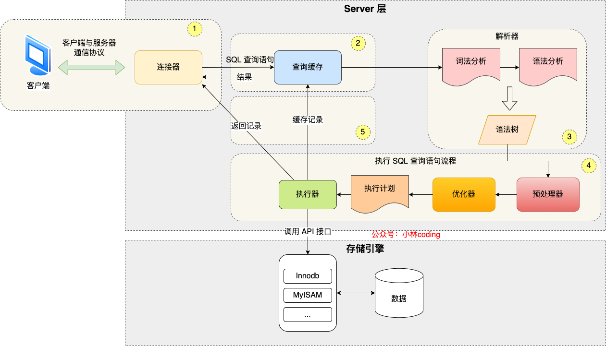

# 小林Coding

## 图解 MySQL


### 基础篇


#### 执行一条select语句，期间发生了什么？


**MySQL执行流程**：

MySQL 的架构共分为两层：**Server 层和存储引擎层**，

- **Server 层负责建立连接、分析和执行 SQL**。
- **存储引擎层负责数据的存储和提取**。索引默认是B+ 树索引




**第一步：连接器**

连接的过程需要先经过 TCP 三次握手.

MySQL 的连接也跟 HTTP 一样，有短连接和长连接的概念，它们的区别如下：

``` java
// 短连接
连接 mysql 服务（TCP 三次握手）
执行sql
断开 mysql 服务（TCP 四次挥手）

// 长连接(推荐使用，减少频繁建立断开连接过程，但是可能占用内存较多)
连接 mysql 服务（TCP 三次握手）
执行sql
执行sql
执行sql
....
断开 mysql 服务（TCP 四次挥手）
```


解决长连接占用内存的问题？

1. 定期断开长连接
2. 客户端主动重置连接（代码里调用 mysql_reset_connection 函数）


至此，连接器的工作做完了，简单总结一下：

- 与客户端进行 TCP 三次握手建立连接；
- 校验客户端的用户名和密码，如果用户名或密码不对，则会报错；
- 如果用户名和密码都对了，会读取该用户的权限，然后后面的权限逻辑判断都基于此时读取到的权限；


**第二步：查询缓存**


MySQL 8.0之前会查询缓存。

但是对于更新比较频繁的表，查询缓存的命中率很低的，因为只要一个表有更新操作，那么这个表的查询缓存就会被清空。

MySQL 8.0之后取消此功能。

这里说的查询缓存是 server 层的，即移除的是 server 层的查询缓存，并不是 Innodb 存储引擎中的 buffer pool。


**第三步：解析SQL**


解析SQL由解析器完成，解析器会做如下两件事情：

1. 词法分析：识别关键字
2. 语法分析：构建SQL语法树

**解析器只负责检查语法和构建语法树，但是不会去查表或者字段存不存在（第四步就做了 ，prepare）。**


**第四步：执行SQL**


每条`SELECT` 查询语句流程主要可以分为下面这三个阶段：

- prepare 阶段，也就是预处理阶段；
- optimize 阶段，也就是优化阶段；
- execute 阶段，也就是执行阶段；


1. **预处理器**：检查 SQL 查询语句中的表或者字段是否存在；将 `select *` 中的 `*` 符号，扩展为表上的所有列；
2. **优化器**：将 SQL 查询语句的执行方案确定下来（存在覆盖索引就用覆盖索引）
   1. **覆盖索引**是指一个索引包含了查询语句所需的所有数据，不仅能够提供索引的搜索能力，还可以完全覆盖查询需求，避免了**回表操作**（即根据索引查找到主键，再根据主键获取数据的额外操作），从而提高查询性能和效率。
3. **执行器**：三种方式执行过程；
   1. 主键索引查询：访问类型为 const
   2. 全表扫描：访问类型为 ALL，每次查询到记录都会返回给客户端，客户端遍历完才显示。
   3. 索引下推：（联合索引，两个二级索引一起构成）
      1. 没有索引下推的时候，每查询到一条二级索引记录，都要进行回表操作，然后将记录返回给客户端判断
      2. 二级索引2交给存储引擎层。查询二级索引1，不回表，先判断，二级索引2成立才回表。


**总结**

执行一条 SQL 查询语句，期间发生了什么？

- 连接器：建立连接，管理连接、校验用户身份；
- 查询缓存：查询语句如果命中查询缓存则直接返回，否则继续往下执行。MySQL 8.0 已删除该模块；
- 解析 SQL，通过解析器对 SQL 查询语句进行词法分析、语法分析，然后构建语法树，方便后续模块读取表名、字段、语句类型；
- 执行 SQL：执行 SQL 共有三个阶段：
  - 预处理阶段：检查表或字段是否存在；将 `select *` 中的 `*` 符号扩展为表上的所有列。
  - 优化阶段：基于查询成本的考虑， 选择查询成本最小的执行计划；
  - 执行阶段：根据执行计划执行 SQL 查询语句，从存储引擎读取记录，返回给客户端；


#### MySQL 一行记录是怎么存储的？


- MySQL 的 NULL 值会占用空间吗？
- MySQL 怎么知道 varchar(n) 实际占用数据的大小？
- varchar(n) 中 n 最大取值为多少？
- 行溢出后，MySQL 是怎么处理的？

**其实都是围绕着 MySQL 一行记录的存储结构**


InnoDB 是我们常用的存储引擎，也是 MySQL 默认的存储引擎。

一张数据库表的数据是保存在「 表名字.ibd 」的文件里的。

**表空间由段（segment）、区（extent）、页（page）、行（row）组成**。

1. **行**：数据库表中的记录都是按行（row）进行存放的，每行记录根据不同的行格式，有不同的存储结构。
2. **页：InnoDB 的数据是按「页」为单位来读写的**
3. **区**：InnoDB 存储引擎是用 B+ 树来组织数据的。如果是以页为单位来分配存储空间，那么链表中相邻的两个页之间的物理位置并不是连续的，可能离得非常远，那么磁盘查询时就会有大量的随机I/O，随机 I/O 是非常慢的。**在表中数据量大的时候，为某个索引分配空间的时候就不再按照页为单位分配了，而是按照区（extent）为单位分配。每个区的大小为 1MB，对于 16KB 的页来说，连续的 64 个页会被划为一个区，这样就使得链表中相邻的页的物理位置也相邻，就能使用顺序 I/O 了**。
4. **段**：表空间是由各个段（segment）组成的，段是由多个区（extent）组成的。段一般分为数据段、索引段和回滚段等。
   - 索引段：存放 B + 树的非叶子节点的区的集合；
   - 数据段：存放 B + 树的叶子节点的区的集合；
   - 回滚段：存放的是回滚数据的区的集合，之前讲事务隔离的时候就介绍到了 MVCC 利用了回滚段实现了多版本查询数据。


InnoDB 提供了 4 种行格式，分别是 Redundant、Compact、Dynamic和 Compressed 行格式。

Compact 行格式：一条完整的记录分为「**记录的额外信息**」和「**记录的真实数据**」两个部分。

- **记录的额外信息**：
  - 变长字段长度列表：变长字段的真实数据占用的字节数会按照列的顺序**逆序存放** 在「变长字段长度列表」里。
    - **NULL 是不会存放在行格式中记录的真实数据部分里的**
    - 之所以要逆序存放，是因为这样可以**使得位置靠前的记录的真实数据和数据对应的字段长度信息可以同时在一个 CPU Cache Line 中，这样就可以提高 CPU Cache 的命中率**。（向左读就是记录头信息，向右读就是真实数据）
    - 如果变长字段允许存储的最大字节数小于等于 255 字节，就会用 1 字节表示「变长字段长度」；
    - 如果变长字段允许存储的最大字节数大于 255 字节，就会用 2 字节表示「变长字段长度」；
    - 「变长字段长度列表」只出现在数据表有变长字段的时候
  - NULL值列表：值为 NULL 的列 **逆序存放** 在 NULL值列表中。
    - **NULL 值列表必须用整数个字节的位表示（1字节8位）**，如果使用的二进制位个数不足整数个字节，则在字节的高位补 `0`。
    - {name: ccc, phone: null, age: null}  = 0000 0110，对应十六进制表示即为 0x06
    - **当数据表的字段都定义成 NOT NULL 的时候，这时候表里的行格式就不会有 NULL 值列表了**。
  - 记录头信息：
    - delete_mask ：标识此条数据是否被删除。（说明 detele 删除数据时并不是真正删除）
    - next_record：下一条记录的位置。从这里可以知道，记录与记录之间是通过链表组织的。**在前面也提到了，指向的是下一条记录的「记录头信息」和「真实数据」之间的位置，这样的好处是向左读就是记录头信息，向右读就是真实数据，比较方便**。
    - record_type：表示当前记录的类型，0表示普通记录，1表示B+树非叶子节点记录，2表示最小记录，3表示最大记录
- **记录的真实数据**：
  - 自定义的字段
  - 三个隐藏字段
    - row_id：如果指定了主键或者唯一约束列，那么就没有 row_id 隐藏字段了。
    - trx_id：事务id，表示这个数据是由哪个事务生成的。 trx_id是必需的，占用 6 个字节。
    - roll_pointer：这条记录上一个版本的指针。roll_pointer 是必需的，占用 7 个字节。

​	

**varchar(n)中n最大取值为多少？**

**MySQL 规定除了 TEXT、BLOBs 这种大对象类型之外，其他所有的列（不包括隐藏列和记录头信息）占用的字节长度加起来不能超过 65535 个字节**。

单字段情况下：65535 - 2（变长字段长度列表） - 1（NULL值列表） = 65532

多字段情况下：得考虑其他字段的变长字段列表大小（1或2 * 字段数）和 NULL值列表（可以为空字段数 / 8+ 1）


行溢出时：InnoDB 的数据都是存放在 「数据页」中。但是当发生行溢出时，溢出的数据会存放到「溢出页」中。


### 索引篇


#### 索引常见面试题


**索引是数据的目录**。

所谓的存储引擎，说白了就是如何存储数据、如何为存储的数据建立索引和如何更新、查询数据等技术的实现方法。


**按照四个角度来分类索引**：

- 按「数据结构」分类：**B+tree索引、Hash索引、Full-text索引**。
- 按「物理存储」分类：**聚簇索引（主键索引）、二级索引（辅助索引）**。
- 按「字段特性」分类：**主键索引、唯一索引、普通索引、前缀索引**。
- 按「字段个数」分类：**单列索引、联合索引**。


**按数据结构分类**


在创建表时，InnoDB 存储引擎会根据不同的场景选择不同的列作为索引：

- 如果有主键，默认会使用主键作为聚簇索引的索引键（key）；
- 如果没有主键，就选择**第一个不包含 NULL 值的唯一列**作为聚簇索引的索引键（key）；
- 在上面两个都没有的情况下，InnoDB 将自动生成一个隐式自增 id 列作为聚簇索引的索引键（key）；

其它索引都属于辅助索引（Secondary Index），也被称为二级索引或非聚簇索引。**创建的主键索引和二级索引默认使用的是 B+Tree 索引**。

**B+Tree 是一种多叉树，叶子节点才存放数据，非叶子节点只存放索引，而且每个节点里的数据是按主键顺序存放的**。每一层父节点的索引值都会出现在下层子节点的索引值中，因此在叶子节点中，包括了所有的索引值信息，并且每一个叶子节点都有两个指针，分别指向下一个叶子节点和上一个叶子节点，形成一个双向链表。

**B+Tree 相比于 B 树和二叉树来说，最大的优势在于查询效率很高，因为即使在数据量很大的情况，查询一个数据的磁盘 I/O 依然维持在 3-4次**。


**通过二级索引查询**：

主键索引的 B+Tree 和二级索引的 B+Tree 区别如下：

- 主键索引的 B+Tree 的**叶子节点存放的是实际数据**，所有完整的用户记录都存放在主键索引的 B+Tree 的叶子节点里；
- 二级索引的 B+Tree 的**叶子节点存放的是主键值，而不是实际数据**。


使用二级索引查询：会先检二级索引中的 B+Tree 的索引值（商品编码，product_no），找到对应的叶子节点，然后获取主键值，然后再通过主键索引中的 B+Tree 树查询到对应的叶子节点，然后获取整行数据。**这个过程叫「回表」，也就是说要查两个 B+Tree 才能查到数据**。

如何使用二级索引查询的是主键，就只需要一次查询。**这种在二级索引的 B+Tree 就能查询到结果的过程就叫作「覆盖索引」，也就是只需要查一个 B+Tree 就能找到数据**。


**为什么 MySQL InnoDB 选择 B+ tree 作为索引的数据结构？**

***1、B+Tree vs B Tree***

B+Tree 只在叶子节点存储数据，而 B 树 的非叶子节点也要存储数据，所以 B+Tree 的单个节点的数据量更小，在相同的磁盘 I/O 次数下，就能查询更多的节点。

另外，B+Tree 叶子节点采用的是**双链表连接**，适合 MySQL 中常见的基于范围的顺序查找，而 B 树无法做到这一点。

***2、B+Tree vs 二叉树***

对于有 N 个叶子节点的 B+Tree，其搜索复杂度为`O(logdN)`，其中 d 表示节点允许的最大子节点个数为 d 个。

在实际的应用当中， d 值是大于100的，这样就保证了，即使数据达到千万级别时，B+Tree 的高度依然维持在 3~4 层左右，也就是说一次数据查询操作只需要做 3~4 次的磁盘 I/O 操作就能查询到目标数据。

而二叉树的每个父节点的儿子节点个数只能是 2 个，意味着其搜索复杂度为 `O(logN)`，这已经比 B+Tree 高出不少，因此二叉树检索到目标数据所经历的磁盘 I/O 次数要更多。

***3、B+Tree vs Hash***

Hash 在做等值查询的时候效率贼快，搜索复杂度为 O(1)。

但是 Hash 表不适合做范围查询，它更适合做等值的查询，这也是 B+Tree 索引要比 Hash 表索引有着更广泛的适用场景的原因。


**什么时候使用索引？**

- 字段有唯一性限制的，比如商品编码；
- 经常用于 WHERE 查询条件的字段；
- 经常用于 GROUP BY 和 ORDER BY 的字段。


**什么时候不需要创建索引？**

- WHERE 条件, GROUP BY, ORDER BY 里用不到的字段；
- 字段中存在大量重复数据，不需要创建索引。
- 表数据太少的时候，不需要创建索引。
- 经常更新的字段不用创建索引。


**按物理存储分类**

从物理存储的角度来看，索引分为聚簇索引（主键索引）、二级索引（辅助索引）。

这两个区别在前面也提到了：

- 主键索引的 B+Tree 的叶子节点存放的是实际数据，所有完整的用户记录都存放在主键索引的 B+Tree 的叶子节点里；
- 二级索引的 B+Tree 的叶子节点存放的是主键值，而不是实际数据。


**按字段特性分类**

- 主键索引：建立在主键字段上的索引，通常在创建表的时候一起创建，一张表最多只有一个主键索引，索引列的值不允许有空值。
- 唯一索引：建立在 UNIQUE 字段上的索引，一张表可以有多个唯一索引，索引列的值必须唯一，但是允许有空值。
- 普通索引：建立在普通字段上的索引，既不要求字段为主键，也不要求字段为 UNIQUE。
- 前缀索引：对字符类型字段的前几个字符建立的索引，而不是在整个字段上建立的索引，前缀索引可以建立在字段类型为 char、 varchar、binary、varbinary 的列上。使用前缀索引的目的是为了减少索引占用的存储空间，提升查询效率。


**按字段个数分类**

- 建立在单列上的索引称为单列索引，比如主键索引；
- 建立在多列上的索引称为联合索引。

使用联合索引时，存在**最左匹配原则**。

创建了一个 `(a, b, c)` 联合索引，前面三个可行，后面三个不可行。**b 和 c 是全局无序，局部相对有序的**

- where a=1；
- where a=1 and b=2 and c=3；
- where a=1 and b=2；

- where b=2；
- where c=3；
- where b=2 and c=3；


这里说一下几种**常见优化索引的方法**：

- 前缀索引优化：使用前缀索引是为了减小索引字段大小，可以增加一个索引页中存储的索引值，有效提高索引的查询速度。
- 覆盖索引优化：SQL 中 query 的所有字段，在索引 B+Tree 的叶子节点上都能找得到的那些索引，从二级索引中查询得到记录，而不需要通过聚簇索引查询获得，可以避免回表的操作。
- 主键索引最好是自增的：每次**插入一条新记录，都是追加操作，不需要重新移动数据**（和UUID对比）
- 索引最好设置为 NOT NULL：占用物理空间，优化器难以优化。
- 防止索引失效：

**发生索引失效的情况**：

- 当我们使用左或者左右模糊匹配的时候，也就是 `like %xx` 或者 `like %xx%`这两种方式都会造成索引失效；
- 当我们在查询条件中对索引列做了计算、函数、类型转换操作，这些情况下都会造成索引失效；
- 联合索引要能正确使用需要遵循最左匹配原则，也就是按照最左优先的方式进行索引的匹配，否则就会导致索引失效。
- 在 WHERE 子句中，如果在 OR 前的条件列是索引列，而在 OR 后的条件列不是索引列，那么索引会失效。


查询语句之前加上 `explain` 并通过查看 `type` 判断扫描方式，`all` 为全表扫描。**执行效率从低到高的顺序为**：

- All（全表扫描）；
- index（全索引扫描）：遍历整颗索引树
- range（索引范围扫描）；
- ref（非唯一索引扫描）；
- eq_ref（唯一索引扫描）；
- const（结果只有一条的主键或唯一索引扫描）。


#### 从数据页的角度看 B+ 树


**InnoDB 的数据是按「数据页」为单位来读写的**

数据库的 I/O 操作的最小单位是页，**InnoDB 数据页的默认大小是 16KB**。

**数据页包括七个部分：文件头，页头，最小和最大记录，用户记录，空闲空间，页目录，文件尾。**

文件头有两个指针，分别指向上一个数据页和下一个数据页，相当于一个双向链表。这样可以让数据页之间逻辑上连续。

**数据页中的记录按照「主键」顺序组成单向链表**

页目录起到索引作用。**页目录就是由多个槽组成的，槽相当于分组记录的索引**。然后，因为记录是按照「主键值」从小到大排序的，所以**我们通过槽查找记录时，可以使用二分法快速定位要查询的记录在哪个槽（哪个记录分组），定位到槽后，再遍历槽内的所有记录，找到对应的记录**，无需从最小记录开始遍历整个页中的记录链表。

**每个槽相当于指针指向了不同组的最后一个记录**。**槽对应的值都是这个组的主键最大的记录。**

InnoDB 对每个分组中的记录条数都是有规定的，槽内的记录就只有几条：（避免槽内记录多，时间复杂度到O(n)）

- 第一个分组中的记录只能有 1 条记录；
- 最后一个分组中的记录条数范围只能在 1-8 条之间；
- 剩下的分组中记录条数范围只能在 4-8 条之间。


**InnoDB 采用了 B+ 树作为索引**。InnoDB 里的 B+ 树中的**每个节点都是一个数据页**

**B+ 树的特点**：

- 只有叶子节点（最底层的节点）才存放了数据，非叶子节点（其他上层节）仅用来存放目录项作为索引。
- 非叶子节点分为不同层次，通过分层来降低每一层的搜索量；
- 所有节点按照索引键大小排序，构成一个双向链表，便于范围查询；


我们再看看 B+ 树如何实现快速查找主键为 6 的记录，以上图为例子：

- 从根节点开始，通过二分法快速定位到符合页内范围包含查询值的页，因为查询的主键值为 6，在[1, 7)范围之间，所以到页 30 中查找更详细的目录项；
- 在非叶子节点（页30）中，继续通过二分法快速定位到符合页内范围包含查询值的页，主键值大于 5，所以就到叶子节点（页16）查找记录；
- 接着，在叶子节点（页16）中，通过槽查找记录时，使用二分法快速定位要查询的记录在哪个槽（哪个记录分组），定位到槽后，再遍历槽内的所有记录，找到主键为 6 的记录。

可以看到，**在定位记录所在哪一个页时，也是通过二分法快速定位到包含该记录的页。定位到该页后，又会在该页内进行二分法快速定位记录所在的分组（槽号），最后在分组内进行遍历查找。**


索引又可以分成**聚簇索引和非聚簇索引（二级索引）**，它们区别就在于叶子节点存放的是什么数据：

- 聚簇索引的叶子节点存放的是实际数据，所有完整的用户记录都存放在聚簇索引的叶子节点；
- 二级索引的叶子节点存放的是主键值，而不是实际数据。


InnoDB 在创建聚簇索引时，会根据不同的场景选择不同的列作为索引：

- 如果有主键，默认会使用主键作为聚簇索引的索引键；
- 如果没有主键，就选择第一个不包含 NULL 值的唯一列作为聚簇索引的索引键；
- 在上面两个都没有的情况下，InnoDB 将自动生成一个隐式自增 id 列作为聚簇索引的索引键；


为了实现非主键字段的快速搜索，就引出了二级索引（非聚簇索引/辅助索引），它也是利用了 B+ 树的数据结构，但是二级索引的叶子节点存放的是主键值，不是实际数据。

**如果某个查询语句使用了二级索引，但是查询的数据不是主键值，这时在二级索引找到主键值后，需要去聚簇索引中获得数据行，这个过程就叫作「回表」，也就是说要查两个 B+ 树才能查到数据。不过，当查询的数据是主键值时，因为只在二级索引就能查询到，不用再去聚簇索引查，这个过程就叫作「索引覆盖」，也就是只需要查一个 B+ 树就能找到数据。**


#### 为什么 MySQL 采用 B+ 树来作为索引？


MySQL 的数据是持久化的，意味着数据（索引+记录）是保存到磁盘上的，磁盘速度比内存速度慢很多。

磁盘读写的最小单位是**扇区**，扇区的大小只有 `512B` 大小，操作系统一次会读写多个扇区，所以**操作系统的最小读写单位是块（Block）。**

要设计一个适合 MySQL 索引的数据结构，至少满足以下要求：

- **能在尽可能少的磁盘的 I/O 操作中完成查询工作；**
- **要能高效地查询某一个记录，也要能高效地执行范围查找；**


二分查找 - 二分查找树（**左子树小于根节点，右子树大于根节点**） - 自平衡二叉树（**每个节点的左子树和右子树的高度差不能超过 1**） 


**当树的节点越多的时候，并且树的分叉数 M 越大的时候，M 叉树的高度会远小于二叉树的高度**。

B 树在数据查询中比平衡二叉树效率要高。但是 B 树的每个节点都包含数据（索引+记录），而**用户的记录数据的大小很有可能远远超过了索引数据**，这就需要花费更多的磁盘 I/O 操作次数来读到「有用的索引数据」。


**B+ 树与 B 树差异的点，主要是以下这几点**：

- 叶子节点（最底部的节点）才会存放实际数据（索引+记录），非叶子节点只会存放索引；
- 所有索引都会在叶子节点出现，叶子节点之间构成一个有序链表；
- 非叶子节点的索引也会同时存在在子节点中，并且是在子节点中所有索引的最大（或最小）。
- 非叶子节点中有多少个子节点，就有多少个索引；


**性能区别**：

- **单点查询：B+ 树的非叶子节点不存放实际的记录数据，仅存放索引，因此数据量相同的情况下，相比存储即存索引又存记录的 B 树，B+树的非叶子节点可以存放更多的索引，因此 B+ 树可以比 B 树更「矮胖」，查询底层节点的磁盘 I/O次数会更少**。
- **插入和删除效率：B+ 树的插入和删除效率更高**。
- **范围查询：B+ 树所有叶子节点间还有一个链表进行连接，这种设计对范围查找非常有帮助**


**B 树**


**B+ 树**


**Innodb 里的 B+ 树**：


但是 Innodb 使用的 B+ 树有一些特别的点，比如：

- B+ 树的叶子节点之间是用「双向链表」进行连接，这样的好处是既能向右遍历，也能向左遍历。
- B+ 树的节点内容是数据页，数据页里存放了用户的记录以及各种信息，每个数据页默认大小是 16 KB。


**MySQL 默认的存储引擎 InnoDB 采用的是 B+ 作为索引的数据结构，原因有**：

- B+ 树的非叶子节点不存放实际的记录数据，仅存放索引，因此数据量相同的情况下，相比存储即存索引又存记录的 B 树，B+树的非叶子节点可以存放更多的索引，因此 B+ 树可以比 B 树更「矮胖」，查询底层节点的磁盘 I/O次数会更少。
- B+ 树有大量的冗余节点（所有非叶子节点都是冗余索引），这些冗余索引让 B+ 树在插入、删除的效率都更高，比如删除根节点的时候，不会像 B 树那样会发生复杂的树的变化；
- B+ 树叶子节点之间用链表连接了起来，有利于范围查询，而 B 树要实现范围查询，因此只能通过树的遍历来完成范围查询，这会涉及多个节点的磁盘 I/O 操作，范围查询效率不如 B+ 树。


#### MySQL 单表不要超过 2000W 行，靠谱吗？


**表空间**：表数据实际上放在一个叫 表名.ibd 的文件中。数据表中，看起来是一条连着一条的，实际上在文件中被分为很多小份的数据页，每份都是16K。

**页的数据结构**：一开始只有六个部分，插入数据时，`Free Space` 空间给 `User Records`，`Free Space` 空间**用完则申请新的页**。每页16K。


**索引的数据结构**：

索引的数据结构和刚刚描述的页几乎是一模一样的，而且大小也是 16K。索引页中记录的是页 (数据页，索引页) 的最小主键 id 和页号，以及在索引页中增加了层级的信息，从 0 开始往上算，所以页与页之间就有了上下层级的概念。

**非叶子节点（索引页）**，在它的内容区中有 id 和 页号地址两部分：

- id ：对应页中记录的最小记录 id 值；
- 页号：地址是指向对应页的指针；

而数据页与此几乎大同小异，区别在于数据页记录的是真实的行数据而不是页地址，而且 id 的也是顺序的。

同样一个 16K 的页，非叶子节点里的每条数据都指向新的页，而新的页有两种可能

- 如果是叶子节点，那么里面就是一行行的数据
- 如果是非叶子节点的话，那么就会继续指向新的页


**总结**：

- MySQL 的表数据是以页的形式存放的，页在磁盘中不一定是连续的。
- 页的空间是 16K, 并不是所有的空间都是用来存放数据的，会有一些固定的信息，如，页头，页尾，页码，校验码等等。
- 在 B+ 树中，叶子节点和非叶子节点的数据结构是一样的，区别在于，叶子节点存放的是实际的行数据，而非叶子节点存放的是主键和页号。
- 索引结构不会影响单表最大行数，2000W 也只是推荐值，超过了这个值可能会导致 B + 树层级更高，影响查询性能。


#### 索引失效有哪些？


MySQL 默认的存储引擎是 InnoDB，它采用 B+Tree 作为索引的数据结构。

MySQL 的 MyISAM 存储引擎支持多种索引数据结构，比如 B+ 树索引、R 树索引、Full-Text 索引。MyISAM 存储引擎在创建表时，创建的主键索引默认使用的是 B+ 树索引。

InnoDB 和 MyISAM 都支持 B+ 树索引，但是它们数据的存储结构实现方式不同。不同之处在于：

- InnoDB 存储引擎：B+ 树索引的叶子节点**保存数据本身；**
- MyISAM 存储引擎：B+ 树索引的叶子节点**保存数据的物理地址；**


**查询条件用上了索引列，并不意味着查询过程就一定都用上索引。以下是一些索引失效的例子**：

1. **对索引使用左或者左右模糊匹配**：`where name like "%xxx"` 和 `where name like "%xxx%"`索引失效，右模糊匹配 `xxx%` 索引是不会失效的。
2. **对索引使用函数**：索引保存的是索引字段的原始值，而不是经过函数计算后的值，自然就没办法走索引了。（但先添加函数索引，走会走索引查了）`where length(name) = 6`
3. **对索引进行表达式计算**：`where id + 1 = 10 ` 不走索引，但是写成 `where id = 10 - 1` 就是走索引的。
4. **对索引隐式类型转换**：`where phone = 15757110192` 不走索引，因为 `phone` 是 `varchar` ，会先转换成数字（使用函数转换）再进行比较。`where id = "1"`就还是会走索引，因为函数转换的是 `"1"`，没有对索引使用函数（或者说对索引隐式类型转换）。
   1. **MySQL 在遇到字符串和数字比较的时候，会自动把字符串转为数字，然后再进行比较**。
5. **联合索引非最左匹配**：多个普通字段组合在一起创建的索引就叫做联合索引，联合索引 (a, b, c) 和 (c, b, a) 在使用的时候会存在差别。
6. **WHERE 子句中的 OR**：条件中只要有一个不是索引列，就会索引失效。


#### MySQL 使用 like “%x” ，索引一定会失效吗？


**使用左模糊匹配（like "%xx"）并不一定会走全表扫描，关键还是看数据表中的字段。**

如果数据库表中的字段只有主键+二级索引，那么即使使用了左模糊匹配，也不会走全表扫描（type=all），而是走全扫描二级索引树(type=index)。

再说一个相似，我们都知道联合索引要遵循最左匹配才能走索引，但是如果数据库表中的字段都是索引的话，即使查询过程中，没有遵循最左匹配原则，也是走全扫描二级索引树(type=index)。


**为什么选择全扫描二级索引树，而不扫描聚簇索引树呢？**

二级索引树的记录东西很少，就只有「索引列+主键值」，而聚簇索引记录的东西会更多，比如聚簇索引中的叶子节点则记录了主键值、事务 id、用于事务和 MVCC 的回滚指针以及所有的剩余列。优化器选择它认为成本小的。


**为什么这个数据表加了非索引字段，执行同样的查询语句后，怎么变成走的是全表扫描呢？**

`select *` 的字段不能全部在二级索引树查询到，还需要回表。优化器认为这样成本太高，所以直接全表扫描。


#### count(*) 和 count(1) 有什么区别？哪个性能最好？


**结论：按照性能排序：count(*) = count(1) > count(主键字段) > count(字段)**

count() 是一个聚合函数，函数的参数不仅可以是字段名，也可以是其他任意表达式，该函数作用是**统计符合查询条件的记录中，函数指定的参数不为 NULL 的记录有多少个**。`select count(name) from t_order;`


**`count(*)` 其实等于 `count(0)`，所以和`count(1)`性能没什么差异。**

- 优化：如果有多个二级索引的时候，优化器会使用key_len 最小的二级索引进行扫描。
- 只有当没有二级索引的时候，才会采用主键索引来进行统计


**`count(1)` 1永远不为null，所以等同于表中的记录条数。**

- 如果表里只有主键索引，没有二级索引时。InnoDB 循环遍历聚簇索引（主键索引），将读取到的记录返回给 server 层，**但是不会读取记录中的任何字段的值**。相对于 `count(主键字段)` 无需读取记录，所以效率高一点。
- 如果表里有二级索引时，InnoDB 循环遍历的对象就二级索引了。


**`count(主键字段)`**

- 如果表里只有主键索引，没有二级索引时，那么，InnoDB 循环遍历聚簇索引，将读取到的记录返回给 server 层，然后**读取记录中的 id 值**，就会 id 值判断是否为 NULL，如果不为 NULL，就将 count 变量加 1。

- 如果表里有二级索引时，InnoDB 循环遍历的对象就不是聚簇索引，而是二级索引。

因为相同数量的二级索引记录可以比聚簇索引记录占用更少的存储空间，所以二级索引树比聚簇索引树小，这样遍历二级索引的 I/O 成本比遍历聚簇索引的 I/O 成本小，因此「优化器」优先选择的是二级索引。


**`count(字段)`采用全表扫描的方式来计数，所以它的执行效率是比较差的。**


**总结**：

1. count(1)、 count(*)、 count(主键字段)在执行的时候，如果表里存在二级索引，优化器就会选择二级索引进行扫描。

2. 如果要执行 count(1)、 count(*)、 count(主键字段) 时，尽量在数据表上建立二级索引，这样优化器会自动采用 key_len 最小的二级索引进行扫描，相比于扫描主键索引效率会高一些。

3. 不要使用 count(字段) 来统计记录个数，因为它的效率是最差的，会采用全表扫描的方式来统计。如果你非要统计表中该字段不为 NULL 的记录个数，**建议给这个字段建立一个二级索引。**


**为什么要通过遍历的方式来计数？**

**InnoDB 存储引擎是支持事务的**，同一个时刻的多个查询，由于多版本并发控制（MVCC）的原因，InnoDB 表“应该返回多少行”也是不确定的，所以无法像 MyISAM一样，只维护一个 row_count 变量。


**如何优化 count(*)?**

面对大表的记录统计，花费的时间比较久。

- **近似值**：可以使用 show table status 或者 explain 命令来表进行估算。
- **额外表保存计数值**


### 事务篇


#### 事务隔离级别是怎么实现的？


事务是由 MySQL 的引擎来实现的，我们常见的 InnoDB 引擎它是支持事务的。

事务看起来感觉简单，但是要实现**事务必须要遵守 4 个特性**：

- **原子性**：要么全部完成，要么全部不完成。undo log 回滚日志来保证的。
- **一致性**：操作前后，数据满足完整性约束。通过持久性+原子性+隔离性来保证；
- **隔离性**：每个事务都有一个完整的数据空间，对其他并发事务是隔离的。MVCC或锁机制来保证的。**（重点）**
- **持久性**：事务结束后，数据修改是永久的。 redo log 重做日志来保证的。


**并发事务会引发什么问题？**（引出隔离性）（三个现象的严重性排序从上到下）

- 脏读：**一个事务「读到」了另一个「未提交事务修改过的数据**」（回滚了）
- 不可重复读：在**一个事务内多次读取同一个数据，结果不一样**。
- 幻读：**在一个事务内多次查询某个符合查询条件的「记录数量」，数量不一样。**


SQL 标准提出了四种隔离级别来规避这些现象，隔离级别越高，性能效率就越低，这四个隔离级别如下：（隔离水平由低到高）

- **读未提交（read uncommitted）**，指一个事务还没提交时，它做的变更就能被其他事务看到；
- **读提交（read committed）**，指一个事务提交之后，它做的变更才能被其他事务看到；
- **可重复读（repeatable read）**，指一个事务执行过程中看到的数据，一直跟这个事务启动时看到的数据是一致的，**MySQL InnoDB 引擎的默认隔离级别**；
- **串行化（serializable ）**；会对记录加上**读写锁**，在多个事务对这条记录进行读写操作时，如果发生了读写冲突的时候，后访问的事务必须等前一个事务执行完成，才能继续执行；


- 在「读未提交」隔离级别下，可能发生脏读、不可重复读和幻读现象；
- 在「读提交」隔离级别下，可能发生不可重复读和幻读现象，但是不可能发生脏读现象；
- 在「可重复读」隔离级别下，可能发生幻读现象，但是不可能脏读和不可重复读现象；
- 在「串行化」隔离级别下，脏读、不可重复读和幻读现象都不可能会发生。


**MySQL InnoDB 引擎的默认隔离级别虽然是「可重复读**」，但是它很大程度上避免幻读现象，解决的方案有两种：

- 针对**快照读**（普通 select 语句），是**通过 MVCC 方式解决了幻读**。
- 针对**当前读**（select ... for update 等语句），是**通过 next-key lock（记录锁+间隙锁）方式解决了幻读**。

在可重复读隔离级别中，普通的 select 语句就是基于 MVCC 实现的快照读，也就是不会加锁的。而 select .. for update 语句就不是快照读了，而是当前读了，也就是每次读都是拿到最新版本的数据，但是它会对读到的记录加上 next-key lock 锁。


**四种隔离级别具体是如何实现的呢？**

- 对于「读未提交」隔离级别的事务来说，因为可以读到未提交事务修改的数据，所以直接读取最新的数据就好了；
- 对于「串行化」隔离级别的事务来说，通过加读写锁的方式来避免并行访问；
- 对于「读提交」和「可重复读」隔离级别的事务来说，它们是通过 **Read View 来实现的，它们的区别在于创建 Read View 的时机不同，大家可以把 Read View 理解成一个数据快照，就像相机拍照那样，定格某一时刻的风景。「读提交」隔离级别是在「每个语句执行前」都会重新生成一个 Read View，而「可重复读」隔离级别是「启动事务时」生成一个 Read View，然后整个事务期间都在用这个 Read View**。这两个隔离级别实现是通过「事务的 Read View 里的字段」和「记录中的两个隐藏列」的比对，来控制并发事务访问同一个记录时的行为，这就叫 MVCC（多版本并发控制）。


**执行「开始事务」命令，并不意味着启动了事务**。在 MySQL 有两种开启事务的命令，分别是：

- 第一种：begin/start transaction 命令。只有在执行这个命令后，执行了第一条 select 语句，才是事务真正启动的时机；
- 第二种：start transaction with consistent snapshot 命令。马上启动事务。


**MVCC (Multiversion Concurrency Control) 中文全程叫多版本并发控制**，是现代数据库（包括 MySQL、Oracle、PostgreSQL 等）引擎实现中常用的处理读写冲突的手段，目的在于提高数据库高并发场景下的吞吐性能。


**Read View 有四个重要的字段：(理解为数据快照)**

- creator_trx_id ：指的是**创建该 Read View 的事务的事务 id**。
- m_ids ：指的是在创建 Read View 时，当前数据库中「活跃事务」的**事务 id 列表**，注意是一个列表，**“活跃事务”指的就是，启动了但还没提交的事务**。
- min_trx_id ：指的是在创建 Read View 时，当前数据库中「活跃事务」中事务 **id 最小的事务**，也就是 m_ids 的最小值。
- max_trx_id ：这个并不是 m_ids 的最大值，而是**创建 Read View 时当前数据库中应该给下一个事务的 id 值**，也就是全局事务中最大的事务 id 值 + 1；


对于使用 InnoDB 存储引擎的数据库表，它的**聚簇索引记录中都包含下面两个隐藏列**：

- **trx_id**，当一个事务对某条聚簇索引记录进行改动时，就会**把该事务的事务 id 记录在 trx_id 隐藏列里**；
- **roll_pointer**，每次对某条聚簇索引记录进行改动时，都会把旧版本的记录写入到 undo 日志中，然后**这个隐藏列是个指针，指向每一个旧版本记录**，于是就可以通过它找到修改前的记录。


在创建 Read View 后，我们可以将记录中的 trx_id 划分这三种情况：


一个事务去访问记录的时候，除了自己的更新记录总是可见之外，还有这几种情况：

- 如果记录的 trx_id 值小于 Read View 中的 `min_trx_id` 值，表示这个版本的记录是在创建 Read View **前**已经提交的事务生成的，所以该版本的记录对当前事务**可见**。

- 如果记录的 trx_id 值大于等于 Read View 中的 `max_trx_id` 值，表示这个版本的记录是在创建 Read View **后**才启动的事务生成的，所以该版本的记录对当前事务**不可见**。

- 如果记录的 trx_id 值在 Read View 的`min_trx_id`和 `max_trx_id`之间，需要判断 trx_id 是否在 m_ids 列表中：

  - 如果记录的 trx_id **在** `m_ids` 列表中，表示生成该版本记录的活跃事务依然活跃着（还没提交事务），所以该版本的记录对当前事务**不可见**。
- 如果记录的 trx_id **不在** `m_ids`列表中，表示生成该版本记录的活跃事务已经被提交，所以该版本的记录对当前事务**可见**。

**这种通过「版本链」来控制并发事务访问同一个记录时的行为就叫 MVCC（多版本并发控制）。**


**可重复读隔离级别是启动事务时生成一个 Read View，然后整个事务期间都在用这个 Read View**。

**读提交隔离级别是在每次读取数据时，都会生成一个新的 Read View**。


#### MySQL 可重复读隔离级别，完全解决幻读了吗？


**幻读的定义**：当同一个查询在不同的时间产生不同的结果集时，事务中就会出现所谓的幻象问题。例如，如果 SELECT 执行了两次，但第二次返回了第一次没有返回的行，则该行是“幻像”行。


可重复读隔离级是由 MVCC（多版本并发控制）实现的，实现的方式是开始事务后（执行 begin 语句后），在执行第一个查询语句后，会创建一个 Read View，**后续的查询语句利用这个 Read View，通过这个 Read View 就可以在 undo log 版本链找到事务开始时的数据，所以事务过程中每次查询的数据都是一样的**，即使中途有其他事务插入了新纪录，是查询不出来这条数据的，所以就很好了避免幻读问题。


MySQL 里除了**普通查询是快照读，其他都是当前读**，比如 update、insert、delete，这些语句执行前都会查询最新版本的数据，然后再做进一步的操作。

**Innodb 引擎为了解决「可重复读」隔离级别使用「当前读」而造成的幻读问题，就引出了间隙锁**。

1. 事务A：`select name for t_stu where id > 2 for update` 执行了这条锁定读语句后，就在对表中的记录加上 id 范围为 (2, +∞] 的 next-key lock（next-key lock 临键锁，是间隙锁+记录锁的组合）。
2. 事务B：`insert into t_stu values(5, "小飞", 100);` 由于5>2，被锁住了，所以会插入一个意向锁，进入等待状态，事知道务A提交。


**可重复读隔离级别下虽然很大程度上避免了幻读，但是还是没有能完全解决幻读**。

**场景1**：在可重复读隔离级别下，事务 A 第一次执行普通的 select 语句时生成了一个 ReadView，之后事务 B 向表中新插入了一条 id = 5 的记录并提交。接着，事务 A 对 id = 5 这条记录进行了更新操作，在这个时刻，这条新记录的 trx_id 隐藏列的值就变成了事务 A 的事务 id，之后事务 A 再使用普通 select 语句去查询这条记录时就可以看到这条记录了，于是就发生了幻读。

因为这种特殊现象的存在，所以我们认为 **MySQL Innodb 中的 MVCC 并不能完全避免幻读现象**。


场景2：

- T1 时刻：事务 A 先执行「快照读语句」：select * from t_test where id > 100 得到了 3 条记录。
- T2 时刻：事务 B 往插入一个 id= 200 的记录并提交；
- T3 时刻：事务 A 再执行「当前读语句」 select * from t_test where id > 100 for update 就会得到 4 条记录，此时也发生了幻读现象。

**要避免这类特殊场景下发生幻读的现象的话，就是尽量在开启事务之后，马上执行 select ... for update 这类当前读的语句**，因为它会对记录加 next-key lock，从而避免其他事务插入一条新记录。


**总结**：

MySQL InnoDB 引擎的可重复读隔离级别（默认隔离级），根据不同的查询方式，分别提出了避免幻读的方案：

- 针对**快照读**（普通 select 语句），是通过 MVCC 方式解决了幻读。
- 针对**当前读**（select ... for update 等语句），是通过 next-key lock（记录锁+间隙锁）方式解决了幻读。

我举例了两个发生幻读场景的例子。

第一个例子：对于快照读， MVCC 并不能完全避免幻读现象。因为当事务 A 更新了一条事务 B 插入的记录，那么事务 A 前后两次查询的记录条目就不一样了，所以就发生幻读。

第二个例子：对于当前读，如果事务开启后，并没有执行当前读，而是先快照读，然后这期间如果其他事务插入了一条记录，那么事务后续使用当前读进行查询的时候，就会发现两次查询的记录条目就不一样了，所以就发生幻读。

所以，**MySQL 可重复读隔离级别并没有彻底解决幻读，只是很大程度上避免了幻读现象的发生。**

要避免这类特殊场景下发生幻读的现象的话，就是尽量在开启事务之后，马上执行 select ... for update 这类当前读的语句，因为它会对记录加 next-key lock，从而避免其他事务插入一条新记录。


### 锁篇


（笔记写在科研记录本2.5）

#### MySQL有哪些锁？


在 MySQL 里，根据加锁的范围，可以分为**全局锁、表级锁和行锁**三类。


**全局锁**：

**全局锁是怎么用的？**

``` sql
flush tables with read lock
```

执行后数据库就处于**只读状态**了，这时其他线程执行以下操作，都会被阻塞：

- 对数据的增删改操作，比如 insert、delete、update等语句；
- 对表结构的更改操作，比如 alter table、drop table 等语句。

``` sql
unlock table
```

**全局锁应用场景是什么？**

全局锁主要应用于做**全库逻辑备份**，这样在备份数据库期间，不会因为数据或表结构的更新，而出现备份文件的数据与预期的不一样。

**加全局锁又会带来什么缺点呢？**

备份期间，数据库只读，会造成业务停滞。

**既然备份数据库数据的时候，使用全局锁会影响业务，那有什么其他方式可以避免？**

如果数据库的引擎支持的事务支持**可重复读的隔离级别**，那么在备份数据库之前先开启事务，会先创建 Read View，然后整个事务执行期间都在用这个 Read View，而且由于 MVCC 的支持，备份期间业务依然可以对数据进行更新操作。

备份数据库的工具是 mysqldump，在使用 mysqldump 时加上 `–single-transaction` 参数的时候，就会在备份数据库之前先开启事务。这种方法只适用于支持「可重复读隔离级别的事务」的存储引擎。


**表级锁 ：MySQL的表级别的锁包括表锁、元数据锁MDL、意向锁、AUTO-INC锁**


**表锁**

``` sql
// 加锁
//表级别的共享锁，也就是读锁；
lock tables t_student read;

//表级别的独占锁，也就是写锁；
lock tables t_stuent write;
```

表锁除了会限制别的线程的读写外，也会限制本线程接下来的读写操作。如果本线程对学生表加了「共享表锁」，那么本线程接下来如果要对学生表执行写操作的语句，是会被阻塞的，当然其他线程对学生表进行写操作时也会被阻塞，直到锁被释放。

``` sql
// 释放锁
// 会话结束后，也会释放所有表锁
unlock tables
```

尽量避免在使用 InnoDB 引擎的表使用表锁，因为表锁的颗粒度太大，会影响并发性能，**InnoDB 牛逼的地方在于实现了颗粒度更细的行级锁**。


**元数据锁(MDL)**

我们不需要显示的使用 MDL，因为当我们对数据库表进行操作时，会自动给这个表加上 MDL：

- 对一张表进行 CRUD 操作时，加的是 **MDL 读锁**；
- 对一张表做结构变更操作的时候，加的是 **MDL 写锁**；

**MDL 不需要显示调用，那它是在什么时候释放的?**

MDL 是在事务提交后才会释放，这意味着**事务执行期间，MDL 是一直持有的**。

**申请不到 MDL 写锁，后续申请读锁的查询操作也会被阻塞？**

申请 MDL 锁的操作会形成一个队列，队列中**写锁获取优先级高于读锁**，一旦出现 MDL 写锁等待，会阻塞后续该表的所有 CRUD 操作。


**意向锁**：

- 在使用 InnoDB 引擎的表里对某些记录加上「共享锁」之前，需要先在表级别加上一个「意向共享锁」；
- 在使用 InnoDB 引擎的表里对某些纪录加上「独占锁」之前，需要先在表级别加上一个「意向独占锁」；

**意向共享锁和意向独占锁是表级锁，不会和行级的共享锁和独占锁发生冲突，而且意向锁之间也不会发生冲突，只会和共享表锁（*lock tables ... read*）和独占表锁（*lock tables ... write*）发生冲突。**

表锁和行锁是满足读读共享、读写互斥、写写互斥的。

**意向锁的目的是为了快速判断表里是否有记录被加锁**。


**AUTO-INC锁**

数据库自动给主键赋值递增的值，这主要是通过 **AUTO-INC 锁**实现的。

AUTO-INC 锁是特殊的表锁机制，锁**不是在一个事务提交后才释放，而是再执行完插入语句后就会立即释放**。

**在插入数据时，会加一个表级别的 AUTO-INC 锁**，然后为被 `AUTO_INCREMENT` 修饰的字段赋值递增的值，等插入语句执行完成后，才会把 AUTO-INC 锁释放掉。

**大量插入的时候影响性能（另一个事务的插入会被阻塞）**：所以提供了后面提供了一种**轻量级的锁**来实现自增。一样也是在插入数据的时候，会为被 `AUTO_INCREMENT` 修饰的字段加上轻量级锁，**然后给该字段赋值一个自增的值，就把这个轻量级锁释放了，而不需要等待整个插入语句执行完后才释放锁**。

InnoDB 存储引擎提供了个 **innodb_autoinc_lock_mode** 的系统变量，是用来控制选择用 AUTO-INC 锁，还是轻量级的锁。

- 当 innodb_autoinc_lock_mode = 0，就采用 AUTO-INC 锁，语句执行结束后才释放锁；
- 当 innodb_autoinc_lock_mode = 2，就采用轻量级锁，申请自增主键后就释放锁，并不需要等语句执行后才释放。
- 当 innodb_autoinc_lock_mode = 1：
  - 普通 insert 语句，自增锁在申请之后就马上释放；
  - 类似 insert … select 这样的批量插入数据的语句，自增锁还是要等语句结束后才被释放；

当 innodb_autoinc_lock_mode = 2 是性能最高的方式，但是当搭配 binlog 的日志格式是 statement 一起使用的时候，在「主从复制的场景」中会发生**数据不一致的问题**。

**当 innodb_autoinc_lock_mode = 2 时，并且 binlog_format = row，既能提升并发性，又不会出现数据一致性问题**。binlog 日志格式设置为 row，这样在 binlog 里面记录的是主库分配的自增值，到备库执行的时候，主库的自增值是什么，从库的自增值就是什么。


**行级锁**

**InnoDB 引擎是支持行级锁的，而 MyISAM 引擎并不支持行级锁。**

如果要在查询时对记录加行锁，可以使用下面这两个方式，这种查询会加锁的语句称为**锁定读**。

``` sql
//对读取的记录加共享锁
select ... lock in share mode;

//对读取的记录加独占锁
select ... for update;
```

上面这两条语句必须在一个事务中，**因为当事务提交了，锁就会被释放**，所以在使用这两条语句的时候，要加上 begin、start transaction 或者 set autocommit = 0。

**共享锁（S锁）满足读读共享，读写互斥。独占锁（X锁）满足写写互斥、读写互斥。**

行级锁的类型主要有三类：

- Record Lock，记录锁，也就是仅仅把一条记录锁上；**（记录锁无法防止插入，只能防止删除或者修改）**
- Gap Lock，间隙锁，锁定一个范围，但是不包含记录本身；
- Next-Key Lock：Record Lock + Gap Lock 的组合，锁定一个范围，并且锁定记录本身。


**Record lock**

Record Lock 称为记录锁，锁住的是一条记录。而且记录锁是有 S 锁和 X 锁之分的：

- 当一个事务对一条记录加了 S 型记录锁后，其他事务也可以继续对该记录加 S 型记录锁（S 型与 S 锁兼容），但是不可以对该记录加 X 型记录锁（S 型与 X 锁不兼容）;
- 当一个事务对一条记录加了 X 型记录锁后，其他事务既不可以对该记录加 S 型记录锁（S 型与 X 锁不兼容），也不可以对该记录加 X 型记录锁（X 型与 X 锁不兼容）。

**Gap Lock**

Gap Lock 称为间隙锁，只存在于可重复读隔离级别，目的是为了解决可重复读隔离级别下幻读的现象。

间隙锁虽然存在 X 型间隙锁和 S 型间隙锁，但是并没有什么区别，**间隙锁之间是兼容的，即两个事务可以同时持有包含共同间隙范围的间隙锁，并不存在互斥关系，因为间隙锁的目的是防止插入幻影记录而提出的**。

**Next-key Lock**

Next-Key Lock 称为临键锁，是 Record Lock + Gap Lock 的组合，锁定一个范围，并且锁定记录本身。next-key lock 即能保护该记录，又能阻止其他事务将新纪录插入到被保护记录前面的间隙中。

**next-key lock 是包含间隙锁+记录锁的，如果一个事务获取了 X 型的 next-key lock，那么另外一个事务在获取相同范围的 X 型的 next-key lock 时，是会被阻塞的**。


**插入意向锁**

一个事务在插入一条记录的时候，需要判断插入位置是否已被其他事务加了间隙锁（next-key lock 也包含间隙锁）。

如果有的话，插入操作就会发生**阻塞**，直到拥有间隙锁的那个事务提交为止（释放间隙锁的时刻），在此期间会生成一个**插入意向锁**，表明有事务想在某个区间插入新记录，但是现在处于等待状态。

（*PS：MySQL 加锁时，是先生成锁结构，然后设置锁的状态，如果锁状态是等待状态，并不是意味着事务成功获取到了锁，只有当锁状态为正常状态时，才代表事务成功获取到了锁*）

插入意向锁名字虽然有意向锁，但是它并**不是意向锁，它是一种特殊的间隙锁，属于行级别锁**。

如果说间隙锁锁住的是一个区间，那么「插入意向锁」锁住的就是一个点。因而从这个角度来说，插入意向锁确实是一种特殊的间隙锁。

**插入意向锁与间隙锁的另一个非常重要的差别是**：尽管「插入意向锁」也属于间隙锁，但两个事务却不能在同一时间内，一个拥有间隙锁，另一个拥有该间隙区间内的插入意向锁（当然，插入意向锁如果不在间隙锁区间内则是可以的）。


#### MySQL 是怎么加锁的？

InnoDB 引擎是支持行级锁的，而 MyISAM 引擎并不支持行级锁。


**什么 SQL 语句会加行级锁？**

普通的 select 语句是不会对记录加锁的（除了串行化隔离级别），因为它属于快照读，是通过 MVCC（多版本并发控制）实现的。

如果要在查询时对记录加行级锁，可以使用下面这两个方式，这两种查询会加锁的语句称为**锁定读**。

```sql
//对读取的记录加共享锁(S型锁)
select ... lock in share mode;

//对读取的记录加独占锁(X型锁)
select ... for update;
```

上面这两条语句必须在一个事务中，**因为当事务提交了，锁就会被释放**，所以在使用这两条语句的时候，要加上 begin 或者 start transaction 开启事务的语句。

**除了上面这两条锁定读语句会加行级锁之外，update 和 delete 操作都会加行级锁，且锁的类型都是独占锁(X型锁)**。

```sql
//对操作的记录加独占锁(X型锁)
update table .... where id = 1;

//对操作的记录加独占锁(X型锁)
delete from table where id = 1;
```

共享锁（S锁）满足读读共享，读写互斥。独占锁（X锁）满足写写互斥、读写互斥。


行级锁的类型主要有三类：

- Record Lock，记录锁，也就是仅仅把一条记录锁上；
- Gap Lock，间隙锁，锁定一个范围，但是不包含记录本身；
- Next-Key Lock：Record Lock + Gap Lock 的组合，锁定一个范围，并且锁定记录本身。


**Record lock**

Record Lock 称为记录锁，锁住的是一条记录。而且记录锁是有 S 锁和 X 锁之分的：

- 当一个事务对一条记录加了 S 型记录锁后，其他事务也可以继续对该记录加 S 型记录锁（S 型与 S 锁兼容），但是不可以对该记录加 X 型记录锁（S 型与 X 锁不兼容）;
- 当一个事务对一条记录加了 X 型记录锁后，其他事务既不可以对该记录加 S 型记录锁（S 型与 X 锁不兼容），也不可以对该记录加 X 型记录锁（X 型与 X 锁不兼容）。

```sql
// 事务会对表中主键 id = 1 的这条记录加上 X 型的记录锁，如果这时候其他事务对这条记录进行删除或者更新操作，那么这些操作都会被阻塞。
mysql > begin;
mysql > select * from t_test where id = 1 for update;
```

**Gap Lock**

Gap Lock 称为间隙锁，只存在于可重复读隔离级别，目的是为了解决可重复读隔离级别下幻读的现象。

间隙锁虽然存在 X 型间隙锁和 S 型间隙锁，但是并没有什么区别，**间隙锁之间是兼容的，即两个事务可以同时持有包含共同间隙范围的间隙锁，并不存在互斥关系，因为间隙锁的目的是防止插入幻影记录而提出的**。

**Next-key Lock**

Next-Key Lock 称为**临键锁**，是 Record Lock + Gap Lock 的组合，锁定一个范围，并且锁定记录本身。next-key lock 即能保护该记录，又能阻止其他事务将新纪录插入到被保护记录前面的间隙中。

**next-key lock 是包含间隙锁+记录锁的，如果一个事务获取了 X 型的 next-key lock，那么另外一个事务在获取相同范围的 X 型的 next-key lock 时，是会被阻塞的**。


**插入意向锁**

一个事务在插入一条记录的时候，需要判断插入位置是否已被其他事务加了间隙锁（next-key lock 也包含间隙锁）。

如果有的话，插入操作就会发生**阻塞**，直到拥有间隙锁的那个事务提交为止（释放间隙锁的时刻），在此期间会生成一个**插入意向锁**，表明有事务想在某个区间插入新记录，但是现在处于等待状态。

*（PS：MySQL 加锁时，是先生成锁结构，然后设置锁的状态，如果锁状态是等待状态，并不是意味着事务成功获取到了锁，只有当锁状态为正常状态时，才代表事务成功获取到了锁）*

插入意向锁名字虽然有意向锁，但是它并**不是意向锁，它是一种特殊的间隙锁，属于行级别锁**。

如果说间隙锁锁住的是一个区间，那么「插入意向锁」锁住的就是一个点。因而从这个角度来说，插入意向锁确实是一种特殊的间隙锁。

**插入意向锁与间隙锁的另一个非常重要的差别是**：尽管「插入意向锁」也属于间隙锁，但两个事务却不能在同一时间内，一个拥有间隙锁，另一个拥有该间隙区间内的插入意向锁（当然，插入意向锁如果不在间隙锁区间内则是可以的）。


**MySQL 是怎么加行级锁的？**


**加锁的对象是索引，加锁的基本单位是 next-key lock**，它是由记录锁和间隙锁组合而成的，**next-key lock 是前开后闭区间，而间隙锁是前开后开区间**。

**在能使用记录锁或者间隙锁就能避免幻读现象的场景下， next-key lock 就会退化成记录锁或间隙锁**。


**唯一索引等值查询（退化的原因就是仅靠xx就够用了）**

- 当查询的记录是「存在」的，在索引树上定位到这一条记录后，将该记录的索引中的 next-key lock 会**退化成「记录锁**」。
  - 可以通过 `select * from performance_schema.data_locks\G;` 查看事务执行 SQL 过程中加了什么锁。
  - 在唯一索引等值查询并且查询记录存在的场景下，仅靠记录锁也能避免幻读的问题。
- 当查询的记录是「不存在」的，在索引树找到第一条大于该查询记录的记录后，将该记录的索引中的 next-key lock 会**退化成「间隙锁**」。
  - 在唯一索引等值查询并且查询记录不存在的场景下，仅靠间隙锁就能避免幻读的问题。


**唯一索引范围查询**

当唯一索引进行范围查询时，**会对每一个扫描到的索引加 next-key 锁，然后如果遇到下面这些情况，会退化成记录锁或者间隙锁**：

- 情况一：针对「大于等于」的范围查询，因为存在等值查询的条件，那么如果等值查询的记录是存在于表中，那么该记录的索引中的 next-key 锁会**退化成记录锁**。
- 情况二：针对「小于或者小于等于」的范围查询，要看条件值的记录是否存在于表中：
  - 当条件值的记录不在表中，那么不管是「小于」还是「小于等于」条件的范围查询，**扫描到终止范围查询的记录时，该记录的索引的 next-key 锁会退化成间隙锁**，其他扫描到的记录，都是在这些记录的索引上加 next-key 锁。
  - 当条件值的记录在表中，如果是「小于」条件的范围查询，**扫描到终止范围查询的记录时，该记录的索引的 next-key 锁会退化成间隙锁**，其他扫描到的记录，都是在这些记录的索引上加 next-key 锁；如果「小于等于」条件的范围查询，扫描到终止范围查询的记录时，该记录的索引 next-key 锁不会退化成间隙锁。其他扫描到的记录，都是在这些记录的索引上加 next-key 锁。


**非唯一索引等值查询**

当我们用非唯一索引进行等值查询的时候，**因为存在两个索引，一个是主键索引，一个是非唯一索引（二级索引），所以在加锁时，同时会对这两个索引都加锁，但是对主键索引加锁的时候，只有满足查询条件的记录才会对它们的主键索引加锁**。

针对非唯一索引等值查询时，查询的记录存不存在，加锁的规则也会不同：

- 当查询的记录「存在」时，由于不是唯一索引，所以肯定存在索引值相同的记录，于是**非唯一索引等值查询的过程是一个扫描的过程，直到扫描到第一个不符合条件的二级索引记录就停止扫描，然后在扫描的过程中，对扫描到的二级索引记录加的是 next-key 锁，而对于第一个不符合条件的二级索引记录，该二级索引的 next-key 锁会退化成间隙锁（为了避免幻读，插入二级记录相同，主键小的记录）同时，在符合查询条件的记录的主键索引上加记录锁**。
- 当查询的记录「不存在」时，**扫描到第一条不符合条件的二级索引记录，该二级索引的 next-key 锁会退化成间隙锁。因为不存在满足查询条件的记录，所以不会对主键索引加锁**。
  - **当有一个事务持有二级索引的间隙锁 (22, 39) 时，插入 age = 22 或者 age = 39 记录的语句是否可以执行成功，关键还要考虑插入记录的主键值，因为「二级索引值（age列）+主键值（id列）」才可以确定插入的位置，确定了插入位置后，就要看插入的位置的下一条记录是否有间隙锁，如果有间隙锁，就会发生阻塞，如果没有间隙锁，则可以插入成功**。


**非唯一索引范围查询**

非唯一索引和主键索引的范围查询的加锁也有所不同，不同之处在于**非唯一索引范围查询，索引的 next-key lock 不会有退化为间隙锁和记录锁的情况**，也就是非唯一索引进行范围查询时，对二级索引记录加锁都是加 next-key 锁。


**没有加索引的查询**

**如果锁定读查询语句，没有使用索引列作为查询条件，或者查询语句没有走索引查询，导致扫描是全表扫描。那么，每一条记录的索引上都会加 next-key 锁，这样就相当于锁住的全表，这时如果其他事务对该表进行增、删、改操作的时候，都会被阻塞**。（update 和 delete也一样）

**在线上在执行 update、delete、select ... for update 等具有加锁性质的语句，一定要检查语句是否走了索引，如果是全表扫描的话，会对每一个索引加 next-key 锁，相当于把整个表锁住了。**


**非唯一索引和主键索引的范围查询的加锁规则不同之处在于**：

- 唯一索引在满足一些条件的时候，索引的 next-key lock 退化为间隙锁或者记录锁。
- 非唯一索引范围查询，索引的 next-key lock 不会退化为间隙锁和记录锁。


#### update 没加索引会锁全表


**在 update 语句的 where 条件没有使用索引，就会全表扫描，于是就会对所有记录加上 next-key 锁（记录锁 + 间隙锁），相当于把整个表锁住了**。


那 update 语句的 where 带上索引就能避免全表记录加锁了吗？

**关键还得看这条语句在执行过程种，优化器最终选择的是索引扫描，还是全表扫描，如果走了全表扫描，就会对全表的记录加锁了**。


将 MySQL 里的 `sql_safe_updates` 参数设置为 1，开启安全更新模式。此时：

update 语句必须满足如下条件之一才能执行成功：

- 使用 where，并且 where 条件中必须有索引列；
- 使用 limit；
- 同时使用 where 和 limit，此时 where 条件中可以没有索引列；

delete 语句必须满足以下条件能执行成功：

- 同时使用 where 和 limit，此时 where 条件中可以没有索引列；

如果 where 条件带上了索引列，但是优化器最终扫描选择的是全表，而不是索引的话，我们可以使用 `force index([index_name])` 可以告诉优化器使用哪个索引，以此避免有几率锁全表带来的隐患。


`LIMIT` 是用于限制查询结果返回的行数的关键字。

`select * from t_user where id > 10 limit 10;`


#### MySQL 记录锁+间隙锁可以防止删除操作而导致的幻读吗？


幻读：两次查询返回的记录数量不同 。

MySQL InnoDB 引擎的默认隔离级别虽然是「可重复读」，但是它很大程度上避免幻读现象，解决的方案有两种：

1. 快照读：MVCC 方式
2. 当前读：临键锁 next-key lock


当前读加锁后，删除操作会被阻塞。

在 MySQL 的可重复读隔离级别下，针对当前读的语句会对**索引**加记录锁+间隙锁，这样可以避免其他事务执行增、删、改时导致幻读的问题。

有一点要注意的是，在执行 update、delete、select ... for update 等具有加锁性质的语句，一定要检查语句是否走了索引，如果是全表扫描的话，会对每一个索引加 next-key 锁，相当于把整个表锁住了，这是挺严重的问题。


#### MySQL死锁了，怎么办？


死锁的发生：两个事务查询记录时候，都用了当前读。结果就锁住了。

**插入意向锁与间隙锁是冲突的，所以当其它事务持有该间隙的间隙锁时，需要等待其它事务释放间隙锁之后，才能获取到插入意向锁。而间隙锁与间隙锁之间是兼容的，所以所以两个事务中 `select ... for update` 语句并不会相互影响**。

**间隙锁的意义只在于阻止区间被插入**，因此是可以共存的。**一个事务获取的间隙锁不会阻止另一个事务获取同一个间隙范围的间隙锁**，共享和排他的间隙锁是没有区别的，他们相互不冲突，且功能相同，即两个事务可以同时持有包含共同间隙的间隙锁。

这里的共同间隙包括两种场景：

- 其一是两个间隙锁的间隙区间完全一样；
- 其二是一个间隙锁包含的间隙区间是另一个间隙锁包含间隙区间的子集。

但是有一点要注意，**next-key lock 是包含间隙锁+记录锁的，如果一个事务获取了 X 型的 next-key lock，那么另外一个事务在获取相同范围的 X 型的 next-key lock 时，是会被阻塞的**。


Insert 语句在正常执行时是不会生成锁结构的，它是靠聚簇索引记录自带的 trx_id 隐藏列来作为**隐式锁**来保护记录的。

隐式锁就是在 Insert 过程中不加锁，只有在特殊情况下，才会将隐式锁转换为显示锁，这里我们列举两个场景。

- 如果记录之间加有间隙锁，为了避免幻读，此时是不能插入记录的；
  - 会添加 X 型插入意向锁

- 如果 Insert 的记录和已有记录存在唯一键冲突，此时也不能插入记录。
  - 如果主键索引重复，插入新记录的事务会给已存在的主键值重复的聚簇索引记录**添加 S 型记录锁**。
  - 如果唯一二级索引重复，插入新记录的事务都会给已存在的二级索引列值重复的二级索引记录**添加 S 型 next-key 锁**。
    - 两个事务都插入重复的唯一二级索引数据时，事务A添加成功，隐式锁；事务B阻塞，想要添加 S 型 next-key 锁，但 A 事务并未提交，所以锁等待，事务A隐式锁转为显式锁，类型为 X 型 记录锁。


**避免死锁**

死锁的四个必要条件：**互斥、占有且等待、不可强占用、循环等待**。只要系统发生死锁，这些条件必然成立，但是只要破坏任意一个条件就死锁就不会成立。

在数据库层面，有两种策略通过「打破循环等待条件」来解除死锁状态：

- **设置事务等待锁的超时时间**。当一个事务的等待时间超过该值后，就对这个事务进行回滚，于是锁就释放了，另一个事务就可以继续执行了。在 InnoDB 中，参数 `innodb_lock_wait_timeout` 是用来设置超时时间的，默认值时 50 秒。

- **开启主动死锁检测**。主动死锁检测在发现死锁后，主动回滚死锁链条中的某一个事务，让其他事务得以继续执行。将参数 `innodb_deadlock_detect` 设置为 on，表示开启这个逻辑，默认就开启。

  

#### 字节面试：加了什么锁，导致死锁的？

两个事务分别向对方持有的间隙锁范围内插入一条记录，而插入操作为了获取到插入意向锁，都在等待对方事务的间隙锁释放，于是就造成了循环等待，满足了死锁的四个条件：**互斥、占有且等待、不可强占用、循环等待**，因此发生了死锁。


### 日志篇


#### MySQL 日志：undo log、redo log、bin log 有什么用？


更新语句的流程会涉及到 undo log（回滚日志）、redo log（重做日志） 、binlog （归档日志）这三种日志：

- **undo log（回滚日志）**：是 Innodb 存储引擎层生成的日志，实现了事务中的**原子性**，主要**用于事务回滚和 MVCC**。
- **redo log（重做日志）**：是 Innodb 存储引擎层生成的日志，实现了事务中的**持久性**，主要**用于掉电等故障恢复**；
- **binlog （归档日志）**：是 Server 层生成的日志，主要**用于数据备份和主从复制**；


**undo log**

我们在执行执行一条“增删改”语句的时候，虽然没有输入 begin 开启事务和 commit 提交事务，但是 MySQL 会**隐式开启事务**来执行“增删改”语句的，执行完就自动提交事务的，这样就保证了执行完“增删改”语句后，我们可以及时在数据库表看到“增删改”的结果了。

执行一条语句是否自动提交事务，是由 `autocommit` 参数决定的，默认是开启。所以，执行一条 update 语句也是会使用事务的。

如果MySQL崩溃，就需要用到 undo log 进行回滚。

**undo log 是一种用于撤销回退的日志。**在事务没提交之前，MySQL 会先**记录更新前的数据到 undo log 日志文件里面**，当事务回滚时，可以利用 undo log 来进行回滚。

- 在**插入**一条记录时，要把这条记录的主键值记下来，这样之后回滚时只需要把这个主键值对应的记录**删掉**就好了；
- 在**删除**一条记录时，要把这条记录中的内容都记下来，这样之后回滚时再把由这些内容组成的记录**插入**到表中就好了；
- 在**更新**一条记录时，要把被更新的列的旧值记下来，这样之后回滚时再把这些列**更新为旧值**就好了。

一条记录的每一次更新操作产生的 undo log 格式都有一个 roll_pointer 指针和一个 trx_id 事务id：

- 通过 trx_id 可以知道该记录是被哪个事务修改的；
- 通过 roll_pointer 指针可以将这些 undo log 串成一个链表，这个链表就被称为**版本链**；

**undo log 还有一个作用，通过 ReadView + undo log 实现 MVCC（多版本并发控制）**。

- 「**读提交」隔离级别是在每个 select 都会生成一个新的 Read View**，也意味着，事务期间的多次读取同一条数据，前后两次读的数据可能会出现不一致，因为可能这期间另外一个事务修改了该记录，并提交了事务。
- 「**可重复读」隔离级别是启动事务时生成一个 Read View**，然后整个事务期间都在用这个 Read View，这样就保证了在事务期间读到的数据都是事务启动前的记录。

这两个隔离级别实现是通过「**事务的 Read View 里的字段**」和「**记录中的两个隐藏列（trx_id 和 roll_pointer）**」的比对，如果不满足可见行，就会顺着 undo log 版本链里找到满足其可见性的记录，从而控制并发事务访问同一个记录时的行为，这就叫 **MVCC（多版本并发控制）**。

**总结：undo log 两大作用**：

- **实现事务回滚，保障事务的原子性**。事务处理过程中，如果出现了错误或者用户执 行了 ROLLBACK 语句，MySQL 可以利用 undo log 中的历史数据将数据恢复到事务开始之前的状态。
- **实现 MVCC（多版本并发控制）关键因素之一**。MVCC 是通过 ReadView + undo log 实现的。undo log 为每条记录保存多份历史数据，MySQL 在执行快照读（普通 select 语句）的时候，会根据事务的 Read View 里的信息，顺着 undo log 的版本链找到满足其可见性的记录。


**很多人疑问 undo log 是如何刷盘（持久化到磁盘）的？**

undo log 和数据页的刷盘策略是一样的，都需要通过 redo log 保证持久化。

buffer pool 中有 undo 页，对 undo 页的修改也都会记录到 redo log。redo log 会每秒刷盘，提交事务时也会刷盘，数据页和 undo 页都是靠这个机制保证持久化的。


**Buffer Pool 缓冲池**

有了 Buffer Pool 后：

- 当读取数据时，如果数据存在于 Buffer Pool 中，客户端就会直接读取 Buffer Pool 中的数据，否则再去磁盘中读取。
- 当修改数据时，如果数据存在于 Buffer Pool 中，那直接修改 Buffer Pool 中数据所在的页，然后将其页设置为脏页（该页的内存数据和磁盘上的数据已经不一致），为了减少磁盘I/O，不会立即将脏页写入磁盘，后续由后台线程选择一个合适的时机将脏页写入到磁盘。

InnoDB 会把存储的数据划分为若干个「页」，以页作为磁盘和内存交互的基本单位，一个页的默认大小为 16KB。因此，Buffer Pool 同样需要按「页」来划分。

在 MySQL 启动的时候，**InnoDB 会为 Buffer Pool 申请一片连续的内存空间，然后按照默认的`16KB`的大小划分出一个个的页， Buffer Pool 中的页就叫做缓存页**。此时这些缓存页都是空闲的，之后随着程序的运行，才会有磁盘上的页被缓存到 Buffer Pool 中。

Buffer Pool 除了缓存「索引页」和「数据页」，还包括了 Undo 页，插入缓存、自适应哈希索引、锁信息等等。

**查询一条记录，就只需要缓冲一条记录吗？**

不是的。当我们查询一条记录时，InnoDB 是会把整个页的数据加载到 Buffer Pool 中，将页加载到 Buffer Pool 后，再通过页里的「页目录」去定位到某条具体的记录。


**redo log**

Buffer Pool 是提高了读写效率没错，但是问题来了，Buffer Pool 是基于内存的，而内存总是不可靠，万一断电重启，还没来得及落盘的脏页数据就会丢失。

**redo log 是为了防止 Buffer Pool 中的脏页丢失而设计的**

为了防止断电导致数据丢失的问题，当有一条记录需要更新的时候，InnoDB 引擎就会先更新内存（同时标记为脏页），然后将本次对这个页的修改以 redo log 的形式记录下来，**这个时候更新就算完成了**。

后续，InnoDB 引擎会在适当的时候，由后台线程将缓存在 Buffer Pool 的脏页刷新到磁盘里，这就是 **WAL （Write-Ahead Logging）技术**。

**WAL 技术指的是， MySQL 的写操作并不是立刻写到磁盘上，而是先写日志，然后在合适的时间再写到磁盘上**。

redo log 是物理日志，记录了某个数据页做了什么修改，比如**对 XXX 表空间中的 YYY 数据页 ZZZ 偏移量的地方做了AAA 更新**，每当执行一个事务就会产生这样的一条或者多条物理日志。

在事务提交时，只要先将 redo log 持久化到磁盘即可，可以不需要等到将缓存在 Buffer Pool 里的脏页数据持久化到磁盘。

当系统崩溃时，虽然脏页数据没有持久化，但是 redo log 已经持久化，接着 MySQL 重启后，可以根据 redo log 的内容，将所有数据恢复到最新的状态。

**被修改 Undo 页面，需要记录对应 redo log 吗？**

需要的。开启事务后，InnoDB 层更新记录前，首先要记录相应的 undo log，如果是更新操作，需要把被更新的列的旧值记下来，也就是要生成一条 undo log，undo log 会写入 Buffer Pool 中的 Undo 页面。

不过，**在内存修改该 Undo 页面后，需要记录对应的 redo log**。

**redo log 和 undo log 区别在哪？**

- redo log 记录了此次事务「**完成后**」的数据状态，记录的是更新**之后**的值；
- undo log 记录了此次事务「**开始前**」的数据状态，记录的是更新**之前**的值；

事务提交之前发生了崩溃，重启后会通过 undo log 回滚事务，事务提交之后发生了崩溃，重启后会通过 redo log 恢复事务。

有了 redo log，再通过 WAL 技术，InnoDB 就可以保证即使数据库发生异常重启，之前已提交的记录都不会丢失，这个能力称为 **crash-safe**（崩溃恢复）。可以看出来， **redo log 保证了事务四大特性中的持久性**。

**redo log 要写到磁盘，数据也要写磁盘，为什么要多此一举？**

写入 redo log 的方式使用了追加操作， 所以磁盘操作是**顺序写**，而写入数据需要先找到写入位置，然后才写到磁盘，所以磁盘操作是**随机写**。磁盘的「顺序写 」比「随机写」 高效的多，因此 redo log 写入磁盘的开销更小。

**为什么需要 redo log ？**

- **实现事务的持久性，让 MySQL 有 crash-safe （崩溃恢复）的能力**，能够保证 MySQL 在任何时间段突然崩溃，重启后之前已提交的记录都不会丢失；
- **将写操作从「随机写」变成了「顺序写**」，提升 MySQL 写入磁盘的性能。

**产生的 redo log 是直接写入磁盘的吗？**

不是的。redo log 也有自己的缓存 **redo log buffer**，每当产生一条 redo log 时，会先写入到 redo log buffer，后续再持久化到磁盘。

**缓存在 redo log buffer 里的 redo log 还是在内存中，它什么时候刷新到磁盘？**

主要有下面几个时机：

- MySQL 正常关闭时；

- 当 redo log buffer 中记录的写入量大于 redo log buffer 内存空间的一半时，会触发落盘；

- **InnoDB 的后台线程每隔 1 秒，将 redo log buffer 持久化到磁盘。**

- 每次事务提交时都将缓存在 redo log buffer 里的 redo log 直接持久化到磁盘（这个策略可由 innodb_flush_log_at_trx_commit 参数控制，下面会说）。

  - 当设置该**参数为 0 时**，表示每次事务提交时 ，还是**将 redo log 留在 redo log buffer 中** ，该模式下在事务提交时不会主动触发写入磁盘的操作。（可以容忍丢失一秒的数据，）

  - 当设置该**参数为 1 时**，表示每次事务提交时，都**将缓存在 redo log buffer 里的 redo log 直接持久化到磁盘**，这样可以保证 MySQL 异常重启之后数据不会丢失。（强无敌，就是消耗IO）

  - 当设置该**参数为 2 时**，表示每次事务提交时，都只是缓存在 redo log buffer 里的 redo log **写到 redo log 文件，注意写入到「 redo log 文件」并不意味着写入到了磁盘**（MySQL崩了没事，系统别崩）
  - 数据安全性：参数 1 > 参数 2 > 参数 0；写入性能：参数 0 > 参数 2> 参数 1。所以，数据安全性和写入性能是熊掌不可得兼的，**要不追求数据安全性，牺牲性能；要不追求性能，牺牲数据安全性**。

**redo log 文件写满了怎么办？**

InnoDB 存储引擎有 1 个重做日志文件组( redo log Group），「重做日志文件组」由有 2 个 redo log 文件组成，这两个 redo 日志的文件名叫 ：`ib_logfile0` 和 `ib_logfile1` 。每个 redo log File 的大小是固定且一致的。重做日志文件组是以**循环写**的方式工作的，从头开始写，写到末尾就又回到开头，相当于一个环形。

redo log 是循环写的方式，相当于一个环形，**InnoDB 用 write pos 表示 redo log 当前记录写到的位置，用 checkpoint 表示当前要擦除的位置**，如下图：


图中的：

- write pos 和 checkpoint 的移动都是顺时针方向；
- write pos ～ checkpoint 之间的部分（图中的红色部分），用来记录新的更新操作；
- check point ～ write pos 之间的部分（图中蓝色部分）：待落盘的脏数据页记录；

如果 write pos 追上了 checkpoint，就意味着 **redo log 文件满了，这时 MySQL 不能再执行新的更新操作，也就是说 MySQL 会被阻塞**（*因此所以针对并发量大的系统，适当设置 redo log 的文件大小非常重要*），此时**会停下来将 Buffer Pool 中的脏页刷新到磁盘中，然后标记 redo log 哪些记录可以被擦除，接着对旧的 redo log 记录进行擦除，等擦除完旧记录腾出了空间，checkpoint 就会往后移动（图中顺时针）**，然后 MySQL 恢复正常运行，继续执行新的更新操作。

所以，一次 checkpoint 的过程就是脏页刷新到磁盘中变成干净页，然后标记 redo log 哪些记录可以被覆盖的过程。


**为什么需要bin log ？**

undo log 和 redo log 这两个日志都是 Innodb 存储引擎生成的。

MySQL 在完成一条更新操作后，Server 层还会生成一条 binlog，等之后事务提交的时候，会将该事物执行过程中产生的所有 binlog 统一写 入 binlog 文件。

**binlog 文件是记录了所有数据库表结构变更和表数据修改的日志，不会记录查询类的操作，比如 SELECT 和 SHOW 操作。**

**为什么有了 binlog， 还要有 redo log？**

只依靠 binlog 是没有 crash-safe（崩溃恢复） 能力的，所以 InnoDB 使用 redo log 来实现 crash-safe 能力。


**redo log 和 binlog 有什么区别？**

这两个日志有四个区别。

*1、适用对象不同：*

- binlog 是 MySQL 的 Server 层实现的日志，所有存储引擎都可以使用；
- redo log 是 Innodb 存储引擎实现的日志；

*2、文件格式不同：*

- binlog 有 3 种格式类型，分别是 STATEMENT（默认格式）、ROW、 MIXED，区别如下：
  - STATEMENT：每一条修改数据的 SQL 都会被记录到 binlog 中（相当于**记录了逻辑操作**，所以针对这种格式， binlog 可以称为逻辑日志），主从复制中 slave 端再根据 SQL 语句重现。但 STATEMENT 有动态函数的问题，比如你用了 uuid 或者 now 这些函数，你在主库上执行的结果并不是你在从库执行的结果，这种随时在变的函数会导致复制的数据不一致；
  - ROW：**记录行数据最终被修改成什么样**了（这种格式的日志，就不能称为逻辑日志了），不会出现 STATEMENT 下动态函数的问题。但 ROW 的缺点是每行数据的变化结果都会被记录，比如执行批量 update 语句，更新多少行数据就会产生多少条记录，使 binlog 文件过大，而在 STATEMENT 格式下只会记录一个 update 语句而已；
  - MIXED：包含了 STATEMENT 和 ROW 模式，它会根据不同的情况自动使用 ROW 模式和 STATEMENT 模式；
- redo log 是**物理日志**，记录的是在某个数据页做了什么修改，比如对 XXX 表空间中的 YYY 数据页 ZZZ 偏移量的地方做了AAA 更新；

*3、写入方式不同：*

- binlog 是**追加写**，写满一个文件，就创建一个新的文件继续写，不会覆盖以前的日志，保存的是全量的日志。
- redo log 是**循环写**，日志空间大小是固定，全部写满就从头开始，保存未被刷入磁盘的脏页日志。

*4、用途不同：*

- binlog 用于**备份恢复、主从复制**；
- redo log 用于掉电等**故障恢复**。

**如果不小心整个数据库的数据被删除了，能使用 redo log 文件恢复数据吗？**

不可以使用 redo log 文件恢复，只能使用 binlog 文件恢复。因为 redo log 文件是循环写，只记录未被刷入磁盘的数据的物理日志。binlog 文件保存的是全量的日志，也就是保存了所有数据变更的情况。


**主从复制是怎么实现？**

MySQL 的主从复制依赖于 binlog ，也就是记录 MySQL 上的所有变化并以二进制形式保存在磁盘上。复制的过程就是将 binlog 中的数据从主库传输到从库上。

这个过程一般是**异步**的，也就是主库上执行事务操作的线程不会等待复制 binlog 的线程同步完成。

MySQL 集群的主从复制过程梳理成 3 个阶段：

- **写入 Binlog**：主库写 binlog 日志，提交事务，并更新本地存储数据。
- **同步 Binlog**：把 binlog 复制到所有从库上，每个从库把 binlog 写到暂存日志（relay log）中。
- **回放 Binlog**：回放 binlog，并更新存储引擎中的数据。

具体详细过程如下：

- MySQL 主库在收到客户端提交事务的请求之后，会先写入 binlog，再提交事务，更新存储引擎中的数据，事务提交完成后，返回给客户端“操作成功”的响应。
- 从库会创建一个专门的 I/O 线程，连接主库的 log dump 线程，来接收主库的 binlog 日志，再把 binlog 信息写入 relay log 的中继日志里，再返回给主库“复制成功”的响应。
- 从库会创建一个用于回放 binlog 的线程，去读 relay log 中继日志，然后回放 binlog 更新存储引擎中的数据，最终实现主从的数据一致性。

在完成主从复制之后，你就可以在写数据时只写主库，在读数据时只读从库，这样即使写请求会锁表或者锁记录，也不会影响读请求的执行。

>  从库是不是越多越好？

并不是，因为从库数量增加，从库连接上来的 I/O 线程也比较多，**主库也要创建同样多的 log dump 线程来处理复制的请求，对主库资源消耗比较高，同时还受限于主库的网络带宽**。一个主库一般跟 2～3 个从库。

> MySQL 主从复制还有哪些模型？

主要有三种：

- **同步复制**：MySQL 主库提交事务的线程要等待所有从库的复制成功响应，才返回客户端结果。这种方式在实际项目中，**基本上没法用**，原因有两个：一是性能很差，因为要复制到所有节点才返回响应；二是可用性也很差，主库和所有从库任何一个数据库出问题，都会影响业务。
- **异步复制**（默认模型）：MySQL 主库提交事务的线程并不会等待 binlog 同步到各从库，就返回客户端结果。**这种模式一旦主库宕机，数据就会发生丢失。**
- **半同步复制**：MySQL 5.7 版本之后增加的一种复制方式，介于两者之间，事务线程不用等待所有的从库复制成功响应，只要一部分复制成功响应回来就行，比如一主二从的集群，只要数据成功复制到任意一个从库上，主库的事务线程就可以返回给客户端。这种**半同步复制的方式，兼顾了异步复制和同步复制的优点，即使出现主库宕机，至少还有一个从库有最新的数据，不存在数据丢失的风险**。


**bin log 什么时候刷盘？**

事务执行过程中，先把日志写到 binlog cache（Server 层的 cache），事务提交的时候，再把 binlog cache 写到 binlog 文件中。一个事务的 binlog 是不能被拆开的，因此无论这个事务有多大（比如有很多条语句），也要保证一次性写入。

> 什么时候 binlog cache会写到 binlog 文件？

**在事务提交的时候**，执行器把 binlog cache 里的完整事务写入到 binlog 文件中，并清空 binlog cache。实际也是先写到page cache里面，然后调用 `fsync` 才持久化到磁盘。

MySQL提供一个 sync_binlog 参数来控制数据库的 binlog 刷到磁盘上的频率：

- sync_binlog = 0 的时候，表示每次提交事务都只 write，不 fsync，后续交由操作系统决定何时将数据持久化到磁盘；（**默认，风险大**）
- sync_binlog = 1 的时候，表示每次提交事务都会 write，然后马上执行 fsync；
- sync_binlog =N(N>1) 的时候，表示每次提交事务都 write，但累积 N 个事务后才 fsync。（**一般主动设置为100-1000**）


**为什么需要两个阶段提交？**

事务提交后，redo log 和 binlog 都要持久化到磁盘，但是这两个是独立的逻辑，可能出现半成功的状态，这样就造成两份日志之间的逻辑不一致。redo log没写入则主库无法恢复，从库恢复了。binlog 没写入则主库恢复了，从库无法恢复。

**MySQL 为了避免出现两份日志之间的逻辑不一致的问题，使用了「两阶段提交」来解决，要么都成功，要么都不成功。两阶段提交把单个事务的提交拆分成了 2 个阶段，分别是「准备（Prepare）阶段」和「提交（Commit）阶段**」，每个阶段都由协调者（Coordinator）和参与者（Participant）共同完成。

为了保证这两个日志的一致性，MySQL 使用了**内部 XA 事务**，内部 XA 事务由 binlog 作为协调者，存储引擎是参与者。

事务的提交过程有两个阶段，就是**将 redo log 的写入拆成了两个步骤：prepare 和 commit，中间再穿插写入binlog**，具体如下：

- **prepare 阶段**：将 XID（内部 XA 事务的 ID） 写入到 redo log，同时将 redo log 对应的事务状态设置为 prepare，然后将 redo log 持久化到磁盘（innodb_flush_log_at_trx_commit = 1 的作用）；
- **commit 阶段**：把 XID 写入到 binlog，然后将 binlog 持久化到磁盘（sync_binlog = 1 的作用），接着调用引擎的提交事务接口，**将 redo log 状态设置为 commit**，此时该状态并不需要持久化到磁盘，只需要 write 到文件系统的 page cache 中就够了，因为只要 binlog 写磁盘成功，就算 redo log 的状态还是 prepare 也没有关系，一样会被认为事务已经执行成功；


**异常重启会出现什么现象？**

- redo log 已经写入磁盘， binlog 还没写入磁盘：**如果 binlog 中没有当前内部 XA 事务的 XID，说明 redolog 完成刷盘，但是 binlog 还没有刷盘，则回滚事务**

- redo log 和 binlog 都已经写入磁盘，还没写入 commit 标识：**如果 binlog 中有当前内部 XA 事务的 XID，说明 redolog 和 binlog 都已经完成了刷盘，则提交事务**。

所以说，**两阶段提交是以 binlog 写成功为事务提交成功的标识**，因为 binlog 写成功了，就意味着能在 binlog 中查找到与 redo log 相同的 XID。

> 处于 prepare 阶段的 redo log 加上完整 binlog，重启就提交事务，MySQL 为什么要这么设计?

binlog 已经写入了，之后就会被从库（或者用这个 binlog 恢复出来的库）使用。采用这个策略，主库和备库的数据就保证了一致性。

> 事务没提交的时候，redo log 会被持久化到磁盘吗？

会的。事务执行中间过程的 redo log 也是直接写在 redo log buffer 中的，这些缓存在 redo log buffer 里的 redo log 也会被「后台线程」每隔一秒一起持久化到磁盘。但如果MySQL崩溃了，重启后因为binlog 没有持久化到磁盘，会回滚的。


**两阶段提交有什么问题？**

- **磁盘 I/O 次数高**：对于“双1”配置，每个事务提交都会进行两次 fsync（刷盘），一次是 redo log 刷盘，另一次是 binlog 刷盘。
- **锁竞争激烈**：两阶段提交虽然能够保证「单事务」两个日志的内容一致，但在「多事务」的情况下，却不能保证两者的提交顺序一致，因此，在两阶段提交的流程基础上，还需要加一个锁来保证提交的原子性，从而保证多事务的情况下，两个日志的提交顺序一致。

> 为什么两阶段提交的磁盘 I/O 次数会很高？

如果 sync_binlog 和 当 innodb_flush_log_at_trx_commit 都设置为 1，那么在每个事务提交过程中， 都会**至少调用 2 次刷盘操作**，一次是 redo log 刷盘，一次是 binlog 落盘，所以这会成为性能瓶颈。

> 为什么锁竞争激烈？

早期MySQL：在一个事务获取到锁时才能进入 prepare 阶段，一直到 commit 阶段结束才能释放锁，下个事务才可以继续进行 prepare 操作。

**MySQL 引入了 binlog 组提交（group commit）机制，当有多个事务提交的时候，会将多个 binlog 刷盘操作合并成一个，从而减少磁盘 I/O 的次数，锁粒度减小了，这样就使得多个阶段可以并发执行，从而提升效率。**

> 有 binlog 组提交，那有 redo log 组提交吗？

MySQL 5.7之后有 redo log 组提交。


**MySQL 磁盘IO 很高，有什么优化的方法？**

- 设置组提交的两个参数： binlog_group_commit_sync_delay 和 binlog_group_commit_sync_no_delay_count 参数，延迟 binlog 刷盘的时机，从而减少 binlog 的刷盘次数。
- 将 sync_binlog 设置为大于 1 的值（比较常见是 100~1000），表示每次提交事务都 write，但累积 N 个事务后才 fsync，相当于延迟了 binlog 刷盘的时机。
- 将 innodb_flush_log_at_trx_commit 设置为 2。表示每次事务提交时，都只是缓存在 redo log buffer 里的 redo log 写到 redo log 文件。。


### 内存篇


#### 揭开 Buffer Pool 的面纱


**为什么要有 Buffer Pool？**

从磁盘里面读取数据性能差。为此，Innodb 存储引擎设计了一个**缓冲池（*Buffer Pool*）**，直接读取内存，来提高数据库的读写性能。

**有了缓冲池后**：

- 当读取数据时，如果数据存在于 Buffer Pool 中，客户端就会直接读取 Buffer Pool 中的数据，否则再去磁盘中读取。
- 当修改数据时，首先是修改 Buffer Pool 中数据所在的页，然后将其页设置为脏页，最后由后台线程将脏页写入到磁盘。


**Buffer Pool 有多大？**

默认配置下 Buffer Pool 只有 `128MB` 。可以通过调整 `innodb_buffer_pool_size` 参数来设置 Buffer Pool 的大小，一般建议设置成可用物理内存的 60%~80%。


**Buffer Pool 缓存什么？**

在 MySQL 启动的时候，**InnoDB 会为 Buffer Pool 申请一片连续的内存空间，然后按照默认的`16KB`的大小划分出一个个的页， Buffer Pool 中的页就叫做缓存页**。

Buffer Pool 除了缓存「索引页」和「数据页」，还包括了 undo 页，插入缓存、自适应哈希索引、锁信息等等。

为了更好的管理这些在 Buffer Pool 中的缓存页，InnoDB 为每一个缓存页都创建了一个**控制块**，控制块信息包括「缓存页的表空间、页号、缓存页地址、链表节点」等等。

控制块也是占有内存空间的，它是放在 Buffer Pool 的最前面，接着才是缓存页。中间的被称为碎片页。

> 为什么会有碎片空间呢？

中间剩余的空间不够放一对控制块和缓存页。 Buffer Pool 大小设置的好的话，也可能不会产生碎片。

> 查询一条记录，就只需要缓冲一条记录吗？

不是的。当我们查询一条记录时，InnoDB 是会把整个页的数据加载到 Buffer Pool 中，因为，**通过索引只能定位到磁盘中的页，而不能定位到页中的一条记录。将页加载到 Buffer Pool 后，再通过页里的页目录去定位到某条具体的记录。**


**如何管理 Buffer Pool？**


**如何管理空闲页？**

为了能够快速找到空闲的缓存页，可以使用链表结构，将空闲缓存页的「控制块」作为链表的节点，这个链表称为 **Free 链表**（空闲链表）。有了 Free 链表后，每当需要从磁盘中加载一个页到 Buffer Pool 中时，就从 Free链表中取一个空闲的缓存页，并且把该缓存页对应的控制块的信息填上，然后把该缓存页对应的控制块从 Free 链表中移除。**Free 链表节点都对应一个空闲的缓存页。**


**如何管理脏页？**

更新数据的时候，不需要每次都要写入磁盘，而是将 Buffer Pool 对应的缓存页标记为**脏页**，然后再由后台线程将脏页写入到磁盘。

那为了能快速知道哪些缓存页是脏的，于是就设计出 **Flush 链表**，它跟 Free 链表类似的，链表的节点也是控制块，区别在于 **Flush 链表的元素都是脏页。**


**如何提高缓存命中率？**

对于一些频繁访问的数据我们希望可以一直留在 Buffer Pool 中，而一些很少访问的数据希望可以在某些时机可以淘汰掉。**使用LRU（Least recently used）算法。**

- 当访问的页在 Buffer Pool 里，就直接把该页对应的 LRU 链表节点移动到链表的头部。
- 当访问的页不在 Buffer Pool 里，除了要把页放入到 LRU 链表的头部，还要淘汰 LRU 链表末尾的节点。

Buffer Pool 里有三种页和链表来管理数据:

- **Free Page（空闲页）**，表示此页未被使用，位于 **Free 链表**；
- **Clean Page（干净页）**，表示此页已被使用，但是页面未发生修改，位于**LRU 链表**。
- **Dirty Page（脏页）**，表示此页「已被使用」且「已经被修改」，其数据和磁盘上的数据已经不一致。当脏页上的数据写入磁盘后，内存数据和磁盘数据一致，那么该页就变成了干净页。脏页同时存在于 **LRU 链表和 Flush 链表**。


简单的 LRU 算法并没有被 MySQL 使用，因为简单的 LRU 算法无法避免下面这两个问题：

- 预读失效；
- Buffer Pool 污染；

> 预读失效

MySQL 在加载数据页时，会提前把它相邻的数据页一并加载进来，目的是为了减少磁盘 IO。

但是可能这些**被提前加载进来的数据页，并没有被访问**，相当于这个预读是白做了，这个就是**预读失效**。

如果使用简单的 LRU 算法，就会把预读页放到 LRU 链表头部，而当 Buffer Pool空间不够的时候，还需要把末尾的页淘汰掉。

如果这些预读页一直不会被访问到，就会出现一个很奇怪的问题，不会被访问的预读页却占用了 LRU 链表前排的位置，而末尾淘汰的页，可能是频繁访问的页，这样就大大降低了缓存命中率。

> 怎么解决预读失效而导致缓存命中率降低的问题？

**让预读的页停留在 Buffer Pool 里的时间要尽可能的短，让真正被访问的页才移动到 LRU 链表的头部，从而保证真正被读取的热数据留在 Buffer Pool 里的时间尽可能长**。

MySQL 是这样做的，它改进了 LRU 算法，将 LRU 划分了 2 个区域：**old 区域 和 young 区域**。

young 区域在 LRU 链表的前半部分，old 区域则是在后半部分。**划分这两个区域后，预读的页就只需要加入到 old 区域的头部，当页被真正访问的时候，才将页插入 young 区域的头部**。

old 区域占整个 LRU 链表长度的比例可以通过 `innodb_old_blocks_pct` 参数来设置，默认是 37，代表整个 LRU 链表中 young 区域与 old 区域比例是 63:37。

> 什么是 Buffer Pool 污染？

当某一个 SQL 语句**扫描了大量的数据**时，在 Buffer Pool 空间比较有限的情况下，可能会将 **Buffer Pool 里的所有页都替换出去，导致大量热数据被淘汰了**，等这些热数据又被再次访问的时候，由于缓存未命中，就会产生大量的磁盘 IO，MySQL 性能就会急剧下降，这个过程被称为 **Buffer Pool 污染**。

Buffer Pool 污染并不只是查询语句查询出了大量的数据才出现的问题，即使查询出来的结果集很小，也会造成 Buffer Pool 污染。(**当索引失效，在全表扫描的时候**)

> 怎么解决出现 Buffer Pool 污染而导致缓存命中率下降的问题？

**思路：提高进入到 young 区域的门槛，就能有效地保证 young 区域里的热点数据不会被替换掉。**

MySQL 是这样做的，进入到 young 区域条件增加了一个**停留在 old 区域的时间判断**。

具体是这样做的，在对某个处在 old 区域的缓存页进行第一次访问时，就在它对应的控制块中记录下来这个访问时间：

- 如果后续的访问时间与第一次访问的时间**在某个时间间隔内**，那么**该缓存页就不会被从 old 区域移动到 young 区域的头部**；
- 如果后续的访问时间与第一次访问的时间**不在某个时间间隔内**，那么**该缓存页移动到 young 区域的头部**；

这个间隔时间是由 `innodb_old_blocks_time` 控制的，默认是 1000 ms。

**只有同时满足「被访问」与「在 old 区域停留时间超过 1 秒」两个条件，才会被插入到 young 区域头部**，这样就解决了 Buffer Pool 污染的问题 。


**脏页什么时候会被刷入磁盘？**

脏页需要被刷入磁盘，保证缓存和磁盘数据一致，但是若每次修改数据都刷入磁盘，则性能会很差，因此一般都会在一定时机进行批量刷盘。

InnoDB 的更新操作采用的是 **WAL(Write Ahead Log) 策略**，即先写日志，再写入磁盘，通过 redo log 日志让 MySQL 拥有了崩溃恢复能力。

下面几种情况会**触发脏页的刷新**：

- 当 redo log 日志满了的情况下，会主动触发脏页刷新到磁盘；
- Buffer Pool 空间不足时，需要将一部分数据页淘汰掉，如果淘汰的是脏页，需要先将脏页同步到磁盘；
- MySQL 认为空闲时，后台线程会定期将适量的脏页刷入到磁盘；
- MySQL 正常关闭之前，会把所有的脏页刷入到磁盘；


**总结**：

Innodb 存储引擎设计了一个 **缓冲池（*Buffer Pool*）**，来提高数据库的读写性能。

Buffer Pool 以页为单位缓冲数据，可以通过 `innodb_buffer_pool_size` 参数调整缓冲池的大小，默认是 128 M。

Innodb 通过三种链表来管理缓页：

- Free List （空闲页链表），管理空闲页；
- Flush List （脏页链表），管理脏页；
- LRU List，管理脏页+干净页，将最近且经常查询的数据缓存在其中，而不常查询的数据就淘汰出去。；

InnoDB 对 LRU 做了一些优化，我们熟悉的 LRU 算法通常是将最近查询的数据放到 LRU 链表的头部，而 InnoDB 做 2 点优化：

- 将 LRU 链表 分为 **young 和 old 两个区域**，加入缓冲池的页，优先插入 old 区域；页被访问时，才进入 young 区域，目的是为了解决预读失效的问题。
- 当 「**页被访问」且「 old 区域停留时间超过 `innodb_old_blocks_time` 阈值（默认为1秒）**」 时，才会将页插入到 young 区域，否则还是插入到 old 区域，目的是为了解决批量数据访问，大量热数据淘汰的问题。

可以通过调整 `innodb_old_blocks_pct` 参数，设置 young 区域和 old 区域比例。

在开启了慢 SQL 监控后，如果你发现「偶尔」会出现一些用时稍长的 SQL，这可因为脏页在刷新到磁盘时导致数据库性能抖动。如果在很短的时间出现这种现象，就需要调大 Buffer Pool 空间或 redo log 日志的大小。


### Others


**MySQL提供的内置函数**：

1. 字符串函数：
   - `CONCAT()`：连接两个或多个字符串。
   - `SUBSTRING()`：从字符串中提取子字符串。
   - `UPPER()`、`LOWER()`：将字符串转换为大写或小写。
   - `LENGTH()`：返回字符串的长度。
   - `TRIM()`：去除字符串首尾的空格。
   - `REPLACE()`：替换字符串中的子字符串。
2. 数值函数：
   - `ABS()`：返回一个数的绝对值。
   - `ROUND()`：四舍五入到指定的小数位数。
   - `CEIL()`、`FLOOR()`：向上或向下取整。
   - `RAND()`：返回一个随机数。
3. 日期和时间函数：
   - `NOW()`：返回当前日期和时间。
   - `DATE()`、`TIME()`、`YEAR()`、`MONTH()`、`DAY()`：从日期/时间中提取部分信息。
   - `DATE_FORMAT()`：格式化日期/时间。
   - `DATEDIFF()`、`TIMEDIFF()`：计算日期/时间之间的差异。
4. 逻辑函数：
   - `IF()`、`CASE WHEN THEN END`：执行条件逻辑。
5. 聚合函数：
   - `SUM()`、`AVG()`、`MAX()`、`MIN()`：计算数据集的总和、平均值、最大值和最小值。
6. 分组函数：
   - `GROUP_CONCAT()`：将组内的值连接为一个字符串。
7. 系统函数：
   - `DATABASE()`：返回当前数据库名称。
   - `USER()`：返回当前用户。
   - `VERSION()`：返回MySQL服务器版本。


## 图解 Redis


### 面试篇


Redis 是一种**基于内存的数据库**，对数据的读写操作都是在内存中完成，因此**读写速度非常快**，常用于**缓存，消息队列、分布式锁等场景**。除此之外，Redis 还支持**事务 、持久化、Lua 脚本、多种集群方案（主从复制模式、哨兵模式、切片机群模式）、发布/订阅模式，内存淘汰机制、过期删除机制**等等。

对数据类型的操作都是**原子性**的，因为执行命令由单线程负责的，不存在并发竞争的问题。


为什么用Redis作为MySQL的缓存？ 因为 **Redis 具备「高性能」和「高并发」两种特性**。

- 高性能：直接操作内存，所以速度相当快。（存在 Redis 和 MySQL 双写一致性问题）
- 高并发：直接访问 Redis 能够承受的请求是远远大于直接访问 MySQL 


Redis 提供了丰富的数据类型，常见的有五种数据类型：**String（字符串），Hash（哈希），List（列表），Set（集合）、Zset（有序集合）**。后面又支持了四种数据类型： **BitMap（2.2 版新增）、HyperLogLog（2.8 版新增）、GEO（3.2 版新增）、Stream（5.0 版新增）**。

- String 类型的应用场景：缓存对象、常规计数、分布式锁、共享 session 信息等。

  - 底层数据结构实现主要是 **SDS（简单动态字符串）**
  - **SDS 不仅可以保存文本数据，还可以保存二进制数据**。（使用 len 属性而不是空字符判断是否末尾）
  - **SDS 获取字符串长度的时间复杂度是 O(1)**。（用 len 属性记录了长度。）
  - **Redis 的 SDS API 是安全的，拼接字符串不会造成缓冲区溢出**。（拼接前自动判断是否需要扩容）

- List 类型的应用场景：消息队列（但是有两个问题：1. 生产者需要自行实现全局唯一 ID；2. 不能以消费组形式消费数据）等。

  - 底层数据结构是由**双向链表或压缩列表**实现的。（默认情况下元素小于512，元素值小于64字节用压缩列表，其余用双向链表）
  - 3.2 版本之后，就只能用 quicklist 实现。

- Hash 类型：缓存对象、购物车等。

  - 底层数据结构是由**压缩列表或哈希表**实现的（默认情况下元素小于512，元素值小于64字节用压缩列表，其余用哈希表）
  - 7.0 版本后，就只能用 listpack 实现。

- Set 类型：聚合计算（并集、交集、差集）场景，比如点赞、共同关注、抽奖活动等。

  - 底层数据结构是由**哈希表或整数集合**实现（默认情况下元素小于512个用整数集合，其余用哈希表）

- Zset 类型：排序场景，比如排行榜、电话和姓名排序等。

  - 底层数据结构是由**压缩列表或跳表**实现的。（默认情况下元素小于128，元素值小于64字节用压缩列表，其余用跳表）
  - 7.0 版本后，就只能用 listpack 实现。

  

**Redis 单线程指的是「接收客户端请求->解析请求 ->进行数据读写等操作->发送数据给客户端」这个过程是由一个线程（主线程）来完成的**，但是，**Redis 程序并不是单线程的**，Redis 在启动的时候，是会**启动后台线程**（BIO: Background I/O）的。

之所以 Redis 为「**关闭文件、AOF 刷盘、释放内存**」这些任务创建单独的线程来处理，是因为这些任务的操作都是很耗时的，如果把这些任务都放在主线程来处理，那么 Redis 主线程就很容易发生阻塞，这样就无法处理后续的请求了。关闭文件、AOF 刷盘、释放内存这三个任务都有各自的任务队列。


之所以 **Redis 采用单线程（网络 I/O 和执行命令）那么快，有如下几个原因**：

- 大部分操作都在内存中完成
- 避免了多线程之间的竞争
- I/O多路复用机制


**Redis 6.0 之前为什么使用单线程？**

**CPU 并不是制约 Redis 性能表现的瓶颈所在**

使用了单线程后，可维护性高，多线程模型虽然在某些方面表现优异，但是它却引入了程序执行顺序的不确定性，带来了并发读写的一系列问题，**增加了系统复杂度、同时可能存在线程切换、甚至加锁解锁、死锁造成的性能损耗**。

**Redis 6.0 之后为什么使用多线程？**

**随着网络硬件的性能提升，Redis 的性能瓶颈有时会出现在网络 I/O 的处理上**。

为了提高网络 I/O 的并行度，Redis 6.0 **对于网络 I/O 采用多线程来处理**。但是对于命令的执行，Redis 仍然使用单线程来处理。

Redis 官方表示，**Redis 6.0 版本引入的多线程 I/O 特性对性能提升至少是一倍以上**。


**Redis 共有三种数据持久化的方式**：

- **AOF 日志 (Append-Only File)**：每执行一条写操作命令，就把该命令以追加的方式写入到一个文件里；
- **RDB (Redis DataBase)快照**：将某一时刻的内存数据，以二进制的方式写入磁盘；
- **混合持久化方式**：Redis 4.0 新增的方式，集成了 AOF 和 RBD 的优点；


**AOF 日志是如何实现的？**

Redis 在**执行完一条写操作命令后，就会把该命令以追加的方式写入到一个文件**里，然后 Redis 重启时，会读取该文件记录的命令，然后逐一执行命令的方式来进行数据恢复。

> 为什么先执行命令，再把数据写入日志呢？

好处：**避免额外的检查开销、不会阻塞当前写操作命令的执行**

风险：**数据可能会丢失、可能阻塞其他操作**

> AOF 写回策略有几种？

实际上也不是直接写到磁盘中的，先到 page cache，然后写入磁盘。 

写入的时机：在 Redis.conf 配置文件中的 appendfsync 配置项可以有以下 3 种参数。

- **Always**，这个单词的意思是「总是」，所以它的意思是每次写操作命令执行完后，同步将 AOF 日志数据写回硬盘；
- **Everysec**，这个单词的意思是「每秒」，所以它的意思是每次写操作命令执行完后，先将命令写入到 AOF 文件的内核缓冲区，然后**每隔一秒**将缓冲区里的内容写回到硬盘；
- **No**，意味着不由 Redis 控制写回硬盘的时机，转交给操作系统控制写回的时机，也就是每次写操作命令执行完后，先将命令写入到 AOF 文件的内核缓冲区，再由操作系统决定何时将缓冲区内容写回硬盘。

> AOF 日志过大，会触发什么机制？

**AOF 重写机制**，当 AOF 文件的大小超过所设定的阈值后，Redis 就会启用 AOF 重写机制，来压缩 AOF 文件。

AOF 重写机制是在重写时，**读取当前数据库中的所有键值对，然后将每一个键值对用一条命令记录到「新的 AOF 文件**」，等到全部记录完后，就将新的 AOF 文件替换掉现有的 AOF 文件。(**只保留最后的结果，历史命令不保留了**)

> 重写 AOF 日志的过程是怎样的？

**重写 AOF 过程是由后台子进程 *bgrewriteaof (background rewrite aof)* 来完成的**

但是在重写过程中，主进程依然可以正常处理命令，可能会出现数据不一致。

为此，Redis 设置了一个 **AOF 重写缓冲区**，这个缓冲区在创建 bgrewriteaof 子进程之后开始使用。在重写 AOF 期间，当 Redis 执行完一个写命令之后，它会**同时将这个写命令写入到 「AOF 缓冲区」和 「AOF 重写缓冲区**」。

当子进程完成 AOF 重写工作（**扫描数据库中所有数据，逐一把内存数据的键值对转换成一条命令，再将命令记录到重写日志**）后，会向主进程发送一条信号，信号是进程间通讯的一种方式，且是异步的。

主进程收到该信号后，会调用一个信号处理函数，该函数主要做以下工作：

- 将 AOF 重写缓冲区中的所有内容追加到新的 AOF 的文件中，使得新旧两个 AOF 文件所保存的数据库状态一致；
- 新的 AOF 的文件进行改名，覆盖现有的 AOF 文件。

信号函数执行完后，主进程就可以继续像往常一样处理命令了。


**RDB 快照是如何实现的？**

RDB 快照就是记录某一个瞬间的内存数据，记录的是实际数据，而 AOF 文件记录的是命令操作的日志，而不是实际的数据。

在 Redis 恢复数据时， RDB 恢复数据的效率会比 AOF 高些，因为直接将 RDB 文件读入内存就可以，不需要像 AOF 那样还需要额外执行操作命令的步骤才能恢复数据。

> RDB 做快照时会阻塞线程吗？

Redis 提供了两个命令来生成 RDB 文件，分别是 save 和 bgsave，他们的区别就在于是否在「主线程」里执行：

- 执行了 save 命令，就会在主线程生成 RDB 文件，由于和执行操作命令在同一个线程，所以如果写入 RDB 文件的时间太长，**会阻塞主线程**；
- 执行了 bgsave 命令，会创建一个子进程来生成 RDB 文件，这样可以**避免主线程的阻塞**；

Redis 的快照是**全量快照**，也就是说每次执行快照，都是把内存中的「所有数据」都记录到磁盘中。所以执行快照是一个比较重的操作，如果频率太频繁，可能会对 Redis 性能产生影响。如果频率太低，服务器故障时，丢失的数据会更多。

> RDB 在执行快照的时候，数据能修改吗？

可以的，执行 bgsave 过程中，Redis 依然**可以继续处理操作命令**的，也就是数据是能被修改的，关键的技术就在于**写时复制技术（Copy-On-Write, COW）。**


**为什么会有混合持久化？**

为了集成了两者的优点， Redis 4.0 提出了**混合使用 AOF 日志和内存快照**，也叫混合持久化，既保证了 Redis 重启速度，又降低数据丢失风险。

混合持久化工作在 **AOF 日志重写过程**，当开启了混合持久化时，在 AOF 重写日志时，fork 出来的重写子进程会先将与主线程共享的内存数据以 RDB 方式写入到 AOF 文件，然后主线程处理的操作命令会被记录在重写缓冲区里，重写缓冲区里的增量命令会以 AOF 方式写入到 AOF 文件，写入完成后通知主进程将新的含有 RDB 格式和 AOF 格式的 AOF 文件替换旧的的 AOF 文件。

也就是说，使用了混合持久化，AOF 文件的**前半部分是 RDB 格式的全量数据，后半部分是 AOF 格式的增量数据**。

**混合持久化优点**：

- 混合持久化结合了 RDB 和 AOF 持久化的优点，开头为 RDB 的格式，使得 Redis 可以更快的启动，同时结合 AOF 的优点，有减低了大量数据丢失的风险。

**混合持久化缺点**：

- AOF 文件中添加了 RDB 格式的内容，使得 AOF 文件的可读性变得很差；
- 兼容性差，如果开启混合持久化，那么此混合持久化 AOF 文件，就不能用在 Redis 4.0 之前版本了。


**Redis  集群**


**Redis 如何实现服务高可用？**

要想设计一个高可用的 Redis 服务，一定要从 Redis 的多服务节点来考虑，比如 Redis 的主从复制、哨兵模式、切片集群。

> 主从复制

主从复制是 Redis 高可用服务的最基础的保证，实现方案就是将从前的一台 Redis 服务器，同步数据到多台从 Redis 服务器上，即一主多从的模式，且主从服务器之间采用的是「读写分离」的方式。

主从服务器之间的命令复制是**异步**进行的。无法实现强一致性保证（主从数据时时刻刻保持一致），数据不一致是难以避免的。

> 哨兵模式

当 Redis 的主从服务器出现故障宕机时，需要手动进行恢复。

为了解决这个问题，Redis 增加了哨兵模式（**Redis Sentinel**），因为哨兵模式做到了可以监控主从服务器，并且提供**主从节点故障转移的功能。**

> 切片集群模式

当 Redis 缓存数据量大到一台服务器无法缓存时，就需要使用 **Redis 切片集群**（Redis Cluster ）方案，它将数据分布在不同的服务器上，以此来降低系统对单主节点的依赖，从而提高 Redis 服务的读写性能。


**集群脑裂导致数据丢失怎么办？**

> 什么是脑裂？

由于网络问题，集群节点之间失去联系。主从数据不同步；重新平衡选举，产生两个主服务。等网络恢复，旧主节点会降级为从节点，再与新主节点进行同步复制的时候，由于会从节点会清空自己的缓冲区，所以导致之前客户端写入的数据丢失了。

> 解决方案

当主节点发现**从节点下线或者通信超时的总数量小于阈值**时，那么禁止主节点进行写数据，直接把错误返回给客户端。

**原主库会被限制接收客户端写请求，客户端也就不能在原主库中写入新数据了**。

**等到新主库上线时，就只有新主库能接收和处理客户端请求，此时，新写的数据会被直接写到新主库中。而原主库会被哨兵降为从库，即使它的数据被清空了，也不会有新数据丢失。**


**Redis 过期删除与内存淘汰**


**Redis 使用的过期删除策略是什么？**

每当我们对一个 key 设置了过期时间时，Redis 会把该 key 带上过期时间存储到一个**过期字典**（expires dict）中，也就是说「过期字典」保存了数据库中所有 key 的过期时间。

当我们查询一个 key 时，Redis 首先检查该 key 是否存在于过期字典中：

- 如果不在，则正常读取键值；
- 如果存在，则会获取该 key 的过期时间，然后与当前系统时间进行比对，如果比系统时间大，那就没有过期，否则判定该 key 已过期。

Redis 使用的过期删除策略是「**惰性删除+定期删除**」这两种策略配和使用。

> 惰性删除

**不主动删除过期键，每次从数据库访问 key 时，都检测 key 是否过期，如果过期则删除该 key。**

优点：资源消耗少。

缺点：占用内存。

> 定期删除

**每隔一段时间「随机」从数据库中取出一定数量的 key 进行检查，并删除其中的过期key。**

优点：减少内存占用。

缺点：难以确定删除操作的执行时长和频率。


**Redis 持久化时，对过期键会如何处理？**

Redis 持久化文件有两种格式：RDB（Redis Database）和 AOF（Append Only File）

RDB 文件分为两个阶段，RDB 文件生成阶段和加载阶段。

- **RDB 文件生成阶段**：从内存状态持久化成 RDB（文件）的时候，会对 key 进行过期检查，**过期的键「不会」被保存到新的 RDB 文件中**，因此 Redis 中的过期键不会对生成新 RDB 文件产生任何影响。

- RDB 加载阶段

  ：RDB 加载阶段时，要看服务器是主服务器还是从服务器，分别对应以下两种情况：

  - **如果 Redis 是「主服务器」运行模式的话，在载入 RDB 文件时，程序会对文件中保存的键进行检查，过期键「不会」被载入到数据库中**。所以过期键不会对载入 RDB 文件的主服务器造成影响；
  - **如果 Redis 是「从服务器」运行模式的话，在载入 RDB 文件时，不论键是否过期都会被载入到数据库中**。但由于主从服务器在进行数据同步时，从服务器的数据会被清空。所以一般来说，过期键对载入 RDB 文件的从服务器也不会造成影响。

AOF 文件分为两个阶段，AOF 文件写入阶段和 AOF 重写阶段。

- **AOF 文件写入阶段**：当 Redis 以 AOF 模式持久化时，**如果数据库某个过期键还没被删除，那么 AOF 文件会保留此过期键，当此过期键被删除后，Redis 会向 AOF 文件追加一条 DEL 命令来显式地删除该键值**。
- **AOF 重写阶段**：执行 AOF 重写时，会对 Redis 中的键值对进行检查，**已过期的键不会被保存到重写后的 AOF 文件中**，因此不会对 AOF 重写造成任何影响。


**Redis 主从模式中，对过期键会如何处理？**

**从库不会进行过期扫描，从库对过期的处理是被动的**。依然可以从从库中获取过期key对应的值。

从库的过期键处理依靠主服务器控制，**主库在 key 到期时，会在 AOF 文件里增加一条 del 指令，同步到所有的从库**，从库通过执行这条 del 指令来删除过期的 key。


**Redis 内存满了，会发生什么？**

触发**内存淘汰机制**，共有八种，这八种策略大体分为「不进行数据淘汰」和「进行数据淘汰」两类策略。

1. 不进行数据淘汰的策略
   1. noeviction：超过最大内存，不淘汰，直接不提供服务，返回错误。
2. 进行数据淘汰的策略
   1. 在设置了过期时间的数据中进行淘汰
      1. **volatile-random**：随机淘汰设置了过期时间的任意键值；
      2. **volatile-ttl**：优先淘汰更早过期的键值。
      3. **volatile-lru**（Redis3.0 之前，默认的内存淘汰策略）：淘汰所有设置了过期时间的键值中，最久未使用的键值；
      4. **volatile-lfu**（Redis 4.0 后新增的内存淘汰策略）：淘汰所有设置了过期时间的键值中，最少使用的键值；
   2. 在所有数据范围内进行淘汰
      1. **allkeys-random**：随机淘汰任意键值;
      2. **allkeys-lru**：淘汰整个键值中最久未使用的键值；
      3. **allkeys-lfu**（Redis 4.0 后新增的内存淘汰策略）：淘汰整个键值中最少使用的键值。


**LRU 算法和 LFU算法有什么区别？**

**LRU** 全称是 Least Recently Used 翻译为**最近最少使用**，会选择淘汰最近最少使用的数据。

Redis 实现的是一种**近似 LRU 算法**，目的是为了更好的节约内存，它的**实现方式是在 Redis 的对象结构体中添加一个额外的字段，用于记录此数据的最后一次访问时间**。

当 Redis 进行内存淘汰时，会使用**随机采样的方式来淘汰数据**，它是随机取 5 个值（此值可配置），然后**淘汰最久没有使用的那个**。

**无法解决缓存污染问题**，比如应用一次读取了大量的数据，而这些数据只会被读取这一次，那么这些数据会留存在 Redis 缓存中很长一段时间，造成缓存污染。

LFU 全称是 Least Frequently Used 翻译为**频率最少使用**，LFU 算法是根据数据访问次数来淘汰数据的，它的核心思想是“如果数据过去被访问多次，那么将来被访问的频率也更高”。

LFU 算法相比于 LRU 算法的实现，多记录了「**数据的访问频次**」的信息。

**在 LRU 算法中**，Redis 对象头的 24 bits 的 lru 字段是用来记录 key 的访问时间戳，因此在 LRU 模式下，Redis可以根据对象头中的 lru 字段记录的值，来比较最后一次 key 的访问时间长，从而淘汰最久未被使用的 key。

**在 LFU 算法中**，Redis对象头的 24 bits 的 lru 字段被分成两段来存储，高 16bit 存储 ldt(Last Decrement Time)，用来记录 key 的访问时间戳；低 8bit 存储 logc(Logistic Counter)，用来记录 key 的访问频次。


**Redis 缓存设计**

**如何避免缓存雪崩、缓存击穿、缓存穿透？**

> 如何避免缓存雪崩？

**缓存雪崩：缓存大面积过期，大量请求打到数据库中**

两种解决方案：**将缓存失效时间随机打散、设置缓存不过期**

> 如何避免缓存击穿？

**缓存击穿：某个热点数据过期，大量请求打到数据库**。（可以认为缓存击穿是缓存雪崩的一个**子集**）

两种解决方案：**互斥锁方案（确保只有一个读请求到数据库）、不给热点数据设置过期时间**

> 如何避免缓存穿透？

**缓存穿透：既不在缓存中，也不在数据库中**

三种解决方案：**非法请求的限制、设置空值或者默认值、使用布隆过滤器快速判断是否存在**


**如何设计一个缓存策略，可以动态缓存热点数据？**

热点数据动态缓存的策略总体思路：**通过数据最新访问时间来做排名，并过滤掉不常访问的数据，只留下经常访问的数据**。


**常见的缓存更新策略**

- Cache Aside（旁路缓存）策略；
- Read/Write Through（读穿 / 写穿）策略；
- Write Back（写回）策略；

实际开发中，Redis 和 MySQL 的更新策略用的是 Cache Aside，另外两种策略应用不了。


> Cache Aside（旁路缓存）策略

Cache Aside（旁路缓存）策略是最常用的，应用程序直接与「数据库、缓存」交互，并负责对缓存的维护，该策略又可以细分为「读策略」和「写策略」。

**写策略的步骤**：

- 先更新数据库中的数据，再删除缓存中的数据。（**缓存的写入通常要远远快于数据库的写入，所以很难出现数据不一致**）

**读策略的步骤**：

- 如果读取的数据命中了缓存，则直接返回数据；
- 如果读取的数据没有命中缓存，则从数据库中读取数据，然后将数据写入到缓存，并且返回给用户。

注意，写策略的步骤的顺序不能倒过来，即**不能先删除缓存再更新数据库**，原因是在「读+写」并发的时候，会出现缓存和数据库的数据不一致性的问题。

**Cache Aside 策略适合读多写少的场景，不适合写多的场景**，因为当写入比较频繁时，缓存中的数据会被频繁地清理，这样会对缓存的命中率有一些影响。


> Read/Write Through（读穿 / 写穿）策略

Read/Write Through（读穿 / 写穿）策略原则是应用程序只和缓存交互，不再和数据库交互，而是由缓存和数据库交互，相当于更新数据库的操作由缓存自己代理了。

***1、Read Through 策略***

先查询缓存中数据是否存在，如果存在则直接返回，如果不存在，则由缓存组件负责从数据库查询数据，并将结果写入到缓存组件，最后缓存组件将数据返回给应用。

***2、Write Through 策略***

当有数据更新的时候，先查询要写入的数据在缓存中是否已经存在：

- 如果缓存中数据已经存在，则更新缓存中的数据，并且由缓存组件同步更新到数据库中，然后缓存组件告知应用程序更新完成。
- 如果缓存中数据不存在，直接更新数据库，然后返回；


> Write Back（写回）策略

Write Back（写回）策略在更新数据的时候，只更新缓存，同时将缓存数据设置为脏的，然后立马返回，并不会更新数据库。对于数据库的更新，会通过批量异步更新的方式进行。

**但Redis 并没有异步更新数据库的功能。**

**Write Back 策略特别适合写多的场景，但是带来的问题是，数据不是强一致性的，而且会有数据丢失的风险**


**Redis 实战**


**Redis 如何实现延迟队列？**

延迟队列是指把当前要做的事情，往后推迟一段时间再做。

在 Redis 可以使用有序集合（ZSet）的方式来实现延迟消息队列的，ZSet 有一个 Score 属性可以用来存储延迟执行的时间。


**Redis 的大 Key 如何处理？**

> 什么是 Redis 大 key？

大 key 并不是指 key 的值很大，而是 key 对应的 value 很大。

一般而言，下面这两种情况被称为大 key：

- String 类型的值大于 10 KB；
- Hash、List、Set、ZSet 类型的元素的个数超过 5000个；

> 大 key 会造成什么问题？

- **客户端超时阻塞**。由于 Redis 执行命令是单线程处理，然后在操作大 key 时会比较耗时，那么就会阻塞 Redis，从客户端这一视角看，就是很久很久都没有响应。
- **引发网络阻塞**。每次获取大 key 产生的网络流量较大，如果一个 key 的大小是 1 MB，每秒访问量为 1000，那么每秒会产生 1000MB 的流量，这对于普通千兆网卡的服务器来说是灾难性的。
- **阻塞工作线程**。如果使用 del 删除大 key 时，会阻塞工作线程，这样就没办法处理后续的命令。
- **内存分布不均**。集群模型在 slot 分片均匀情况下，会出现数据和查询倾斜情况，部分有大 key 的 Redis 节点占用内存多，QPS 也会比较大。

> 如何找到大 key ？

***1、redis-cli --bigkeys 查找大key***

***2、使用 SCAN 命令查找大 key***

***3、使用 RdbTools 工具查找大 key***

> 如何删除大 key？

删除操作的本质是要释放键值对占用的内存空间。

如果一下子释放了大量内存，空闲内存块链表操作时间就会增加，相应地就会造成 Redis 主线程的阻塞。

因此，删除大 key 这一个动作，我们要小心。具体要怎么做呢？这里给出两种方法：

- 分批次删除
- 异步删除（Redis 4.0版本以上）


**Redis 管道有什么用？**

管道技术（Pipeline）是客户端提供的一种批处理技术，用于**一次处理多个 Redis 命令**，从而提高整个交互的性能。

**管道技术可以解决多个命令执行时的网络等待**

管道技术本质上是客户端提供的功能，而非 Redis 服务器端的功能。


**Redis 事务支持回滚吗？**

MySQL 在执行事务时，会提供回滚机制，当事务执行发生错误时，事务中的所有操作都会撤销，已经修改的数据也会被恢复到事务执行前的状态。

**Redis 中并没有提供回滚机制**，虽然 Redis 提供了 DISCARD 命令，但是这个命令只能用来主动放弃事务执行，把暂存的命令队列清空，起不到回滚的效果。

**Redis 并不一定保证原子性**（原子性：事务中的命令要不全部成功，要不全部失败）。


**如何用 Redis 实现分布式锁？**

分布式锁是用于分布式环境下并发控制的一种机制，用于控制某个资源在同一时刻只能被一个应用所使用。

基于 Redis 节点实现分布式锁时，对于加锁操作，我们需要满足三个条件：

- NX 实现加锁。
- EX/PX 设置过期时间，防止锁无法释放。
- 设置唯一标识，用于标识客户端。

满足三个条件的分布式命令如下：

``` sql
SET lock_key unique_value NX PX 10000 
```

解锁的过程就是将 lock_key 键删除（del lock_key），但**要保证执行操作的客户端就是加锁的客户端**。


释放锁时，先比较 unique_value 是否相等，相等才进行解锁。由于有两个操作，需要**使用Lua脚本来保证解锁的原子性**。

**通过使用 SET 命令和 Lua 脚本在 Redis 单节点上完成了分布式锁的加锁和解锁**

> 基于 Redis 实现分布式锁有什么优缺点？

基于 Redis 实现分布式锁的**优点**：

1. 性能高效（这是选择缓存实现分布式锁最核心的出发点）。
2. 实现方便。很多研发工程师选择使用 Redis 来实现分布式锁，很大成分上是因为 Redis 提供了 setnx 方法，实现分布式锁很方便。
3. 避免单点故障（因为 Redis 是跨集群部署的，自然就避免了单点故障）。

基于 Redis 实现分布式锁的**缺点**：

- 超时时间不好设置

  。如果锁的超时时间设置过长，会影响性能，如果设置的超时时间过短会保护不到共享资源。

  - **那么如何合理设置超时时间呢？** 我们可以基于续约的方式设置超时时间：先给锁设置一个超时时间，然后启动一个守护线程，让守护线程在一段时间后，重新设置这个锁的超时时间。实现方式就是：写一个守护线程，然后去判断锁的情况，当锁快失效的时候，再次进行续约加锁，当主线程执行完成后，销毁续约锁即可，不过这种方式实现起来相对复杂。

- **Redis 主从复制模式中的数据是异步复制的，这样导致分布式锁的不可靠性**。如果在 Redis 主节点获取到锁后，在没有同步到其他节点时，Redis 主节点宕机了，此时新的 Redis 主节点依然可以获取锁，所以多个应用服务就可以同时获取到锁。

> Redis 如何解决集群情况下分布式锁的可靠性？

为了保证集群环境下分布式锁的可靠性，Redis 官方已经设计了一个分布式锁算法 Redlock（红锁）。

Redlock 算法的基本思路，**是让客户端和多个独立的 Redis 节点依次请求申请加锁，如果客户端能够和半数以上的节点成功地完成加锁操作，那么我们就认为，客户端成功地获得分布式锁，否则加锁失败**。

**加锁成功要同时满足两个条件如果有超过半数的 Redis 节点成功的获取到了锁，并且总耗时没有超过锁的有效时间，那么就是加锁成功**

加锁失败后，客户端向**所有 Redis 节点发起释放锁的操作**，释放锁的操作和在单节点上释放锁的操作一样，只要执行释放锁的 Lua 脚本就可以了。


### 数据类型篇


#### Redis 常见数据类型和应用场景


**String**

String 是最基本的 key-value 结构，key 是唯一标识，value 是具体的值，value其实不仅是字符串， 也可以是数字（整数或浮点数），value 最多可以容纳的数据长度是 `512M`。

String 类型的**底层的数据结构实现主要是 int 和 SDS（简单动态字符串）。**

- **SDS 不仅可以保存文本数据，还可以保存二进制数据**。（ `SDS` 使用 `len` 属性的值而不是空字符来判断字符串是否结束）
- **SDS 获取字符串长度的时间复杂度是 O(1)**。（SDS 结构里用 `len` 属性记录了字符串长度，所以复杂度为 `O(1)`）
- **Redis 的 SDS API 是安全的，拼接字符串不会造成缓冲区溢出**。（拼接字符串之前会检查，空间不够自动扩容）

字符串对象的内部编码（encoding）有 3 种 ：**int、embstr、raw**。

看到`embstr`和`raw`编码都会使用`SDS`来保存值，但不同之处在于`embstr`会通过一次内存分配函数来分配一块连续的内存空间来保存`redisObject`和`SDS`，而`raw`编码会通过调用两次内存分配函数来分别分配两块空间来保存`redisObject`和`SDS`。

`embstr`内存分配只需一次，释放对象也只需调用一次内存释放函数，内存连续有利于提升性能。但**embstr编码的字符串对象实际上是只读的**。

**应用场景**：

1. **缓存对象**
   1. 直接缓存整个对象的 JSON，命令例子： `SET user:1 '{"name":"xiaolin", "age":18}'`。
   2. 采用将 key 进行分离为 user:ID:属性，采用 MSET 存储，用 MGET 获取各属性值，命令例子： `MSET user:1:name xiaolin user:1:age 18 user:2:name xiaomei user:2:age 20`。
2. **常规计数**：因为 Redis 处理命令是单线程，所以执行命令的过程是原子的。因此 String 数据类型适合计数场景，比如计算访问次数、点赞、转发、库存数量等等。
3. **分布式锁**：SET 命令有个 NX 参数可以实现「key不存在才插入」，可以用它来实现分布式锁
4. **共享Session信息**：分布式系统使用同一个 Redis 存储 Session


**List**

List 列表是简单的字符串列表，**按照插入顺序排序**，可以从头部或尾部向 List 列表添加元素。

列表的最大长度为 `2^32 - 1`，也即每个列表支持超过 `40 亿`个元素。（4个字节）

List 类型的底层数据结构是由**双向链表或压缩列表**实现的。（默认情况下元素个数小于512个，元素值都小于64字节用压缩列表，否者双向链表）

**在 Redis 3.2 版本之后，List 数据类型底层数据结构就只由 quicklist 实现了，替代了双向链表和压缩列表**。

**应用场景**：

1. **消息队列**：（List和Stream都可以实现）
   1. 消息队列在存取消息时，必须要满足三个需求，分别是**消息保序、处理重复的消息和保证消息可靠性**。
   2. 消息保序：生成者 LPUSH , 消费者 RPOP。为什么不让消费者一直调用命令检查是否有消息品，Redis提供了 BRPOP 命令。**BRPOP命令也称为阻塞式读取，客户端在没有读到队列数据时，自动阻塞，直到有新的数据写入队列，再开始读取新数据**。
   3. 处理重复信息：**List 并不会为每个消息生成 ID 号，所以我们需要自行为每个消息生成一个全局唯一ID**`LPUSH mq "111000102:stock:99"` 这样就将一条全局 ID 为 111000102、库存量为 99 的消息插入了消息队列。
   4. 保证消息可靠性：为了留存消息，List 类型提供了 `BRPOPLPUSH` 命令，这个命令的**作用是让消费者程序从一个 List 中读取消息，同时，Redis 会把这个消息再插入到另一个 List（可以叫作备份 List）留存**。
   5. 总结：
      1. 消息保序：使用 LPUSH + RPOP；
      2. 阻塞读取：使用 BRPOP；
      3. 重复消息处理：生产者自行实现全局唯一 ID；
      4. 消息的可靠性：使用 BRPOPLPUSH
   6. **List 不支持多个消费者消费同一条消息，List 类型并不支持消费组的实现**。（Stream可以）


**Hash**

Hash 是一个键值对（key - value）集合，其中 value 的形式如： `value=[{field1，value1}，...{fieldN，valueN}]`。Hash 特别适合用于存储对象。

**Hash 与 String 对象的区别**：

- String: uid:1:name --> tom; uid:1:age --> 23
- Hash: uid:1 --> [{name, tom},{age, 23}]

Hash 类型的底层数据结构是由**压缩列表或哈希表**实现的，7.0 后listpack。

**应用场景**：

1. **缓存对象**
   1. 一般对象用 String + Json 存储，对象中**某些频繁变化的属性**可以考虑抽出来用 Hash 类型存储。
2. 购物车
   1. 以用户 id 为 key，商品 id 为 field，商品数量为 value


**Set**

Set 类型是一个**无序并唯一的键值集合**，它的存储顺序不会按照插入的先后顺序进行存储。

一个集合最多可以存储 `2^32-1` 个元素。概念和数学中个的集合基本类似，可以交集，并集，差集等等，所以 Set 类型除了支持集合内的增删改查，同时还支持多个集合取交集、并集、差集。（4个字节）

Set 类型的底层数据结构是由**哈希表或整数集合**实现的。（元素都是整数且个数小于512个，使用整数集合，否则哈希表。）

**应用场景**：

Set 类型比较适合用来数据去重和保障数据的唯一性，还可以用来统计多个集合的交集、错集和并集等，当我们存储的数据是无序并且需要去重的情况下，比较适合使用集合类型进行存储。

**Set 的差集、并集和交集的计算复杂度较高，在数据量较大的情况下，如果直接执行这些计算，会导致 Redis 实例阻塞**。

1. **点赞**：Set 类型可以保证一个用户只能点一个赞
2. **共同关注**：Set 类型支持交集运算，所以可以用来计算共同关注的好友、公众号等。
3. **抽奖活动**：存储某活动中中奖的用户名 ，Set 类型因为有去重功能，可以保证同一个用户不会中奖两次。


**Zset**

Zset 类型（有序集合类型）相比于 Set 类型多了一个**排序属性 score（分值）**，对于有序集合 ZSet 来说，每个存储元素相当于有两个值组成的，一个是有序集合的元素值，一个是排序值。

有序集合保留了集合不能有重复成员的特性（分值可以重复），但不同的是，有序集合中的元素可以排序。

Zset 类型的底层数据结构是由**压缩列表或跳表** skiplist 实现的。（元素个数小于128个，每个元素值小于64字节，使用压缩列表，否则跳表）

**在 Redis 7.0 中，压缩列表 ziplist数据结构已经废弃了，交由 listpack 数据结构来实现了。**

**应用场景**：

1. **排行榜**：有序集合比较典型的使用场景就是排行榜。
2. **电话、姓名排序：不要在分数不一致的 SortSet 集合中去使用 ZRANGEBYLEX和 ZREVRANGEBYLEX 指令，因为获取的结果会不准确。**


**BitMap**

Bitmap，即位图，是一串连续的二进制数组（0和1），可以通过偏移量（offset）定位元素。BitMap通过最小的单位bit来进行`0|1`的设置，表示某个元素的值或者状态，时间复杂度为O(1)。

由于 bit 是计算机中最小的单位，使用它进行储存将非常节省空间，特别适合一些数据量大且使用**二值统计的场景**。

Bitmap 本身是**用 String 类型作为底层数据结构实现**的一种统计二值状态的数据类型。**可以把 Bitmap 看作是一个 bit 数组。**

**应用场景：（适合二值状态统计的场景）**

1. **签到统计**
2. **判断用户是否登录态**
3. **连续签到用户总数**


**HyperLogLog**

HyperLogLog **提供不精确的去重计数**。HyperLogLog 的优点是，在输入元素的数量或者体积非常非常大时，计算基数所需的内存空间总是固定的、并且是很小的。HyperLogLog 的统计规则是基于概率完成的，所以它给出的统计结果是有一定误差的，标准误算率是 0.81%。

在 Redis 里面，**每个 HyperLogLog 键只需要花费 12 KB 内存，就可以计算接近 `2^64` 个不同元素的基数**，和元素越多就越耗费内存的 Set 和 Hash 类型相比，HyperLogLog 就非常节省空间。

**应用场景**：

1. **百万级网页UV计数**（UV：Unique visitor）


**GEO**

主要用于存储地理位置信息，并对存储的信息进行操作。

GEO 本身并没有设计新的底层数据结构，而是直接使用了 Sorted Set 集合类型。

可以把经纬度保存到 Sorted Set 中，利用 Sorted Set 提供的“按权重进行有序范围查找”的特性，实现 LBS 服务中频繁使用的“搜索附近”的需求。

**应用场景**：

1. **滴滴打车**

``` sql
# 车辆id=33，所在位置：经纬度信息
GEOADD cars:locations 116.034579 39.030452 33
# 用户所在位置：经纬度信息。返回以此为中心5km内前十个车辆信息，从进到远（升序）
GEORADIUS cars:locations 116.054579 39.030452 5 km ASC COUNT 10
```


**Stream**

专门为消息队列设计的数据类型。它支持消息的持久化、支持自动生成全局唯一 ID、支持 ack 确认消息的模式、支持消费组模式等，让消息队列更加的稳定和可靠。

应用场景：

1. 消息队列
   1. **想要实现阻塞读（当没有数据时，阻塞住），可以调用 XRAED 时设定 BLOCK 配置项**，实现类似于 List 中 BRPOP 的阻塞读取操作。
   2. 特有功能（List 不支持的）
      1. Stream 可以以使用 **XGROUP 创建消费组**。**消息队列中的消息一旦被消费组里的一个消费者读取了，就不能再被该消费组内的其他消费者读取了，即同一个消费组里的消费者不能消费同一条消息**。**不同消费组的消费者可以消费同一条消息（但是有前提条件，创建消息组的时候，不同消费组指定了相同位置开始读取消息）**。
      2. Streams 会自动使用内部队列（也称为 PENDING List）留存消费组里每个消费者读取的消息，直到消费者使用 XACK 命令通知 Streams“消息已经处理完成”。（**保证宕机重启后仍能继续处理未完成消息**）**在重启后，用 XPENDING 命令查看已读取、但尚未确认处理完成的消息**。
   3. 总结
      1. 消息保序：XADD/XREAD
      2. 阻塞读取：XREAD block
      3. 重复消息处理：Stream 在使用 XADD 命令，会自动生成全局唯一 ID；
      4. 消息可靠性：内部使用 PENDING List 自动保存消息，使用 XPENDING 命令查看消费组已经读取但是未被确认的消息，消费者使用 XACK 确认消息；
      5. 支持消费组形式消费数据

> Redis 基于 Stream 消息队列与专业的消息队列有哪些差距？

***Redis Stream 消息会丢失吗？***

消息队列，其实就分为三大块：**生产者、队列中间件、消费者**。要保证三个环节都不丢失数据。

生产者和消费者都不会丢，中间件会丢：

- AOF 持久化配置为每秒写盘，但这个写盘过程是异步的，Redis 宕机时会存在数据丢失的可能
- 主从复制也是异步的，主从切换时，也存在丢失数据的可能。

像 RabbitMQ 或 Kafka 这类专业的队列中间件，在使用时是部署一个集群，生产者在发布消息时，队列中间件通常会写「多个节点」，也就是有多个副本，这样一来，即便其中一个节点挂了，也能保证集群的数据不丢失。

***Redis Stream 消息可堆积吗？***

Redis 的数据都**存储在内存中**，这就意味着一旦发生消息积压，则会导致 Redis 的内存持续增长，如果超过机器内存上限，就会面临被 OOM 的风险。所以得指定上限，超过上限，就丢失消息。

但 Kafka、RabbitMQ 专业的消息队列它们的数据都是**存储在磁盘上**，当消息积压时，无非就是多占用一些磁盘空间。


> Redis 发布/订阅机制为什么不可以作为消息队列？

1. 不具备「数据持久化」的能力，
2. 订阅者离线重连之后不能消费之前的历史消息，
3. 消息积压时，消费端会被强行断开。

发布/订阅机制只适合即时通讯的场景，比如**构建哨兵集群**的场景采用了发布/订阅机制。


**总结**：

Redis 五种数据类型的应用场景：

- String 类型的应用场景：缓存对象、常规计数、分布式锁、共享session信息等。
- List 类型的应用场景：消息队列（有两个问题：1. 生产者需要自行实现全局唯一 ID；2. 不能以消费组形式消费数据）等。
- Hash 类型：缓存对象、购物车等。
- Set 类型：聚合计算（并集、交集、差集）场景，比如点赞、共同关注、抽奖活动等。
- Zset 类型：排序场景，比如排行榜、电话和姓名排序等。

Redis 后续版本又支持四种数据类型，它们的应用场景如下：

- BitMap（2.2 版新增）：二值状态统计的场景，比如签到、判断用户登陆状态、连续签到用户总数等；
- HyperLogLog（2.8 版新增）：海量数据基数统计的场景，比如百万级网页 UV 计数等；
- GEO（3.2 版新增）：存储地理位置信息的场景，比如滴滴叫车；
- Stream（5.0 版新增）：消息队列，相比于基于 List 类型实现的消息队列，有这两个特有的特性：自动生成全局唯一消息ID，支持以消费组形式消费数据。

针对 Redis 是否适合做消息队列，关键看你的业务场景：

- 如果你的业务场景足够简单，对于数据丢失不敏感，而且消息积压概率比较小的情况下，把 Redis 当作队列是完全可以的。
- 如果你的业务有海量消息，消息积压的概率比较大，并且不能接受数据丢失，那么还是用专业的消息队列中间件吧。


#### Redis 数据结构

> Redis为什么那么快？

1. 所有的操作都在内存上
2. 实现的数据结构，使得我们对数据进行增删查改操作时，Redis 能高效的处理。

**Redis 数据结构并不是指 String（字符串）对象、List（列表）对象、Hash（哈希）对象、Set（集合）对象和 Zset（有序集合）对象，因为这些是 Redis 键值对中值的数据类型，也就是数据的保存形式，这些对象的底层实现的方式就用到了数据结构**。


**新旧版本的数据结构，共有 9 种数据结构：SDS、双向链表、压缩列表、哈希表、跳表、整数集合、quicklist、listpack。**


**键值对数据库是怎么实现的？**

Redis 的键值对中的 key 就是字符串对象，而 **value 可以是字符串对象，也可以是集合数据类型的对象**，比如 List 对象、Hash 对象、Set 对象和 Zset 对象。

Redis 是**使用了一个「哈希表」保存所有键值对**，哈希表的最大好处就是让我们可以用 O(1) 的时间复杂度来快速查找到键值对。**哈希表其实就是一个数组，数组中的元素叫做哈希桶。**

**哈希桶**存放的是指向键值对数据的指针（dictEntry*），这样通过指针就能找到键值对数据，然后因为键值对的值可以保存字符串对象和集合数据类型的对象，所以键值对的数据结构中并不是直接保存值本身，而是保存了 void * key 和 void * value 指针，分别指向了实际的键对象和值对象，这样一来，即使值是集合数据，也可以通过 void * value 指针找到。


**SDS**

C 语言的字符串不足之处以及可以改进的地方：

- 获取字符串长度的时间复杂度为 O（N）；
- 字符串的结尾是以 “\0” 字符标识，字符串里面不能包含有 “\0” 字符，因此不能保存二进制数据；
- 字符串操作函数不高效且不安全，比如有缓冲区溢出的风险，有可能会造成程序运行终止；

Redis 实现的 SDS 的结构就把上面这些问题解决了.

Redis 的 SDS 结构在原本字符数组之上，增加了三个元数据：len(记录字符串长度)、alloc(计算所需空间)、flags(表示不同类型)，用来解决 C 语言字符串的缺陷。还有一个 buf[]，用来实际保存数据。

**alloc**

- 如果所需的 sds 长度**小于 1 MB**，那么最后的扩容是按照**翻倍扩容**来执行的，即 2 倍的newlen
- 如果所需的 sds 长度**超过 1 MB**，那么最后的扩容长度应该是 newlen **+ 1MB**。

**扩容时多给容量，有效的减少内存分配次数**。

**flags**

包括5 种类型，主要**区别就在于，它们数据结构中的 len 和 alloc 成员变量的数据类型不同**。

**为了能灵活保存不同大小的字符串，从而有效节省内存空间**。


**链表**

Redis 的 List 对象的底层实现之一就是链表。C 语言本身没有链表这个数据结构的，所以 Redis 自己设计了一个链表数据结构。（双向链表）

Redis 在 listNode 结构体基础上又封装了 list 这个数据结构，这样操作起来会更方便。

Redis 的链表实现优点如下：

- listNode 链表节点的结构里带有 prev 和 next 指针，**获取某个节点的前置节点或后置节点的时间复杂度只需O(1)，而且这两个指针都可以指向 NULL，所以链表是无环链表**；
- list 结构因为提供了表头指针 head 和表尾节点 tail，所以**获取链表的表头节点和表尾节点的时间复杂度只需O(1)**；
- list 结构因为提供了链表节点数量 len，所以**获取链表中的节点数量的时间复杂度只需O(1)**；
- listNode 链表节使用 void* 指针保存节点值，并且可以通过 list 结构的 dup、free、match 函数指针为节点设置该节点类型特定的函数，因此**链表节点可以保存各种不同类型的值**；

链表的缺陷也是有的：

- 链表每个节点之间的内存都是不连续的，意味着**无法很好利用 CPU 缓存**。能很好利用 CPU 缓存的数据结构就是数组，因为数组的内存是连续的，这样就可以充分利用 CPU 缓存来加速访问。
- 还有一点，保存一个链表节点的值都需要一个链表节点结构头的分配，**内存开销较大**。


**压缩列表**

压缩列表的最大特点，就是它被设计成一种内存紧凑型的数据结构，占用一块连续的内存空间，不仅可以利用 CPU 缓存，而且会针对不同长度的数据，进行相应编码，这种方法可以有效地节省内存开销。

但是，压缩列表的缺陷也是有的：

- 不能保存过多的元素，否则查询效率就会降低；
- 新增或修改某个元素时，压缩列表占用的内存空间需要重新分配，甚至可能引发连锁更新的问题。

压缩列表是 Redis 为了节约内存而开发的，它是**由连续内存块组成的顺序型数据结构**，有点类似于数组。

**根据数据大小和类型进行不同的空间大小分配的设计思想，正是 Redis 为了节省内存而采用的**。

**压缩列表新增某个元素或修改某个元素时，如果空间不不够，压缩列表占用的内存空间就需要重新分配。而当新插入的元素较大时，可能会导致后续元素的 prevlen 占用空间都发生变化，从而引起「连锁更新」问题，导致每个元素的空间都要重新分配，造成访问压缩列表性能的下降**。前一个大，后面prevlen变大，整体变大，后续prevlen变大，整体变大，开始连锁反应。

因此，**压缩列表只会用于保存的节点数量不多的场景**，只要节点数量足够小，即使发生连锁更新，也是能接受的。


**哈希表** （字典）

哈希表中的每一个 key 都是独一无二的，程序可以根据 key 查找到与之关联的 value，或者通过 key 来更新 value，又或者根据 key 来删除整个 key-value等等。

Redis 的 Hash 对象的底层实现之一是压缩列表，另外一个底层实现就是哈希表。

哈希表优点在于，它**能以 O(1) 的复杂度快速查询数据**。

**Redis 采用了「链式哈希」来解决哈希冲突**，在不扩容哈希表的前提下，将具有相同哈希值的数据串起来，形成链接起，以便这些数据在表中仍然可以被查询到。

链式哈希局限性也很明显，随着链表长度的增加，在查询这一位置上的数据的耗时就会增加，毕竟链表的查询的时间复杂度是 O(n)。

要想解决这一问题，就需要进行 rehash，也就是对哈希表的大小进行扩展。

**rehash**：将「哈希表 1 」的数据迁移到「哈希表 2」 中

**存在的问题：如果「哈希表 1 」的数据量非常大，那么在迁移至「哈希表 2 」的时候，因为会涉及大量的数据拷贝，此时可能会对 Redis 造成阻塞，无法服务其他请求**。

**渐进式 rehash**，也就是将数据的迁移的工作不再是一次性迁移完成，而是分多次迁移。

在渐进式 rehash 进行期间，哈希表元素的删除、查找、更新等操作都会在这两个哈希表进行。新增一个 key-value 时，会被保存到「哈希表 2 」里面，而「哈希表 1」 则不再进行任何添加操作。

**触发 rehash 操作的条件，主要有两个**：

- **当负载因子大于等于 1 ，并且 Redis 没有在执行 bgsave 命令或者 bgrewiteaof 命令，也就是没有执行 RDB 快照或没有进行 AOF 重写的时候，就会进行 rehash 操作。**
- **当负载因子大于等于 5 时，此时说明哈希冲突非常严重了，不管有没有有在执行 RDB 快照或 AOF 重写，都会强制进行 rehash 操作。**

（***负载因子 = 哈希表已保存节点数量 / 哈希表大小***）


**整数集合**

整数集合是 Set 对象的底层实现之一。当一个 Set 对象只包含整数值元素，并且元素数量不大时，就会使用整数集这个数据结构作为底层实现。

整数集合会有一个升级规则，就是当我们将一个新元素加入到整数集合里面，如果新元素的类型（int32_t）比整数集合现有所有元素的类型（int16_t）都要长时，整数集合需要先进行升级，也就是按新元素的类型（int32_t）扩展 contents 数组的空间大小，然后才能将新元素加入到整数集合里，当然升级的过程中，也要维持整数集合的有序性。

整数集合升级的过程不会重新分配一个新类型的数组，而是在原本的数组上扩展空间，然后在将每个元素按间隔类型大小分割，如果 encoding 属性值为 INTSET_ENC_INT16，则每个元素的间隔就是 16 位。

整数集合升级的好处是**节省内存资源**。

**但不支持降级操作**


**跳表**

链表的基础上，建立了多级索引。有点类似于二分法。

Redis 只有 Zset 对象的底层实现用到了跳表，跳表的优势是能支持平均 O(logN) 复杂度的节点查找。

zset 结构体里有两个数据结构：一个是跳表，一个是哈希表。这样的好处是既能进行高效的**范围查询**，也能进行高效单点查询。

Zset 对象在使用跳表作为数据结构的时候，是使用由「哈希表+跳表」组成的 struct zset，但是我们讨论的时候，都会说跳表是 Zset 对象的底层数据结构，而不会提及哈希表，是因为 struct zset 中的哈希表只是用于以常数复杂度获取元素权重，大部分操作都是跳表实现的。

**跳表是在链表基础上改进过来的，实现了一种「多层」的有序链表**，这样的好处是能快读定位数据。

跳表是一个带有层级关系的链表，而且每一层级可以包含多个节点，每一个节点通过指针连接起来，实现这一特性就是靠跳表节点结构体中的 **zskiplistLevel 结构体类型的 level 数组**。

查找一个跳表节点的过程时，跳表会从头节点的最高层开始，逐一遍历每一层。在遍历某一层的跳表节点时，会用跳表节点中的 SDS 类型的元素和元素的权重来进行判断，共有两个判断条件：

- 如果当前节点的权重「小于」要查找的权重时，跳表就会访问该层上的下一个节点。
- 如果当前节点的权重「等于」要查找的权重时，并且当前节点的 SDS 类型数据「小于」要查找的数据时，跳表就会访问该层上的下一个节点。

跳表的相邻两层的节点数量的比例会影响跳表的查询性能。

**跳表的相邻两层的节点数量最理想的比例是 2:1，查找复杂度可以降低到 O(logN)**。

> 那怎样才能维持相邻两层的节点数量的比例为 2 : 1 呢？

Redis 则采用一种巧妙的方法是，**跳表在创建节点的时候，随机生成每个节点的层数**，并没有严格维持相邻两层的节点数量比例为 2 : 1 的情况。具体的做法是，**跳表在创建节点时候，会生成范围为[0-1]的一个随机数，如果这个随机数小于 0.25（相当于概率 25%），那么层数就增加 1 层，然后继续生成下一个随机数，直到随机数的结果大于 0.25 结束，最终确定该节点的层数**。

> 为什么 Zset 的实现用跳表而不用平衡树（如 AVL树、红黑树等）？

- **从内存占用上来比较，跳表比平衡树更灵活一些**。平衡树每个节点包含 2 个指针（分别指向左右子树），而跳表每个节点包含的指针数目平均为 1/(1-p)，具体取决于参数 p 的大小。如果像 Redis里的实现一样，取 p=1/4，那么平均每个节点包含 1.33 个指针，比平衡树更有优势。
- **在做范围查找的时候，跳表比平衡树操作要简单**。在平衡树上，我们找到指定范围的小值之后，还需要以中序遍历的顺序继续寻找其它不超过大值的节点。如果不对平衡树进行一定的改造，这里的中序遍历并不容易实现。而在跳表上进行范围查找就非常简单，只需要在找到小值之后，对第 1 层链表进行若干步的遍历就可以实现。
- **从算法实现难度上来比较，跳表比平衡树要简单得多**。平衡树的插入和删除操作可能引发子树的调整，逻辑复杂，而跳表的插入和删除只需要修改相邻节点的指针，操作简单又快速。


**quicklist**

在 Redis 3.0 之前，List 对象的底层数据结构是双向链表或者压缩列表。在 Redis 3.2 的时候，List 对象的底层改由 quicklist 数据结构实现。其实 **quicklist 就是「双向链表 + 压缩列表」组合，因为一个 quicklist 就是一个链表，而链表中的每个元素又是一个压缩列表。**

面对压缩列表的不足，quicklist 解决办法，**通过控制每个链表节点中的压缩列表的大小或者元素个数，来规避连锁更新的问题。因为压缩列表元素越少或越小，连锁更新带来的影响就越小，从而提供了更好的访问性能。**

quicklist 的结构体跟链表的结构体类似，都包含了表头和表尾，区别在于 quicklist 的节点是 quicklistNode。quicklistNode 结构体里包含了前一个节点和下一个节点指针，这样每个 quicklistNode 形成了一个双向链表。但是链表节点的元素不再是单纯保存元素值，而是保存了一个压缩列表，所以 quicklistNode 结构体里有个指向压缩列表的指针 *zl。


在向 quicklist 添加一个元素的时候，不会像普通的链表那样，直接新建一个链表节点。而是会检查插入位置的压缩列表是否能容纳该元素，如果能容纳就直接保存到 quicklistNode 结构里的压缩列表，如果不能容纳，才会新建一个新的 quicklistNode 结构。

quicklist 会控制 quicklistNode 结构里的压缩列表的大小或者元素个数，来规避潜在的连锁更新的风险，但是这并没有完全解决连锁更新的问题。


**listpack**

quicklist 虽然通过控制 quicklistNode 结构里的压缩列表的大小或者元素个数，来减少连锁更新带来的性能影响，但是并没有完全解决连锁更新的问题。**要想彻底解决这个问题，需要设计一个新的数据结构。**

Redis 在 5.0 新设计一个数据结构叫 listpack，目的是替代压缩列表，它最大特点是 listpack 中每个节点不再包含前一个节点的长度了，压缩列表每个节点正因为需要保存前一个节点的长度字段，就会有连锁更新的隐患。

listpack 采用了压缩列表的很多优秀的设计，比如还是用一块连续的内存空间来紧凑地保存数据，并且为了节省内存的开销，listpack 节点会采用不同的编码方式保存不同大小的数据。

**listpack 没有压缩列表中记录前一个节点长度的字段了，listpack 只记录当前节点的长度，当我们向 listpack 加入一个新元素的时候，不会影响其他节点的长度字段的变化，从而避免了压缩列表的连锁更新问题**。


> 压缩列表的entry为什么要保存prevlen呢？listpack改成len之后不会影响功能吗？

压缩列表的 entry 保存 prevlen 是为了实现节点从后往前遍历，知道前一个节点的长度，就可以计算前一个节点的偏移量。

listpack 一样可以支持从后往前遍历的。从当前列表项起始位置的指针开始，向左逐个字节解析，得到前一项的 entry-len 值。


### 持久化篇


#### AOF 持久化是怎么实现的？

Redis 里的 **AOF(*Append Only File*)** 持久化功能，**注意只会记录写操作命令，读操作命令是不会被记录的**。默认不开启。

AOF 日志文件其实就是普通的文本，我们可以通过 `cat` 命令查看里面的内容。

Redis 是先执行写操作命令后，才将该命令记录到 AOF 日志里，这样做有两个好处：

1. **避免额外的检查开销**：语句因为语法问题失败。
2. **不会阻塞当前写操作命令的执行**：写操作执行完，然后记录到AOF日志。

**风险**：

1. **丢失的风险**：操作完成，但是还没写到日志中就宕机了。
2. **可能会给「下一个」命令带来阻塞风险**：写入到日志的这个操作也是在主进程完成的（执行命令也是在主进程）


**3 种写回策略**：

1. Redis 执行完写操作命令后，会将命令追加到 `server.aof_buf` 缓冲区；
2. 然后通过 write() 系统调用，将 aof_buf 缓冲区的数据写入到 AOF 文件，此时数据并没有写入到硬盘，而是拷贝到了内核缓冲区 **page cache**，等待内核将数据写入硬盘；
3. **具体内核缓冲区的数据什么时候写入到硬盘，由内核决定。**

Redis 提供了 3 种写回硬盘的策略，控制的就是上面说的第三步的过程。在 `redis.conf` 配置文件中的 `appendfsync` 配置项可以有以下 3 种参数可填：

1. **Always**，这个单词的意思是「总是」，所以它的意思是每次写操作命令执行完后，同步将 AOF 日志数据写回硬盘；
2. **Everysec**，这个单词的意思是「每秒」，所以它的意思是每次写操作命令执行完后，先将命令写入到 AOF 文件的内核缓冲区，然后**每隔一秒**将缓冲区里的内容写回到硬盘；
3. **No**，意味着不由 Redis 控制写回硬盘的时机，转交给操作系统控制写回的时机，也就是每次写操作命令执行完后，先将命令写入到 AOF 文件的内核缓冲区，再**由操作系统决定**何时将缓冲区内容写回硬盘。

这 3 种写回策略都无法能完美解决「主进程阻塞」和「减少数据丢失」的问题，因为两个问题是对立的，偏向于一边的话，就会要牺牲另外一边，所以要根据业务选择。

深入到源码后，你就会发现这三种策略只是在控制 `fsync()` 函数的调用时机。


**AOF 重写机制**

Redis 为了避免 AOF 文件越写越大，提供了 **AOF 重写机制**，当 AOF 文件的大小超过所设定的阈值后，Redis 就会启用 AOF 重写机制，来压缩 AOF 文件。

AOF 重写机制是在重写时，**读取当前数据库中的所有键值对，然后将每一个键值对用一条命令记录到「新的 AOF 文件**」，等到全部记录完后，就将新的 AOF 文件替换掉现有的 AOF 文件。（**相当于新的AOF文件中去重了，只记录最终的结果**）

**根据「键值对」当前的最新状态，然后用一条命令去记录键值对**

**如果 AOF 重写过程中失败了，现有的 AOF 文件就会造成污染**。所以要先写到新的AOF文件中。


**AOF 后台重写**

重写的操作不能放在主进程里，**是由后台子进程 *bgrewriteaof* 来完成的**

主进程在通过 `fork` 系统调用生成 bgrewriteaof 子进程时，操作系统会把主进程的「**页表**」复制一份给子进程，这个页表记录着虚拟地址和物理地址映射关系，而不会复制物理内存，也就是说，两者的虚拟空间不同，但其对应的物理空间是同一个。这样一来，子进程就共享了父进程的物理内存数据了，这样能够**节约物理内存资源**，页表对应的页表项的属性会标记该物理内存的权限为**只读**。

当父进程或者子进程在向这个内存发起写操作时，CPU 就会触发**写保护中断**，这个写保护中断是由于违反权限导致的，然后操作系统会在「写保护中断处理函数」里进行**物理内存的复制**，并重新设置其内存映射关系，将父子进程的内存读写权限设置为**可读写**，最后才会对内存进行写操作，这个过程被称为「**写时复制(*Copy On Write*)**」。

写时复制顾名思义，**在发生写操作的时候，操作系统才会去复制物理内存**，这样是为了防止 fork 创建子进程时，由于物理内存数据的复制时间过长而导致父进程长时间阻塞的问题。

**有两个阶段会导致阻塞父进程**：

- 创建子进程的途中，由于要复制父进程的页表等数据结构，阻塞的时间跟页表的大小有关，页表越大，阻塞的时间也越长；
- 创建完子进程后，如果子进程或者父进程修改了共享数据，就会发生写时复制，这期间会拷贝物理内存，如果内存越大，自然阻塞的时间也越长；

如果此时**主进程修改了已经存在 key-value，就会发生写时复制，注意这里只会复制主进程修改的物理内存数据，没修改物理内存还是与子进程共享的**。

重写 AOF 日志过程中，如果主进程修改了已经存在 key-value，此时这个 **key-value 数据在子进程的内存数据就跟主进程的内存数据不一致**了。

为了解决这种数据不一致问题，Redis 设置了一个 **AOF 重写缓冲区**，这个缓冲区在创建 bgrewriteaof 子进程之后开始使用。

在重写 AOF 期间，当 Redis 执行完一个写命令之后，它会**同时将这个写命令写入到 「AOF 缓冲区」和 「AOF 重写缓冲区**」。


在 bgrewriteaof 子进程执行 AOF 重写期间，主进程需要执行以下三个工作:

- 执行客户端发来的命令；
- 将执行后的写命令追加到 「AOF 缓冲区」；
- 将执行后的写命令追加到 「AOF 重写缓冲区」；

当子进程完成 AOF 重写工作（*扫描数据库中所有数据，逐一把内存数据的键值对转换成一条命令，再将命令记录到重写日志*）后，会向主进程发送一条信号，信号是进程间通讯的一种方式，且是异步的。

主进程收到该信号后，会调用一个信号处理函数，该函数主要做以下工作：

- 将 **AOF 重写缓冲区**中的所有内容追加到新的 AOF 的文件中，使得新旧两个 AOF 文件所保存的数据库状态一致；
- 新的 AOF 的文件进行改名，覆盖现有的 AOF 文件。

信号函数执行完后，主进程就可以继续像往常一样处理命令了。

在整个 AOF 后台重写过程中，除了发生**写时复制会对主进程造成阻塞，还有信号处理函数执行时也会对主进程造成阻塞**，在其他时候，AOF 后台重写都不会阻塞主进程。


#### RDB 快照是怎么实现的？

- AOF 文件的内容是操作命令；
- RDB 文件的内容是二进制数据。

RDB 快照就是记录**某一个瞬间的内存数据，记录的是实际数据**，而 AOF 文件记录的是命令操作的日志，而不是实际的数据。

因此在 Redis 恢复数据时， RDB 恢复数据的效率会比 AOF 高些，因为直接将 RDB 文件读入内存就可以，不需要像 AOF 那样还需要额外执行操作命令的步骤才能恢复数据。

Redis 提供了两个命令来生成 RDB 文件，分别是 `save` 和 `bgsave`，他们的区别就在于是否在「主线程」里执行：

- 执行了 `save` 命令，就会在主线程生成 RDB 文件，由于和执行操作命令在同一个线程，所以如果写入 RDB 文件的时间太长，**会阻塞主线程**；
- 执行了 `bgsave` 命令，会创建一个子进程来生成 RDB 文件，这样可以**避免主线程的阻塞**；

RDB 文件的加载工作是在服务器启动时自动执行的，Redis 并没有提供专门用于加载 RDB 文件的命令。

Redis 还可以通过配置文件的选项来实现每隔一段时间自动执行一次 bgsave 命令，默认会提供以下配置：

``` sql
# 300 秒之内，对数据库进行了至少 10 次修改
save 300 10
```

别看选项名叫 save，实际上执行的是 bgsave 命令，也就是会创建子进程来生成 RDB 快照文件。

Redis 的快照是**全量快照**，记录所有数据，是一个比较重的操作。

通常可能设置至少 5 分钟才保存一次快照，这时如果 Redis 出现宕机等情况，则意味着最多可能丢失 5 分钟数据。这也是 RDB 的缺点，不能太频繁，否则会影响 Redis 的性能。但不能频繁意味着宕机是丢失的数据更多。

执行 bgsave 过程中，Redis 依然**可以继续处理操作命令**，也就是数据是能被修改的。

关键的技术就在于**写时复制技术（Copy-On-Write, COW）。**

如果主线程（父进程）要**修改共享数据里的某一块数据**（比如键值对 `A`）时，就会发生写时复制，于是这块数据的**物理内存就会被复制一份（键值对 `A'`）**，然后**主线程在这个数据副本（键值对 `A'`）进行修改操作**。与此同时，**bgsave 子进程可以继续把原来的数据（键值对 `A`）写入到 RDB 文件**。

即**发生了写时复制后，RDB 快照保存的是原本的内存数据**

极端情况下，**如果所有的共享内存都被修改，则此时的内存占用是原先的 2 倍**。所以要留意 RDB 时的内存变化。


**RDB 和 AOF 合体**

**混合使用 AOF 日志和内存快照**，也叫混合持久化。

``` sql
# 在 Redis 配置文件将下面这个配置项设置成 yes
aof-use-rdb-preamble yes
```

AOF 文件的**前半部分是 RDB 格式的全量数据，后半部分是 AOF 格式的增量数据**。

这样的好处在于，重启 Redis 加载数据的时候，由于前半部分是 RDB 内容，这样**加载的时候速度会很快**。

加载完 RDB 的内容后，才会加载后半部分的 AOF 内容，这里的内容是 Redis 后台子进程重写 AOF 期间，主线程处理的操作命令，可以使得**数据更少的丢失**。


#### Redis 大 Key 对持久化有什么影响？

>  持久化大 Key 的时候，对 AOF 日志会影响什么？

**当使用 Always 策略的时候，如果写入是一个大 Key，主线程在执行 fsync()  函数的时候，阻塞的时间会比较久，因为当写入的数据量很大的时候，数据同步到硬盘这个过程是很耗时的**。

当使用 Everysec 策略的时候，由于是异步执行 fsync() 函数，所以大 Key 持久化的过程（数据同步磁盘）不会影响主线程。

当使用 No 策略的时候，由于永不执行 fsync() 函数，所以大 Key 持久化的过程不会影响主线程。

> 大 Key 对 AOF 重写和 RDB 的影响

当 AOF 日志写入了很多的大 Key，AOF 日志文件的大小会很大，那么很快就会触发 **AOF 重写机制**。

AOF 重写机制和 RDB 快照（bgsave 命令）的过程，都会分别通过 `fork()` 函数创建一个子进程来处理任务。

在通过 `fork()` 函数创建子进程的时候，虽然不会复制父进程的物理内存，但是**内核会把父进程的页表复制一份给子进程，如果页表很大，那么这个复制过程是会很耗时的，那么在执行 fork 函数的时候就会发生阻塞现象**。fork函数是主线程调用的，所以会阻塞主线程。

> 那什么时候会发生物理内存的复制呢？

「**写时复制(Copy On Write)**」

如果创建完子进程后，**父进程对共享内存中的大 Key 进行了修改，那么内核就会发生写时复制，会把物理内存复制一份，由于大 Key 占用的物理内存是比较大的，那么在复制物理内存这一过程中，也是比较耗时的，于是父进程（主线程）就会发生阻塞**。

额外知识点：如果 **Linux 开启了内存大页，会影响 Redis 的性能的**。所以要关闭内存大页。


**总结**：

当 AOF 写回策略配置了 Always 策略，如果写入是一个大 Key，主线程在执行 fsync() 函数的时候，阻塞的时间会比较久，因为当写入的数据量很大的时候，数据同步到硬盘这个过程是很耗时的。

AOF 重写机制和 RDB 快照（bgsave 命令）的过程，都会分别通过 `fork()` 函数创建一个子进程来处理任务。会有两个阶段会导致阻塞父进程（主线程）：

- **创建子进程的途中**，由于要复制父进程的页表等数据结构，阻塞的时间跟页表的大小有关，页表越大，阻塞的时间也越长；
- 创建完子进程后，如果**父进程修改了共享数据中的大 Key，就会发生写时复制**，这期间会拷贝物理内存，由于大 Key 占用的物理内存会很大，那么在复制物理内存这一过程，就会比较耗时，所以有可能会阻塞父进程。

大 key 除了会影响持久化之外，还会有以下的影响。

- 客户端超时阻塞。由于 Redis 执行命令是单线程处理，然后在操作大 key 时会比较耗时，那么就会阻塞 Redis，从客户端这一视角看，就是很久很久都没有响应。
- 引发网络阻塞。每次获取大 key 产生的网络流量较大，如果一个 key 的大小是 1 MB，每秒访问量为 1000，那么每秒会产生 1000MB 的流量，这对于普通千兆网卡的服务器来说是灾难性的。
- 阻塞工作线程。如果使用 del 删除大 key 时，会阻塞工作线程，这样就没办法处理后续的命令。
- 内存分布不均。集群模型在 slot 分片均匀情况下，会出现数据和查询倾斜情况，部分有大 key 的 Redis 节点占用内存多，QPS 也会比较大。

如何避免大 Key 呢？

最好在设计阶段，就把大 key 拆分成一个一个小 key。或者，定时检查 Redis 是否存在大 key ，如果该大 key 是可以删除的，不要使用 DEL 命令删除，因为该命令删除过程会阻塞主线程，而是用 unlink 命令（Redis 4.0+）删除大 key，因为该命令的删除过程是异步的，不会阻塞主线程。


### 功能篇


#### Redis 过期删除策略和内存淘汰策略有什么区别？

> 设置过期时间的相关命令

``` bash
# 设置键值对 jim:25,100后过期
set jim 25 ex 100
# 查看 jim 的存活时间 time to live
ttl jim
# 永不过期，此时查看ttl返回 -1
persist jim
```

> 如何判定 key 是否过期？

「**过期字典」保存了数据库中所有 key 的过期时间。**

过期字典数据结构结构如下：

- 过期字典的 key 是一个指针，指向某个键对象；
- 过期字典的 value 是一个 long long 类型的整数，这个整数保存了 key 的过期时间；

当我们查询一个 key 时，Redis 首先检查该 key 是否存在于过期字典中：

- 如果不在，则正常读取键值；
- 如果存在，则会获取该 key 的过期时间，然后与当前系统时间进行比对，如果比系统时间大，那就没有过期，否则判定该 key 已过期。

> 过期删除策略有哪些？

- 定时删除：**在设置 key 的过期时间时，同时创建一个定时事件，当时间到达时，由事件处理器自动执行 key 的删除操作。**
  - 优点：可以保证过期 key 会被尽快删除，也就是内存可以被尽快地释放。因此，定时删除对内存是最友好的。
  - 缺点：在过期 key 比较多的情况下，删除过期 key 可能会占用相当一部分 CPU 时间，在内存不紧张但 CPU 时间紧张的情况下，将 CPU 时间用于删除和当前任务无关的过期键上，无疑会对服务器的响应时间和吞吐量造成影响。所以，定时删除策略对 CPU 不友好。
- 惰性删除：**不主动删除过期键，每次从数据库访问 key 时，都检测 key 是否过期，如果过期则删除该 key。**
  - 优点：因为每次访问时，才会检查 key 是否过期，所以此策略只会使用很少的系统资源，因此，惰性删除策略对 CPU 时间最友好。
  - 缺点：如果一个 key 已经过期，而这个 key 又仍然保留在数据库中，那么只要这个过期 key 一直没有被访问，它所占用的内存就不会释放，造成了一定的内存空间浪费。所以，惰性删除策略对内存不友好。
- 定期删除：**每隔一段时间「随机」从数据库中取出一定数量的 key 进行检查，并删除其中的过期key。**（折中）
  - 优点：通过限制删除操作执行的时长和频率，来减少删除操作对 CPU 的影响，同时也能删除一部分过期的数据减少了过期键对空间的无效占用。
  - 缺点：
    - 内存清理方面没有定时删除效果好，同时没有惰性删除使用的系统资源少。
    - 难以确定删除操作执行的时长和频率。如果执行的太频繁，定期删除策略变得和定时删除策略一样，对CPU不友好；如果执行的太少，那又和惰性删除一样了，过期 key 占用的内存不会及时得到释放。

> Redis 过期删除策略是什么？

**Redis 选择「惰性删除+定期删除」这两种策略配和使用**，以求在合理使用 CPU 时间和避免内存浪费之间取得平衡。

Redis 的惰性删除策略由 db.c 文件中的 `expireIfNeeded` 函数实现。判断是否过期，过期则可以选择异步删除或同步删除，删除后返回null，不过期返回正常键值对给客户端。

Redis 的定期删除策略，默认每秒进行 10 次过期检查一次数据库，其中随机抽查的数量为20（写死了），如果20个中有5个以上（25%）过期则继续抽查。

**定期删除是一个循环的流程**，为了不一直循环，设置默认上限定期删除25ms内。


**内存淘汰策略**

当 Redis 的运行内存已经超过 Redis 设置的最大内存之后，则会使用内存淘汰策略删除符合条件的 key，以此来保障 Redis 高效的运行。

在配置文件 redis.conf 中，可以通过参数 `maxmemory <bytes>` 来设定最大运行内存，只有在 Redis 的运行内存达到了我们设置的最大运行内存，才会触发内存淘汰策略。 （64位操作系统，默认0，即无限制，32位系统默认3G）

触发**内存淘汰机制**，共有八种，这八种策略大体分为「不进行数据淘汰」和「进行数据淘汰」两类策略。

1. 不进行数据淘汰的策略
   1. noeviction：超过最大内存，不淘汰，直接不提供服务，返回错误。禁止写入，但仍可以查询删除。（**默认的内存淘汰策略**）
2. 进行数据淘汰的策略
   1. 在设置了过期时间的数据中进行淘汰
      1. **volatile-random**：随机淘汰设置了过期时间的任意键值；
      2. **volatile-ttl**：优先淘汰更早过期的键值。
      3. **volatile-lru**（Redis3.0 之前，默认的内存淘汰策略）：淘汰所有设置了过期时间的键值中，最久未使用的键值；
      4. **volatile-lfu**（Redis 4.0 后新增的内存淘汰策略）：淘汰所有设置了过期时间的键值中，最少使用的键值；
   2. 在所有数据范围内进行淘汰
      1. **allkeys-random**：随机淘汰任意键值;
      2. **allkeys-lru**：淘汰整个键值中最久未使用的键值；
      3. **allkeys-lfu**（Redis 4.0 后新增的内存淘汰策略）：淘汰整个键值中最少使用的键值。

> 如何查看当前 Redis 使用的内存淘汰策略？

使用 `config get maxmemory-policy` 命令


> 什么是 LRU 算法？

**LRU** 全称是 Least Recently Used 翻译为**最近最少使用**，会选择淘汰最近最少使用的数据。

Redis 并没有使用这样的方式实现 LRU 算法，因为传统的 LRU 算法存在两个问题：（**空间开销和性能开销**）

- 需要用链表管理所有的缓存数据，这会带来额外的空间开销；
- 当有数据被访问时，需要在链表上把该数据移动到头端，如果有大量数据被访问，就会带来很多链表移动操作，会很耗时，进而会降低 Redis 缓存性能。

> Redis 是如何实现 LRU 算法的？

Redis 实现的是一种**近似 LRU 算法**，目的是为了更好的节约内存，它的**实现方式是在 Redis 的对象结构体中添加一个额外的字段，用于记录此数据的最后一次访问时间**。

当 Redis 进行内存淘汰时，会使用**随机采样的方式来淘汰数据**，它是随机取 5 个值（此值可配置），然后**淘汰最久没有使用的那个**。

但是 LRU 算法有一个问题，**无法解决缓存污染问题**，比如应用一次读取了大量的数据，而这些数据只会被读取这一次，那么这些数据会留存在 Redis 缓存中很长一段时间，造成缓存污染。

因此，在 Redis 4.0 之后引入了 LFU 算法来解决这个问题。

> 什么是 LFU 算法

LFU 全称是 Least Frequently Used 翻译为**最近最不常用**，LFU 算法是根据数据访问次数来淘汰数据的，它的核心思想是“如果数据过去被访问多次，那么将来被访问的频率也更高”。

> Redis 是如何实现 LFU 算法的？

LFU 算法相比于 LRU 算法的实现，多记录了「数据的访问频次」的信息。

**在 LRU 算法中**，Redis 对象头的 24 bits 的 lru 字段是用来记录 key 的访问时间戳，因此在 LRU 模式下，Redis可以根据对象头中的 lru 字段记录的值，来比较最后一次 key 的访问时间长，从而淘汰最久未被使用的 key。

**在 LFU 算法中**，Redis对象头的 24 bits 的 lru 字段被分成两段来存储，高 16bit 存储 ldt(Last Decrement Time)，低 8bit 存储 logc(Logistic Counter)。

**访问频率**不只是访问次数。访问频率需要考虑 key 的访问是多长时间段内发生的。key 的先前访问距离当前时间越长，那么这个 key 的访问频率相应地也就会降低，这样被淘汰的概率也会更大。


### 高可用篇


#### 主从复制是怎么实现的？


AOP 和 RDB 保证了但服务器情况下不会丢失数据（或者说丢失少量数据），但无法避免单点故障的影响。

因此需要多服务器。Redis 提供了 **主从复制模式**来保持服务器之间的数据一致性。

这个模式可以保证多台服务器的数据一致性，且主从服务器之间采用的是「**读写分离**」的方式。

**主服务器可以进行读写操作**，当发生写操作时自动将写操作**同步**给从服务器，而**从服务器一般是只读**，并接受主服务器同步过来写操作命令，然后执行这条命令。


**第一次同步**

使用 `replicaof`命令形成主服务器和从服务器的关系。

``` bash
# 服务器 B 执行这条命令后就成为了 A 的从服务器
replicaof <服务器 A 的 IP 地址> <服务器 A 的 Redis 端口号>
```

主从服务器间的第一次同步的过程可分为三个阶段：

- 第一阶段是建立链接、协商同步；
  - 从服务器就会给主服务器发送 `psync` 命令，包含两个参数，分别是**主服务器的 runID**（第一次同时不知道，设置为 ？） 和**复制进度 offset**（第一次同步，其值为 -1 ）。
  - 主服务器收到 psync 命令后，会用 `FULLRESYNC` 作为响应命令返回给对方，包含两个参数，主服务器的 runID 和主服务器目前的复制进度 offset。FULLRESYNC 响应命令的意图是采用**全量复制**的方式。
- 第二阶段是主服务器同步数据给从服务器；（RDB）
  - 主服务器会执行 bgsave 命令来生成 RDB 文件（bgsave 子线程，异步，不会阻塞），然后把文件发送给从服务器。
    - 为了保证主从服务器的数据一致性，**主服务器在下面这三个时间间隙中将收到的写操作命令，写入到 replication buffer 缓冲区里**：主服务器生成 RDB 文件期间；主服务器发送 RDB 文件给从服务器期间；「从服务器」加载 RDB 文件期间；
  - 从服务器收到 RDB 文件后，会先清空当前的数据，然后载入 RDB 文件。
- 第三阶段是主服务器发送新写操作命令给从服务器。
  - 从服务器收到 RDB 文件后，丢弃所有旧数据，**将 RDB 数据载入到内存**。完成 RDB 的载入后，会回复一个确认消息给主服务器。接着，主服务器将 replication buffer 缓冲区里所记录的写操作命令发送给从服务器，**从服务器执行来自主服务器 replication buffer 缓冲区里发来的命令**，这时主从服务器的数据就一致了。


**命令传播**

主从服务器在完成第一次同步后，双方之间就会维护一个 TCP 连接。

后续主服务器可以通过这个连接继续将**写操作命令**传播给从服务器，然后从服务器执行该命令，使得与主服务器的数据库状态相同。

而且这个连接是长连接的，目的是避免频繁的 TCP 连接和断开带来的性能开销。

上面的这个过程被称为**基于长连接的命令传播**，通过这种方式来**保证第一次同步后的主从服务器的数据一致性。**


**分摊主服务器的压力**

主从服务器在第一次数据同步的过程中，主服务器会做两件耗时的操作：生成 RDB 文件和传输 RDB 文件。

主服务器是可以有多个从服务器的，如果从服务器数量非常多，而且都与主服务器进行全量同步的话，就会带来两个问题：

- 由于是通过 bgsave 命令来生成 RDB 文件的，那么主服务器就会忙于使用 fork() 创建子进程，如果主服务器的内存数据非大，在执行 fork() 函数时是会阻塞主线程的，从而使得 Redis 无法正常处理请求；
- 传输 RDB 文件会占用主服务器的网络带宽，会对主服务器响应命令请求产生影响。

主服务器管理从服务器变成，主服务器管理部分从服务器，部分从服务器管理下属从服务器。（让一部分从服务器成为管理者）

通过这种方式，**主服务器生成 RDB 和传输 RDB 的压力可以分摊到充当经理角色的从服务器**。


**增量复制**

如果主从服务器间的网络连接断开了，那么就无法进行命令传播了，这时从服务器的数据就没办法和主服务器保持一致了，客户端就可能从「从服务器」读到旧的数据。

网络断开又恢复后，从主从服务器会采用**增量复制**的方式继续同步，也就是只会把网络断开期间主服务器接收到的写操作命令，同步给从服务器。主要有三个步骤：

- 从服务器在恢复网络后，会发送 psync 命令给主服务器，此时的 psync 命令里的 offset 参数不是 -1；
- 主服务器收到该命令后，然后用 CONTINUE 响应命令告诉从服务器接下来采用增量复制的方式同步数据；
- 然后主服务将主从服务器断线期间，所执行的写命令发送给从服务器，然后从服务器执行这些命令。

**主服务器怎么知道要将哪些增量数据发送给从服务器呢？**

- **repl_backlog_buffer**，是一个「**环形**」缓冲区，用于主从服务器断连后，从中找到差异的数据；
- **replication offset**，标记上面那个缓冲区的同步进度，主从服务器都有各自的偏移量，主服务器使用 master_repl_offset 来记录自己「*写*」到的位置，从服务器使用 slave_repl_offset 来记录自己「*读*」到的位置。

在主服务器进行命令传播时，不仅会将写命令发送给从服务器，还会将写命令写入到 repl_backlog_buffer 缓冲区里，因此 这个缓冲区里会保存着最近传播的写命令。

网络断开后，当从服务器重新连上主服务器时，从服务器会通过 psync 命令将自己的复制偏移量 slave_repl_offset 发送给主服务器，主服务器根据自己的 master_repl_offset 和 slave_repl_offset 之间的差距，然后来决定对从服务器执行哪种同步操作：

- 如果判断出从服务器要读取的数据还在 repl_backlog_buffer 缓冲区里，那么主服务器将采用**增量同步**的方式；
- 相反，如果判断出从服务器要读取的数据已经不存在 repl_backlog_buffer（**环形，当主服务器写入速度远超从服务器读取速度时，会被覆盖，所以应该调整其大小，尽可能大一点，不免全量同步**） 缓冲区里，那么主服务器将采用**全量同步**的方式。

repl_backlog_buffer 最小大小的计算方式 = second * write_size_per_second。即重连平均之间乘上主服务器平均每秒写入数据量。一般设置最小大小的两倍。


主从复制共有三种模式：**全量复制、基于长连接的命令传播、增量复制**。第一次同步，全量复制。后续命令传播。如果网络断开，根据 repl_backlog_buffer 缓冲区判断是全量同步还是增量同步。


> Redis 主从节点是长连接还是短连接？

长连接。

> 怎么判断 Redis 某个节点是否正常工作？

通过互相的 ping-pong 心态检测机制，如果有一半以上的节点去 ping 一个节点的时候没有 pong 回应，集群就会认为这个节点挂掉了，会断开与这个节点的连接。

Redis **主从节点**发送的心态间隔是不一样的，而且作用也有一点区别：

- Redis 主节点默认每隔 10 秒对从节点发送 ping 命令，判断从节点的存活性和连接状态，可通过参数repl-ping-slave-period控制发送频率。
- Redis 从节点每隔 1 秒发送 replconf ack{offset} 命令，给主节点上报自身当前的复制偏移量，目的是为了：
  - 实时监测主从节点网络状态；
  - 上报自身复制偏移量， 检查复制数据是否丢失， 如果从节点数据丢失， 再从主节点的复制缓冲区中拉取丢失数据。

> 主从复制架构中，过期key如何处理？

主节点处理了一个key或者通过淘汰算法淘汰了一个key，这个时间**主节点模拟一条del命令发送给从节点**，从节点收到该命令后，就进行删除key的操作。

> Redis 是同步复制还是一步复制？

Redis 主节点每次收到写命令之后，先写到内部的缓冲区 replication buffer，然后异步发送给从节点。

> 主从复制中两个buffer (replication buffer, repl backlog buffer)区别？

- 出现的阶段不一样：
  - repl backlog buffer 是在增量复制阶段出现，**一个主节点只分配一个 repl backlog buffer**；
  - replication buffer 是在全量复制阶段和增量复制阶段都会出现，**主节点会给每个新连接的从节点，分配一个 replication buffer**；
- 这两个 Buffer 都有大小限制的，当缓冲区满了之后，发生的事情不一样：
  - 当 repl backlog buffer 满了，因为是环形结构，会直接**覆盖起始位置数据**;
  - 当 replication buffer 满了，会导致连接断开，删除缓存，从节点重新连接，**重新开始全量复制**.

> 为什么会出现主从数据不一致？

**因为主从节点间的命令复制是异步进行的**.

> 如何如何应对主从数据不一致？

第一种方法，尽量保证主从节点间的网络连接状况良好，避免主从节点在不同的机房。

第二种方法，可以开发一个外部程序来监控主从节点间的复制进度


**主从切换过程中，产生数据丢失的情况有两种**：

- 异步复制同步丢失：主节点还没来得及同步给从节点时发生了断电，那么主节点内存中的数据会丢失。
  - 减少丢失方案：配置 min-slaves-max-lag 参数。一旦所有的从节点数据复制和同步的延迟都超过了 min-slaves-max-lag 定义的值，那么主节点就会拒绝接收任何请求。
- 集群产生脑裂数据丢失：由于网络问题，集群节点之间失去联系。主从数据不同步；重新平衡选举，产生两个主服务。等网络恢复，旧主节点会降级为从节点，再与新主节点进行同步复制的时候，由于会从节点会清空自己的缓冲区，所以导致之前客户端写入的数据丢失了。
  - 减少丢失方案：当主节点发现「从节点下线的数量太多」，或者「网络延迟太大」的时候，那么主节点会禁止写操作，直接把错误返回给客户端。配置 min-slaves-to-write 和 min-slaves-max-lag 参数，保证从节点个数以及消息延迟时间。


> 主从如何做到故障自动切换？

Redis 的哨兵机制，哨兵在发现主节点出现故障时，由哨兵自动完成故障发现和故障转移，并通知给应用方，从而实现高可用性。


#### 为什么要有哨兵？

在 Redis 的主从架构中，由于主从模式是读写分离的，如果主节点（master）挂了，那么将没有主节点来服务客户端的写操作请求，也没有主节点给从节点（slave）进行数据同步了。

这时如果要恢复服务的话，需要人工介入，选择一个「从节点」切换为「主节点」，然后让其他从节点指向新的主节点，同时还需要通知上游那些连接 Redis 主节点的客户端，将其配置中的主节点 IP 地址更新为「新主节点」的 IP 地址。

Redis 在 2.8 版本以后提供的**哨兵（*Sentinel*）机制**，它的作用是实现**主从节点故障转移**。它会监测主节点是否存活，如果发现主节点挂了，它就会选举一个从节点切换为主节点，并且把新主节点的相关信息通知给从节点和客户端。


哨兵其实是一个运行在特殊模式下的 Redis 进程，所以它也是一个节点。从“哨兵”这个名字也可以看得出来，它相当于是“观察者节点”，观察的对象是主从节点。但不仅仅是观察，还要处理。哨兵节点主要负责三件事情：**监控、选主、通知**。

> 如何判断主节点真的故障了？

哨兵会**每隔 1 秒**给所有主从节点发送 PING 命令，当主从节点收到 PING 命令后，会发送一个响应命令给哨兵，这样就可以判断它们是否在正常运行。如果主节点或者从节点没有在规定的时间内响应哨兵的 PING 命令，哨兵就会将它们标记为「**主观下线**」。这个「规定的时间」是配置项 `down-after-milliseconds` 参数设定的，单位是毫秒。

「**主观下线**」是因为可能主服务器压力大或者网络拥堵，避免误判，所以定义为 主观下线。

**需要哨兵集群**（*最少需要三台机器来部署哨兵集群*），**通过多个哨兵节点一起判断，就可以就可以避免单个哨兵因为自身网络状况不好，而误判主节点下线的情况**。

「**客观下线**」当一个哨兵判断主节点为「主观下线」后，就会向其他哨兵发起命令，其他哨兵收到这个命令后，就会根据自身和主节点的网络状况，做出赞成投票或者拒绝投票的响应。赞成主服务器下线的超过 quorum 则定义为 客观下线。

> 由那个哨兵进行主从故障转移？

**哨兵是以哨兵集群的方式存在的**，需要在哨兵集群中选出一个 leader，让 leader 来执行主从切换。

Leader 候选者是所有赞成主服务器下线的哨兵。

> 候选者如何选举成为 Leader ？ 

满足两个条件：

- 第一，拿到半数以上的赞成票；
- 第二，拿到的票数同时还需要大于等于哨兵配置文件中的 quorum 值。

每位候选者都会先给自己投一票，然后向其他哨兵发起投票请求。如果投票者先收到「候选者 A」的投票请求，就会先投票给它，如果投票者用完投票机会后，收到「候选者 B」的投票请求后，就会拒绝投票。这时，候选者 A 先满足了上面的那两个条件，所以「候选者 A」就会被选举为 Leader。

> 为什么哨兵节点至少要有 3 个？

2个的话出现问题，候选者无法拿到半数以上的赞成票，成为Leader。

> Redis 1 主 4 从，5 个哨兵，quorum 设置为 3，如果 2 个哨兵故障，当主节点宕机时，哨兵能否判断主节点“客观下线”？主从能否自动切换？

- **哨兵集群可以判定主节点“客观下线”**。(3 >= 2)
- **哨兵集群可以完成主从切换**。(3 > 2.5, 3 >= 3)

**quorum 的值建议设置为哨兵个数的二分之一加 1**，例如 3 个哨兵就设置 2，5 个哨兵设置为 3，而且**哨兵节点的数量应该是奇数**。这样设置可以防止上面两样情况不一致，做无用功。


**主从故障转移的过程是怎么样的？**

包含以下四个步骤：

- 第一步：在已下线主节点（旧主节点）属下的所有「从节点」里面，挑选出一个从节点，并将其转换为主节点。
  - 过滤掉已经离线的从节点。
  - 过滤掉历史网络连接状态不好的从节点。
  - 第一轮考察：哨兵首先会根据从节点的优先级来进行排序，优先级越小排名越靠前，（优先级是可以配置的）
  - 第二轮考察：如果优先级相同，则查看复制的下标，哪个从「主节点」接收的复制数据多，哪个就靠前。（命令传播）
  - 第三轮考察：如果优先级和下标都相同，就选择从节点 ID 较小的那个。
  - 发送 `SLAVEOF no one` 命令，让从节点升级为新主节点。
  - 哨兵 leader 会以每秒一次的频率向被升级的从节点发送 `INFO` 命令，查询角色信息。
- 第二步：让已下线主节点属下的所有「从节点」修改复制目标，修改为复制「新主节点」；
  - 哨兵 leader 向所有从节点（server3 和 server4）发送 `SLAVEOF` ，让它们成为新主节点的从节点。
- 第三步：将新主节点的 IP 地址和信息，通过「发布者/订阅者机制」通知给客户端；
  - **主从切换完成后，哨兵就会向 `+switch-master` 频道发布新主节点的 IP 地址和端口的消息，这个时候客户端就可以收到这条信息，然后用这里面的新主节点的 IP 地址和端口进行通信了**。
- 第四步：继续监视旧主节点，当这个旧主节点重新上线时，哨兵集群就会向它发送 `SLAVEOF` 命令，将它设置为新主节点的从节点；


**哨兵集群是如何组成的？**

**哨兵节点之间是通过 Redis 的发布者/订阅者机制来相互发现的**。

主节点上有一个名为`__sentinel__:hello`的频道，不同哨兵就是通过它来相互发现，实现互相通信的。

> 哨兵集群会对「从节点」的运行状态进行监控，那哨兵集群如何知道「从节点」的信息？

哨兵 B 给主节点发送 `INFO` 命令，主节点接受到这个命令后，就会**把从节点列表返回给哨兵**。接着，哨兵就可以根据从节点列表中的连接信息，和每个从节点建立连接，并在这个连接上持续地对从节点进行监控。


### 缓存篇


#### 什么是缓存雪崩、击穿、穿透？


##### 缓存雪崩

**定义：大量缓存数据在同一时间过期（失效）或者 Redis 故障宕机**

**应对方法（for 大量数据同时过期）**：

- 均匀设置过期时间：**给数据的过期时间加上一个随机数**
- 互斥锁：**如果发现访问的数据不在 Redis 里，就加个互斥锁，保证同一时间内只有一个请求来构建缓存（数据库读取后更新缓存）**，最好**设置超时时间，防止不释放锁。**
- 后台更新缓存：**让缓存“永久有效”，并将更新缓存的工作交由后台线程定时更新**。

**应对方法（for Redis 故障宕机）**：

- 服务熔断或请求限流机制：**暂停业务应用对缓存服务的访问，直接返回错误**；**只将少部分请求发送到数据库进行处理，再多的请求就在入口直接拒绝服务**
- 构建 Redis 缓存高可靠集群：**主从节点的方式构建 Redis 缓存高可靠集群**。


##### 缓存击穿

**某个热点数据过期**

可以认为缓存击穿是缓存雪崩的一个子集。

**应对方案**：

- **互斥锁方案**，保证同一时间只有一个业务线程更新缓存，未能获取互斥锁的请求，要么等待锁释放后重新读取缓存，要么就返回空值或者默认值。
- **不给热点数据设置过期时间**，由后台异步更新缓存，或者在热点数据准备要过期前，提前通知后台线程更新缓存以及重新设置过期时间；


##### 缓存穿透

**既不在缓存中，也不在数据库中**

**应对方案**：

- 非法请求的限制；
- 缓存空值或者默认值；
- 使用布隆过滤器快速判断数据是否存在，避免通过查询数据库来判断数据是否存在；

布隆过滤器由「初始值都为 0 的位图数组」和「 N 个哈希函数」两部分组成。

N 个哈希函数分别对 X 进行映射，将对应位置的值都设置为1。**存在哈希冲突的可能性**

**查询布隆过滤器说数据存在，并不一定证明数据库中存在这个数据，但是查询到数据不存在，数据库中一定就不存在这个数据**。


#### 数据库和缓存如何保证一致性？


**无论是「先更新数据库，再更新缓存」，还是「先更新缓存，再更新数据库」，这两个方案都存在并发问题，当两个请求并发更新同一条数据的时候，可能会出现缓存和数据库中的数据不一致的现象**。（ABBA）

写策略：更新数据库缓存；删除缓存数据。

读策略：缓存未命中；读取数据库；回写缓存。

**先删除缓存，再更新数据库，在「读 + 写」并发的时候，还是会出现缓存和数据库的数据不一致的问题**。(ABBBA，写A读B)

「**先更新数据库 + 再删除缓存」的方案，是可以保证数据一致性的**。（BBAAB会不一致，但是很少发生，**因为缓存的写入通常要远远快于数据库的写入**），给缓存数据加上了「**过期时间**」，就算在这期间存在缓存数据不一致，有过期时间来兜底，这样也能达到最终一致。

这种方案缓存的数据都会被删除，会对缓存的命中率带来影响。**如果我们的业务对缓存命中率有很高的要求，我们可以采用「更新数据库 + 更新缓存」的方案，因为更新缓存并不会出现缓存未命中的情况**。数据不一致有两种解决方案：

1. 分布式锁，只允许一个请求更新缓存。
2. 加上较短的过期时间。


针对「先删除缓存，再更新数据库」方案在「读 + 写」并发请求而造成缓存不一致的解决办法是「**延迟双删**」。需要一个 睡眠时间，有点玄学，极端情况下还是会缓存不一致。


**建议用「先更新数据库，再删除缓存」的方案。**


**在删除缓存（第二个操作）的时候失败，会导致缓存中的数据是旧值**，引出新问题：**如何保证「先更新数据库 ，再删除缓存」这两个操作能执行成功？**

**如果要想保证「先更新数据库，再删缓存」策略第二个操作能执行成功，我们可以使用「消息队列来重试缓存的删除」，或者「订阅 MySQL binlog 再操作缓存」，这两种方法有一个共同的特点，都是采用异步操作缓存。**


> 为什么是删除缓存，而不是更新缓存呢？

删除一个数据，相比更新一个数据更加轻量级，出问题的概率更小。在实际业务中，缓存的数据可能不是直接来自数据库表，也许来自多张底层数据表的聚合。


## 图解网络


### 基础篇


#### TCP/IP 网络模型有几层？


TCP/IP 网络通常是由上到下分成 4 层，分别是**应用层，传输层，网络层和网络接口层**。


**应用层**

数据块	**传输单位：消息或报文**

我们能直接接触到的就是**应用层**（*Application Layer*），我们电脑或手机使用的应用软件都是在应用层实现。

应用层只需要专注于为用户提供应用功能，比如 HTTP、FTP、Telnet、DNS、SMTP等。

应用层是不用去关心数据是如何传输的。

应用层是工作在操作系统中的用户态，传输层及以下则工作在内核态。


**传输层**

TCP头部 + 数据块	**传输单位：段**

应用层的数据包会传给传输层，**传输层**（*Transport Layer*）是为应用层提供网络支持的。

**传输层实现应用到应用的通信。**

在传输层会有两个传输协议，分别是 TCP 和 UDP。

- TCP 的全称叫传输控制协议（*Transmission Control Protocol*），大部分应用使用的正是 TCP 传输层协议，比如 HTTP 应用层协议。TCP 相比 UDP 多了很多特性，比如流量控制、超时重传、拥塞控制等，这些都是为了**保证数据包能可靠地传输给对方**。
  - 当传输层的数据包大小超过 MSS（TCP 最大报文段长度） ，就要将数据包分块，这样即使中途有一个分块丢失或损坏了，只需要重新发送这一个分块，而不用重新发送整个数据包。在 TCP 协议中，我们把每个分块称为一个 **TCP 段**（*TCP Segment*）。
  - 当设备作为接收方时，传输层则要负责把数据包传给应用，但是一台设备上可能会有很多应用在接收或者传输数据，因此需要用一个编号将应用区分开来，这个编号就是**端口**。由于传输层的**报文中会携带端口号**，因此接收方可以识别出该报文是发送给哪个应用。

- UDP 相对来说就很简单，简单到**只负责发送数据包，不保证数据包是否能抵达对方**，但它实时性相对更好，传输效率也高。当然，UDP 也可以实现可靠传输，把 TCP 的特性在应用层上实现就可以。


**网络层**

IP头部 + TCP头部 + 数据块	**传输单位：包**

我们不希望传输层协议处理太多的事情，只需要服务好应用即可，让其作为应用间数据传输的媒介，帮助实现应用到应用的通信，而实际的传输功能就交给下一层，也就是**网络层**（*Internet Layer*）。

网络层最常使用的是 IP 协议（*Internet Protocol*），**IP 协议会将传输层的报文作为数据部分，再加上 IP 包头组装成 IP 报文**，如果 IP 报文大小超过 MTU（以太网中一般为 1500 字节）就会**再次进行分片**，得到一个即将发送到网络的 IP 报文。

网络层负责将数据从一个设备传输到另一个设备，世界上那么多设备，又该如何找到对方呢？（**IP地址**）

IP 地址包括两个部分：

- 一个是**网络号**，负责标识该 IP 地址是属于哪个「子网」的。**IP地址与子网掩码按位与**
- 一个是**主机号**，负责标识同一「子网」下的不同主机。**IP地址与取反的子网掩码按位与**

IP 地址：192.168.1.1；子网掩码：255.255.255.0；网络号：192.168.1；主机号：1

寻址的过程中，先匹配到相同的网络号（表示要找到同一个子网），才会去找对应的主机。

除了寻址能力， IP 协议还有另一个重要的能力就是**路由**：找到目标地址的子网，找到后进而把数据包转发给对应的网络内。

**IP 协议的寻址作用是告诉我们去往下一个目的地该朝哪个方向走，路由则是根据「下一个目的地」选择路径。寻址更像在导航，路由更像在操作方向盘**。


**网络接口层**

帧头 + IP 头部 + TCP 头部 + 数据块 + 帧尾 	**传输单位：帧**

生成了 IP 头部之后，接下来要交给**网络接口层**（*Link Layer*）在 IP 头部的前面加上 MAC 头部，并封装成**数据帧**（Data frame）发送到网络上。

以太网在判断网络包目的地时和 IP 的方式不同，因此必须采用相匹配的方式才能在以太网中将包发往目的地，而 MAC 头部就是干这个用的，所以，在以太网进行通讯要用到 MAC 地址。

MAC 头部是以太网使用的头部，它包含了接收方和发送方的 MAC 地址等信息，我们可以通过 ARP 协议获取对方的 MAC 地址。

**网络接口层主要为网络层提供「链路级别」传输的服务**，负责在以太网、WiFi 这样的底层网络上发送原始数据包，工作在网卡这个层次，使用 MAC 地址来标识网络上的设备。


#### 键入网址到网页显示，期间发生了什么？


##### 孤单小弟 —— HTTP

HTTP 报文 + 数据

首先浏览器做的第一步工作就是要对 `URL` 进行解析，从而生成发送给 `Web` 服务器的 HTTP 请求信息。

http://www.server.com/dir1/file1.html 中 http是协议，www.server.com是服务器名称，/dir1/file1.html是文件的路径名。

如果省略路径名，则默认访问服务器根目录下事先设置的**默认文件**

对 `URL` 进行解析之后，浏览器确定了 Web 服务器和文件名，接下来就是根据这些信息来生成 HTTP 请求消息了。


##### 真实地址查询 —— DNS

通过浏览器解析 URL 并生成 HTTP 消息后，需要委托操作系统将消息发送给 `Web` 服务器。

但在发送之前，还有一项工作需要完成，那就是**查询服务器域名对应的 IP 地址**，因为委托操作系统发送消息时，必须提供通信对象的 IP 地址。

有一种服务器就专门保存了 `Web` 服务器域名与 `IP` 的对应关系，它就是 `DNS` 服务器。

DNS 中的域名都是用**句点**来分隔的，比如 `www.server.com`，这里的句点代表了不同层次之间的**界限**。

在域名中，**越靠右**的位置表示其层级**越高**。(外国人喜欢从小到大)

实际上域名最后还有一个点，比如 `www.server.com.`，这个最后的一个点代表根域名。

也就是，`.` 根域是在最顶层，它的下一层就是 `.com` 顶级域，再下面是 `server.com`。

客户端只要能够找到任意一台 DNS 服务器，就可以通过它找到根域 DNS 服务器，然后再一路顺藤摸瓜找到位于下层的某台目标 DNS 服务器。

> 域名解析的工作流程

1. 客户端先问本地 DNS 服务器（是否有缓存）
2. 本地 DNS 再问根域名服务器（不用于域名解析，但指明顶级域名服务器）
3. 本地 DNS 再问顶级域名服务器（指向权威域名服务器）
4. 本地 DNS 返回对应的IP地址
5. 本地 DNS  返回给客户端，然后建立连接。

> 那是不是每次解析域名都要经过那么多的步骤呢？

先看缓存，在看 hosts 文件，再问 本地 DNS 服务器。


##### 指南好帮手 —— 协议栈

通过 DNS 获取到 IP 后，就可以把 HTTP 的传输工作交给操作系统中的**协议栈**。

应用程序（浏览器）通过调用 Socket 库，来委托协议栈工作。**协议栈的上半部分有两块，分别是负责收发数据的 TCP 和 UDP 协议，这两个传输协议会接受应用层的委托执行收发数据的操作。**

**协议栈的下面一半是用 IP 协议控制网络包收发操作**，在互联网上传数据时，数据会被切分成一块块的网络包，而将网络包发送给对方的操作就是由 IP 负责的。

此外 IP 中还包括 `ICMP` 协议和 `ARP` 协议。

- `ICMP` 用于告知网络包传送过程中产生的错误以及各种控制信息。
- `ARP` 用于根据 IP 地址查询相应的以太网 MAC 地址。

IP 下面的网卡驱动程序负责控制网卡硬件，而最下面的网卡则负责完成实际的收发操作，也就是对网线中的信号执行发送和接收操作。


##### 可靠传输 —— TCP

TCP 头部 + HTTP 报文 + 数据

**TCP 报文头部的格式**


> TCP 传输数据之前，要先三次握手建立连接

TCP 连接的建立，通常称为**三次握手**。三次握手目的是**保证双方都有发送和接收的能力**。

> 如何查看 TCP 的连接状态？

在 Linux 可以通过 `netstat -napt` 命令查看。

> TCP 分割数据

如果 HTTP 请求消息比较长，超过了 `MSS`的长度，这时 TCP 就需要把 HTTP 的数据拆解成一块块的数据发送，而不是一次性发送所有数据。

- `MTU`：一个网络包的最大长度，以太网中一般为 `1500` 字节。
- `MSS`：除去 IP 和 TCP 头部之后，一个网络包所能容纳的 TCP 数据的最大长度。

> TCP 报文生成

TCP 协议里面会有两个端口，一个是浏览器监听的端口（通常是随机生成的），一个是 Web 服务器监听的端口（HTTP 默认端口号是 `80`， HTTPS 默认端口号是 `443`）。

在双方建立了连接后，TCP 报文中的**数据部分就是存放 HTTP 头部 + 数据**，组装好 TCP 报文之后，就需交给下面的网络层处理。


##### 远程定位 —— IP

IP头部 + TCP 头部 + HTTP 报文 + 数据

TCP 模块在执行连接、收发、断开等各阶段操作时，都需要委托 IP 模块将数据封装成**网络包**发送给通信对象。

在 IP 协议里面需要有**源地址 IP** 和 **目标地址 IP**：

- 源地址IP，即是客户端输出的 IP 地址；
- 目标地址，即通过 DNS 域名解析得到的 Web 服务器 IP。

因为 HTTP 是经过 TCP 传输的，所以在 IP 包头的**协议号**，要填写为 `06`（十六进制），表示协议为 TCP。

> 假设客户端有多个网卡，就会有多个 IP 地址，那 IP 头部的源地址应该选择哪个 IP 呢？

根据**路由表**规则，来判断哪一个网卡作为源地址 IP。在 Linux 操作系统，我们可以使用 `route -n` 命令查看当前系统的路由表。然后根据 IP 地址和子网掩码 按位与。


##### 两点传输 —— MAC

MAC 头部 + IP头部 + TCP 头部 + HTTP 报文 + 数据

在 MAC 包头里需要**发送方 MAC 地址**和**接收方目标 MAC 地址**，用于**两点之间的传输**。（还有协议类型，即IP）

一般在 TCP/IP 通信里，MAC 包头的**协议类型**只使用：

- `0800` ： IP 协议
- `0806` ： ARP 协议

> MAC 发送方和接收方如何确认?

**发送方**的 MAC 地址：直接读取网卡 ROM

**接收方**的 MAC 地址：查一下**路由表**，在路由表中找到相匹配的条目，然后把包发给 `Gateway` 列中的 IP 地址就可以了。

> 既然知道要发给谁，按如何获取对方的 MAC 地址呢？

需要 `ARP` 协议帮我们找到路由器的 MAC 地址。ARP 协议会在以太网中以**广播**的形式获取。

> 好像每次都要广播获取，这不是很麻烦吗？

**ARP 缓存**，（先查 ARP 缓存，再发送 ARP 广播查询）

> 查看 ARP 缓存内容

在 Linux 系统中，我们可以使用 `arp -a` 命令来查看 ARP 缓存的内容。


##### 出口 —— 网卡

报头和起始帧分界符 + MAC 头部 + IP头部 + TCP 头部 + HTTP 报文 + 数据 + FCS

将**数字信息转换为电信号**，才能在网线上传输，也就是说，这才是真正的数据发送过程。

负责执行这一操作的是**网卡**，要控制网卡还需要靠**网卡驱动程序**。

网卡驱动获取网络包之后，会将其**复制**到网卡内的缓存区中，接着会在其**开头加上报头和起始帧分界符，在末尾加上用于检测错误的帧校验序列**。

- 起始帧分界符是一个用来表示包起始位置的标记
- 末尾的 `FCS`（帧校验序列）用来检查包传输过程是否有损坏


##### 送别者 —— 交换机

交换机的设计是将网络包**原样**转发到目的地。交换机工作在 MAC 层，也称为**二层网络设备**。

> 交换机的包接收操作

和网卡不同，**交换机的端口不具有 MAC 地址**。交换机的端口不核对接收方 MAC 地址，而是直接接收所有的包并存放到缓冲区中，接下来需要查询一下这个包的接收方 MAC 地址是否已经在 MAC 地址表中有记录了。

**交换机的 MAC 地址表主要包含两个信息**：

- 一个是设备的 MAC 地址，
- 另一个是该设备连接在交换机的哪个端口上。

**交换机根据 MAC 地址表查找 MAC 地址，然后将信号发送到相应的端口**。

> 当 MAC 地址表找不到指定的 MAC 地址会怎么样？

交换机无法判断应该把包转发到哪个端口，只能将包转发到除了源端口之外的所有端口上，无论该设备连接在哪个端口上都能收到这个包。**只有相应的接收者才接收包，而其他设备则会忽略这个包**。

如果接收方 MAC 地址是一个**广播地址**，那么交换机会将包发送到除源端口之外的所有端口。

以下两个属于**广播地址**：

- MAC 地址中的 `FF:FF:FF:FF:FF:FF`
- IP 地址中的 `255.255.255.255`


##### 出境大门 —— 路由器

> 路由器与交换机的区别

- 因为**路由器**是基于 IP 设计的，俗称**三层**网络设备，路由器的各个端口都具有 MAC 地址和 IP 地址；
- 而**交换机**是基于以太网设计的，俗称**二层**网络设备，交换机的端口不具有 MAC 地址。

> 路由器的基本原理

路由器的端口具有 MAC 地址，因此它就能够成为以太网的发送方和接收方；同时还具有 IP 地址，从这个意义上来说，它和计算机的网卡是一样的。

当转发包时，首先路由器端口会接收发给自己的以太网包，然后**路由表**查询转发目标，再由相应的端口作为发送方将以太网包发送出去。

> 路由器的包接收操作

首先，电信号到达网线接口部分，路由器中的模块会将电信号转成数字信号，然后通过包末尾的 `FCS` 进行错误校验。

如果没问题则检查 MAC 头部中的**接收方 MAC 地址**，看看是不是发给自己的包，如果是就放到接收缓冲区中，否则就丢弃这个包。

总的来说，**路由器的端口都具有 MAC 地址，只接收与自身地址匹配的包，遇到不匹配的包则直接丢弃。**

> 查询路由表确定输出端口

完成包接收操作之后，路由器就会**去掉**包开头的 MAC 头部。

**MAC 头部的作用就是将包送达路由器**，其中的接收方 MAC 地址就是路由器端口的 MAC 地址。因此，当包到达路由器之后，MAC 头部的任务就完成了，于是 MAC 头部就会**被丢弃**。

接下来，路由器会根据 MAC 头部后方的 `IP` 头部中的内容进行包的转发操作。

IP 地址与子网掩码进行按位与，然后匹配路由表。

实在找不到匹配路由时，就会选择**默认路由**，路由表中子网掩码为 `0.0.0.0` 的记录表示「默认路由」。

> 路由器的发送操作

首先，我们需要根据**路由表的网关列**判断对方的地址。

- 如果网关是一个 IP 地址，则这个IP 地址就是我们要转发到的目标地址，**还未抵达终点**，还需继续需要路由器转发。
- 如果网关为空，则 IP 头部中的接收方 IP 地址就是要转发到的目标地址，也是就终于找到 IP 包头里的目标地址了，说明**已抵达终点**。

知道对方的 IP 地址之后，接下来需要通过 `ARP` 协议根据 IP 地址查询 MAC 地址，并将查询的结果作为接收方 MAC 地址。

路由器也有 ARP 缓存，因此首先会在 ARP 缓存中查询，如果找不到则发送 ARP 查询请求。

接下来是发送方 MAC 地址字段，这里填写输出端口的 MAC 地址。还有一个以太类型字段，填写 `0800` （十六进制）表示 IP 协议。

网络包完成后，接下来会将其转换成电信号并通过端口发送出去。这一步的工作过程和计算机也是相同的。

发送出去的网络包会通过**交换机**到达下一个路由器。由于接收方 MAC 地址就是下一个路由器的地址，所以交换机会根据这一地址将包传输到下一个路由器。

接下来，下一个路由器会将包转发给再下一个路由器，经过层层转发之后，网络包就到达了最终的目的地。

在网络包传输的过程中，**源 IP 和目标 IP 始终是不会变的，一直变化的是 MAC 地址**，因为需要 MAC 地址在以太网内进行**两个设备**之间的包传输。


##### 互相扒皮 —— 服务器 与 客户端

发送端：通过每一层添加头部

接收端：通过每一层删除头部


> 读者问：“笔记本的是自带交换机的吗？交换机现在我还不知道是什么”

笔记本不是交换机，交换机通常是2个网口以上。

现在家里的**路由器其实有了交换机的功能**了。交换机可以简单理解成一个设备，三台电脑网线接到这个设备，这三台电脑就可以互相通信了，交换机嘛，交换数据这么理解就可以。

> 读者问：“如果知道你电脑的mac地址，我可以直接给你发消息吗？”

Mac地址只能是两个设备之间传递时使用的，如果你要从大老远给我发消息，是离不开 IP 的。

> 读者问：“请问公网服务器的 Mac 地址是在什么时机通过什么方式获取到的？我看 arp 获取Mac地址只能获取到内网机器的 Mac 地址吧？”

在发送数据包时，如果目标主机不是本地局域网，填入的MAC地址是路由器，也就是把数据包转发给路由器，路由器一直转发下一个路由器，直到转发到目标主机的路由器，发现 IP 地址是自己局域网内的主机，就会 arp 请求获取目标主机的 MAC 地址，从而转发到这个服务器主机。


#### Linux 系统是如何收发网络包的？

由于网络设备的异构性，国际标准化组织定义了一个七层的 OSI 网络模型，分别是应用层、表示层、会话层、传输层、网络层、数据链路层以及物理层。

每一层负责的职能都不同，如下：

- 应用层，负责给应用程序提供统一的接口；
- 表示层，负责把数据转换成兼容另一个系统能识别的格式；
- 会话层，负责建立、管理和终止表示层实体之间的通信会话；
- 传输层，负责端到端的数据传输；
- 网络层，负责数据的路由、转发、分片；
- 数据链路层，负责数据的封帧和差错检测，以及 MAC 寻址；
- 物理层，负责在物理网络中传输数据帧；

事实上，我们比较常见，也比较实用的是四层模型，即 TCP/IP 网络模型，Linux 系统正是按照这套网络模型来实现网络协议栈的。

TCP/IP 网络模型共有 4 层，分别是应用层、传输层、网络层和网络接口层，每一层负责的职能如下：

- 应用层，负责向用户提供一组应用程序，比如 HTTP、DNS、FTP 等;
- 传输层，负责端到端的通信，比如 TCP、UDP 等；
- 网络层，负责网络包的封装、分片、路由、转发，比如 IP、ICMP 等；
- 网络接口层，负责网络包在物理网络中的传输，比如网络包的封帧、 MAC 寻址、差错检测，以及通过网卡传输网络帧等；

*我们常说的七层和四层负载均衡，是用 OSI 网络模型来描述的，七层对应的是应用层，四层对应的是传输层。*

**Linux 网络协议栈的样子，类似于 TCP/IP 的四层结构**


**Linux 接收网络包的流程**

网卡是计算机里的一个硬件，专门负责接收和发送网络包，当网卡接收到一个网络包后，会通过 DMA 技术，将网络包写入到指定的内存地址，也就是写入到 Ring Buffer ，这个是一个环形缓冲区，接着就会告诉操作系统这个网络包已经到达。

> 那应该怎么告诉操作系统这个网络包已经到达了呢？

最简单的办法就是触发中断，但是影响 CPU 效率。

所以为了解决频繁中断带来的性能开销，Linux 内核在 2.6 版本中引入了 **NAPI 机制**，它是混合「中断和轮询」的方式来接收网络包，它的核心概念就是**不采用中断的方式读取数据**，而是首先采用中断唤醒数据接收的服务程序，然后 `poll` 的方法来轮询数据。

因此，当有网络包到达时，会通过 DMA 技术，将网络包写入到指定的内存地址，接着网卡向 CPU 发起硬件中断，当 CPU 收到硬件中断请求后，根据中断表，调用已经注册的中断处理函数。

硬件中断处理函数会做如下的事情：

- 需要先「暂时屏蔽中断」，表示已经知道内存中有数据了，告诉网卡下次再收到数据包直接写内存就可以了，不要再通知 CPU 了，这样可以提高效率，避免 CPU 不停的被中断。
- 接着，发起「软中断」，然后恢复刚才屏蔽的中断。

至此，硬件中断处理函数的工作就已经完成。

硬件中断处理函数做的事情很少，主要耗时的工作都交给软中断处理函数了。

> 软中断的处理

内核中的 ksoftirqd 线程专门负责软中断的处理，当 ksoftirqd 内核线程收到软中断后，就会来轮询处理数据。

ksoftirqd 线程会从 Ring Buffer 中获取一个数据帧，用 sk_buff 表示，从而可以**作为一个网络包交给网络协议栈进行逐层处理。**

> 网络协议栈

首先，会先进入到网络接口层，在这一层会检查报文的合法性，如果不合法则丢弃，合法则会找出该网络包的上层协议的类型，比如是 IPv4，还是 IPv6，接着再去掉帧头和帧尾，然后交给网络层。

到了网络层，则取出 IP 包，判断网络包下一步的走向，比如是交给上层处理还是转发出去。当确认这个网络包要发送给本机后，就会从 IP 头里看看上一层协议的类型是 TCP 还是 UDP，接着去掉 IP 头，然后交给传输层。

传输层取出 TCP 头或 UDP 头，根据四元组「源 IP、源端口、目的 IP、目的端口」 作为标识，找出对应的 Socket，并把数据放到 Socket 的接收缓冲区。

最后，应用层程序调用 Socket 接口，将内核的 Socket 接收缓冲区的数据「拷贝」到应用层的缓冲区，然后唤醒用户进程。


**Linux 发送网络包的流程**

发送网络包的流程正好和接收流程相反。


> 发送网络数据的时候，涉及几次内存拷贝操作？

第一次，调用发送数据的系统调用的时候，内核会申请一个内核态的 sk_buff 内存，将用户待发送的数据拷贝到 sk_buff 内存，并将其加入到发送缓冲区。

第二次，在使用 TCP 传输协议的情况下，从传输层进入网络层的时候，每一个 sk_buff 都会被克隆一个新的副本出来。副本 sk_buff 会被送往网络层，等它发送完的时候就会释放掉，然后原始的 sk_buff 还保留在传输层，目的是为了实现 TCP 的可靠传输，等收到这个数据包的 ACK 时，才会释放原始的 sk_buff 。

第三次，当 IP 层发现 sk_buff 大于 MTU 时才需要进行。会再申请额外的 sk_buff，并将原来的 sk_buff 拷贝为多个小的 sk_buff。


### HTTP 篇


#### HTTP 常见面试题

 

> 那「HTTP 是用于从互联网服务器传输超文本到本地浏览器的协议」，这种说法正确吗？

这种说法是**不正确**的。因为也可以是「服务器< -- >服务器」，所以采用**两点之间**的描述会更准确。


**HTTP 常见的状态码有哪些？**


**HTTP 常见字段有哪些？**

*Host：*客户端发送请求时，用来指定服务器的域名。

*Content-Length：*表明本次回应的数据长度。**HTTP 协议通过设置回车符、换行符作为 HTTP header 的边界，通过 Content-Length 字段作为 HTTP body 的边界，这两个方式都是为了解决“粘包”的问题**。

*Connection：*最常用于客户端要求服务器使用「HTTP 长连接」机制，以便其他请求复用。HTTP 长连接的特点是，只要任意一端没有明确提出断开连接，则保持 TCP 连接状态。

*Content-Type：*用于服务器回应时，告诉客户端，本次数据是什么格式。（客户端请求的时候，可以使用 `Accept` 字段声明自己可以接受哪些数据格式。`Accept: */*`表示接受任何格式数据）

*Content-Encoding：*表示服务器返回的数据使用了什么压缩格式。（客户端在请求时，用 `Accept-Encoding` 字段说明自己可以接受哪些压缩方法。）


**GET 和 POST 有什么区别？**

**GET 的语义是从服务器获取指定的资源**

**POST 的语义是根据请求负荷（报文body）对指定的资源做出处理**

**安全和幂等的概念**：

- 在 HTTP 协议里，所谓的「安全」是指请求方法不会「破坏」服务器上的资源。
- 所谓的「幂等」，意思是多次执行相同的操作，结果都是「相同」的。

**从 RFC 规范定义的语义来分析**：

GET 的语义是请求获取指定的资源。GET 方法是安全、幂等、可被缓存的。

POST 的语义是根据请求负荷（报文主体）对指定的资源做出处理，具体的处理方式视资源类型而不同。POST 不安全，不幂等，（大部分实现）不可缓存。

**但是实际过程中，开发者不一定会按照 RFC 规范定义的语义来实现 GET 和 POST 方法。比如**：

- 可以用 GET 方法实现新增或删除数据的请求，这样实现的 GET 方法自然就不是安全和幂等。
- 可以用 POST 方法实现查询数据的请求，这样实现的 POST 方法自然就是安全和幂等。

虽然 POST 用 body 传输数据，而 GET 用 URL 传输，这样数据会在浏览器地址拦容易看到，但是并不能说 GET 不如 POST 安全的。因为 HTTP 传输的内容都是明文的，虽然在浏览器地址拦看不到 POST 提交的 body 数据，但是只要**抓个包就都能看到了**。

所以，要避免传输过程中数据被窃取，就要使用 HTTPS 协议，这样所有 **HTTP 的数据都会被加密传输**。

> GET 请求可以带 body 吗？

RFC 规范并没有规定 GET 请求不能带 body 的。**理论上，任何请求都可以带 body 的**。只是因为 RFC 规范定义的 GET 请求是获取资源，所以根据这个语义不需要用到 body。

另外，URL 中的查询参数也不是 GET 所独有的，POST 请求的 URL 中也可以有参数的。


**HTTP缓存技术**

HTTP 缓存有两种实现方式，分别是**强制缓存和协商缓存**。

**强制缓存**指的是只要浏览器判断缓存没有过期，则直接使用浏览器的本地缓存，决定是否使用缓存的**主动性在于浏览器**这边。

强缓存是利用下面这两个 HTTP 响应头部（Response Header）字段实现的，它们都用来表示资源在客户端缓存的有效期：

- `Cache-Control`， 是一个相对时间；**Cache-Control 的优先级高于 Expires** 
- `Expires`，是一个绝对时间；

**协商缓存**：通过服务端告知客户端是否可以使用缓存的方式被称为协商缓存。**协商缓存就是与服务端协商之后，通过协商结果（资源是否一致）来判断是否使用本地缓存**。

协商缓存可以基于两种头部来实现：

1. 请求头部中的 `If-Modified-Since` 字段与响应头部中的 `Last-Modified` 字段
2. 请求头部中的 `If-None-Match` 字段与响应头部中的 `ETag` 字段

第一种实现方式是基于时间实现的，第二种实现方式是基于一个唯一标识实现的，相对来说后者可以更加准确地判断文件内容是否被修改，避免由于时间篡改导致的不可靠问题。 **Etag 的优先级更高**

**协商缓存这两个字段都需要配合强制缓存中 Cache-Control 字段来使用，只有在未能命中强制缓存的时候，才能发起带有协商缓存字段的请求**。

先 **强制缓存**，没有则 **协商缓存**。


**HTTP 特性**

- HTTP/1.1：
  - 优点是「简单、灵活和易于扩展、应用广泛和跨平台」
  - 缺点是「无状态（Cookie解决）、明文传输」，同时还有「不安全」
  - *长连接*：任意一端没有明确提出断开连接，则保持 TCP 连接状态。
  - *管道网络传输*：管道机制则是允许浏览器同时发出 A 请求和 B 请求，但是**服务器必须按照接收请求的顺序发送对这些管道化请求的响应**。即，**HTTP/1.1 管道解决了请求的队头阻塞，但是没有解决响应的队头阻塞**。（**默认不开启**，后文也当1.1没开）
  - *队头阻塞*：请求序列中的一个请求因为某种原因被阻塞时，在后面排队的所有请求也一同被阻塞


**HTTP 和 HTTPS**

**两者的区别**：

- HTTP 是超文本传输协议，信息是明文传输，存在安全风险的问题。HTTPS 则解决 HTTP 不安全的缺陷，在 TCP 和 HTTP 网络层之间加入了 SSL/TLS 安全协议，使得报文能够加密传输。
- HTTP 连接建立相对简单， TCP 三次握手之后便可进行 HTTP 的报文传输。而 HTTPS 在 TCP 三次握手之后，还需进行 SSL/TLS 的握手过程，才可进入加密报文传输。
- 两者的默认端口不一样，HTTP 默认端口号是 80，HTTPS 默认端口号是 443。
- HTTPS 协议需要向 CA（证书权威机构）申请数字证书，来保证服务器的身份是可信的。

HTTP 由于是明文传输，所以安全上存在以下三个风险：**窃听风险、篡改风险、冒充风险**。

HTTP**S** 在 HTTP 与 TCP 层之间加入了 `SSL/TLS` 协议，通过**信息加密、校验机制、身份证书**解决上述风险，具体操作如下：

1. **混合加密**：HTTPS 采用的是**对称加密**（通信建立后，速度快）和**非对称加密**（通信建立前，速度慢但保密性强）结合的「混合加密」方式。
2. **摘要算法 + 数字签名**：接收方通过**摘要算法（哈希函数）来计算出内容的哈希值**，与发送放发来的的结果比较。**但是并不能保证「内容 + 哈希值」不会被中间人替换**。所以需要验证身份，还是用非对称加密。数字签名**通过「私钥加密，公钥解密」的方式，来确认消息的身份**，加密的是哈希值。接收方对比摘要算法的值和公钥解密的值是否相同。
3. **数字证书**：防止替换公钥私钥，客户端用CA公钥解析出服务器数字证书的公钥。

> https 和 http 相比，就是传输的内容多了对称加密，可以这么理解吗？

1. 建立连接时候：https 比 http多了 TLS 的握手过程；
2. 传输内容的时候：https 会把数据进行加密，通常是对称加密数据；

> 我看文中 TLS 和 SSL 没有做区分，这两个需要区分吗？

两者可以视作同一个东西的不同阶段。（SSL 改名到 TLS）

> 为啥 SSL 的握手是 4 次？

SSL/TLS 1.2 需要 4 次握手。SSL/TLS 1.3 需要 3 次握手。


**HTTPS 是如何建立连接的？其间交互了什么？**

SSL/TLS 协议基本流程：

- 客户端向服务器索要并验证服务器的公钥。
- 双方协商生产「会话秘钥」。
- 双方采用「会话秘钥」进行加密通信。

TLS 在实现上分为**握手协议**和**记录协议**两层：

- **TLS 握手协议**就是我们前面说的 TLS 四次握手的过程，负责协商加密算法和生成对称密钥，后续用此密钥来保护应用程序数据（即 HTTP 数据）；
- **TLS 记录协议**负责保护应用程序数据并验证其完整性和来源，所以**对 HTTP 数据加密是使用记录协议**；


**HTTPS 协议本身到目前为止还是没有任何漏洞的，即使你成功进行中间人攻击，本质上是利用了客户端的漏洞（用户点击继续访问或者被恶意导入伪造的根证书），并不是 HTTPS 不够安全**。

> 如何避免被中间人抓取数据？

- 不要信任任何证书非法的网站
- **HTTPS 双向认证**：客户端和服务端都要验证，而不是只客户端验证服务端


HTTP/1.1 相对于 HTTP/1.0 的改进：长连接、管道网络传输

HTTP/2（基于HTTPS）相比于 HTTP/1.1的改进：头部压缩、二进制格式、并发传输（**并行交错地发送请求和响应**）、服务器主动推送资源。虽然通过 Stream 实现并发传输，但只解决了 HTTP 这一层面，TCP 层面并没有解决。无序的内容到达无法拼接，只能放到内存缓冲区。

HTTP/2 队头阻塞的问题是因为 TCP，所以 **HTTP/3 把 HTTP 下层的 TCP 协议改成了 UDP！**

但基于 UDP 的 **QUIC 协议** 可以实现类似 TCP 的可靠性传输，QUIC 有以下 3 个特点。

- 无队头阻塞：**当某个流发生丢包时，只会阻塞这个流，其他流不会受到影响，因此不存在队头阻塞问题**。
- 更快的连接建立：握手过程只需要 1 RTT
- 连接迁移：通过**连接 ID** 来标记通信的两个端点。（避免IP地址变化时 *[热点-WiFi]* 需要重新连接）

QUIC 是一个在 UDP 之上的**伪** TCP + TLS + HTTP/2 的多路复用的协议。**目前还普及非常慢**


#### HTTP/1.1 如何优化？

三种优化思路来优化 HTTP/1.1 协议：（内容越来越多样化，延迟越来越高）

- *尽量避免发送 HTTP 请求* ：缓存
- *在需要发送 HTTP 请求时，考虑如何减少请求次数* ：
  - 减少重定向请求次数：**重定向的工作交由代理服务器完成**
  - 合并请求：**合并资源，以一个大资源的请求替换多个小资源的请求**。
  - 延迟发送请求：**按需获取**
- *减少服务器的 HTTP 响应的数据大小*：
  - 无损压缩
  - 有损压缩


#### HTTPS RSA 握手协议

传统的 TLS 握手基本都是使用 RSA 算法来实现密钥交换的。

- TLS 握手过程：**信息加密（混合加密）、校验机制（摘要算法 + 数字签名）、身份验证（数字证书）**

- RSA 握手过程

  - TLS 第一次握手：客户端发送`Client Hello`消息，包含 TLS 版本号、支持的密码套件列表，以及生成的**随机数（*Client Random*）**

  - TLS 第二次握手：确认 TLS 版本号是否支持，和从密码套件列表中选择一个密码套件，以及生成**随机数（*Server Random*）**，然后返回`Server Hello` 消息，发送「Server Certificate」给客户端，这个消息里含有数字证书。随后，服务端发了「Server Hello Done」消息，目的是告诉客户端，我已经把该给你的东西都给你了，本次打招呼完毕。

  - 客户端验证证书：比较用相同 hash 算法解密和CA 公钥解密的值是否相同。

  - TLS 第三次握手：客户端生成一个新的 **随机数 (*pre-master*)**，用服务器的 RSA 公钥加密该随机数，通过 `Client Key Exchange` 消息传给服务端。服务端用 RSA 私钥解密。至此，双方根据已经得到的三个随机数，生成**会话密钥（Master Secret）**，它是对称密钥，用于对后续的 HTTP 请求/响应的数据加解密。生成完「会话密钥」后，然后客户端发一个`Change Cipher Spec`，告诉服务端 **开始使用加密方式发送消息**。然后，客户端再发一个`Encrypted Handshake Message（Finishd）`wo消息，把之前所有发送的数据做个 **摘要**，再用会话密钥（master secret）加密一下，让服务器做个**验证**，验证加密通信「是否可用」和「之前握手信息是否有被中途篡改过」。之后就都是密文传输。

    TLS 第四次握手：服务器也是同样的操作，发`Change Cipher Spec`和`Encrypted Handshake Message`消息，如果双方都验证加密和解密没问题，那么握手正式完成。

- RSA算法缺陷：**使用 RSA 密钥协商算法的最大问题是不支持前向保密**（长期密钥在未来被破解或泄露,也不会危及过去的通信内容，一旦服务器私钥泄露就G）。


#### HTTPS ECDHE 握手协议

HTTPS 常用的密钥交换算法有两种，分别是 RSA 和 **ECDHE 算法（具有前向安全）**。

- 离散对数
  - `a^i (mod p) = b`  **当模数 p 是一个很大的质数，即使知道底数 a 和真数 b ，计算机仍无法算出离散对数 i 的**
- DH 算法（**核心的数学思想就是离散对数**）
  - 对数为私钥，根据私钥算公钥，然后公开，即使知道公钥也难求私钥（离散对数）
  - 离散对数的幂运算有交换律 `K = B^a (mod P) = A^b (mod p)` ，K 就是通信双方用的**对称加密密钥**
- DHE 算法
  - static DH 算法里有一方的私钥是静态的，海量数据可能会被破解，不具备前向安全。
  - DHE 算法干脆让**双方**的私钥在每次密钥交换通信时，都是临时随机生成，这样保证了前向安全。（E: ephermeral 短暂的）
- ECDHE 算法
  - ECC 椭圆曲线特性，可以用**更少的计算量**计算出公钥，以及最终的会话密钥。
- ECDHE 握手过程
  - 客户端可以不用等服务端的最后一次 TLS 握手，就可以提前发出加密的 HTTP 数据，**节省了一个消息的往返时间**


#### HTTPS 如何优化？

- 分析性能损耗
  - TLS 协议握手过程（网络延迟、性能损耗）
  - 握手后的对称加密报文传输（性能消耗小）
- 硬件优化
  - **HTTPS 协议是计算密集型，而不是 I/O 密集型**，所以升级**支持 AES-NI 特性的 CPU**
- 软件优化
  - 软件升级（企业的人力、时间成本高）
- 协议优化：对「密钥交换过程」进行优化
  - 密钥交换过程算法优化：**选择 ECDHE 算法，x25519 曲线，AES_128_GCM 对称加密**
  - TLS 升级：把 TLS 1.2 升级成 TLS 1.3（**完成 TLS 握手只要 1 RTT**）
- 证书优化（服务器把证书发给客户端）
  - 证书传输优化：选择 ECDHE，密钥长度比 RSA 更短
  - 证书验证优化：（验证证书是否注销）
    - CRL(*Certificate Revocation List*)：下载这个保存本地，但是实时性差，而且这个文件一直变大。
    - OCSP(*Online Certificate Status Protocol*)：**向 CA 发送查询请求，让 CA 返回证书的有效状态**（网络开销）
    - OCSP Stapling：服务器向 CA 周期性地查询证书状态，获得一个带有时间戳和签名的响应结果并缓存它，后续直接发给客户端检查。
- 会话复用（复用首次协商出来的对称密钥）
  - 下面三者都面临重放攻击，前两者还没有前向安全，所以应当对会话密钥设定一个合理的过期时间
  - Session ID：**客户端和服务器首次 TLS 握手连接后，双方会在内存缓存会话密钥，并用唯一的 Session ID 来标识**
  - Session Ticket：**服务器不再缓存每个客户端的会话密钥，而是把缓存的工作交给了客户端**（类似于 Cookie）
  - **Pre-shared Key**：重连 TLS1.3 只需要 **0 RTT**


#### HTTP/2 牛逼在哪里？

- HTTP/1.1 协议的性能问题：内容多样化，带来了高延迟。
- 兼容 HTTP/1.1
  - 没有引入新的协议名，还是 `http://`
  - 只在应用层做了改变，网络层还是基于TCP。
    - 语义不变：请求方法、状态码、头字段等规则保留不变
    - 语法改变：基本改变了 HTTP 报文的传输格式
- 头部压缩：**HPACK** 算法（静态字典【61个高频词】 + 动态字典【62开始，随时更新，丢包会阻塞无法建立动态表 - 队头阻塞】 + 哈夫曼算法）
- 二进制帧：将 HTTP/1 的文本格式改成二进制格式传输数据。**二进制帧传输**
- 并发传输：**多个 Stream 复用一条 TCP 连接，达到并发的效果**，不同Stream可以乱序发送，同一Stream内有序。
- 服务器主动推送资源

*在 http 层面解决了队头阻塞，但是没有解决 TCP 层面，TCP不连续则会存放到内核缓存区中，完整后才能被应用层接收*


#### HTTP/3 强势来袭

- 美中不足的 HTTP/2
  - 队头阻塞：TCP 丢包
  - TCP 与 TLS 的握手时延迟：需要经过 TCP 三次握手和 TLS 四次握手（TLS 1.2）的过程
  - 网络迁移需要重新连接： TCP 连接是由四元组（源 IP 地址，源端口，目标 IP 地址，目标端口），IP变则得重连。
- QUIC 协议的特点（将不可靠传输的 UDP 协议变成“可靠”的）
  - 无队头阻塞：UDP + Stream
  - 更快的连接建立：**QUIC 内部包含了 TLS**
  - 连接迁移：UDP
- HTTP/3 协议
  - QPACK（静态字典【91个高频词】 + 动态字典【两个特殊的单向流来同步双方的动态表】 + 哈夫曼算法）


#### 既然有 HTTP 协议，为什么还要有 RPC ?

- TCP
  - 作为程序员，一般使用Socket 进行编程。
  - 例如 `fd = socket(AF_INET, SOCK_STREAM, 0);`，`SOCK_STREAM`就是指字节流传输，即TCP协议。
- 仅使用 TCP 有什么问题
  - TCP 是有三个特点，**面向连接**、**可靠**、基于**字节流**（没办法区分边界，即**粘包问题**）。
  - 因为有粘包问题，所以需要加一个消息头（写明完整包长度）。这需要双方约定好，也就是协议（HTTP 和 RPC）
- HTTP 和 RPC
  - TCP 是传输层协议，基于它造出来的 **HTTP 和各类 RPC 协议都只是定义了不同消息格式的应用层协议**。
  - HTTP：在浏览器输入网址访问就用到 HTTP 协议
  - RPC(Remote Procedure Call) 远程过程调用。不是具体协议，而是一种**调用方式**。
  - RPC 协议有很多，但**不一定非得使用 TCP，改用 UDP 或者 HTTP，其实也可以做到类似的功能。**
  - 先有 TCP(70年代)，然后有 RPC(80年代) ，才有 HTTP(90年代)。
  - **HTTP 主要用于 Browser/Server (B/S) 架构，而 RPC 更多用于 Client/Server (C/S) 架构。**
- HTTP 和 RPC 有什么区别
  - 服务发现
    - HTTP 通过 DNS 服务器解析
    - PRC 通过中间服务保存
  - 底层连接形式
    - HTTP 长连接
    - PRC 长连接 + 连接池（提升网络性能）
  - 传输的内容
    - 将结构体转为二进制数组的过程就叫**序列化**，反过来将二进制数组复原成结构体的过程叫**反序列化**。
    - HTTP/1.1 冗余信息多，RPC 定制化程度高，性能更好，公司内部微服务用的多。
    - HTTP/2 优化的挺好，但是很多公司内部用很多年了，一般也就没换。


#### 既然有 HTTP 协议了，为什么还要有 WebSocket？

- 使用 HTTP 不断轮询
  - 经典场景：扫码登录，网页并不知道用于是否扫码，所以一直询问服务器
  - 存在问题：消耗带宽，有卡顿感。
- 长轮询
  - 设置请求超时时间，时间内服务器收到打扫请求，立马反馈给客户端。
  - **长轮询机制**：发起一个请求，在较长时间内等待服务器响应的机制
- WebSocket 是什么：全双工 TCP，被 HTTP/1.1 用成了半双工，为什么支持全双工，提出了基于 TCP 的新协议 WebSocket
  - 怎么建立 WebSocket 连接
    - 浏览器在 **TCP 三次握手**建立连接之后，都**统一使用 HTTP 协议**先进行一次通信。
      - 使用普通 HTTP 请求 则后续继续用 HTTP
      - 想要建立 WebSocket 连接，就会在请求中戴上 **特殊的 header 头**。
  - WebSocket 抓包
    - **经历了三次TCP握手之后，利用 HTTP 协议升级为 WebSocket 协议**。
  - WebSocket 的消息格式
    - 数据包在 WebSocket 中被叫做**帧**
      - opcode 字段：标志是什么类型的数据帧（text、二进制、关闭连接信号）
      - payload 字段：真正想要传输的数据长度（单位是字节，“111”的长度为3）
      - payload data 字段：真正传输的数据
      - Tips：**TCP 有粘包问题**，所以上层协议一般都是 **消息头 + 消息体** 的格式
  - WebSocket 的使用场景
    - 网页/小程序游戏，网页聊天室，以及一些类似飞书这样的网页协同办公软件。（需要**服务器主动发送给客户端，两者频繁交互的场景**）


### TCP 篇


#### TCP 三次握手和四次握手面试题

- TCP 基本认识
  - TCP 头部格式
    - 序列号：发送一次数据，就累加一次数据字节数大小。**用来解决网络包乱序问题**
    - 确认应答号：下一次期望收到的序列号。**用来解决丢包问题**
    - 控制位：**ACK（将确认应答号字段变为有效）**, RST, **SYN（希望建立连接，并初始化序列号）**, FIN
  - IP 不可靠，需要 TCP 来保证可靠。
  - TCP 是**面向连接的（一对一）、可靠的、基于字节流**的传输层通信协议。
  - 建立一个 TCP 连接是需要客户端与服务端达成**Socket**（IP地址 + 端口号）、**序列号**（解决乱序）、**窗口大小**（流量控制）的共识。
  - **通过 TCP 四元组（源地址、源端口、目标地址、目标端口）唯一确定一个连接**。
  - 最大 TCP 连接数 = 客户端 IP 数 * 客户端端口数（会受到服务端文件描述符和内存的限制）
  - TCP 和 UDP 的区别：连接、服务对象、可靠性、拥塞控制和流量控制、首部开销、传输方式、分片不同
  - TCP 使用场景：FTP 文件传输、 HTTP/HTTPS
  - UDP 使用场景： DNS、SNMP、多媒体通信、广播通信
  - TCP 和 UDP 可以共用一个端口号
- TCP 连接建立
  - **三次握手过程**
    - 第一个报文：SYN 报文。客户端：SYN = 1，随机生成序列号
    - 第二个报文：SYN + ACK 报文。服务端：SYN = 1，ACK = 1 ，随机生成序列号，确认应答号  = 客户端序列号 + 1
    - 第三次报文：ACK 报文。客户端：ACK = 1，确认应答号 = 服务端序列号 + 1
    - **第三次握手是可以携带数据的，前两次握手是不可以携带数据的**
  - **为什么三次握手才可以初始化 Socket、序列号和窗口大小并建立 TCP 连接？**
    - *避免历史连接*（主要原因）
    - *同步双方初始序列号*
    - *避免资源浪费*
    - 「两次握手」：无法防止历史连接的建立，会造成双方资源的浪费，也无法可靠的同步双方序列号；
    - 「四次握手」：三次握手就已经理论上最少可靠连接建立，所以不需要使用更多的通信次数。
  - 为什么每次建立 TCP 连接时，初始化的序列号都要求不一样呢？
    - 为了防止历史报文被下一个相同四元组的连接接收（主要方面）；
    - 为了安全性，防止黑客伪造的相同序列号的 TCP 报文被对方接收；
  - 初始序列号 ISN 是如何随机产生的？ **随机数是会基于时钟计时器递增**
  - 既然 IP 层会分片，为什么 TCP 层还需要 MSS 呢？
    - `MTU`：一个网络包的最大长度，以太网中一般为 `1500` 字节；
    - `MSS`：除去 IP 和 TCP 头部之后，一个网络包所能容纳的 TCP 数据的最大长度；
    - TCP 层分片后，如果一个 TCP 分片丢失后，**进行重发时也是以 MSS 为单位**。TCP 不分片，留给 IP 分片，丢失的话就需要重传整个 IP 报文的所有分片。
  - 第一次握手失败：客户端触发「超时重传」机制，重传 SYN 报文，而且**重传的 SYN 报文的序列号都是一样的**。
  - 第二次握手失败：**客户端就会触发超时重传机制，重传 SYN 报文**；**服务端这边会触发超时重传机制，重传 SYN-ACK 报文**。
  - 第三次握手失败：服务端这边会触发超时重传机制，重传 SYN-ACK 报文。客户端的**ACK 报文是不会有重传的，当 ACK 丢失了，就由对方重传对应的报文**。
  - **SYN 攻击**：短时间伪造不同 IP 发送 SYN 报文到服务端。
    - 表现：**将TCP 半连接队列占满，后续再在收到 SYN 报文就会丢弃**（SYN 队列，半连接队列。Accept 队列，全连接队列）
    - 如何避免？
      - 调大 netdev_max_backlog ：调大保存数据包的队列
      - 增大 TCP 半连接队列
      - 开启 net.ipv4.tcp_syncookies：SYN 队列返回 SYN Cookie。
      - 减少 SYN+ACK 重传次数
- TCP 连接断开
  - TCP 断开连接是通过**四次挥手**方式。
  - 过程：（双方都可以主动断开，下面以客户端主动举例）
    - 第一次挥手：客户端：FIN = 1 （仅仅表示客户端不再发送，但还能接收）
    - 第二次挥手：服务端：ACK 应答报文 （可能还有数据要处理和发送）
    - 第三次挥手：服务端：FIN 报文 （服务端也不再发送了，同意关闭连接）
    - 第四次挥手：客户端：ACK 应答报文。
    - 服务端收到ACK后就关闭，客户端需要等待 2MSL (TIME_WAIT)后关闭。**主动关闭的一方需要等待关闭**
  - 第一次挥手失败：客户端超时重传 FIN 报文
  - 第二次挥手失败：客户端超时重传 FIN 报文。**ACK报文不会重传**，所以服务端没反应。
  - 第三次挥手失败：服务端超时重发 FIN 报文
  - 第四次挥手失败：服务端超时重发 FIN 报文
  - TIME_WAIT 为什么是 2MSL？
    - `MSL` 是 Maximum Segment Lifetime，**报文最大生存时间**
    - 2MSL 其实是相当于**至少允许报文丢失一次**。如果客户端又接收到了服务端重发的 FIN 报文，那么 **2MSL 时间将重新计时**。
  - 需要 TIME-WAIT 状态，主要是两个原因：
    - 防止历史连接中的数据，被后面相同四元组的连接错误的接收；
    - 保证「被动关闭连接」的一方，能被正确的关闭；
  - TIME_WAIT 危害：占用系统资源、占用端口资源
  - 优化 TIME_WAIT?
    - 打开 net.ipv4.tcp_tw_reuse 和 net.ipv4.tcp_timestamps 选项；
    - net.ipv4.tcp_max_tw_buckets
    - 程序中使用 SO_LINGER ，应用强制使用 RST 关闭。
    - **如果服务端要避免过多的 TIME_WAIT 状态的连接，就永远不要主动断开连接，让客户端去断开，由分布在各处的客户端去承受 TIME_WAIT**。
  - **什么场景下服务端会主动断开连接呢？**
    - 第一个场景：HTTP 没有使用长连接(**根据大多数 Web 服务的实现，不管哪一方禁用了 HTTP Keep-Alive，都是由服务端主动关闭连接**)
    - 第二个场景：HTTP 长连接超时(大量的客户端建立完 TCP 连接后，很长一段时间没有发送数据)
    - 第三个场景：HTTP 长连接的请求数量达到上限(**如果达到这个参数设置的最大值时，则 nginx 会主动关闭这个长连接**)
  - **当服务端出现大量 CLOSE_WAIT 状态的连接的时候，通常都是代码的问题，这时候我们需要针对具体的代码一步一步的进行排查和定位，主要分析的方向就是服务端为什么没有调用 close**
  - 建立连接后，客户端故障了怎么办？TCP保活机制，每隔一段时间发送探测报文，都没回则判断连接死亡。
  - 建立连接后，服务端崩溃了怎么办？**TCP 的连接信息是由内核维护的**，服务端进程没了，也还能发送 FIN 报文与客户端四次挥手。
- Socket 编程
  - 监听的 socket 和真正用来传送数据的 socket，是「两个」 socket，一个叫作**监听 socket**，一个叫作**已完成连接 socket**。成功连接建立之后，双方开始通过 read 和 write 函数来读写数据，就像往一个文件流里面写东西一样。
  - **现在通常认为 backlog 是 accept 队列**
  - **客户端 connect 成功返回是在第二次握手，服务端 accept 成功返回是在三次握手成功之后。**
  - 没有 accept ，也能建立 TCP 连接。因为accept只负责从TCP 全连接队列中取出已建立连接的socket。
  - 没有 listen，也能建立 TCP 连接。两个客户端之间连接。


#### TCP 重传、滑动窗口、流量控制、拥塞控制

- 重传机制
  - 超时重传
    - TCP 在两种情况下会超时重传：数据保丢失、确认应答丢失
    - `RTT` （Round-Trip Time 往返时延）指的是**数据发送时刻到接收到确认的时刻的差值**，也就是包的往返时间。
    - 超时重传时间是以 `RTO` （Retransmission Timeout 超时重传时间）表示，**略大于 RTT**
  - 快速重传
    - **不以时间为驱动，而是以数据驱动重传**。
    - 当收到三个相同的 ACK 报文时(即中间有丢失数据包)，会在定时器过期之前，重传丢失的报文段。
    - 快速重传解决了超时时间的问题，但是无法确定是重传一个还是后面的所有数据包。
  - SACK（Selective Acknowledge）选择性重传
    - 在 TCP 头部「选项」字段里加一个 `SACK` 的东西，它**可以将已收到的数据的信息发送给「发送方**」，这样就可以只重传丢失的数据。
  - D-SACK （Duplicate SACK）
    - **使用了 SACK 来告诉「发送方」有哪些数据被重复接收了**
    - 好处就是让发送方知道发生了什么情况（发出去的包丢了，回应的包丢了，网络延迟等等）
- 滑动窗口：窗口大小就是指**无需等待确认应答，而可以继续发送数据的最大值**。
  - 发送窗口：**可用窗口大小 = SND.WND -（SND.NXT - SND.UNA）**
  - 接收窗口：指定好了
  - 接收窗口的大小是**约等于**发送窗口的大小的。
- 流量控制：**TCP 提供一种机制可以让「发送方」根据「接收方」的实际接收能力控制发送的数据量，这就是所谓的流量控制。**
  - 操作系统缓冲区与滑动窗口的关系：**TCP 规定是不允许同时减少缓存又收缩窗口的，而是采用先收缩窗口，过段时间再减少缓存，这样就可以避免了丢包情况**
  - 窗口关闭：**如果窗口大小为 0 时，就会阻止发送方给接收方传递数据，直到窗口变为非 0 为止，这就是窗口关闭。**
  - 糊涂窗口综合征：**如果接收方腾出几个字节并告诉发送方现在有几个字节的窗口，而发送方会义无反顾地发送这几个字节，这就是糊涂窗口综合症**。
  - 流量控制是避免「发送方」的数据填满「接收方」的缓存
- 拥塞控制：**避免「发送方」的数据填满整个网络络**。网络没有出现拥塞，cwnd增大，反之减少。
  - 慢启动：**当发送方每收到一个 ACK，拥塞窗口 cwnd 的大小就会加 1。**发包的个数是**指数性的增长**。
    - 拥塞窗口`cwnd`  < 慢启动门限 `ssthresh` 时，使用慢启动算法，否者拥塞避免。
  - 拥塞避免：**每当收到一个 ACK 时，cwnd 增加 1/cwnd**。**发包的个数是线性增长。**
  - 拥塞发生
    - 超时重传：`ssthresh` 设为 `cwnd/2`，`cwnd` 重置为 `1`。**后续慢启动**
    - 快速重传：`cwnd = cwnd/2，ssthresh = cwnd`。（发送端收到三个前一次包的ACK即快速重传）**后续快速恢复**
  - 快速恢复
    - 快速重传和快速恢复算法一般同时使用（网络也不那么糟糕）
    - 速恢复开始时 `csnd = ssthresh > 3`，即处理拥塞避免，线性增长。


### IP 篇


#### IP 基础知识全家桶

- IP 基本认识

  - IP 的作用
    - IP 在 TCP/IP 参考模型中处于第三层，也就是**网络层**。
    - 网络层的主要作用是：**实现主机与主机之间的通信，也叫点对点（end to end）通信。**
  - IP 与 MAC 的关系
    - **MAC 的作用则是实现「直连」的两个设备之间通信，而 IP 则负责在「没有直连」的两个网络之间进行通信传输。**
    - 在网络中数据包传输中也是如此，**源IP地址和目标IP地址在传输过程中是不会变化的（前提：没有使用 NAT 网络），只有源 MAC 地址和目标 MAC 一直在变化。**

- IP 地址的基础知识

  - IP 地址的定义

    - IP 地址（IPv4 地址）由 `32` 位正整数来表示，二进制的方式处理的
    - **点分十进制**：32位 IP 地址每 8 位一组，共 4 组。然后转换成十进制。

  - IP 地址的分类

    - IP 地址分类成了 5 种类型，分别是 A 类、B 类、C 类、D 类、E 类。

    - | 类别 | IP 地址范围（小） | IP 地址范围（大） | 结构                       | 最大主机数          |
      | ---- | ----------------- | ----------------- | -------------------------- | ------------------- |
      | A    | 0.0.0.0           | 127.255.255.255   | 0，7位网络号，24位主机号   | 2^24 - 2 = 16777214 |
      | B    | 128.0.0.0         | 191.255.255.255   | 10，14位网络号，16位主机号 | 2^16 - 2 = 65534    |
      | C    | 192.0.0.0         | 223.255.255.255   | 110，21位网络号，8位主机号 | 2^8 - 2 = 254       |

    - 最大主机数要 -2 是因为：主机号全为 1 用于广播，全为 0 指定某个网络

    - 广播地址可以分为本地广播（在本网络之间广播）和直接广播（在不同网络之间广播）。

    - | 类别 | IP 地址范围（小） | IP 地址范围（大） | 结构               | 用途     |
      | ---- | ----------------- | ----------------- | ------------------ | -------- |
      | D    | 224.0.0.0         | 239.255.255.255   | 1110，28位组播地址 | IP 多播  |
      | E    | 240.0.0.0         | 255.255.255.255   | 1111，28位留待后用 | 预留使用 |

    - 多播用于**将包发送给特定组内的所有主机。**

    - **广播无法穿透路由**，若想给其他网段发送同样的包，就可以使用可以穿透路由的多播。

    - IP 分类的优点：快速判断网络类型。第0位是0还是1？第1位是0还是1？（**得按序判断**）

    - IP 分类的缺点：同一网络下没有地址层次；不能很好的与现实网络匹配（C太少，B太多）

  - 无分类地址 CIDR

    - 表示形式 `a.b.c.d/x`，其中 `/x` 表示前 x 位属于**网络号**， x 的范围是 `0 ~ 32`，这就使得 IP 地址更加具有灵活性。
    - 还有另一种划分网络号与主机号形式，那就是**子网掩码**，掩码的意思就是掩盖掉主机号，剩余的就是网络号。**做子网划分后的 ip 地址：网络地址＋（子网网络地址＋子网主机地址）**
    - 为什么要分离网络号和主机号？路由寻址过程中，先找到对应的网络号再发。

  - 公有 IP 地址 与 私有 IP 地址

    - 私有 IP 地址通常是内部的 IT 人员管理，公有 IP 地址是由 `ICANN` 组织管理

  - IP 地址与路由控制

    - IP地址的**网络地址**这一部分是用于进行路由控制。
    - 计算机使用一个特殊的 IP 地址 **127.0.0.1 作为环回地址**。与该地址具有相同意义的是一个叫做 `localhost` 的主机名。使用这个 IP 或主机名时，数据包不会流向网络。

  - IP 分片与重组

    - 以太网的 MTU 是 `1500` 字节。
    - 当 IP 数据包大小大于 MTU 时， IP 数据包就会被分片。
    - **在分片传输中，一旦某个分片丢失，则会造成整个 IP 数据报作废**，所以 TCP 引入了 `MSS` 也就是在 TCP 层进行分片不由 IP 层分片，那么对于 UDP 我们尽量不要发送一个大于 `MTU` 的数据报文。

  - IPv6 基本认识

    - IPv4 的地址是 32 位的，8位一组，十进制表示。IPv6 的地址是 128 位的，16位一组，冒号隔开，十六进制表示。
    - 如果出现连续的 0 时还可以将这些 0 省略，并用两个冒号 「::」隔开。但是，一个 IP 地址中只允许出现一次两个连续的冒号。

  - IPv4 首部与 IPv6 首部，IPv6 的改进之处：

    - **取消了首部校验和字段。**
    - **取消了分片/重新组装相关字段。**
    - **取消选项字段。**

- IP 协议相关技术

  - **DNS （Domain Name System）域名解析**，DNS 可以将域名网址自动转换为具体的 IP 地址。（域名方便人类记忆，**右边层级高**）
  - 通过 **ARP（Address Resolution Protocol） 地址解析协议**，可以求得下一跳的 MAC 地址。ARP 是借助 **ARP 请求（广播发送）与 ARP 响应**两种类型的包确定 MAC 地址的。
    - RARP 协议正好相反，它是**已知 MAC 地址求 IP 地址**。

  - **DHCP（Dynamic Host Configuration Protocol）动态主机配置协议。 动态获取 IP 地址**，大大省去了配 IP 信息繁琐的过程。
    - 客户端能够在租用期内使用 DHCP 服务器分配的 IP 地址，快到期时重新请求。
    - 交互过程全都使用 UDP 广播通信，只能局域网通信。**出现 DHCP 中继代理来解决这一问题，客户端 - DHCP 中继代理 - DHCP**

  - **网络地址转换 NAT（Network Address Translation）** ，缓解了 IPv4 地址耗尽的问题。
    - 对外通信时，NAT 路由器把私有 IP 地址转换成公有 IP 地址。
    - **网络地址与端口转换 NAPT**：把 IP 地址 + 端口号一起进行转换。公有地址相同，以不同端口号区分。
    - 缺点：外部无法主动与内部建立连接；转换操作性能开销；NAT 路由器重启，连接全部重置
    - 解决方案：改用IPv6，NAT穿透技术（客户端自己建立端口映射条目，对外通信）

  - ICMP 全称是 **Internet Control Message Protocol**，也就是**互联网控制报文协议**。
    - **确认 IP 包是否成功送达目标地址、报告发送过程中 IP 包被废弃的原因和改善网络设置等。**
    - ICMP 包头封装在 IP 包里。包头类型大致分为两类：「**查询报文类型**」「**差错报文类型**」

  - **IGMP（Internet Group Management Protocol） 是因特网组管理协议，工作在主机（组播成员）和最后一跳路由之间**
    - IGMP 报文向路由器申请加入和退出组播组


#### ping 的工作原理

- ping 是基于 `ICMP` 协议工作的
- ICMP 全称是 **Internet Control Message Protocol**，也就是**互联网控制报文协议**。
  - **确认 IP 包是否成功送达目标地址、报告发送过程中 IP 包被废弃的原因和改善网络设置等。**
  - ICMP 包头封装在 IP 包里。包头类型大致分为两类：「**查询报文类型**」「**差错报文类型**」
    - 查询报文类型：回送应答——类型为 `0`、回送请求—— 类型 为 `8`（**两者统称为回送消息，ping就是利用这个消息实现的**）
    - 差错报文类型：
      - 目标不可达消息 —— 类型 为 `3`（包括不可达原因，5种：0网络不可达；1主机不可达；2协议不可达；3端口不可达；4需要进行分片但设置了不分片）
      - 原点抑制消息 —— 类型 `4`：**缓和拥堵情况**
      - 重定向消息 —— 类型 `5`：消息中包含了**最合适的路由信息和源数据**
      - 超时消息 —— 类型 `11`：IP 包中有一个字段叫做 `TTL` （`Time To Live`，生存周期），它的**值随着每经过一次路由器就会减 1，直到减到 0 时该 IP 包会被丢弃。**
- ping （查询报文类型的使用）
  - **使用了 ICMP 里面的 ECHO REQUEST（类型为 8 ） 和 ECHO REPLY （类型为 0）**。
  - A发送 回送请求，B返回 回送应答
- traceroute（差错报文类型的使用）
  - 作用1：**故意设置特殊的 TTL，来追踪去往目的地时沿途经过的路由器。**；发送UDP时填入不可能端口，当返回端口不可达时，说明 UDP 到达目的主机。
  - 作用2：**故意设置不分片，从而确定路径的 MTU**。


#### 断网了，还能 ping 通 127.0.0.1 吗？

- 127.0.0.1
  - **127 开头的都属于回环地址**，也是 `IPV4` 的特殊地址，
  - 在IPV4下用的是 **ping 127.0.0.1** 命令。在IPV6下用的是 **ping6 ::1** 命令。（::说明省略了一长串0）
- ping
  - ping 是应用层命令，**尝试发送消息，判断是否可达。**
  - ping 应用的底层，用的是网络层的**ICMP协议**。
- TCP 发数据和 ping 类似
- ping 回环地址和**通过TCP等各种协议发送数据到回环地址**都不会出网络，在本地打个转就回来了，所以**断网还能 ping 通 `127.0.0.1`**
- **ping 回环地址和 ping 本机地址(ipconfig查IPv4)没有区别**
- **127.0.0.1，localhost，0.0.0.0**
  - 这三个 IP 都能访问 nginx 的欢迎页面
  - 默认情况下，使用 `localhost` 跟使用 `127.0.0.1` 确实是没区别的。`localhost` 是域名，默认解析为`127.0.0.1`
  - `0.0.0.0` 表示本机所有 IPV4地址。所以用服务器监听`0.0.0.0`，那客户端用上面两个地址都能访问到服务器。


## 图解系统


### 硬件结构


#### CPU 是如何执行程序的？

- 图灵机的工作方式：用机器来模拟人们用纸笔进行数学运算的过程
- 冯诺依曼模型：**运算器、控制器、存储器、输入设备、输出设备**
  - 内存：存储数据的基本单位是**字节（*byte*）**
  - 中央处理器：CPU
    - 32 位和 64 位，通常称为 CPU 的位宽，代表的是 CPU 一次可以计算（运算）的数据量。（一次计算 4/8 字节）
    - CPU 内部还有一些组件，常见的有**寄存器、控制单元和逻辑运算单元**等。
      - 寄存器：存储计算时的数据
        - 通用寄存器：存放需要进行计算的数据
        - 程序计数器：存储 CPU 要执行的**下一条指令所在的内存地址**
        - 指令寄存器：存放当前**执行指令本身**

      - 控制单元：控制 CPU 工作
      - 逻辑运算单元：负责计算

  - 总线：用于 CPU 和内存以及其他设备之间的通信
    - 地址总线：指定CPU 要操作的内存地址
    - 控制总线：发送和接收信号
    - 数据总线：读写内存数据

  - 输入输出设备：

- 线路位宽与 CPU 位宽
  - 一个地址是1字节，32条地址总线，2^32=4GB
  - CPU 的位宽最好不要小于线路位宽
  - **如果计算的数额不超过 32 位数字的情况下，32 位和 64 位 CPU 之间没什么区别的，只有当计算超过 32 位数字的情况下，64 位的优势才能体现出来**。

- 程序执行的基本过程
  - 一个程序执行的时候，CPU 会根据程序计数器里的内存地址，从内存里面把需要执行的指令读取到指令寄存器里面执行，然后根据指令长度自增（32位CPU指令长度为4），开始顺序读取下一条指令。
  - CPU 从程序计数器读取指令、到执行、再到下一条指令，这个过程会不断循环，直到程序执行结束，这个不断循环的过程被称为 **CPU 的指令周期**。


> 硬件的 64 位和 32 位指的是 CPU 的位宽，软件的 64 位和 32 位指的是指令的位宽。
>
> 指令位宽高于 CPU 位宽直接运行不了，反之需要一套兼容机制即可。


#### 磁盘比内存慢几万倍？

- 存储器的层次结构（越上面速度越快，容量越小，成本越高，前两者都在 CPU 内部）
  - 寄存器：寄存器的访问速度非常快，一般要求在半个 CPU 时钟周期内完成读写。**纳秒级别**
  - CPU Cache：**SRAM（*Static Random-Access* Memory，静态随机存储器）**
    - L1 一级缓存： `2~4` 个时钟周期，每个 CPU 核心都有自己的 L1,缓存内容分成**指令缓存和数据缓存**
    - L2 二级缓存：`10~20` 个时钟周期。每个 CPU 核心都有一个自己的 L2.
    - L3 三级缓存：`20~60`个时钟周期。多个CPU核心共用的。
  - 内存：**DRAM （*Dynamic Random Access Memory*，动态随机存取存储器）**
    - `200~300` 个 时钟周期
    - 只有不断刷新，数据才能被存储起来
  - SSD/HDD
- 存储器的层次关系
  - **每个存储器只和相邻的一层存储器设备打交道，并且存储设备为了追求更快的速度，所需的材料成本必然也是更高，也正因为成本太高，所以 CPU 内部的寄存器、L1\L2\L3 Cache 只好用较小的容量，相反内存、硬盘则可用更大的容量，这就我们今天所说的存储器层次结构**。
- 存储器之间的实际价格和性能差距


#### 如何写出让 CPU 跑得更快的代码？

- CPU Cache 有多快：L1 比 内存读取快100多倍
- CPU Cache 的数据结构和读取过程是什么样的？
  - CPU Cache 是由很多个 **Cache Line**（缓存块）组成的
  - Cache Line 是 CPU 对内存读取数据的基本单位，字 word 是 CPU 从 CPU Cache 读取的基本单位
  - Cache Line 是由有效位、组标记、实际数据组成。
  - **直接映射 Cache**，取模运算，把内存块地址始终映射在一个缓存块中
- 如何写出让 CPU 跑得更快的代码？
  - 提升数据缓存命中率
    - **遍历数组时，按照内存布局顺序访问(先行后列)，将可以有效的利用 CPU Cache 带来的好处，得到性能提升**
  - 提升指令缓存命中率
    - CPU 中有分支预测器。如果分支预测到写下来要执行的指令，就会放到缓存中，执行更快。
    - 先排序再遍历 > 先遍历再排序（这里排序帮助分支预测了，`if array[i] < 50`）
  - 提升多核 CPU 缓存命中率
    - 把**线程绑定在某一个 CPU 核心上**，减少切换时候的消耗。


#### CPU 的缓存一致性

- CPU Cache 的数据写入
  - 写直达：**把数据同时写入内存和 Cache 中**（无论如何，都要写内存，速度慢）
    - 如果数据已经在 Cache 里面，先将数据更新到 Cache 里面，再写入到内存里面；
    - 如果数据没有在 Cache 里面，就直接把数据更新到内存里面。
  - 写回：**当发生写操作时，新的数据仅仅被写入 Cache Block 里，只有当修改过的 Cache Block「被替换」时才需要写到内存中**（减少数据写回内存的频率）
- 缓存一致性问题
  - **写传播**：某个 CPU 核心里的 Cache 数据更新时，必须要传播到其他核心的 Cache。
  - **事务的串行化**：某个 CPU 核心里对数据的操作顺序，必须在其他核心看起来顺序是一样的。
- 总线嗅探：CPU 需要每时每刻监听总线上的一切活动，但是不管别的核心的 Cache 是否缓存相同的数据，都需要发出一个**广播事件**，这无疑会加重总线的负载。（**实现写传播**）
- MESI 协议（基于总线嗅探机制的 MESI 协议**实现事务的串行化**）
  - **M**odified - 已修改：脏标记，代表Cache  Block 已经被修改，但还未被写入内存。
  - **E**xclusive - 独占：只有一个 CPU 的 Cache 有这个数据，可以随意操作。
  - **S**hared - 共享：多个 CPU 核心的 Cache 里都有，修改的时候要广播通知其他核心标记为 已失效。
  - **I**nvalidated - 已失效。
    - 当 Cache Line 状态是「已修改」或者「独占」状态时，修改更新其数据不需要发送广播给其他 CPU 核心，这在一定程度上减少了总线带宽压力。
    - 「独占」和「共享」状态都代表 Cache Block 里的数据是干净的，也就是说，这个时候 Cache Block 里的数据和内存里面的数据是一致性的。


#### CPU 是如何执行任务的？

- CPU 如何读写数据的？
  - CPU 架构：寄存器 - L1 L2 L3 - 内存 - 硬盘
  - CPU 读写单位：**CPU Cache Line（一般是64字节） 是 CPU 从内存读取数据到 Cache 的单位**。
  - CPU 伪共享问题：因为多个线程同时读写同一个 Cache Line 的不同变量时，而导致 CPU Cache 失效的现象。（**得重新读取 Cache Line**）
  - 避免伪共享方法
    - 对于热点数据，应该尽量避免刚好在同一个 Cache Line
    - Linux 使用宏定义，空间换时间 （**Cache Line 大小字节对齐**）
    - Java 并发框架 Disruptor 使用「字节填充 + 继承」（**字节填充**）

- CPU 如何选择线程的？
  - 进程与线程：在 Linux 内核中，进程和线程都是用 `task_struct` 结构体表示的，区别在于线程的 task_struct 结构体里部分资源是共享了进程已创建的资源，更轻量化。
  - 普通任务与实时任务：相应时间的要求高低。（前者优先级 `100-139`，后者  `0-99`）
  - 调度类（三种调度类：Deadline，Realtime，Fair）
    - 前两种调度类组合的调度策略：（**应用于实时任务**）
      - SCHED_DEADLINE：按照 deadline 调度，时间近的优先调度。
      - SCHED_FIFO：相同优先级，先来先服务。优先级高的可以插队。
      - SCHED_RR：相同优先级，时间片轮转。优先级高的可以插队。
    - Fair 调度类（**应用于普通任务**）
      - SCHED_NORMAL：普通任务使用的调度策略
      - SCHED_BATCH：后台任务的调度策略。不影响其他需要交互的任务，可以降低它的优先级。
  - 完全公平调度：平常遇到基本都是普通任务，公平性很重要。
    - 理念是想让分配给每个任务的 CPU 时间是一样。
    - 给每个任务一个 vruntime，运行越久，值越大。优先选择值小的任务。
    - 考虑到优先级，vruntime 还需要一个权重 （nice 值）。
  - CPU 运行队列：描述在此 CPU 上所运行的所有进程，其队列包含三个运行队列。
  - 调整优先级：
    - 普通任务，调整 nice 值。nice 值越低，任务的优先级就越高。
    - 或者直接将普通任务变为实时任务。


#### 什么是软中断？

- 中断是什么？
  - 中断是系统用来响应硬件设备请求的一种机制，操作系统收到硬件的中断请求，会打断正在执行的进程，然后调用内核中的中断处理程序来响应请求。
  - **中断请求的响应程序，也就是中断处理程序，要尽可能快的执行完，这样可以减少对正常进程运行调度地影响。**
  - 中断处理程序在响应中断时，可能还会「**临时关闭中断**」。处理中断时，无法相应后来的中断。
- 什么是软中断？把一些处理比较耗时且复杂的事情，交给「软中断处理程序」去做，也就是中断的下半部
  - **上半部直接处理硬件请求，也就是硬中断**，主要是负责耗时短的工作，特点是快速执行；
  - **下半部是由内核触发，也就说软中断**，主要是负责上半部未完成的工作，通常都是耗时比较长的事情，特点是延迟执行；
- 系统里有哪些软中断？
- 如何定位软中断 CPU 使用率过高的问题？


#### 为什么 0.1 + 0.2 不等于 0.3 ？

- 进制转换
  - 十进制数转二进制采用的是**除 2 取余法**
  - 小数转二进制采用的是 **乘 2 取整法**。**并不是所有小数都可以用二进制表示**

- 为什么负数要用补码表示？
  - 负数在计算机中是以「补码」表示的，**所谓的补码就是把正数的二进制全部取反再加 1**
  - 如果负数不是使用补码的方式表示，则在做基本对加减法运算的时候，**还需要多一步操作来判断是否为负数，如果为负数，还得把加法反转成减法，或者把减法反转成加法**。（对性能不友好）
  - **用了补码的表示方式，对于负数的加减法操作，实际上是和正数加减法操作一样的**。
- 十进制小数与二进制的转换
  - **由于计算机的资源是有限的，所以是没办法用二进制精确的表示 0.1，只能用「近似值」来表示，就是在有限的精度情况下，最大化接近 0.1 的二进制数，于是就会造成精度缺失的情况**。
- 计算机是怎么存小数的？
  - 浮点数，采用 IEEE 指定的国际标准。（符号位 + 指数位 + 尾数）
  - 32位单精度浮点数 `float`（1 + 8 + 23） ，64位多精度浮点数 `double` （1 + 11 + 52）
  - **float 中的「指数位」就跟这里移动的位数有关系，把移动的位数再加上「偏移量」（避免判断指数正负），float 的话偏移量是 127，相加后就是指数位的值了**。右移为正，左移为负。
  - IEEE 标准规定，二进制浮点数的小数点左侧只能有 1 位，并且还只能是 1，**既然这一位永远都是 1，那就可以不用存起来了**。节约一位空间，尾数多存一位小数，精度更高一点。
- 0.1 + 0.2 == 0.3?
  - **因为有的小数无法可以用「完整」的二进制来表示，所以计算机里只能采用近似数的方式来保存，那两个近似数相加，得到的必然也是一个近似数**。


### 操作系统结构


#### Linux 内核 vs Windows 内核

- 内核：**作为应用连接硬件设备的桥梁**
  -  4 个基本能力：进程调度、内存管理、硬件通信、提供系统调用。
  -  把内存分成了两个区域：内核空间、用户空间
  -  **内核程序执行在内核态，用户程序执行在用户态。**
- Linux 的设计
  - MultiTask 多任务：支持并发（一段时间内执行了多个任务）或并行（多个任务被多个核心同时执行）
  - SMP 对称多处理：每个 CPU 的地位是相等的，对资源的使用权限也是相同的，多个 CPU 共享同一个内存，每个 CPU 都可以访问完整的内存和硬件资源。
  - ELF 可执行文件链接格式：可执行文件的存储格式
  - Monolithic Kernel **宏内核**：意味着 Linux 的内核是一个完整的可执行程序，拥有最高权限。
    - 宏内核的特征是系统内核的所有模块，比如进程调度、内存管理、文件系统、设备驱动等，都运行在内核态。
    - 与宏内核相反的是**微内核**，微内核架构的内核只保留最基本的能力。其他一些模块和服务则由用户态管理
    - 还有一种内核叫 **混合类型内核**，就像宏内核包裹着一个微内核，其他模块基于微内核搭建。
- Windows 的设计
  - 也支持 MultiTask 和 SMP
  - 可执行文件的格式叫 PE，称为 可移植执行文件
  - 使用的内核叫做 Windows NT(New Technology)，是混合型内核。


### 内存管理


#### 为什么要有虚拟内存？

- 虚拟内存
  - **单片机的 CPU 是直接操作内存的「物理地址**」。
  - **操作系统会提供一种机制，将不同进程的虚拟地址和不同内存的物理地址映射起来。**
    - 我们程序所使用的内存地址叫做**虚拟内存地址**（*Virtual Memory Address*）
    - 实际存在硬件里面的空间地址叫**物理内存地址**（*Physical Memory Address*）。
    - 操作系统通过**内存分段和内存分页**来管理虚拟地址与物理地址之间的关系。
  - **虚拟内存的作用**：
    - 可以使进程的运行内存超过物理内存大小。因为局部性原理，没有经常使用的内存可以放到内存之外。
    - 每个进程的虚拟内存空间相互独立。解决了多进程之间地址冲突的问题。
    - 页表里的页表项中有一些标记属性的比特，能提供更好的安全性。
- 内存分段
  - 分段机制下的虚拟地址由两部分组成，**段选择因子**和**段内偏移量**。
  - 不足：**外部内存碎片，内存交换的效率低**
    - 内存碎片主要分为，内部内存碎片和外部内存碎片。**内存分段**是根据实际需求分的，所以**不会出现内部碎片**，但是每段长度不固定，不能利用所有内存空间，**会出现外部碎片**。
    - 解决「外部内存碎片」的问题就是**内存交换**。（相当于重新整理一下，放入硬盘再放回内存）
    - **如果内存交换的时候，交换的是一个占内存空间很大的程序，这样整个机器都会显得卡顿。**
- 内存分页
  - **分页是把整个虚拟和物理内存空间切成一段段固定尺寸的大小**。
  - **采用了分页，页与页之间是紧密排列的，所以不会有外部碎片。**
  - 但是**内存分页机制会有内部内存碎片**，不足一页也需要分配一页。
  - 通过换入换出，在需要的时候才加载到内存中。**页数少，所以内存交换的效率就相对比较高。**
  - 在分页机制下，虚拟地址分为两部分，**页号**和**页内偏移**。
  - 简单的分页缺陷？页表占用空间大，每个进程都得有一个页表，有空间上的缺陷。
  - **多级页表**：利用了**局部性原理，如果某个一级页表的页表项没有被用到，也就不需要创建这个页表项对应的二级页表了，即可以在需要时才创建二级页表**。（存在时间上的开销，转换页表）
  - **TLB (Translation Lookaside Buffer)**：专门存放程序最常访问的页表项
    - 在 CPU 芯片里面，封装了内存管理单元（*Memory Management Unit*）芯片，它用来完成地址转换和 TLB 的访问与交互。
    - 有了 TLB 后，那么 CPU 在寻址时，会**先查 TLB，如果没找到，才会继续查常规的页表。**
    - TLB 的命中率其实是很高的，因为程序最常访问的页就那么几个。
- **段页式内存管理：结合内存分段和内存分页。**
  - 实现的方式：
    - 先将程序划分为多个有逻辑意义的段，也就是前面提到的分段机制；
    - 接着再把每个段划分为多个页，也就是对分段划分出来的连续空间，再划分固定大小的页；
  - 地址结构就由**段号、段内页号和页内位移**三部分组成。
    - 第一次访问段表，得到页表起始地址；
    - 第二次访问页表，得到物理页号；
    - 第三次将物理页号与页内位移组合，得到物理地址。
- Linux 内存布局
  - **Linux 系统主要采用了分页管理，但是由于 Intel 处理器的发展史，Linux 系统无法避免分段管理**。
  - **Linux 系统中的每个段都是从 0 地址开始的整个 4GB 虚拟空间（32 位环境下），也就是所有的段的起始地址都是一样的。这意味着，Linux 系统中的代码，包括操作系统本身的代码和应用程序代码，所面对的地址空间都是线性地址空间（虚拟地址），这种做法相当于屏蔽了处理器中的逻辑地址概念，段只被用于访问控制和内存保护。**


#### malloc 是如何分配内存的？

- Linux 进程的内存分布。
  - 虚拟地址空间的内部又被分为**内核空间和用户空间**两部分。
  - 用户空间从低到高分别是 6 种不同的内存段：**代码段、数据段、BSS段、堆、文件映射、栈。**
  - **堆和文件映射段的内存是动态分配的。**
- malloc 是如何分配内存的？
  - malloc() 并不是系统调用，而是 C 库里的函数，用于动态分配内存。
  - malloc 通过两种方式向操作系统申请堆内存。（分配内存小的时候用 brk() ，大的时候用 mmap() ）
    - 方式一：通过 brk() 系统调用从堆分配内存。通过 brk() 函数将「堆顶」指针向高地址移动，获得新的内存空间
    - 方式二：通过 mmap() **系统调用**在文件映射区域分配内存；调用中「私有匿名映射」的方式，在文件映射区分配一块内存，也就是从文件映射区“偷”了一块内存。
- malloc() 分配的是物理内存吗？
  - **malloc() 分配的是虚拟内存**。
  - 分配后虚拟内存如果没有被访问的话，是不会映射到物理内存的。
  - 访问的时候触发缺页终端，然后系统建立映射关系。
- malloc(1) 会分配多大的虚拟内存？
  - malloc() **会预分配更大的空间作为内存池**。
- free 释放内存，会归还给操作系统吗？
  - malloc 通过 brk() 方式申请的内存，free 后还在内存池里。当进程退出后，操作系统就会回收进程的所有资源。
  - malloc 通过 mmap 方式申请的内存，free 后直接归还给系统。
- 为什么不全部使用 mmap 来分配内存？
  - **频繁通过 mmap 分配的内存话，不仅每次都会发生运行态的切换（mmap为系统调用，需要进入内核态），还会发生缺页中断（在第一次访问虚拟地址后），这样会导致 CPU 消耗较大**。
- 既然 brk 那么牛逼，为什么不全部使用 brk 来分配？
  - brk 申请的内存释放后，缓存在内存池中。**等下次在申请内存的时候，就直接从内存池取出对应的内存块就行了，而且可能这个内存块的虚拟地址与物理地址的映射关系还存在，这样不仅减少了系统调用的次数，也减少了缺页中断的次数，这将大大降低 CPU 的消耗**。
  - 系统频繁地 malloc 和 free ，尤其对于小块内存，堆内将产生越来越多不可用的碎片，导致“内存泄露”
  - 所以，malloc 实现中，默认分配大块内存用 mmap ，小块内存用 brk()。
- free() 函数只传入一个内存地址，为什么能知道释放多大的内存？
  - malloc 返回给用户态的内存起始地址比进程的堆空间起始地址多的 16 字节，保存了该内存块的描述信息。
  - 执行 free() 函数时，free 会对传入进来的内存地址向左偏移 16 字节，然后从这个 16 字节的分析出当前的内存块的大小。


#### 内存满了，会发生什么？

- 内存分配的过程是怎么样的？

  - malloc 申请虚拟内存，不会分配物理内存。访问的时候发生缺页中断，才分配物理内存，建立映射关系。
  - 如果内存不足，内核开始回收内存。
    - **后台内存回收**：唤醒 kswapd 内核线程回收内存，异步不阻塞。
    - **直接内存回收**：如果后台异步回收跟不上申请内存的速度，就开始直接回收。同步会阻塞。
    - OOM：如果直接回收还跟不上申请内存的速度，内核放大招触发 OOM(Out Of Memory)机制。
      - 根据算法选择一个占用物理内存较高的进程，然后将其杀死。循环这个过程直到内存够分配。

- 哪些内存可以被回收？

  - 文件页：内核缓存的磁盘数据（Buffer）和内核缓存的文件数据（Cache）都叫作文件页。
    - **回收干净页的方式是直接释放内存，回收脏页的方式是先写回磁盘后再释放内存**。
  - 匿名页：这部分内存没有实际载体，不像文件缓存有硬盘文件这样一个载体，比如堆、栈数据等。
    - **通过 Linux 的 Swap 机制**：不常访问的放入磁盘，需要时重新读入。
  - **文件页和匿名页的回收都是基于 LRU 算法，也就是优先回收不常访问的内存。**

- **减少回收内存带来的性能影响**

  - 调整文件页和匿名页的回收倾向
    - 更倾向于文件页的回收：因为文件页对于干净页的回收不会发生磁盘I/O
  - 尽早触发 kswapd 内核线程异步回收内存
    - 三个阈值（按剩余内存）：页高阈值、页低阈值、最小阈值
    - 超过页低阈值，kswapd 线程开始执行，直到高于页高阈值。
    - 超过最小阈值，触发直接内存回收。
    - 调整 min_free_kbytes，它虽然设置的是页最小阈值（pages_min），但另外两个阈值也是根据它算的。
  - NUMA 架构下的内存回收策略
    - **SMP 架构**指的是一种**多个 CPU 处理器共享资源的电脑硬件架构**，即每个 CPU 地区平等。
    - NUMA 架构，非一致存储访问结构（Non-uniform memory access）。
      - 将每个 CPU 分组，每一组用 node 表示。**每个 Node 有自己独立的资源，包括内存、IO 等**，，每个 Node 之间可以通过互联模块总线（QPI）进行通信。
      - 在 NUMA 架构下，当某个 Node 内存不足时，系统可以从其他 Node 寻找空闲内存，也可以从本地内存中回收内存。

- 如何保护一个进程不被 OOM 杀掉？

  - ``` c
    // points 代表打分的结果
    // process_pages 代表进程已经使用的物理内存页面数
    // oom_score_adj 代表 OOM 校准值 -1000-1000
    // totalpages 代表系统总的可用页面数
    points = process_pages + oom_score_adj*totalpages/1000
    ```

  - **用「系统总的可用页面数」乘以 「OOM 校准值 oom_score_adj」再除以 1000，最后再加上进程已经使用的物理页面数，计算出来的值越大，那么这个进程被 OOM Kill 的几率也就越大**。

  - 消耗内存越大越容易被杀

  - 如果你想某个进程无论如何都不能被杀掉，那你可以将 oom_score_adj 配置为 -1000。（**重要的系统服务可以这样设置**）


#### 在 4G 物理内存的机器上，申请 8G 内存会怎么样？

- 操作系统虚拟内存大小
  - 32 位系统：`32` 位系统的内核空间占用 `1G`，位于最高处，剩下的 `3G` 是用户空间；
    - 在申请虚拟内存阶段就会失败
  - 64 位系统：`64` 位系统的内核空间和用户空间都是 `128T`，分别占据整个内存空间的最高和最低处，剩下的中间部分是未定义的。
    - 可以正常申请虚拟内存。（申请但不用，系统不会进行映射）
    - 能申请127T多的虚拟内存，应该程序本身占用一定部分，然后申请虚拟内存也需要少量物理内存记录。
- Swap 机制的作用：Swap 就是把一块磁盘空间或者本地文件，当成内存来使用。（**匿名页回收的方式是通过 Linux 的 Swap 机制**）
  - 没有开启 Swap：超过物理内存，程序直接 OOM。
  - 开启 Swap：超过物理内存，程序可以正常运行。


#### 如何避免预读失效和缓存污染的问题？

- Linux 和 MySQL 的缓存
  - Linux 操作系统的缓存：Linux 操作系统是会对读取的文件数据进行缓存的，会缓存在文件系统中的 **Page Cache**，Page Cache 起到了加速访问数据的作用。
  - MySQL 的缓存：Innodb 存储引擎设计了一个**缓冲池**（Buffer Pool），Buffer Pool 属于内存空间里的数据。
    - 当读取数据时，如果数据存在于 Buffer Pool 中，客户端就会直接读取 Buffer Pool 中的数据，否则再去磁盘中读取。
    - 当修改数据时，首先是修改 Buffer Pool 中数据所在的页，然后将其页设置为脏页，最后由后台线程将脏页写入到磁盘。
- **传统 LRU 算法的缺陷**
  - 预读失效导致缓存命中率下降
  - 缓存污染导致缓存命中率下降
- 预读失效，怎么办？
  - 什么是预读机制
    - Linux 操作系统为基于 Page Cache 的读缓存机制提供**预读机制**（**多读一点**），MySQL 的 Buffer Pool 类似。
  - 预读失效会带来什么问题？
    - 如果**这些被提前加载进来的页，并没有被访问**，就相当于白做了。
    - **不会被访问的预读页却占用了 LRU 链表前排的位置，而末尾淘汰的页，可能是热点数据，这样就大大降低了缓存命中率** 。
  - 如何避免预读失效造成的影响？
    - **思路：让预读页停留在内存里的时间要尽可能的短，让真正被访问的页才移动到 LRU 链表的头部，从而保证真正被读取的热数据留在内存里的时间尽可能长**。
    - Linux 操作系统实现两个了 LRU 链表：**活跃 LRU 链表（active_list）和非活跃 LRU 链表（inactive_list）**；
      - **预读页加入到 inactive list 区域的头部，当页被真正访问的时候，才将页插入 active list 的头部**，active list 末尾的页放到 inactive list 头部。
    - MySQL 的 Innodb 存储引擎是在一个 LRU 链表上划分来 2 个区域：**young 区域 和 old 区域**。（两者一定的比例，默认63:37）
      - **预读的页加入到 old 区域的头部，当页被真正访问的时候，才将页插入 young 区域的头部** ，young区域末尾的到old区域头部。
- 缓存污染，怎么办？
  - 什么是缓存污染？**批量读取数据时，大量数据占用活跃链表，淘汰热点数据**
    - **如果这些大量的数据在很长一段时间都不会被访问的话，那么整个活跃 LRU 链表（或者 young 区域）就被污染了**。
  - 缓存污染会带来什么问题？缓存未命中，产生大量磁盘I/O，影响系统性能。
  - 怎么避免缓存污染造成的影响？
    - **思路：提高进入到活跃 LRU 链表（或者 young 区域）的门槛，就能有效地保证活跃 LRU 链表（或者 young 区域）里的热点数据不会被轻易替换掉**。
    - Linux：第二次访问才从 inactive list 升级到 active list。
    - MySQL InnoDB：第二次 + 停留 old 时间判断。


#### 深入理解 Linux 虚拟内存管理


**64 位 CPU 对应 48 位虚拟内存地址：全局页目录项(9位) + 上层页目录项(9位) + 中间页目录项(9位) + 页表项(9位) + 页内偏移(12位)**

**32 位 CPU 对应 32位虚拟内存地址：页目录项(10位) + 页表项(10位) + 页内偏移(12位)**

48 位能表示 256 TB（128 TB + 128 TB），32位能表示 4GB（1 TB + 3 TB）

多个进程执行同一程序操作变量，会发生混乱。使用虚拟地址，可以隔离进程，防止多进程运行时造成的内存地址冲突

进程**用户态**虚拟内存空间：**代码段、数据段、BSS段、堆、文件映射于匿名映射区、栈、内核空间**。（地址从低到高）


**Linux 进程虚拟内存空间**

- 32 位

  - 用户态虚拟内存空间为 3 GB，虚拟内存地址范围为：0x0000 0000 - 0xC000 000
  - 低地址区域为保留区，无效指针null就是指到这里的。代码段从0x0804 8000开始。
  - **堆 地址的增长方向是从低地址到高地址增长。**

  - **文件映射与匿名映射区，栈 的地址增长方向是从高地址向低地址增长**。

- 64 位

  - 用户态虚拟内存空间为 128 GB，虚拟内存地址范围为：0x0000 0000 0000 0000 - 0x0000 7FFF FFFF F000
  - 高 8 位都是 0（核心态 都是 1）
  - 增长方向和结构 与 32 位 类似，底下也有保留区。

  

  **进程虚拟内存空间的管理**

  **每个进程都有唯一的 `mm_struct` 结构体，mm_struct 结构体来表示进程虚拟内存空间的全部信息。**

  **子进程在新创建出来之后它的虚拟内存空间是和父进程的虚拟内存空间一模一样的，直接拷贝过来**。

  内核通过 TASK_SIZE （定义了分界线）划分用户态和内核态的虚拟内存空间


**内核是通过一个 mm_struct 结构的内存描述符来表示进程的虚拟内存空间的，并通过 task_size 域来划分用户态虚拟内存空间和内核态虚拟内存空间。**

结构体 `vm_area_struct`，正是这个结构体描述了这些虚拟内存区域 VMA（virtual memory area）

结构体 `vm_area_struct` 结构描述的是 [vm_start，vm_end) 这样一段左闭右开的虚拟内存区域。


内核态虚拟内存空间是所有进程共享的，**不同进程进入内核态之后看到的虚拟内存空间全部是一样的**。不同进程在用户态虚拟内存空间中访问同一个虚拟地址，看到的内容是不一样的。（背后映射到了不同的物理内存中）

进程进入内核态之后使用的仍然是虚拟内存地址，只不过在内核中使用的虚拟内存地址被限制在了内核态虚拟内存空间范围中。


**内核虚拟内存空间**

**内核对物理内存的管理都是以页为最小单位来管理的，每页默认 4K 大小**


在 64 位体系下的内核虚拟内存空间与物理内存的映射就变得非常简单，由于虚拟内存空间足够的大，即便是内核要访问全部的物理内存，**直接映射**就可以了。


**物理内存：随机访问存储器（ random-access memory ）也叫 RAM。**

RAM 分为两类：

- 静态 RAM（ `SRAM` ）：访问速度为 1 - 30 个时钟周期，但是容量小，造价高。（ L1Cache，L2Cache，L3Cache）
- 动态 RAM ( `DRAM` )：访问速度为 50 - 200 个时钟周期，但是容量大，造价便宜些（主存）

主存包括多个存储器模块和一个存储控制器。

DRAM 芯片的 IO 单位为一个` supercell` ，也就是一个字节(8 bit)。

CPU 与内存之间的数据交互是通过总线（bus）完成的，而数据在总线上的传送是通过一系列的步骤完成的，这些步骤称为总线事务（bus transaction）。

【**以 CPU 的视角说**】

- 数据从内存传送到 CPU 称之为读事务（read transaction）
- 数据从 CPU 传送到内存称之为写事务（write transaction）

**总线上传输的地址均为物理内存地址**。

CPU 只会访问虚拟内存，在操作总线之前，需要把虚拟内存地址转换为物理内存地址，总线上传输的都是物理内存地址。


#### 深入理解 Linux 物理内存管理

内核是以页为基本单位对物理内存进行管理的，通过将物理内存划分为一页一页的内存块，每页大小为 4K。


### 进程管理


#### 进程、线程基础知识

- 进程

  - 进程的概念：**运行中的程序，就被称为「进程」（Process）**
    - **并行**：多个任务轮着做；**并发**：多个任务一起做
    - **CPU 可以从一个进程切换到另外一个进程，在切换前必须要记录当前进程中运行的状态信息，以备下次切换回来的时候可以恢复执行。**
  - 进程的状态：
    - **进程的活动期间至少具备三种基本状态，即运行状态、就绪状态、阻塞状态。**
    - 进程还有另外两个基本状态：**创建状态、结束状态**
    - 运行状态：进程占用 CPU
    - 就绪状态：其他进程处于运行态而暂时停止
    - 阻塞状态：等待某一时间做完再执行。这时给他运行也无法运行。
      - 在虚拟内存管理的操作系统中，通常会把阻塞状态的进程的物理内存空间换出到硬盘，等需要再次运行的时候，再从硬盘换入到物理内存。
      - **挂起状态：描述进程没有占用实际的物理内存空间的情况**
        - 阻塞挂起状态：进程在外存（硬盘）并等待某个事件的出现；
        - 就绪挂起状态：进程在外存（硬盘），但只要进入内存，即刻立刻运行；
  - 进程的控制结构
    - 用**进程控制块**（*process control block，PCB*）数据结构来描述进程
    - **PCB 是进程存在的唯一标识**，即**PCB 与 进程 共存亡**。
    - PCB 包含：进程描述信息，进程控制和管理信息，资源分配清单，CPU 相关信息
    - PCB 通常是通过**链表**的方式进行组织，把具有**相同状态的进程链在一起，组成各种队列**。
  - 进程的控制：**创建、终止、阻塞、唤醒**
  - 进程的上下文切换
    - **一个进程切换到另一个进程运行，称为进程的上下文切换**。
    - CPU 上下文切换分成：**进程上下文切换、线程上下文切换和中断上下文切换**。
    - **进程的上下文切换不仅包含了虚拟内存、栈、全局变量等用户空间的资源，还包括了内核堆栈、寄存器等内核空间的资源。**

- 线程

  - 为什么使用线程？线程之间可以并发运行且共享相同的地址空间。
  - 什么是线程？**线程是进程当中的一条执行流程。**
    - 优点：一个进程可以同时存在多个线程，线程之间可以并发运行且共享地址空间和文件等资源。
    - 缺点：进程中的一个线程崩溃时，会导致其所属的进程的所有线程崩溃。
  - **线程与进程的比较**
    - **进程是资源分配的单位，线程是 CPU 调度的单位；（最大的区别）**
    - 进程拥有一个完整的资源平台，而线程只独享必不可少的资源，如**寄存器和栈**；
    - 线程同样具有就绪、阻塞、执行三种基本状态，同样具有状态之间的转换关系；
    - 线程能减少并发执行的时间和空间开销；
      - 创建快、终止快、切换快、数据交互效率高。
  - 线程的上下文切换
    - 当两个线程不是属于同一个进程，则切换的过程就跟进程上下文切换一样；
    - **当两个线程是属于同一个进程，因为虚拟内存是共享的，所以在切换时，虚拟内存这些资源就保持不动，只需要切换线程的私有数据、寄存器等不共享的数据**
  - 线程的实现
    - **用户线程**：用户空间实现的线程，用户态的线程库来完成线程的管理。
      - **用户线程的整个线程管理和调度，操作系统是不直接参与的，而是由用户级线程库函数来完成线程的管理，包括线程的创建、终止、同步和调度等。**
      - **线程控制块（*Thread Control Block, TCB*）**
      - 用户线程和内核线程的对应关系一对一
    - **内核线程**：内核中实现的线程，由内核管理的线程。
      - **内核线程是由操作系统管理的，线程对应的 TCB 自然是放在操作系统里的，这样线程的创建、终止和管理都是由操作系统负责。**
      - 用户线程和内核线程的对应关系多对一
    - **轻量级进程**：在内核中来支持用户线程。
      - **轻量级进程（*Light-weight process，LWP*）是内核支持的用户线程，一个进程可有一个或多个 LWP，每个 LWP 是跟内核线程一对一映射的，也就是 LWP 都是由一个内核线程支持，而且 LWP 是由内核管理并像普通进程一样被调度**。
      - LWP 与用户线程的对应关系就有三种：`1:1`, `N:1`,`M:n`

- 调度：选择一个进程运行这一功能是在操作系统中完成的，通常称为**调度程序**（*scheduler*）

  - > 前面说 线程 是调度的基本单位，这里却说进程调度的原因是很多相关书籍都这么说。所以理解能只有一个线程的进程吧。

  - 调度时机：进程的三种基本运行状态转换时，就会触发系统调度。

    - 根据如何处理时钟中断 ，把调度算法分为两类：
      - 非抢占式调度算法：被阻塞或退出时才会调用另外的进程
      - 抢占式调度算法：到点就挂起

  - 调度原则（5点）

    - 为了提高 **CPU 利用率**，在这种发送 I/O 事件致使 CPU 空闲的情况下，调度程序需要从就绪队列中选择一个进程来运行。
    - 要提高**系统的吞吐率**，调度程序要权衡长任务和短任务进程的运行完成数量。
    - 如果进程的等待时间很长而运行时间很短，那**周转时间**就很长，这不是我们所期望的，调度程序应该避免这种情况发生。
    - 就绪队列中进程的**等待时间**也是调度程序所需要考虑的原则。
    - 对于交互式比较强的应用，**响应时间**也是调度程序需要考虑的原则。

  - 调度算法（单核 CPU 常见的调度算法）

    - 先来先服务（适合于 CPU 繁忙型作业的系统，不适合 I/O 繁忙型作业的系统）
    - 最短作业优先调度算法（长作业不友好）
    - 高响应比优先调度算法【(等待时间 + 要求服务时间) / 要求服务的时间】（无法实现，因为无法获知服务时间）
    - 时间片轮转调度算法（公平）
    - 最高优先级调度算法（静态优先级和动态优先级）
    - 多级反馈队列调度算法（前面两者的结合，兼顾长短作业）
      - 每个**队列优先级从高到低**，同时**优先级越高时间片越短**；
      - 新进程放到第一级队列末尾，时间片内未完成则进入第二级队列末尾
      - 有新进程进入高优先级队列时，停止当前进程并移入队尾，执行新进程。


#### 进程间有哪些通信方式？（6种）

**内核空间是每个进程都共享的，所以进程之间要通信必须通过内核。**

- 管道：使用简单，**通信方式效率低，不适合进程间频繁地交换数据**。
  - **所谓的管道，就是内核里面的一串缓存**。
  - **匿名管道`|`，它的通信范围是存在父子关系的进程**。数据无格式的流并且大小受限，单向。
  - **命名管道`mkfifo myPipe`，它可以在不相关的进程间也能相互通信**。
  - 两者数据都是**先进先出**

- 消息队列：（适合频繁交换数据）
  - **消息队列是保存在内核中的消息链表**
  - **消息队列不适合比较大数据的传输**
  - **消息队列通信过程中，存在用户态与内核态之间的数据拷贝开销**

- 共享内存：（减少用户态与内核态消数据拷贝开销）
  - **共享内存的机制，就是拿出一块虚拟地址空间来，映射到相同的物理内存中**。

- 信号量（防止多进程竞争共享资源）
  - **信号量其实是一个整型的计数器，主要用于实现进程间的互斥与同步，而不是用于缓存进程间通信的数据**。
  - 控制信息号的两种原子操作：（资源P减V增）
    -  **P 操作**，这个操作会把信号量减去 1，相减后如果信号量 < 0，则表明资源已被占用，进程需阻塞等待；相减后如果信号量 >= 0，则表明还有资源可使用，进程可正常继续执行。
    -  **V 操作**，这个操作会把信号量加上 1，相加后如果信号量 <= 0，则表明当前有阻塞中的进程，于是会将该进程唤醒运行；相加后如果信号量 > 0，则表明当前没有阻塞中的进程；
    -  信号初始化为 `1`，就代表着是**互斥信号量**，只能有一个进程同时访问。
    -  信号初始化为 `0`，就代表着是**同步信号量**，进程a（生成）应当在进程b后执行。

- 信号：（异常情况的工作模式下）
  - 信号是进程间通信机制中**唯一的异步通信机制**
  - 进程对信号的处理方式：执行默认操作、捕捉信号、忽略信号

- Socket（同主机或不同主机之间的进程通信）
  - 监听的 socket 和真正用来传送数据的 socket，是「**两个**」 socket，一个叫作**监听 socket**，一个叫作**已完成连接 socket**。
  - 三种常见的通信方式：基于 TCP 协议的通信方式、基于 UDP 协议的通信方式、本地进程间通信方式


#### 多线程冲突了怎么办？

线程是调度的基本单位，进程则是资源分配的基本单位。

- 竞争与协作
  - 互斥的概念：「操作 A 和操作 B 不能在同一时刻执行」
    - **临界区（*critical section*），它是访问共享资源的代码片段，一定不能给多线程同时执行。**
    - **互斥（*mutualexclusion*）：保证一个线程在临界区执行时，其他线程应该被阻止进入临界区**
  - 同步的概念：「操作 A 应在操作 B 之前执行」，「操作 C 必须在操作 A 和操作 B 都完成之后才能执行」等；
    - **并发进程/线程在一些关键点上可能需要互相等待与互通消息，这种相互制约的等待与互通信息称为进程/线程同步**。
- 互斥与同步的实现（信号量比锁的功能更强一些）
  - 锁
    - 忙等待锁（也被称为自旋锁）
      - **原子操作就是要么全部执行，要么都不执行，不能出现执行到一半的中间状态**
      - **原子操作指令 —— 测试和置位（*Test-and-Set*）指令**：测试旧值，设置新值。
      - 当获取不到锁时，线程就会一直 while 循环
    - 无忙等待锁
      - 当没获取到锁的时候，就把当前线程放入到锁的等待队列，然后执行调度程序，把 CPU 让给其他线程执行。
  - 信号量
    - *P 操作*：将 `sem` 减 `1`，相减后，如果 `sem < 0`，则进程/线程进入阻塞等待，否则继续，表明 P 操作可能会阻塞；
    - *V 操作*：将 `sem` 加 `1`，相加后，如果 `sem <= 0`，唤醒一个等待中的进程/线程，表明 V 操作不会阻塞
    - P 操作是用在进入临界区之前，V 操作是用在离开临界区之后，这两个操作是必须成对出现的。
    - PV 操作的函数是由操作系统管理和实现的，所以操作系统已经使得执行 PV 函数时是具有原子性的。
    - 初值为 1，实现互斥。初值为 0，实现同步。
  - 生成者-消费者问题
    - **生产者**在生成数据后，放在一个缓冲区中；**消费者**从缓冲区取出数据处理；任何时刻，**只能有一个**生产者或消费者可以访问缓冲区；
    - 先生产在消费，**需要同步**。同一时刻只能有一个访问缓冲区，**需要互斥**。
    - 需要三个信号量：`mutex` 实现互斥，初始为 1；`fullBuffers` 消费者询问缓冲区是否有数据，初始为 0；`emptyBuffers` 生产者询问缓存区是否有空位，初始为 n（缓存区大小）。
- 经典同步问题
  - **哲学家就餐问题**（对于互斥访问有限的竞争问题一类的建模过程十分有用。）
    - 哲学家只有拿到左右两边的叉子时才能吃饭。
    - 方案一：使用pv，可能会发生同时竞争左边叉子导致死锁的现象。
    - 方案二：pv + 加上互斥信号量，每次进餐只有一位哲学家，效率低。
    - 方案三：pv + 偶数位先拿左边后拿右边，奇数位先拿右边后拿左边。(不会死锁，可以两人同时进餐)
    - 方案四：pv + 数组 state记录状态（三个状态，相当于生产者消费者的信号量）
  - **读者-写者问题**（为数据库访问建立了一个模型）
    - 读者只会读取数据，不会修改数据，而写者即可以读也可以修改数据。
    - 读读允许，读写互斥，写写互斥。
    - 方案一：信号量（读者优先，写者可能饥饿）
    - 方案二：信号量（写者优先，读者可能饥饿）
    - 方案三：信号量（flag，公平访问）


#### 怎么避免死锁？

- 死锁的概念：**两个线程都在等待对方释放锁**
  - 同时满足四个条件才会发生：**互斥、占有且等待、不可强占用、循环等待**
    - 互斥：**多个线程不能同时使用同一个资源**
    - 占有且等待：**线程 A 在等待资源 2 的同时并不会释放自己已经持有的资源 1**
    - 不可强占用：**在自己使用完之前不能被其他线程获取**
    - 循环等待：获取资源的顺序构成了环形链

- 模拟死锁问题的产生
- 利用工具排查死锁问题
  - Java中使用 jstack 工具，它是 jdk 自带的线程堆栈分析工具
- 避免死锁问题的发生
  - **最常用的方法：使用资源有序分配法，来破环环路等待条件**。（都要ab资源，则获取时统一顺序）


#### 什么是悲观锁、乐观锁？

- 互斥锁和自旋锁
  - 最底层的两种就是会「互斥锁和自旋锁」，有很多高级的锁都是基于它们实现的。
  - **互斥锁**加锁失败后，线程会**释放 CPU** ，给其他线程；
    - 互斥锁加锁失败时，会从用户态陷入到内核态，让内核帮我们切换线程，虽然简化了使用锁的难度，但是存在一定的性能开销成本。**两次线程上下文切换成本**
    - **如果被锁住的代码执行时间很短，就不应该用互斥锁，而应该选用自旋锁**。防止上下文切换的时间比锁的时间都长。
  - **自旋锁**加锁失败后，线程会**忙等待**，直到它拿到锁；
    - 通过 CPU 提供的 `CAS` 函数（*Compare And Swap*），在「用户态」完成加锁和解锁操作
    - **在单核 CPU 上，需要抢占式的调度器（即不断通过时钟中断一个线程，运行其他线程）。否则，自旋锁在单 CPU 上无法使用，因为一个自旋的线程永远不会放弃 CPU。**
  - **当加锁失败时，互斥锁用「线程切换」来应对，自旋锁则用「忙等待」来应对**。
- 读写锁：**读写锁适用于能明确区分读操作和写操作的场景**
  - 读优先锁，写优先锁
  - **公平读写锁比较简单的一种方式是：用队列把获取锁的线程排队，不管是写线程还是读线程都按照先进先出的原则加锁即可，这样读线程仍然可以并发，也不会出现「饥饿」的现象。**
  - 互斥锁和自旋锁都是最基本的锁，读写锁可以根据场景来选择这两种锁其中的一个进行实现。
- 悲观锁和乐观锁
  - 悲观锁：**多线程同时修改共享资源的概率比较高，于是很容易出现冲突，所以访问共享资源前，先要上锁**。（前面三者都属于悲观锁）
  - 乐观锁：**先修改完共享资源，再验证这段时间内有没有发生冲突，如果没有其他线程在修改资源，那么操作完成，如果发现有其他线程已经修改过这个资源，就放弃本次操作**。
  - **只有在冲突概率非常低，且加锁成本非常高的场景时，才考虑使用乐观锁。**（在线文档，SVN，Git 都用了乐观锁思想）


> CAS 不是乐观锁吗，为什么基于 CAS 实现的自旋锁是悲观锁？

CAS 是乐观锁没错，但是 CAS 和自旋锁不同之处，自旋锁基于 CAS 加了while 或者睡眠 CPU 的操作而产生自旋的效果，加锁失败会忙等待直到拿到锁，自旋锁是要需要事先拿到锁才能修改数据的，所以算悲观锁。


#### 一个进程最多可以创建多少个线程？

- **进程的虚拟内存空间上限**，因为创建一个线程，操作系统需要为其分配一个**栈空间**，如果线程数量越多，所需的栈空间就要越大，那么虚拟内存就会占用的越多。
- **系统参数限制**，虽然 Linux 并没有内核参数来控制单个进程创建的最大线程个数，但是有系统级别的参数来控制整个系统的最大线程个数。
- 实际情况：
  - 32 位系统，用户态的虚拟空间只有 3G，如果创建线程时分配的栈空间是 10M，那么一个进程最多只能创建 300 个左右的线程。
  - 64 位系统，用户态的虚拟空间大到有 128T，理论上不会受虚拟内存大小的限制，而会受系统的参数或性能限制。


#### 线程崩溃了，进程也会崩溃吗？

- **C/C++ 语言里，线程崩溃后，进程也会崩溃。**
- **Java 中，线程崩溃不会导致 JVM 崩溃**
- 在进程中，**各个线程的地址空间是共享的**，既然是共享，那么某个线程对地址的**非法访问**就会导致内存的不确定性，进而可能会影响到其他线程，这种操作是危险的，操作系统会认为这很可能导致一系列严重的后果，于是干脆让整个进程崩溃。
- 非法访问：针对只读内存写入数据；访问了进程没有权限访问的地址空间（比如内核空间）；访问了不存在的内存。
- 线程崩溃后，进程是如何崩溃的呢？**通过信号**。
- **JVM 自定义了自己的信号处理函数，拦截了 SIGSEGV 信号，针对 *StackoverflowError* 和 *NullPointerException* 不让它们崩溃**。


### 调度算法


#### 进程调度、页面置换、磁盘调度算法

- 进程调度算法（也称 CPU 调度算法）
  - 发生 CPU 调度时机：运行态 - 等待态/就绪态/终止态；等待态 - 就绪态。
  - 先来先服务算法：按顺序一次服务。
    - 对长作业有利，适用于 CPU 繁忙型作业的系统，而不适用于 I/O 繁忙型作业的系统。
  - 最短作业优先调度算法：**优先选择运行时间最短的进程来运行**
    - 对长作业不利
  - 高响应比优先调度算法：**每次进行进程调度时，先计算「响应比优先级」，然后把「响应比优先级」最高的进程投入运行**
    - 实际无法实现，因为无法计算响应比
    - 优先权：（等待时间 + 要求服务时间）/ （要求服务时间）
  - 时间片轮转调度算法：**每个进程被分配一个时间段，称为时间片（\*Quantum\*），即允许该进程在该时间段中运行。**
  - 最高优先级调度算法：**从就绪队列中选择最高优先级的进程进行运行**
    - 按照优先级可以分为：静态优先级和动态优先级
    - 按照处理优先级的方式可以分为：非抢占式和抢占式
  - 多级反馈队列调度算法：「时间片轮转算法」和「最高优先级算法」的综合和发展。
    - 多级队列，优先级从高到低，优先级越高的时间片越短。
    - 新进程放到第一级队列末尾，先来先服务。没在时间片内完成，转入下一级队列末尾。
    - 高优先级队列为空，调度执行低优先级。进程运行时，有新进程进入高优先级队列，将当前进程移至末尾，执行新进程。
    - **兼顾了长短作业，同时有较好的响应时间。**
- 页面置换算法
  - 当 CPU 访问的页面**不在物理内存**时，便会产生一个**缺页中断**，请求操作系统将所缺页调入到物理内存。
  - 如果物理内存中找不到空闲页，需要「页面置换算法」。
  - 页面置换算法是在**出现缺页异常，需调入新页面而内存已满时，选择被置换的物理页面**。
  - 最佳页面置换算法：**置换在「未来」最长时间不访问的页面**。（时机无法实现，因为无法预知）
  - 先进先出置换算法：**选择在内存驻留时间很长的页面进行中置换**
  - 最近最久未使用的置换算法：**选择最长时间没有被访问的页面进行置换**（由于开销比较大，实际应用中比较少使用。）
  - 时钟页面置换算法：把所有的页面都保存在一个类似钟面的「环形链表」中，一个表针指向最老的页面。
    - 指针指到访问位为0，就淘汰页面。
    - 指针指到访问位为1，就置0，继续移动。
  - 最不常用置换算法：**当发生缺页中断时，选择「访问次数」最少的那个页面，并将其淘汰**。
- 磁盘调度算法
  - 先来先服务算法
  - 最短寻道时间优先算法：优先选择从当前磁头位置所需寻道时间最短的请求
    - 可能会出现饥饿情况：**原因是磁头在一小块区域来回移动**
  - 扫描算法：**磁头在一个方向上移动，访问所有未完成的请求，直到磁头到达该方向上的最后的磁道，才调换方向**
    - 中间磁盘相应频率比两边高很多
  - 循环扫描算法：**磁道只响应一个方向上的请求**，到边缘后移动至另一边最边缘。
  - LOOK 与 C-LOOK 算法（分别优化了扫描算法和循环扫描算法）
    - LOOK 算法：磁头在每个方向上仅仅移动到最远的请求位置，然后立即反向移动，而**不需要移动到磁盘的最始端或最末端，反向移动的途中会响应请求**。
    - C-LOOK 算法：磁头在每个方向上仅仅移动到最远的请求位置，然后立即反向移动，而不需要移动到磁盘的最始端或最末端，**反向移动的途中不会响应请求**。（反向还是到边缘，正向到最远请求位置）


### 文件系统


#### 文件系统全家桶

- 文件系统的组成
  - Linux：**一切皆文件**，为每个文件分配两个数据结构：索引节点和目录项
  - 索引节点 *inode* ：记录文件元信息。（文件的唯一标识，存储在磁盘，会被加载到内存）
  - 目录项 *dentry* ：记录文件名字、索引节点指针以及层级关系。（内核维护，缓存在内存）
  - 目录项和索引节点的关系是多对一。一个文件可以有多个别名。硬链接的实现就是多个目录项中的索引节点指向同一个文件。
  - 目录也是文件，也是用索引节点唯一标识。普通文件在磁盘里面保存的是文件数据，而目录文件在磁盘里面保存子目录或文件。
  - 目录不是目录项，**内核会把已经读过的目录用目录项这个数据结构缓存在内存**
  - 文件系统把多个扇区组成了一个**逻辑块**，每次读写的最小单位就是逻辑块（数据块）
  - 磁盘格式化，会分成三个区域：超级快（文件系统详细信息）、索引节点区（索引节点）、数据块区（文件或目录数据）。
- 虚拟文件系统：给用户提供一个统一的接口
  - 根据存储位置的不同，可以把文件系统分为三类：磁盘的文件系统、内存的文件系统、网络的文件系统。
- 文件的使用：用户习惯以字节的方式读写文件，而操作系统则是以数据块来读写文件
- 文件的存储
  - 连续空间存储：**文件存放在磁盘「连续的」物理空间中，读写效率高**
    - **文件头里需要指定「起始块的位置」和「长度**」
    - **存在「磁盘空间碎片」和「文件长度不易扩展」的缺陷。**
  - 非连续空间存储
    - 链表方式：**消除磁盘碎片，文件长度可以动态扩展**
      - 隐式链表：**文件头要包含「第一块」和「最后一块」的位置，并且每个数据块里面留出一个指针空间，用来存放下一个数据块的位置**
      - 显示链表：**把用于链接文件各数据块的指针，显式地存放在内存的一张链接表中**，这张表格称为**文件分配表（*File Allocation Table，FAT*）**，对于大磁盘而言占用空间大。
    - 索引方式：为每个文件创建一个「**索引数据块**」，里面存放的是**指向文件数据块的指针列表**（类似目录）
      - **文件头需要包含指向「索引数据块」的指针**
      - 大文件可能出现索引数据块放不下索引信息，使用**链式索引块**，**在索引数据块留出一个存放下一个索引数据块的指针**
- 空闲空间管理
  - 空闲表法：为所有空闲空间建立一张表，表内容包括空闲区的第一个块号和该空闲区的块个数。
  - 空闲链表法：每一个空闲块里有一个指针指向下一个空闲块
  - 位图法：利用二进制的一位来表示磁盘中一个盘块的使用情况
- 文件系统的结构
  - **块组**：「一个块的位图 + 一系列的块」，外加「一个块的 inode 的位图 + 一系列的 inode 的结构」
- 目录的存储
  - **普通文件的块里面保存的是文件数据，而目录文件的块里面保存的是目录里面一项一项的文件信息。**
  - 列表：一项一项列出来
  - 哈希表：文件名进行哈希计算，查找效率高。
- 软链接和硬链接
  - 硬链接是**多个目录项中的「索引节点」指向一个文件**，也就是指向同一个 inode
    - **硬链接是不可用于跨文件系统的**
    - **只有删除文件的所有硬链接以及源文件时，系统才会彻底删除该文件。**
  - 软链接相当于重新创建一个文件，这个文件有**独立的 inode**，但是这个**文件的内容是另外一个文件的路径**
    - **软链接是可以跨文件系统的**
    - **目标文件被删除了，链接文件还是在的，只不过指向的文件找不到了而已**
- 文件 I/O
  - 缓冲与非缓冲 I/O：**根据「是否利用标准库缓冲」划分**
  - 直接与非直接 I/O：**根据是「否利用操作系统的缓存**」
  - 阻塞与非阻塞 I/O VS 同步与非同步 I/O
    - **阻塞 I/O：阻塞等待的是「内核数据准备好」和「数据从内核态拷贝到用户态」这两个过程**。
    - **非阻塞I/O** 的 read 请求在数据未准备好的情况下立即返回，可以继续往下执行，此时应用程序不断轮询内核，直到数据准备好。**最后一次 read 调用，获取数据的过程，是一个同步的过程，是需要等待的过程。这里的同步指的是内核态的数据拷贝到用户程序的缓存区这个过程。**
    - **基于非阻塞 I/O 的多路复用：I/O 多路复用接口最大的优势在于，用户可以在一个线程内同时处理多个 socket 的 IO 请求**
    - 上述都是同步 I/O。因为都需要等待**内核将数据从内核空间拷贝到应用程序空间**。
    - 真正的**异步 I/O** 是「内核数据准备好」和「数据从内核态拷贝到用户态」这两个过程都不用等待。**和前面的同步操作不一样，应用程序并不需要主动发起拷贝动作**


#### 进程写文件时，进程发生过了崩溃，已写入的数据会丢失吗？（不会）

因为进程在执行 write （使用缓冲 IO）系统调用的时候，实际上是将文件数据写到了内核的 page cache，它是文件系统中用于缓存文件数据的缓冲，所以即使进程崩溃了，文件数据还是保留在内核的 page cache，我们读数据的时候，也是从内核的 page cache 读取，因此还是依然读的进程崩溃前写入的数据。内核会找个合适的时机，将 page cache 中的数据持久化到磁盘。但是如果 page cache 里的文件数据，在持久化到磁盘化到磁盘之前，系统发生了崩溃，那这部分数据就会丢失了。

- Page Cache
  - **Page Cache 的本质是由 Linux 内核管理的内存区域**
  - page 在操作系统中通常为 4KB 大小（32bits/64bits），而 Page Cache 的大小则为 4KB 的整数倍。
  - **`Page Cache = Buffers + Cached + SwapCached`**
  - 操作系统为基于 Page Cache 的读缓存机制提供**预读机制**（PAGE_READAHEAD）
  - 优势： 加快数据访问；减少 I/O 次数，提高系统磁盘 I/O 吞吐量
  - 劣势：占用额外物理空间；对应用层并没有提供很好的管理 API；在某些应用场景下比 Direct I/O 多一次磁盘读 I/O 以及磁盘写 I/O。
- Page Cache 与文件持久化的一致性 & 可靠性
  - **任何系统引入缓存，就会引发一致性问题。**
  - **吞吐量与数据一致性保证是一对矛盾。**
  - 当前 Linux 下以两种方式实现文件一致性：
    1. **Write Through（写穿）**：向用户层提供特定接口，应用程序可主动调用接口来保证文件一致性；
    2. **Write back（写回）**：系统中存在定期任务（表现形式为内核线程），周期性地同步文件系统中文件脏数据块，这是默认的 Linux 一致性方案


### 设备管理


#### 键盘敲入 A 字母时，操作系统期间发生了什么？

- 设备控制器
  - 每个设备都有一个叫**设备控制器（*Device Control*）** 的组件，CPU 是通过设备控制器来和设备打交道的。
  - 控制器是有三类寄存器，它们分别是**状态寄存器（*Status Register*）**、 **命令寄存器（*Command Register*）以及数据寄存器（*Data Register*）**
  - 输入输出设备可分为两大类 ：**块设备（*Block Device*）（硬盘、USB）和字符设备（*Character Device*）（鼠标）**
- I/O 控制方式
  - 控制器相当于一个小 CPU，它可以自己处理一些事情，但完成任务后如何通知 CPU ?（轮询、中断）
  - 但中断的方式对于频繁读写数据的磁盘，并不友好，CPU 频繁被中断。解决方法：**DMA(*Direct Memory Access*)**
  - 实现 DMA 功能要有 「DMA 控制器」硬件的支持。
- 设备驱动程序
  - 为了屏蔽「设备控制器」的差异，引入了**设备驱动程序**。
  - 设备控制器是硬件，设备驱动程序软件。
  - 不同的设备控制器虽然功能不同，但是**设备驱动程序会提供统一的接口给操作系统**。
- 通用块层
  - 对于块设备，为了减少不同块设备的差异带来的影响，Linux 通过一个统一的**通用块层**，来管理不同的块设备。
- 存储系统 I/O 软件分层
  - Linux 存储系统的 I/O 由上到下可以分为三个层次，分别是文件系统层、通用块层、设备层。
    - **文件系统层**，包括虚拟文件系统和其他文件系统的具体实现，它向上为应用程序统一提供了标准的文件访问接口，向下会通过通用块层来存储和管理磁盘数据。
    - **通用块层**，包括块设备的 I/O 队列和 I/O 调度器，它会对文件系统的 I/O 请求进行排队，再通过 I/O 调度器，选择一个 I/O 发给下一层的设备层。
    - **设备层**，包括硬件设备、设备控制器和驱动程序，负责最终物理设备的 I/O 操作。
- 键盘敲入字母时，期间发生了什么？
  1. **键盘控制器**就会产生扫描码数据，并将其缓冲在键盘控制器的寄存器中，紧接着键盘控制器通过总线给 CPU 发送**中断请求**
  1. CPU 收到中断请求后，操作系统会**保存被中断进程的 CPU 上下文**，然后调用键盘的**中断处理程序**。
  1. 键盘的中断处理程序是在**键盘驱动程序**初始化时注册的，那键盘**中断处理函数**的功能就是从键盘控制器的寄存器的缓冲区读取扫描码，再根据扫描码找到用户在键盘输入的字符
  1. 得到了显示字符的 ASCII 码后，就会把 ASCII 码放到「读缓冲区队列」，接下来就是要把显示字符显示屏幕了，显示设备的驱动程序会定时从「读缓冲区队列」读取数据放到「写缓冲区队列」，最后把「写缓冲区队列」的数据一个一个写入到显示设备的控制器的寄存器中的数据缓冲区，最后将这些数据显示在屏幕里。
  1. 显示出结果后，**恢复被中断进程的上下文**


### 网络系统


#### 什么是零拷贝？

- 为什么要有 DMA 技术？
  - 没有DMA：整个数据的传输过程，都要需要 CPU 亲自参与搬运数据的过程，而且这个过程，CPU 是不能做其他事情的。
  - DMA 技术：**在进行 I/O 设备和内存的数据传输的时候，数据搬运的工作全部交给 DMA 控制器，而 CPU 不再参与任何与数据搬运相关的事情，这样 CPU 就可以去处理别的事务**。 **CPU 不再参与「将数据从磁盘控制器缓冲区搬运到内核空间」的工作，这部分工作全程由 DMA 完成**。（CPU 仍需要将数据从内核缓存区拷贝到用户缓冲区）
- 传统的文件传输有多糟糕？
  - 传统 I/O 的工作方式是，数据读取和写入是从用户空间到内核空间来回复制，而内核空间的数据是通过操作系统层面的 I/O 接口从磁盘读取或写入。期间共**发生了 4 次用户态与内核态的上下文切换**，因为发生了两次系统调用，一次是 `read()` ，一次是 `write()`。还**发生了 4 次数据拷贝**，其中两次是 DMA 的拷贝，另外两次则是通过 CPU 拷贝的。
    - 第一次拷贝：DMA，磁盘数据拷贝到内核缓冲区
    - 第二次拷贝：CPU，内核缓冲区拷贝到用户缓冲区
    - 第三次拷贝：CPU，用户缓冲区拷贝到内核 socket 缓冲区
    - 第四次拷贝：DMA，内核 socket 缓冲区拷贝到网卡缓冲区
  - **要想提高文件传输的性能，就需要减少「用户态与内核态的上下文切换」和「内存拷贝」的次数**。
- 如何优化文件传输的性能？
  - **要想减少上下文切换到次数，就要减少系统调用的次数**。
  - 在文件传输的应用场景中，**用户缓冲区是没有必要存在的**
- 如何实现零拷贝？
  - 两种方式：mmap + write；sendfile
  - **mmap + write**：用 `mmap()` 替换 `read()`。`mmap()` 系统调用函数会直接把内核缓冲区里的数据「**映射**」到用户空间，这样，操作系统内核与用户空间就不需要再进行任何的数据拷贝操作。（**减少了一次数据拷贝，上下文切换还是4次**）
  - **sendfile**：系统提供的函数，该系统调用，可以直接把内核缓冲区里的数据拷贝到 socket 缓冲区里，不再拷贝到用户态，这样就只有 2 次上下文切换，和 3 次数据拷贝。如果网卡支持SG-DMA（*The Scatter-Gather Direct Memory Access*）技术，还可以直接把内核缓冲区拷贝到网卡。这就是所谓的**零拷贝（*Zero-copy*）技术，因为我们没有在内存层面去拷贝数据，也就是说全程没有通过 CPU 来搬运数据，所有的数据都是通过 DMA 来进行传输的。**
    - **零拷贝技术：sendfile + SG-DMA**
    - 零拷贝技术的文件传输方式相比传统文件传输的方式，减少了 2 次上下文切换和数据拷贝次数，**只需要 2 次上下文切换和数据拷贝次数，就可以完成文件的传输，而且 2 次的数据拷贝过程，都不需要通过 CPU，2 次都是由 DMA 来搬运。**
    - **零拷贝技术可以把文件传输的性能提高至少一倍以上**
    - 使用零拷贝项目：Kafka，Nginx
- Page Cache 有什么作用？
  - **优点**：缓存最近被访问的数据；预读功能。
  - **但是，在传输大文件（GB 级别的文件）的时候，PageCache 会不起作用，那就白白浪费 DMA 多做的一次数据拷贝，造成性能的降低，即使使用了 PageCache 的零拷贝也会损失性能**
  - 所以，针对大文件的传输，不应该使用 PageCache，也就是说不应该使用零拷贝技术。
- 大文件传输用什么方式实现？
  - **在高并发的场景下，针对大文件的传输的方式，应该使用「异步 I/O + 直接 I/O」来替代零拷贝技术**。
  - 异步体现在内核向磁盘发送读请求，不用等待直接放回。知道内核将数据拷贝到进程缓冲区的时候通知进程。
  - 直接体现在绕过了 Page Cache

**总结**：

- 传输大文件的时候，使用「异步 I/O + 直接 I/O」；
- 传输小文件的时候，则使用「零拷贝技术」；


#### I/O 多路复用：select/poll/epoll

- 最基本的 Socket 模型
  - 要想客户端和服务器能在网络中通信，那必须得使用 Socket 编程，它可以跨主机间通信。
  - 调用 `socket()` 函数后，调用 `bind()` 函数，**绑定 IP 地址和端口**（目的是为了确定发到哪里，哪张网卡，哪个端口）
  - 然后调用 `listen()` 实现监听。然后调用 `accept()` 来从内核获取连接，没有则等待客户端连接。
  - 监听的 Socket 和真正用来传数据的 Socket 是两个：
    - 一个叫作**监听 Socket**；
    - 一个叫作**已连接 Socket**；
  - 连接完成后，客户端和服务端通过 `read()` 和 `writer` 来读写数据。
  - 最基础的 TCP 的 Socket 编程，它是**阻塞 I/O 模型**，基本上只能一对一通信，那为了服务更多的客户端，我们需要改进网络 I/O 模型。
- 如何服务更多的用户？
  - 理论值：**最大 TCP 连接数 = 客户端 IP 数×客户端端口数**。
  - 实际限制：文件描述符、系统内存
- 多进程模型：为每个客户端分配一个进程来处理请求
  - 父进程，fork() 函数创建一个子进程，子进程复制父进程的文件描述符。
  - 父进程只关心 **监听 Socket**，子进程只关心 **已连接 Socket**
  - **进程的上下文切换**不仅包含了虚拟内存、栈、全局变量等用户空间的资源，还包括了内核堆栈、寄存器等内核空间的资源。开销大。
- 多线程模型
  - 线程频繁创建和销毁开销也不小。所以使用**线程池**的方式来避免线程的频繁创建和销毁。
- I/O 多路复用
  - 只使用一个进程来维护多个 Socket
  - 类似一个 CPU **并发**多个进程，所以也叫做时分多路复用。
  - select/poll/epoll 内核提供给用户态的多路复用系统调用，**进程可以通过一个系统调用函数从内核中获取多个事件**。
- select/poll
  - **都是使用「线性结构」存储进程关注的 Socket 集合，因此都需要遍历文件描述符集合来找到可读或可写的 Socket，时间复杂度为 O(n)，而且也需要在用户态与内核态之间拷贝文件描述符集合**
- epoll
  - 通过两个方面，解决 select/poll 问题：
    - 在内核里使用**红黑树来跟踪进程所有待检测的文件描述字**（增删改时间复杂度O(logn)）
    - 使用**事件驱动**的机制，内核里**维护了一个链表来记录就绪事件**
  - **epoll 被称为解决 C10K 问题的利器**。（C10K，一万个客户端）
  - 支持两种事件触发模式，分别是**边缘触发（*edge-triggered，ET*）和水平触发（*level-triggered，LT*）**。
    - 边缘触发：**服务器端只会从 epoll_wait 中苏醒一次**，需要保证一次读完内核缓冲区。
    - 水平触发：**服务器端不断地从 epoll_wait 中苏醒，直到内核缓冲区数据被 read 函数读完才结束**


#### 高性能网络模式：Reactor 和 Proactor

- 演进
  - 每一条连接创建进程 - 每一条连接创建线程 - 线程池（资源复用）- I/P 多路复用
- **Reactor ：对 I/O 多路复用作了一层封装，将面向过程改为面向对象**
  - 直译是反应堆，这里的反应指的是「**对事件反应**」，也就是**来了一个事件，Reactor 就有相对应的反应/响应**。
  - **I/O 多路复用监听事件，收到事件后，根据事件类型分配（Dispatch）给某个进程 / 线程**。
  - Reactor 模式主要由 **Reactor** 和**处理资源池**这两个核心部分组成，它俩负责的事情如下：
    - Reactor 负责**监听和分发事件**，事件类型包含连接事件、读写事件；
    - 处理资源池负责**处理事件**，如 read -> 业务逻辑 -> send；
  - 单 Reactor 单进程 / 线程
    - C语言单进程，Java单线程。
    - 全部工作都在同一个进程内完成，所以实现起来比较简单，不需要考虑进程间通信，也不用担心多进程竞争。
    - 缺点：**无法充分利用 多核 CPU 的性能**，**如果业务处理耗时比较长，那么就造成响应的延迟**；
    - **不适用计算机密集型的场景，只适用于业务处理非常快速的场景**。
  - 单 Reactor 多进程 / 线程
    - **能够充分利用多核 CPU 的能力**
    - **因为一个 Reactor 对象承担所有事件的监听和响应，而且只在主线程中运行，在面对瞬间高并发的场景时，容易成为性能的瓶颈的地方**。
  - 多 Reactor 多进程 / 线程
    - 通过多个 Reactor 来解决了前面的缺陷，主 Reactor 只负责监听事件，响应事件的工作交给了从 Reactor。
    - 大名鼎鼎的两个开源软件 Netty 和 Memcache 都采用了「多 Reactor 多线程」的方案
    - 采用了「多 Reactor 多进程」方案的开源软件是 Nginx，不过方案与标准的多 Reactor 多进程有些差异。
  - 多 Reactor 单进程 / 线程（复杂且没有性能优势，实际不使用）
- Proactor
  - **Reactor 是非阻塞同步网络模式，而Proactor 是异步网络模式**
  - **阻塞I/O，等待的是「内核数据准备好」和「数据从内核态拷贝到用户态」这两个过程**。
  - **非阻塞 I/O**，非阻塞的 read 请求在数据未准备好的情况下立即返回，可以继续往下执行，此时应用程序不断轮询内核，直到数据准备好，内核将数据拷贝到应用程序缓冲区，`read` 调用才可以获取到结果。「数据从内核态拷贝到用户态」还是要等。
  - 阻塞和非阻塞都是同步的。
  - **异步 I/O 是「内核数据准备好」和「数据从内核态拷贝到用户态」这两个过程都不用等待**。
- Reactor 和 Proactor
  - **Reactor 是非阻塞同步网络模式，感知的是就绪可读写事件**。「**来了事件操作系统通知应用进程，让应用进程来处理**」
  - **Proactor 是异步网络模式， 感知的是已完成的读写事件**。「**来了事件操作系统来处理，处理完再通知应用进程**」
  - **Reactor 模式是基于「待完成」的 I/O 事件，而 Proactor 模式则是基于「已完成」的 I/O 事件**。


#### 什么是一致性哈希？

- 如何分配请求？（其实这个问题就是「负载均衡问题」）
  - 加权轮询：配置高的，权重高，承担更多请求。（无法应对分布式系统，因为数据水平切分）
- 使用哈希算法有什么问题？
  - **如果节点数量发生了变化，也就是在对系统做扩容或者缩容时，必须迁移改变了映射关系的数据**
  - 需要我们进行**迁移数据**，重新对数据和节点做映射。最坏情况所有数据都要迁移。
- 使用一致性哈希算法有什么问题？
  - 哈希算法是对节点的数量进行取模运算，而**一致哈希算法是对 2^32 进行取模运算，是一个固定的值**。
  - **一致性哈希是指将「存储节点」和「数据」都映射到一个首尾相连的哈希环上**。
  - 映射的结果值往**顺时针的方向的找到第一个节点**，就是存储该数据的节点。
  - **在一致哈希算法中，如果增加或者移除一个节点，仅影响该节点在哈希环上顺时针相邻的后继节点，其它数据也不会受到影响**。
  - **一致性哈希算法虽然减少了数据迁移量，但是存在节点分布不均匀的问题**。
- 如何通过虚拟节点提高均衡度？
  - **不再将真实节点映射到哈希环上，而是将虚拟节点映射到哈希环上，并将虚拟节点映射到实际节点，所以这里有「两层」映射关系。**
  - 节点 A 加上编号来作为虚拟节点：A-01、A-02、A-03
  - **节点数量多了后，节点在哈希环上的分布就相对均匀了**
  - **当节点变化时，会有不同的节点共同分担系统的变化，因此稳定性更高**。
  - **带虚拟节点的一致性哈希方法不仅适合硬件配置不同的节点的场景，而且适合节点规模会发生变化的场景**。


### Linux 命令


#### 如何查看网络的性能指标？

- 性能指标有哪些？（带宽、延时、吞吐率、PPS(Packet Per Second)）
  - *带宽*，表示链路的最大传输速率。
  - *延时*，表示请求数据包发送后，收到对端响应，所需要的时间延迟。
  - *吞吐率*，表示单位时间内成功传输的数据量。
  - *PPS*，全称是 Packet Per Second（包 / 秒），表示以网络包为单位的传输速率。
- 网络配置如何看？（`ifconfig` 和 `ip` 命令）
  - `ifconfig` 和 `ip` 命令只显示的是网口的配置以及收发数据包的统计信息，看不到协议栈里的信息。
- socket 信息如何查看？（`netstat` 或者 `ss`）
- 网络吞吐率和 PPS 如何查看？（`sar` 命令）
  - 用法是给 `sar` 增加 `-n` 参数就可以查看网络的统计信息
- 连通性和延时如何查看？（`ping` 命令）


#### 如何从日志分析 PV、UV？

页面访问次数（*PV*），访问人数（*UV*）

- 别急着开始
  - `ls -lh` 命令可以查看日志文件的大小（日志不大用）
  - 使用 `scp` 命令将文件传输到闲置的服务器再分析（日志大的时候）
- 慎用 cat
  -  `cat` 命令是用来查看文件内容，有多少读多少。（不适用大文件）
  -  `less` 命令，按序读取，往下看的时候才加载。（大文件用）
  -  `tail` 命令，返回倒数x行的内容（`tail -n x`）
- PV 分析
  - 访问量，日志多少行就又多少访问量。
  - 使用 `wc -l` 命令
- PV 分组
  - **`awk` 是一个处理文本的利器**
- UV 分析：也使用 `awk`
- UV 分组：也是用 `awk`
- 终端分析：也是用 `awk`
- 分析 TOP 3 的请求：也是用 `awk`

在Linux终端中，竖线符号 "|" 代表着管道符号（Pipe），它的作用是将一个命令的输出作为另一个命令的输入。使用管道可以将多个命令串联起来，让它们协同工作，从而实现更复杂的操作。


## Java 面试题


### MySQL 面试题


#### SQL 基础


**SQL 和 NOSQL**

- SQL 关系型数据库：数据以行列二维表的形式存储
  - 支持 ACID，即原子性 Atomicity，一致性 Consistency，隔离性 Isolation 和持续性 Durability。
- NoSQL 非关系型数据库：数据以 JSON 或 键值对 的形式存储
  - 支持 BASE，即基本可用 Basically Available，软状态 Soft state 和最终一致性 Eventually consistent。


**三大范式**

- 第一范式：每一列不可分割
- 第二范式：每一列都和主键相关，而不是部分相关（针对联合主键）
- 第三范式：非主属性不依赖与其他非主属性（消除传递依赖）

后面还有 BCNF 范式 、第四范式 和第五范式。

一般来说，在关系型数据库设计中，最高也就遵循到 BCNF，普遍还是3NF。但也不绝对，有时候为了提高某些查询性能，我们还需要破坏范式规则，也就是**反规范化**。


**连表查询**

- 内连接 inner join：返回匹配的
- 左外连接 left join：返回左表所有行
- 右外连接 right join：返回右表所有行
- 全连接 full join：返回两个表的所有行，MySQL 中需要通过 left join + union + right join 实现 full join


**避免插入重复数据**

- 添加 UNIQUE 约束
- 使用 INSERT ... ON DUPLICATE KEY UPDATE 插入时有重复键则更新
- 使用 INSERT IGNORE 插入时有重复键忽略


**SQL执行顺序**

1. FROM
2. ON
3. OUTER JOIN (LEFT JOIN, RIGHT JOIN, FULL JOIN?)
4. WHERE
5. GROUP BY
6. AGG FUNC (COUNT, AVG, SUM...)
7. HAVING
8. SELECT
9. DISTINCT
10. ORDER BY
11. LIMIT / OFFSET


#### 存储引擎


**SQL 过程**

- 客户端

- 服务层

  - 连接器
  - 查询缓存
    - 8.0 后被删除：查询缓存无效化问题（表的数据发生变化，缓存就无效了），维护一致性成本高

  - 解析器：词法分析（识别关键字），语法分析（是否满足语法规则），语法树

  - 执行 SQL
    - 预处理阶段：检查表或字段是否存在
    - 优化阶段：选择成本最小的执行计划
    - 执行阶段：根据执行计划，从存储引擎中获取记录。

- 存储引擎


- InnoDB
  - 索引和数据一起保存，B+ 树
  - 支持事务
  - 行级锁：锁的粒度更小，更好支持并发性能
  - 崩溃恢复：redo log
- Myisam
  - 索引和数据分离保存
  - 不支持事务
  - 表级锁
  - 不支持崩溃恢复


#### 索引


索引类型：

- 按「数据结构」分类：B+树索引、Hash索引、Full-text索引
  - InnoDB 和 MyISAM 都只支持 B+树索引 和 Full-text 索引
  - Memory 只支持 B+树索引和 hash索引
- 按「物理结构」分类：聚簇索引（主键索引）、二级索引（辅助索引）
  - 主键索引叶子节点放的是所有数据
  - 二级索引叶子结点放的是主键值（回表）
- 按「字段特性」分类：主键索引、唯一索引、普通索引、前缀索引
  - 主键索引：建立在主键字段上的索引
  - 唯一索引：建立在 unique 字段上的索引
  - 普通索引：建立在普通字段上的索引（不为主键不为 unique）
  - 前缀索引：针对字符串类型字段前几个字符建立的索引（减少索引的存储空间） 
- 按「字段个数」分类：单列索引、联合索引
  - 单列索引：建立在一个字段上的索引
  - 联合索引：建立在多个字段上的索引
    - 最左匹配原则：按照最左有限的方式进行索引匹配
    - 不遵循 最左匹配原则 会导致索引失效
    - 最左匹配原则匹配到范围查询就停止匹配，即 范围查询后面的字段无法用到联合索引


索引下推：通过把索引过滤条件下推到存储引擎，来减少 MySQL 存储引擎访问基表的次数。

覆盖索引：索引中包含了要查询的所有列。


联合索引 abc：

- 查ac，a走联合索引，c走索引下推
- 查ba，ab都走联合索引


创建表时，InnoDB 会根据不同场景选择索引：

- 有主键选主键作为索引
- 没有主键选第一个不包含null值的唯一列作为索引
- 上述条件都不满足，则生成一个隐式自增id列作为索引


主键的选择：

- 唯一 且 非空
- 最好递增，避免频繁页分裂，影响性能
- 不建议用业务数据作为主键，防止后续变动
- 单机系统 考虑 自增字段，分布式系统 考虑 分布式 ID 方案


索引失效的场景：

1. 使用 左 或 左右 模糊匹配
2. 对 索引列 使用函数 或 计算
3. 联合索引不遵循最左匹配原则
4. where 子句中 or 前后有非索引列


InnoDB 的数据是按「数据页」为单位来读写的，默认大小为 16K，数据页之间是双向链表的结构。每一个节点都是一个数据页。

数据页中的记录按照「主键」顺序组成单向链表。数据页中有一个**页目录**，是由多个槽组成的，槽相当于分组记录的索引，槽记录了每组地址偏移量，相当于指向了该组最后一个记录，可以通过二分法快速确定记录在哪个槽。


**B+树 的优点**

- 对比 B树

  - 非叶子节点：B+树只存放索引信息，B树存放索引信息和数据（B+树 减少 IO，相对来说更少数据）

  - 叶子结点：B+树链表连接，B树没有链表连接（利于范围查询）

- 对比 二叉树

  - B+树的时间复杂度为 O(log d N)，d为最大子节点个数，N为叶子节点个数（实际应用中，d>100，导致高度一般就 3-4 层）
  - 二叉树的时间复杂度为 O(log 2 N)

- 对比 Hash

  - B+树的应用场景过多，例如范围搜索。Hash 只适合等值查询。


#### 事务


事务的特性 ACID

- Atomicity 原子性：通过 undo log 保证
- Consistency 一致性：通过其他三个特性保证
- Isolation 隔离性：通过 MVCC 或者 锁机制 保证
- Durability 持久性：通过 redo log 保证


处理多个事务可能产生的并发问题：

- 脏读：读到其他其他事务未提交数据
- 不可重复读：查询结果不同
- 幻读：查询结果的记录数量不同


事务的隔离级别：

- 读未提交：事务没提交时，所做的变更就能被其他事务看到
- 读已提交：MVCC，提交后才能看到 （解决了脏读）
- 可重复读：MVCC，事务看到的数据和启动该事务时保持一致（解决了脏读 和 不可重复读，很大程度上避免了 幻读，默认的隔离级别）
  - 快照读(普通查询，读取进入事务时候的快照)通过 MVCC 避免幻读
  - 当前读(select ... for update, update, insert, delete ，读取最新数据）通过引入临键锁避免幻读
  - 幻读发生的场景：
    - A快照读记录为空，B新增记录x提交，A更新该条记录，A快照读查到记录数据
    - A快照读查范围数据n条，B新增记录x提交，A当前读再查范围数据 n + 1 条
  - 为了避免上述两种场景，在开启事务后，需要尽快执行当前读
- 串行化：加锁，后访问的事务必须等前一个事务执行完成才能执行（解决了脏读、不可重复读 和 幻读）
  - 普通查询也会对记录加 S 型 next-key 锁


**MVCC**：通过「版本链」来控制并发事务访问同一个记录时。

- 读已提交：在「每个select语句执行前」都会重新生成一个 Read View
- 可重复读：执行第一条select时，生成一个 Read View，然后整个事务期间都在用这个 Read View


Read View 有四个重要字段：

- creator_trx_id：创建该 ReadView 事务的事务id
- m_ids：创建时，活跃且未提交的事务id列表
- min_trx_id：创建时，活跃且未提交的最小事务id
- max_trx_id：创建时，下一个事务id（即还没有开始的事务）


InnoDB 中聚簇索引的隐藏列：

- trx_id：事务对该记录进行改动时，把该事务的id记录在 trx_id
- roll_pointer：事务对该记录进行改动时，旧版本的记录会被写入到 undo log 中，这个指针指向 旧版本记录


记录的可见分析

- trx < min_trx_id：该记录在创建 ReadView 之前的事务生成，可见
- trx >= max_trx_id：该记录是创建 ReadView 之后的事务生成，不可见
- trx  在 min_trx_id 和 max_trx_id 之间
  - trx_id 在 m_ids：该记录属于活跃未提交事务，不可见
  - trx_id 不在 m_ids：事务已提交，可见


#### 锁


类型：

- 全局锁：锁整个数据库，锁后数据库只读，主要用于全库备份
- 表级锁
  - 表锁：锁全表
  - 元数据锁：CRUD 加的是 MDL 读锁；表结构变更加的是 MDL 写锁
  - 意向锁：CRUD 前先加意向独占锁，再加独占锁（方便快速判断表里是否有记录被加锁）
- 行级锁（以下三种锁都有 S 锁 和 X 锁）
  - 记录锁：锁记录
  - 间隙锁(,)：只存在于可重复读，解决幻读问题
    - 间隙锁的 S锁 和 X锁，并没有区别。
    - 间隙锁之间是兼容的，即区域内可以添加多个间隙锁。
    - 插入意向锁：特殊的间隙锁，间隙锁锁的是范围，插入意向锁锁的是一个点，两者不兼容。
  - 临键锁(,]：记录锁 + 间隙锁，锁定一个范围，以及记录自身

共享锁（S锁）满足读读共享，读写互斥。独占锁（X锁）满足写写互斥、读写互斥。


加锁：

- insert：正常情况下不会生成锁结构，通过 trx_id 实现 隐式锁。
  - 插入的位置如果有间隙锁，则生成插入意向锁，并进入等待状态。

- select：没加锁，可以通过 `select ... lock in share mode`加共享锁(S型锁) 和`select ... for update` 加排它锁(X型锁)
- update, delete：加独占锁(X型锁)


死锁的四个必要条件：**互斥、请求和保持、不可剥夺、循环等待**。

在数据库层面，有两种策略通过「打破循环等待条件」来解除死锁状态：

- 设置事务等待锁的超时时间

- 开启主动死锁检测


#### 日志


- bin log 二进制日志，是 Server 层生成的日志，主要用于**数据备份 和 主从复制**
  - 追加写，记录变更操作。先写到 bin log cache
  - 有三种格式
    - STATEMENT：记录 SQL（可能导致从库重放结果不一样，使用now() 等函数）
    - ROW：记录修改后的记录数据
    - MIXED：根据情况，自动选择上述两种模式
- undo log 回滚日志，是 Innodb 存储引擎层生成的日志，实现了事务中的**原子性**，主要用于**事务回滚 和 MVCC**
  - 记录事务开始前的数据（包含 trx_id 和 roll_pointer）
  - 执行相反的操作即可回滚失误
  - 被存储在 Buffer Pool 缓冲池 中的 Undo 页 中，内存中，不可靠。
- redo log 重做日志，是 Innodb 存储引擎层生成的日志，实现了事务中的**持久性**，主要用于**崩溃恢复**
  - 记录事务提交后的数据，物理文件，可靠。
  - 循环写，write_pos 表示写入位置，checkpoint 表示擦除位置，Buffer Pool 的脏页(写入缓存池的修改还未写入磁盘)写入磁盘后即可擦除。
  - 但其实 redo log 也不是直接写到磁盘的，先是写到了 redo log buffer
  - bin log 是 server 层的日志，没有脏页信息，无法实现崩溃恢复
- relay log 中继日志，从库通过 io 线程拷贝主库的 bin log 后本地生成的日志
- slow query log 慢查询日志，用于记录执行时间过长的sql，需要设置阈值后手动开启

**WAL 技术指的是， MySQL 的写操作并不是立刻写到磁盘上，而是先写日志，然后在合适的时间再写到磁盘上**。


bin log 和 redo log 都要写入磁盘，为了保证两者的一致性，MySQL 使用了 内部 XA 事务（两阶段提交）：

- prepare 阶段：将 XID 写入 redo log，事务状态设置为 prepare，同时持久化到磁盘
- commit 阶段：将 XID 写入 bin log，持久化到磁盘。将 redo log 的事务状态设置为 commit

MySQL 重启后会扫描 redo log 文件，碰到处于 prepare 状态的 redo log，就查 bin log 中是否有相同的 XID。有则提交事务，没有则回滚失误。（**两阶段提交是以 binlog 写成功为事务提交成功的标识**）


#### 性能调优


使用 explain 是查看 sql 的执行计划，部分参数如下：

- key：实际用到的索引
- rows：扫描行数
- type：扫描类型（效率从高到底）
  - const：结果只有一条的主键或唯一索引扫描（通常是与常量比较）
  - eq_ref：唯一索引扫描（通常是多表联查）
  - ref：非唯一索引扫描（索引不唯一，所以还需要在等值索引的小范围继续扫描）
  - range：索引范围扫描（在索引范围内扫描）
  - index：全索引扫描（对索引表进行全扫描，好处是无需排序，尽量避免）
  - all：全表扫描（全表扫描，尽量避免）
- extra：其他
  - Using filesort：无法利用索引完成排序，需要内部排序甚至文件排序，效率底
  - Using temporary：使用临时表保存中间结果，效率底
  - Using index：使用了覆盖索引，避免了回表


#### 架构


主从复制过程：

- **写入 Binlog**：主库写 binlog 日志。
- **同步 Binlog**：从库创建 I/O 线程连接主库的 log dump 线程，接受 binlog 并写到 relay log 中。
- **回放 Binlog**：从库创建 SQL 线程，回放 binlog，同步数据。


主从延迟处理：强制走主库方案


分库：拆分数据库（解决并发连接过多，单机MySQL扛不住的问题）

分表：拆分数据表（解决表单数据过大，查询过慢的问题）

分库和分表都可以通过垂直和水平两种维度进行拆分。


### Redis


#### 数据类型及其底层数据结构


- Key

- Value

  - String：字符串、整数或浮点数
    - 底层结构：int 和 SDS（len值保存长度，可以存二进制数据）
    - 应用场景：缓存对象、分布式锁
    - 常用指令：
      - `set username:1 jim` 
      - `SET lock_key unique_value NX PX 10000`nx参数保证只在key不存在时操作,px为过期时间，释放锁 
  - List：一个链表，每个节点都包含一个字符串
    - 底层结构：压缩列表（元素个数小于 512 个，每个元素小于 64字节），双向链表。3.2版本后用 quicklist 实现
    - 应用场景：消息队列
    - 常用指令：
      - LPUSH + BRPOPLPUSH 实现消息队列
        - 消息队列的三大需求：消息保序、处理重复的消息和保证消息可靠性
        - 一边进一边出 保证了**消息保序**
        - BRPOPLPUSH 保证了阻塞读取，避免一直请求。以及消息者消费后备份消息，保证消息可靠。
        - 缺陷：不支持**消费组**实现，组内消费者分担消息消费，组间消费者可以重复消费（Stream 支持）
      - `LPUSH mq "111000102:stock:99"`（111000102 为消息id，保证了**消息不重复**）
      - `BRPOPLPUSH mq mq_bak 10`10为超时时间，将mq的最右元素返回并弹出到mq_bak

  - Hash：键值对
    - 底层结构：压缩列表（元素个数小于 512 个，每个元素小于 64字节），哈希表。7.0版本后用 listpack 实现
    - 应用场景：购物车(cart_id,[{iphone 11, 5599}, {apple watch s4, 2299}])
      - 也可以用 String 实现，String 保存一个 JSON 字符串即可。如果数据变更频繁就用 hash。
    - 常用指令：
      - `HSET uid:1 name jim  `
      - `HGET uid:1 name`

  - Set：无序并唯一字符串
    - 底层结构：整数集合（元素个数小于 512 个），哈希表
    - 应用场景：点赞、共同关注（交并差集操作）
    - 常用指令：
      - `SADD article:1 uid:1`添加
      - `SREM article:1 uid:1`删除

  - ZSet：有序并唯一键值对(浮点数-字符串，根据浮点数排序)
    - 底层结构：压缩列表（元素个数小于 128 个，每个元素小于 64 字节），跳表。7.0后用 listpack 实现
    - 应用场景：排行榜
    - 常用指令：
      - `ZADD read:ranking 200 jim` 添加 注意是 分数 在前
      - `ZREVRANGE read:ranking 0 2 WITHSCORES`展示阅读量前三的人及其分数
  - BitMap：一连串的二进制数组（占用空间小）
    - 底层结构：Redis 的 String ，但只能保存二进制 0 或 1
    - 应用场景：签到统计
    - 常用命令：
      - `setbit uid:sign:1:202409 2 1`2为偏移量，用来定位，记录用户9月3日已签到
      - `getbig uid:sign:1:202409 2 `查询
  - HyperLogLog：提供不精确的去重计数
    - 底层结构：比较复杂
    - 应用场景：百万级uv计数
    - 常用命令：
      - `pfadd page1:uv user1 usr2`添加两个访问用户
      - `pfcount page1:uv`计数
  - GEO：存储地理位置信息
    - 底层结构：和 zset 一致
    - 应用场景：滴滴打车
    - 常用命令：
      - `GEOADD cars:locations 116.034579 39.03045 33` 写入车辆经纬度信息，33是id
      - `GEORADIUS cars:locations 116.000000 39.000000 5 km ASC COUNT 10`返回10个 5km内最近的车辆信息
  - Stream：专门为消息队列设计，支持发布订阅模式、消费组、自动生成唯一ID、自动保存消费者读取消息并在消费成功后返回确认消息等功能
    - 应用场景：消费队列（但仍存在消息丢失和消息积压的问题）
    - 常见命令：
      - `XADD mq * name xiaolin` *表示生成唯一ID
      - `XGROUP CREATE mymq group1 0-0`创建名为group1的消费者，并从第一条消息开始读取
      - `XREADGROUP GROUP group1 consumer1 STREAMS mymq >`group1中的consumer1消费者开始消费，> 表示从第一条未读消息开始


数据结构

- SDS：在原本字符数组之上，增加了三个元数据：len 记录字符串长度、alloc记录分配的空间长度、flags 表示类型，用来解决 C 语言字符串的缺陷。
  - O(1) 复杂度获取字符串长度（len）
  - 二进制安全（len，不需要标识符标识出结尾位置）
  - 不会发生缓冲区溢出 (追加前 alloc - len 来判断是否需要扩容)
- 压缩列表：由连续内存块组成的顺序型数据结构，类似于数组（只适合保存节点数量不多的场景）
  - 压缩列表结构：zlbytes | zltail | zllen | entry1 | ... | entryN | zlend
    - zlbytes：记录整个压缩列表占用字节数
    - zltail：记录列表尾偏移量
    - zllen：记录节点数量
    - zlend：标识结束，固定值 0xFF
    - entry： prelen | encoding | data
      - prelen：记录前一个节点的长度（实现 向前遍历）
      - encoding：记录当前节点的数据类型和长度
      - data：实际数据
  - 缺陷：容易引发 **连锁更新**（连续多次的空间扩展操作）
    - 前一个元素大于等于254字节，下一个元素的 prevlen 也需要增大
    - 下一个元素的 prevlen 增大，整体也超过 254，导致下一个元素的 prevlen 也需要增大
    - ...
- 双向链表：包含 头指针 head、尾指针 tail、节点数量 len、以及可以自定义实现的 dup 复制、free 释放、match 比较 函数。
  - 通过自定义函数，链表节点可以保存各种不同类型的值
- quicklist：结构体 和 链表 类似，却别在于节点的结构。
  - qulicklistNode：前后指针、压缩列表指针、压缩列表字节大小、压缩列表元素个数
  - 添加元素时，先检查 压缩列表 能否容纳，不能容纳则再创建一个 quicklistNode
  - 通过控制 压缩列表字节大小、压缩列表元素个数 来避免潜在的 连锁更新 问题（没有完全避免）
- 哈希表：保存键值对的结构
  - Redis 采用了 拉链法 来解决冲突
  - 采用了 渐进式 rehash 来扩容：数据的迁移的工作不再是一次性完成，而是分多次迁移。
- 跳表：支持平均 O(logN) 复杂度的节点查找
  - 跳表是在链表基础上改进过来的，实现了一种「多层」的**有序链表**
  - 降低时间复杂度，需要尽可能相邻层数节点数量2:1。为此，跳表在创建节点时候，会生成范围为[0-1]的一个随机数，如果这个随机数小于 0.25（相当于概率 25%），那么层数就增加 1 层，然后继续生成下一个随机数，直到随机数的结果大于 0.25 结束，最终确定该节点的层数。
  - 跳表结构：头尾节点、长度、最大层数
  - 调表节点结构：元素值，权重，后向指针，level数组（每个level：前向指针、跨度）
  - 对比平衡树：范围查找更简单，插入和删除更简单
- listpack：设计的目的是替代压缩列表，最大的特点就是 listpack entry 不再包含 prevlen
  - listpack 结构：listpack 总字节数 | listpack 元素数量 | listpack entry1 | ... | listpack entryN | listpack 结尾标识
  - listpack entry 结构：encoding | date | len
    - encoding：编码类型
    - data：实际数据
    - len：encoding + data 的 总长度
  - 压缩列表使用 prevlen 是为了 向前遍历，listpack 使用 len 向前遍历


#### 线程模型


Redis 为什么快：

- 大部分操作都在内存中进行
- 单线程模型避免了竞争（**命令只有一个线程在执行**，关闭文件、AOF 刷盘、释放内存创建了单独线程）
- I/O 多路复用机制，一个线程处理多个 IO 流（6.0 后引入了多线程 IO）
  - “多路”指的是多个网络连接客户端，“复用”指的是复用同一个线程
  - 使用 Reactor 模式：一个进程管理多个连接。（6.0 后引入了多线程 IO）

6.0 后，Redis 启动后默认创建 7 个线程：一个主线程，关闭文件、AOF 刷盘、释放内存各一个，三个 IO 线程


#### 事务


Redis 保证原子性：

- 单线程，不存在多线程安全问题
- lua 脚本实现将 多个命令 视为 整体执行（lua 脚本写好边界条件，防止报错）


一般都使用事务保证原子性，但是 Redis 的事务不支持回滚，它只负责把多个命令放在一起执行，防止其他命令插队。


#### 持久化


Redis 读写都在内存中，为了保证数据不丢失，提供了两种持久化方式：

- AOF 日志：Redis 执行完一条命令后，将 **命令** 追加写入日志文件中保存
  - 写回磁盘策略：
    - Always 同步写回；
    - Everysec：每隔一秒写回
    - No：由操作系统控制写回
  - 优缺点：数据安全性更好，但影响性能(IO 和 重写)同时恢复较慢
- RDB 快照：记录某一瞬间的**内存数据**
  - 两个命令来生成 RDB
    - save：主线程执行
    - bgsave：创建一个子线程来执行，避免阻塞主线程
  - 优缺点：速度快，占用空间小，但数据安全性较差（恢复期间写入会导致数据不一致）
- 一般都是用混合持久化（前半部分是 RDB 格式的全量数据，后半部分是 AOF 格式的增量数据）


#### 缓存淘汰 和 过期删除


- 缓存淘汰：内存写满后的处理策略（大体上有八种）
  - 不进行数据淘汰的策略
    1. noeviction：超过最大内存，不淘汰，直接不提供服务，返回错误。禁止写入，但仍可以查询删除。（**默认的内存淘汰策略**）
  - 进行数据淘汰的策略
    1. 在设置了过期时间的数据中进行淘汰
       1. volatile-random：随机淘汰设置了过期时间的任意键值；
       2. volatile-ttl：优先淘汰更早过期的键值。
       3. volatile-lru：淘汰所有设置了过期时间的键值中，最久未使用的键值；
       4. volatile-lfu（：淘汰所有设置了过期时间的键值中，最少使用的键值；
    2. 在所有数据范围内进行淘汰
       1. allkeys-random：随机淘汰任意键值;
       2. allkeys-lru：淘汰整个键值中最久未使用的键值；
       3. allkeys-lfu：淘汰整个键值中最少使用的键值。
- 过期删除：将已过期的键值对进行删除，Redis 采用的删除策略是 **惰性删除 + 定期删除**
  - 惰性删除：不主动删除 key，而是当查看或修改 key 时，先判断是否过期，过期就删除并返回null
  - 定期删除：每隔一段时间「随机」从数据库中取出一批 key 进行检查，删除其中的过期key。如果批次中 过期 key 占比过高，则再次抽取一批。


#### 集群


- **主从复制**：主从服务器的数据同步

  - 包括三种模式：**全量复制、基于长连接的命令传播、增量复制**。
  - 第一次同步，全量复制。后续命令传播。如果网络断开，根据 repl_backlog_buffer 缓冲区判断是全量同步还是增量同步。

  - 全量复制：基于 sync 命令，传输的是 RDB 文件
    - 使用场景：初次同步、从服务器数据丢失、主从服务器数据差异过大

  - 增量复制：基于 psync 命令，用于断网补发，传输的是 命令。
    - 如何实现：主服务器根据从服务器记录的偏移量，来发送增量数据。
      - **repl_backlog_buffer**：环形缓冲区，在主服务器中，记录了已经执行的命令
      - **replication offset**：标记环形缓冲区的偏移量，主从服务器都有
      - Tips：如果从服务器的数据已经环形缓冲区中，则需要进行全量复制，为了避免全量复制的性能损耗，尽量将环形缓冲区设置的大一点。

- **哨兵机制**：实现 主从节点 故障转移

  - 哨兵节点主要负责三件事情：**监控、选主、通知**

  - 监控

    - 三个定时监控：主从信息获取，哨兵信息发布，节点心跳检测（向主从节点以及其他哨兵发送）
    - 主观下线和客观下线
      - 主观下线：哨兵节点认为某个节点有问题。（心跳检测没有回应）
      - 客观下线：超过一定数量 quorum 的哨兵节点认为主节点有问题。（ quorum 的值建议设置为哨兵个数的二分之一加 1）

  - 选主 + 通知

    - 选主：每个哨兵发送命令给其余哨兵，其余哨兵如果是第一次收到该命令则同意，否则拒绝。如果每个哨兵获得的同意数大于等于 max(quorum, num(sentinels) / 2 + 1) 则成为Leader。如果没有哨兵满足则进行下一轮选举。

    - Leader 实现故障转移：选择节点成为主节点；向其余节点发送命令，使其成为新主节点的从节点；监视老主节点，上线后通知其成为新主节点的从节点。
      - 选择主节点的参考依据：响应时间短、从节点优先级高、复制偏移量大（越大越完整）、runid 小

- **集群模式**：将数据存储在多个服务器上（一份数据一个服务器存不下）

  - **虚拟槽分区**：每个键通过哈希算法映射到槽上，**每个集群节点负责一定范围的槽**。槽的个数是2 的 14 次方，和 HashMap 中数组长度是 2 的幂次方一样，能够保证扩容后，大部分数据停留在扩容前的位置，少部分需要迁移。
  - 支持主从复制和主节点的自动故障转移（与哨兵类似）


大 key 问题：某个 key 对应的 value 占用空间过大，或者元素过多

解决方案：拆分，定期清理没用数据


热 key 问题：某个 key 被大量访问

解决方案：读写分离